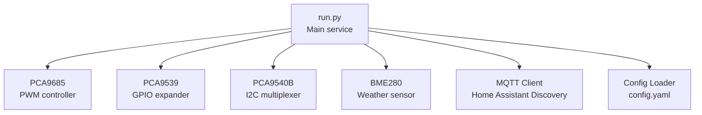
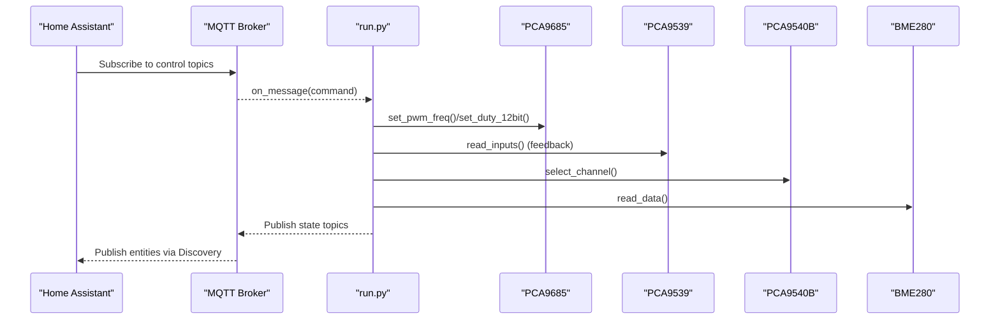
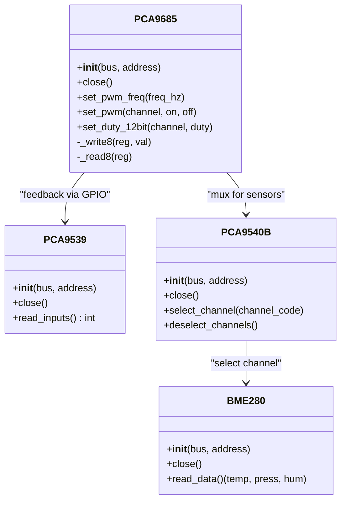
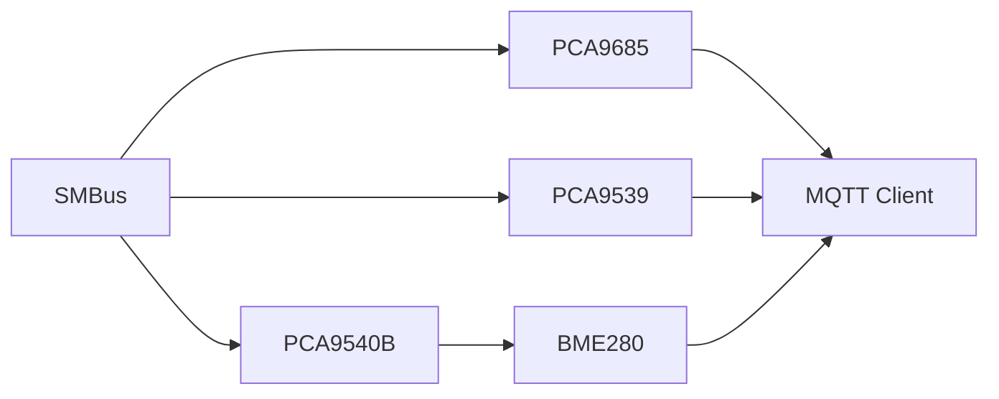

# API Reference

<cite>
**Referenced Files in This Document**
- [run.py](file://run.py)
- [config.yaml](file://config.yaml)
</cite>

## Table of Contents
1. [Introduction](#introduction)
2. [Project Structure](#project-structure)
3. [Core Components](#core-components)
4. [Architecture Overview](#architecture-overview)
5. [Detailed Component Analysis](#detailed-component-analysis)
6. [Dependency Analysis](#dependency-analysis)
7. [Performance Considerations](#performance-considerations)
8. [Troubleshooting Guide](#troubleshooting-guide)
9. [Conclusion](#conclusion)
10. [Appendices](#appendices)

## Introduction
This document provides a comprehensive API reference for the PCA9685 PWM controller system. It covers hardware classes (PCA9685, PCA9539, PCA9540B, BME280), channel control functions, PWM manipulation methods, hardware access procedures, configuration options, MQTT topic reference, return codes and error handling, thread-safety and concurrency, and practical usage examples. The goal is to enable developers to integrate and operate the system reliably across environments such as Home Assistant with MQTT Discovery.

## Project Structure
The project consists of a single Python script that initializes hardware devices, manages MQTT connectivity and discovery, and exposes control APIs for PWM channels, relays, steppers, and sensors.

**Diagram sources**
- [run.py:571-624](file://run.py#L571-L624)
- [run.py:1250-1257](file://run.py#L1250-L1257)
- [config.yaml:28-41](file://config.yaml#L28-L41)

**Section sources**
- [run.py:571-624](file://run.py#L571-L624)
- [config.yaml:28-41](file://config.yaml#L28-L41)

## Core Components
- PCA9685: 16-channel 12-bit PWM controller with frequency and duty control.
- PCA9539: 16-bit I2C GPIO expander for feedback and diagnostics.
- PCA9540B: 1-of-2 I2C multiplexer enabling multiple sensors on the same bus.
- BME280: Temperature, pressure, and humidity sensor with calibration and compensation.

Key channel constants define fixed mappings for PWM and control signals.

**Section sources**
- [run.py:61-109](file://run.py#L61-L109)
- [run.py:111-137](file://run.py#L111-L137)
- [run.py:139-159](file://run.py#L139-L159)
- [run.py:162-263](file://run.py#L162-L263)
- [run.py:266-281](file://run.py#L266-L281)

## Architecture Overview
The system orchestrates hardware access via a shared I2C bus, exposes control surfaces through MQTT Discovery, and maintains health and feedback via GPIO expansion and polling.

**Diagram sources**
- [run.py:1709-1883](file://run.py#L1709-L1883)
- [run.py:822-874](file://run.py#L822-L874)
- [run.py:606-624](file://run.py#L606-L624)

## Detailed Component Analysis

### PCA9685 Class
- Purpose: Manage 16 PWM channels (0–15) with configurable frequency and duty cycle.
- Constructor: Initializes MODE1 and MODE2 registers and applies initial sleep mode.
- Methods:
  - set_pwm_freq(freq_hz): Sets global PWM frequency; recalculates prescaler and toggles sleep mode safely.
  - set_pwm(channel, on, off): Writes 12-bit on/off values to LEDn registers for a given channel.
  - set_duty_12bit(channel, duty): Convenience to set duty cycle (off=0) for a channel.
  - close(): Placeholder for resource cleanup.
- Hardware Access: Uses shared SMBus with a global lock to serialize I2C transactions.
- Thread Safety: Protected by a global lock around register writes and reads.

Method signatures and parameters
- set_pwm_freq(freq_hz: float) -> None
- set_pwm(channel: int, on: int, off: int) -> None
- set_duty_12bit(channel: int, duty: int) -> None

Return values
- All methods return None; exceptions raised on invalid inputs.

Error handling
- Raises ValueError for out-of-range channel indices.
- Raises RuntimeError on I2C failures during initialization.

Concurrency
- Uses a global lock to prevent interleaved I2C operations.

Example usage
- Initialize PCA9685, set frequency, then adjust duty cycles for fans and heaters.

**Section sources**
- [run.py:61-109](file://run.py#L61-L109)

### PCA9539 Class
- Purpose: Read 16 GPIO inputs for feedback and diagnostics.
- Constructor: Configures all pins as inputs by default.
- Methods:
  - read_inputs(): Returns a 16-bit mask of input states.
  - close(): Placeholder for resource cleanup.
- Hardware Access: Uses shared SMBus with a global lock.

Method signatures and parameters
- read_inputs() -> int

Return values
- Integer representing 16-bit input mask.

Error handling
- Exceptions during I2C operations are propagated to caller.

Concurrency
- Uses a global lock around register reads.

Example usage
- Poll inputs periodically to validate relay states and stepper signals.

**Section sources**
- [run.py:111-137](file://run.py#L111-L137)

### PCA9540B Class
- Purpose: Select I2C channels to enable multiple sensors on the same bus.
- Constructor: Initializes without changing channel selection.
- Methods:
  - select_channel(channel_code): Selects CH0 or CH1; CH_NONE deselects.
  - deselect_channels(): Convenience to deselect all channels.
  - close(): Placeholder for resource cleanup.
- Hardware Access: Uses shared SMBus with a global lock.

Method signatures and parameters
- select_channel(channel_code: int) -> None
- deselect_channels() -> None

Return values
- None.

Error handling
- Exceptions during I2C operations are propagated to caller.

Concurrency
- Uses a global lock around register writes.

Example usage
- Select CH0 before initializing BME280 at 0x76, then deselect after initialization.

**Section sources**
- [run.py:139-159](file://run.py#L139-L159)

### BME280 Class
- Purpose: Read temperature, pressure, and optionally humidity from BME280/BMP280.
- Constructor: Validates chip ID, loads calibration coefficients, and configures oversampling and standby.
- Methods:
  - read_data(): Returns tuple of (temperature, pressure, humidity) or (None, None, None) on invalid data.
  - close(): Placeholder for resource cleanup.
- Hardware Access: Uses shared SMBus with a global lock.

Method signatures and parameters
- read_data() -> tuple[float, float, float] | tuple[None, None, None]

Return values
- Temperature in Celsius, pressure in hPa, humidity in percent (or zeros for BMP280).

Error handling
- Raises RuntimeError on unexpected chip ID.
- Returns None values when raw readings indicate invalid data.

Concurrency
- Uses a global lock around register reads.

Example usage
- Initialize BME280 on selected channel, read periodically, and publish to MQTT.

**Section sources**
- [run.py:162-263](file://run.py#L162-L263)

### Channel Control Functions
- channel_on(channel: int): Sets a channel’s duty cycle to maximum.
- channel_off(channel: int): Sets a channel’s duty cycle to zero.
- These functions delegate to PCA9685.set_duty_12bit.

Method signatures and parameters
- channel_on(channel: int) -> None
- channel_off(channel: int) -> None

Return values
- None.

Error handling
- Raises ValueError if channel is out of range.

Example usage
- Turn on a heater or fan by calling channel_on on the corresponding channel.

**Section sources**
- [run.py:563-569](file://run.py#L563-L569)

### PWM Manipulation Methods
- set_pwm_freq(freq_hz: float): Recalculates prescaler and safely toggles sleep mode.
- set_pwm(channel: int, on: int, off: int): Writes 12-bit on/off values to LEDn registers.
- set_duty_12bit(channel: int, duty: int): Sets off value to duty and on to 0.

Constraints and behavior
- Channel must be within 0–15.
- Duty/on/off clamped to 0–4095.
- Frequency clamped to a valid range.

**Section sources**
- [run.py:79-109](file://run.py#L79-L109)

### Hardware Access Procedures
- Shared SMBus: Created once and reused across devices.
- Global lock: Ensures atomicity of I2C transactions.
- Initialization sequence: Open bus, create PCA9685, configure frequency, then initialize optional devices.

**Section sources**
- [run.py:39-46](file://run.py#L39-L46)
- [run.py:571-586](file://run.py#L571-L586)

### Fixed Channel Mappings
- PWM1: 0
- Heaters: 1–4
- Fans: 5–6
- Stepper: DIR=7, ENA=8
- PU: 9
- PWM2: 10
- Reserved: 11
- RGB LEDs: Red=12, Green=13, Blue=14
- System LED: 15

These constants are validated early and used throughout the code.

**Section sources**
- [run.py:266-281](file://run.py#L266-L281)
- [run.py:533-557](file://run.py#L533-L557)

## Architecture Overview

**Diagram sources**
- [run.py:61-109](file://run.py#L61-L109)
- [run.py:111-137](file://run.py#L111-L137)
- [run.py:139-159](file://run.py#L139-L159)
- [run.py:162-263](file://run.py#L162-L263)

## Detailed Component Analysis

### MQTT Topic Reference
All topics follow the Home Assistant MQTT Discovery convention. Topics are generated programmatically and include command and state topics for each entity.

- Numbers
  - PWM1 Duty: Command topic “homeassistant/number/pca_pwm1_duty/set”, State topic “homeassistant/number/pca_pwm1_duty/state”
  - PWM2 Duty: Command topic “homeassistant/number/pca_pwm2_duty/set”, State topic “homeassistant/number/pca_pwm2_duty/state”
  - PU Frequency: Command topic “homeassistant/number/pca_pu_freq_hz/set”, State topic “homeassistant/number/pca_pu_freq_hz/state”

- Switches
  - Heaters 1–4: Command topics “homeassistant/switch/pca_heater_X/set” (X=1..4), State topics “homeassistant/switch/pca_heater_X/state”
  - Fan 1/2 Power: Command topics “homeassistant/switch/pca_fan_1_power/set”, “homeassistant/switch/pca_fan_2_power/set”; State topics “homeassistant/switch/pca_fan_1_power/state”, “homeassistant/switch/pca_fan_2_power/state”

- Select
  - Stepper Direction: Command topic “homeassistant/select/pca_stepper_dir/set”, State topic “homeassistant/select/pca_stepper_dir/state”

- Binary Sensors (Feedback)
  - ENA, DIR, PU, Relay1–6, Res2–4, TAXO1–2: State topics “homeassistant/binary_sensor/status_*”

- Sensors (BME280)
  - CH0 0x76: Temperature, Humidity, Pressure
  - CH0 0x77: Temperature, Humidity, Pressure
  - CH1 0x77: Temperature, Humidity, Pressure

- Availability
  - Topic: “homeassistant/availability” with payload “online” or “offline”

Payload formats
- Numbers: Numeric string (percent for duty, Hz for frequency)
- Switches: “ON” or “OFF”
- Select: “CW” or “CCW”
- Binary sensors: “ON” or “OFF”
- Sensors: Numeric string with units

Discovery payloads
- Each entity publishes a JSON configuration to “homeassistant/{component}/{unique_id}/config” with fields such as name, unique_id, command_topic, state_topic, availability_topic, and device metadata.

Deep clean
- When enabled, subscribes to “homeassistant/#” to discover orphaned topics and clears them by publishing empty payloads, then re-publishes current discovery.

**Section sources**
- [run.py:461-531](file://run.py#L461-L531)
- [run.py:1310-1624](file://run.py#L1310-L1624)
- [run.py:1627-1707](file://run.py#L1627-L1707)

### Configuration Options
Environment and configuration parameters are loaded from options.json and/or Supervisor API, then merged into runtime settings.

- Environment variables
  - SUPERVISOR_TOKEN: Used to fetch MQTT credentials from Supervisor services endpoint.

- Options.json parameters
  - mqtt_host, mqtt_port, mqtt_username, mqtt_password
  - pca_address, pca9539_address, pca9540_address
  - i2c_bus
  - bme_interval, led_indicator_interval
  - pca_frequency
  - default_duty_cycle
  - pu_default_hz
  - mqtt_deep_clean

- Validation and defaults
  - pca_frequency constrained to a valid range
  - default_duty_cycle clamped to 0–100
  - bme_interval, led_indicator_interval constrained to sensible ranges
  - mqtt_deep_clean is boolean

- Schema constraints
  - Types and ranges enforced in config.yaml schema:
    - mqtt_host: str
    - mqtt_port: port
    - mqtt_username/password: str?
    - mqtt_deep_clean: bool?
    - pca_address/pca9539_address/pca9540_address: hex string
    - i2c_bus: int in [0,10]
    - bme_interval: int in [1,3600]
    - pca_frequency: int in [24,1526]
    - default_duty_cycle: int in [0,100]
    - pu_default_hz: float?
    - led_indicator_interval: int in [5,300]

**Section sources**
- [run.py:284-311](file://run.py#L284-L311)
- [run.py:314-341](file://run.py#L314-L341)
- [config.yaml:28-57](file://config.yaml#L28-L57)

### Return Codes, Error Messages, and Exception Handling
- PCA9685.set_pwm_freq
  - Behavior: Recalculates prescaler and toggles sleep mode; uses a global lock.
  - Errors: No explicit return code; raises ValueError on invalid inputs.

- PCA9685.set_pwm
  - Behavior: Validates channel and clamps on/off values; writes block data.
  - Errors: ValueError if channel out of range.

- PCA9685.set_duty_12bit
  - Behavior: Calls set_pwm with on=0 and off=duty.
  - Errors: Inherits validation from set_pwm.

- PCA9539.read_inputs
  - Behavior: Reads two bytes and combines into 16-bit mask.
  - Errors: Propagates I2C exceptions.

- PCA9540B.select_channel/deselect_channels
  - Behavior: Writes byte to select channel; deselects with CH_NONE.
  - Errors: Propagates I2C exceptions.

- BME280.__init__
  - Behavior: Validates chip ID; raises RuntimeError for unsupported chips.
  - Errors: RuntimeError on unexpected chip ID.

- BME280.read_data
  - Behavior: Returns None values if raw data indicates invalid readings.
  - Errors: No exceptions; returns None triple on invalid data.

- MQTT handling
  - Errors: Logs exceptions during message processing; continues operation.

- Shutdown
  - Behavior: Stops threads, resets channels, publishes offline, disconnects.

**Section sources**
- [run.py:79-109](file://run.py#L79-L109)
- [run.py:128-133](file://run.py#L128-L133)
- [run.py:149-156](file://run.py#L149-L156)
- [run.py:167-171](file://run.py#L167-L171)
- [run.py:223-225](file://run.py#L223-L225)
- [run.py:1881-1882](file://run.py#L1881-L1882)
- [run.py:1898-1930](file://run.py#L1898-L1930)

### Thread-Safe Operations and Concurrency
- Global locks
  - i2c_lock: Protects all I2C register reads/writes across PCA9685, PCA9539, PCA9540B, and BME280.
  - pwm1_lock, pwm2_lock: Protect updates to PWM values and corresponding duty calculations.
  - pu_lock: Protects enable/frequency state for pulse generation.
  - status_lock: Protects system status updates.
  - any_problem_lock: Protects real-time problem flag.
  - clean_lock: Protects topic discovery/cleanup operations.

- Threading model
  - Dedicated worker threads for:
    - PCA9539 feedback polling
    - BME280 sensor reads
    - Pulse generation (PU)
    - System LED blink
    - LED indicator
  - Threads are started/stopped with guards to prevent race conditions.

- Concurrency guarantees
  - All hardware access is serialized via locks.
  - State updates are protected by dedicated locks per subsystem.

**Section sources**
- [run.py:39-46](file://run.py#L39-L46)
- [run.py:633-662](file://run.py#L633-L662)
- [run.py:800-820](file://run.py#L800-L820)
- [run.py:822-896](file://run.py#L822-L896)
- [run.py:1044-1126](file://run.py#L1044-L1126)
- [run.py:1128-1165](file://run.py#L1128-L1165)
- [run.py:1167-1226](file://run.py#L1167-L1226)

### Method Signatures and Parameter Types
- PCA9685
  - set_pwm_freq(float) -> None
  - set_pwm(int, int, int) -> None
  - set_duty_12bit(int, int) -> None

- PCA9539
  - read_inputs() -> int

- PCA9540B
  - select_channel(int) -> None
  - deselect_channels() -> None

- BME280
  - read_data() -> tuple[float|None, float|None, float|None]

- Control helpers
  - channel_on(int) -> None
  - channel_off(int) -> None

**Section sources**
- [run.py:61-109](file://run.py#L61-L109)
- [run.py:111-137](file://run.py#L111-L137)
- [run.py:139-159](file://run.py#L139-L159)
- [run.py:162-263](file://run.py#L162-L263)
- [run.py:563-569](file://run.py#L563-L569)

### Practical Usage Examples
- Initialize PCA9685 and set frequency
  - Create PCA9685 with shared SMBus and address; call set_pwm_freq with desired frequency.
  - Example path: [run.py:571-586](file://run.py#L571-L586)

- Control a heater
  - Call channel_on or channel_off on the heater channel; verify with PCA9539 feedback.
  - Example path: [run.py:563-569](file://run.py#L563-L569), [run.py:950-991](file://run.py#L950-L991)

- Configure PWM duty for fans
  - Publish numeric payload to “homeassistant/number/pca_pwm1_duty/set”; system updates duty and fan power automatically.
  - Example path: [run.py:1782-1794](file://run.py#L1782-L1794)

- Enable pulse generation (PU)
  - Publish “ON” to “homeassistant/switch/pca_pu_enable/set”; set frequency via “homeassistant/number/pca_pu_freq_hz/set”.
  - Example path: [run.py:1868-1879](file://run.py#L1868-L1879)

- Read BME280 data
  - Initialize BME280 on selected channel; call read_data and publish to MQTT.
  - Example path: [run.py:606-624](file://run.py#L606-L624), [run.py:822-874](file://run.py#L822-L874)

- MQTT Discovery
  - On connect, subscribe to command topics and publish discovery configs and initial states.
  - Example path: [run.py:1709-1739](file://run.py#L1709-L1739), [run.py:1647-1674](file://run.py#L1647-L1674)

## Dependency Analysis

**Diagram sources**
- [run.py:42-46](file://run.py#L42-L46)
- [run.py:571-624](file://run.py#L571-L624)

**Section sources**
- [run.py:42-46](file://run.py#L42-L46)
- [run.py:571-624](file://run.py#L571-L624)

## Performance Considerations
- I2C transaction overhead: All hardware access is serialized behind a single global lock; avoid long-running operations inside locked sections.
- Frequency limits: PCA frequency is constrained to a valid range; higher frequencies reduce resolution slightly but improve switching speed.
- Sensor polling: BME intervals are configurable; lower intervals increase CPU usage and I2C traffic.
- Thread scheduling: Worker threads sleep between iterations; tune intervals for responsiveness vs. power usage.
- MQTT publish rate: Discovery and state topics are retained; frequent updates can saturate the broker.

[No sources needed since this section provides general guidance]

## Troubleshooting Guide
- I2C bus not accessible
  - Ensure kernel module i2c-dev is loaded and device permissions are granted.
  - Verify i2c_bus setting and device presence.

- PCA9685 initialization fails
  - Confirm address and wiring; retry loop logs attempts and exits after repeated failures.

- PCA9539 not responding
  - Initialization warnings disable GPIO feedback; verify address and pull-ups.

- PCA9540B not functioning
  - Ensure channel selection/deselection is performed before sensor access.

- BME280 chip ID mismatch
  - Only 0x60 (BME280) and 0x58 (BMP280) are supported; unexpected ID triggers error.

- MQTT connection issues
  - Check credentials and broker reachability; the service retries with exponential backoff.

- Unexpected PWM behavior
  - Validate channel index and duty range; confirm frequency constraints.

**Section sources**
- [run.py:29-38](file://run.py#L29-L38)
- [run.py:571-586](file://run.py#L571-L586)
- [run.py:588-595](file://run.py#L588-L595)
- [run.py:597-604](file://run.py#L597-L604)
- [run.py:167-171](file://run.py#L167-L171)
- [run.py:1947-1959](file://run.py#L1947-L1959)

## Conclusion
This API reference documents the PCA9685 PWM controller system’s hardware classes, control functions, MQTT integration, configuration, and operational constraints. By adhering to the documented interfaces, locking semantics, and MQTT topic conventions, integrators can reliably control PWM outputs, monitor hardware feedback, and expose device capabilities to Home Assistant.

[No sources needed since this section summarizes without analyzing specific files]

## Appendices

### Version Compatibility and Migration
- Version: See config.yaml version field.
- Migration guidance: If upgrading, review schema constraints and ensure configuration values fall within allowed ranges. Validate MQTT discovery payloads remain compatible with Home Assistant versions.

**Section sources**
- [config.yaml:2](file://config.yaml#L2)

### Configuration Reference Summary
- Environment
  - SUPERVISOR_TOKEN: Optional; enables Supervisor-based MQTT configuration retrieval.

- Options.json
  - mqtt_host, mqtt_port, mqtt_username, mqtt_password
  - pca_address, pca9539_address, pca9540_address
  - i2c_bus
  - bme_interval, led_indicator_interval
  - pca_frequency
  - default_duty_cycle
  - pu_default_hz
  - mqtt_deep_clean

- Schema constraints
  - Types and ranges defined in config.yaml schema.

**Section sources**
- [run.py:284-311](file://run.py#L284-L311)
- [config.yaml:28-57](file://config.yaml#L28-L57)