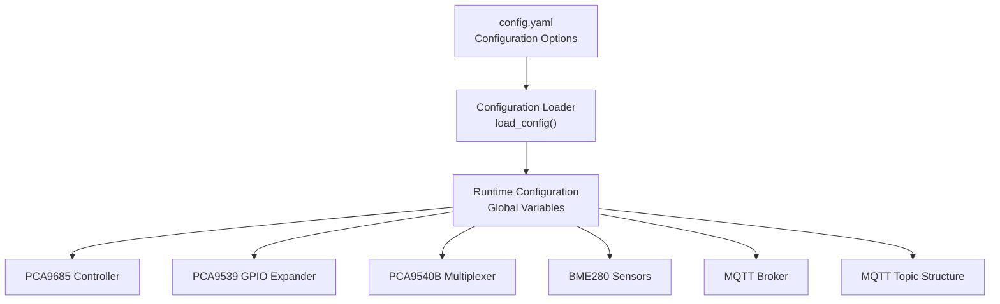
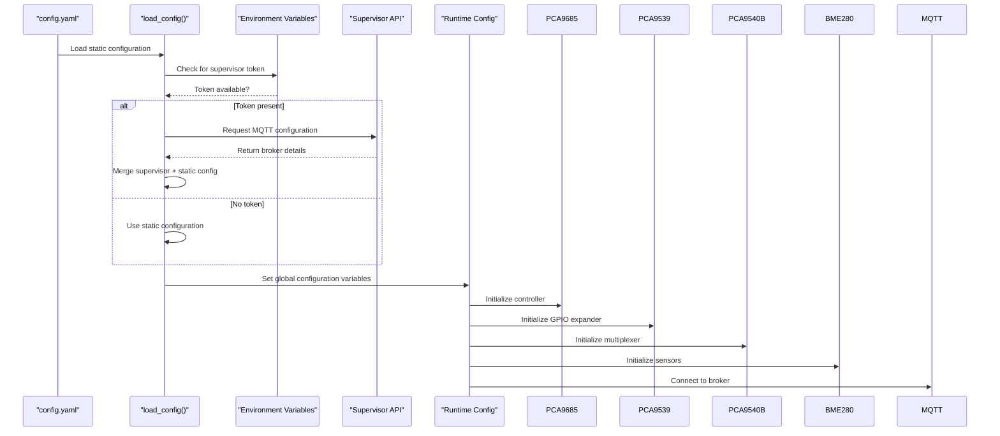
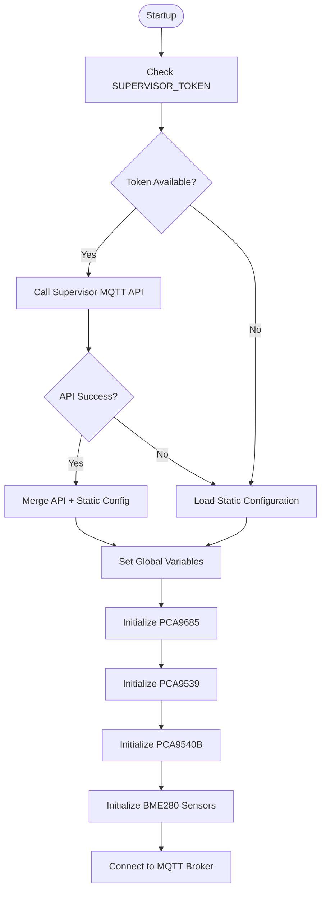
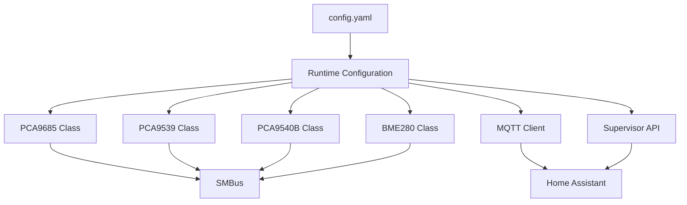
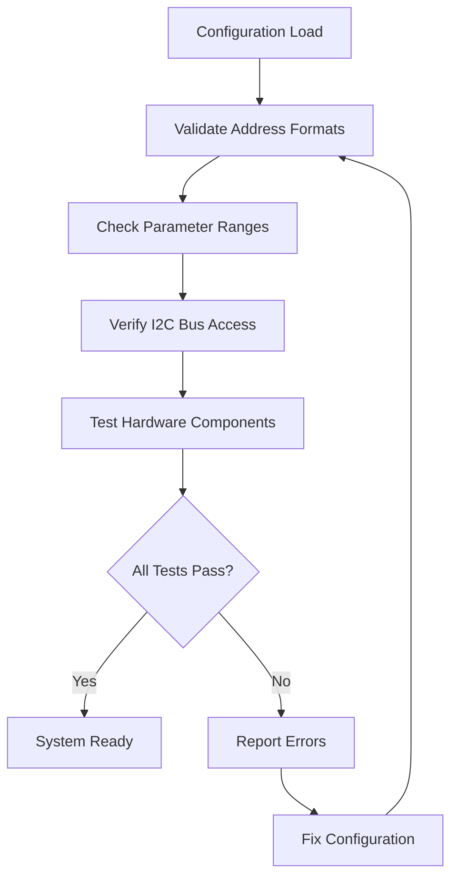

# Configuration Management

<cite>
**Referenced Files in This Document**
- [config.yaml](file://config.yaml)
- [run.py](file://run.py)
- [repository.yaml](file://repository.yaml)
- [repository.json](file://repository.json)
</cite>

## Table of Contents
1. [Introduction](#introduction)
2. [Project Structure](#project-structure)
3. [Core Components](#core-components)
4. [Architecture Overview](#architecture-overview)
5. [Detailed Component Analysis](#detailed-component-analysis)
6. [Dependency Analysis](#dependency-analysis)
7. [Performance Considerations](#performance-considerations)
8. [Troubleshooting Guide](#troubleshooting-guide)
9. [Conclusion](#conclusion)
10. [Appendices](#appendices)

## Introduction
This document provides comprehensive configuration management guidance for the PCA9685 PWM controller system. It covers all configuration options available in the configuration file, including I2C bus settings, hardware addresses for PCA9685, PCA9539, PCA9540B, and BME280 sensors, timing parameters, and MQTT broker configuration. It also explains environment variable usage for dynamic configuration in Home Assistant OS environments, hardware address configuration and conflict resolution strategies, timing parameters, MQTT settings, advanced configuration options, validation procedures, troubleshooting steps, and practical configuration scenarios.

## Project Structure
The configuration management system centers around a single configuration file and a main Python application that reads and applies the configuration. The repository includes metadata files for Home Assistant Add-on integration.

**Diagram sources**
- [config.yaml:28-57](file://config.yaml#L28-L57)
- [run.py:284-341](file://run.py#L284-L341)

**Section sources**
- [config.yaml:1-57](file://config.yaml#L1-L57)
- [run.py:284-341](file://run.py#L284-L341)

## Core Components
The configuration system consists of two primary components:
- Static configuration file defining all configurable parameters
- Dynamic configuration loader that merges runtime and static configuration

Key responsibilities:
- Define I2C bus and hardware addresses
- Set timing parameters for sensors and indicators
- Configure MQTT broker connection details
- Validate configuration ranges and formats
- Provide fallback values for optional parameters

**Section sources**
- [config.yaml:28-57](file://config.yaml#L28-L57)
- [run.py:284-341](file://run.py#L284-L341)

## Architecture Overview
The configuration architecture follows a layered approach with clear separation between static configuration definition and dynamic loading.

**Diagram sources**
- [run.py:284-311](file://run.py#L284-L311)
- [run.py:314-341](file://run.py#L314-L341)

## Detailed Component Analysis

### Configuration File Structure
The configuration file defines all system parameters with strict validation rules and type constraints.

#### I2C and Hardware Configuration
- I2C Bus Selection: Integer bus number with range validation (0-10)
- PCA9685 Address: Hexadecimal address with format validation (0x40 default)
- PCA9539 Address: Optional hexadecimal address with format validation (0x74 default)
- PCA9540B Address: Optional hexadecimal address with format validation (0x70 default)

#### Timing Parameters
- BME Sensor Interval: Integer seconds with range validation (1-3600, default 30)
- LED Indicator Interval: Integer seconds with range validation (5-300, default 30)
- LED Indicator On Duration: Fixed 5 seconds for problem indication

#### PWM and Control Settings
- PCA Frequency: Integer Hertz with range validation (24-1526, default 1000)
- Default Duty Cycle: Integer percentage with range validation (0-100, default 30)
- Pulse Unit (PU) Default Frequency: Float with minimum value validation (default 10.0)

#### MQTT Configuration
- Host: String with optional username/password
- Port: Integer port number
- Authentication: Optional credentials for secure connections
- Deep Clean: Boolean flag for topic cleanup

**Section sources**
- [config.yaml:32-41](file://config.yaml#L32-L41)
- [config.yaml:48-56](file://config.yaml#L48-L56)

### Environment Variable Usage
The system supports dynamic configuration through Home Assistant Supervisor integration:

**Diagram sources**
- [run.py:284-311](file://run.py#L284-L311)

**Section sources**
- [run.py:284-311](file://run.py#L284-L311)

### Hardware Address Configuration
The system supports flexible hardware addressing with conflict resolution strategies:

#### Address Space Management
- PCA9685: Primary PWM controller at 0x40 (fixed)
- PCA9539: GPIO expander at 0x74 (optional)
- PCA9540B: I2C multiplexer at 0x70 (optional)
- BME280 Sensors: Multiple instances at 0x76 and 0x77

#### Conflict Resolution Strategies
- Address Validation: All addresses validated against hexadecimal format
- Optional Components: PCA9539 and PCA9540B are optional with graceful degradation
- Sensor Multiplexing: PCA9540B enables multiple sensor instances on same bus
- Default Values: Safe defaults prevent initialization failures

**Section sources**
- [config.yaml:32-35](file://config.yaml#L32-L35)
- [run.py:606-624](file://run.py#L606-L624)

### Timing Parameter Configuration
The system implements multiple timing parameters for optimal operation:

#### Sensor Reading Intervals
- BME Sensor Interval: Configurable between 1-3600 seconds
- Default: 30 seconds for balanced responsiveness vs. bus load
- Threaded Implementation: Non-blocking sensor readings

#### LED Indicator Timing
- Indicator Interval: Configurable between 5-300 seconds
- On Duration: Fixed 5 seconds for problem indication
- Status Indication: Solid green for normal, blinking red for problems

#### System Polling Frequencies
- PCA9539 Feedback: 1-second polling interval
- MQTT Reconnection: Exponential backoff up to 10 attempts
- System LED: Continuous 1-second blink pattern

**Section sources**
- [config.yaml:36-41](file://config.yaml#L36-L41)
- [run.py:822-873](file://run.py#L822-L873)
- [run.py:1167-1202](file://run.py#L1167-L1202)

### MQTT Broker Configuration
The system provides comprehensive MQTT integration with Home Assistant:

#### Connection Parameters
- Host: Configurable hostname or IP address
- Port: Standard 1883 or custom port
- Authentication: Optional username/password support
- Availability: Online/offline status publishing

#### Topic Structure
The system uses Home Assistant MQTT Discovery format with structured topics:
- Component Topics: `homeassistant/{component}/{unique_id}/{suffix}`
- State Topics: Separate for each entity
- Command Topics: For receiving control commands
- Availability Topic: Central online/offline status

#### Discovery Mechanism
- Automatic Device Discovery: Publishes entity configurations
- Initial State Publishing: Sets initial values for all entities
- Deep Clean Mode: Optional cleanup of orphaned topics
- Prefix-based Cleanup: Removes topics with specific prefixes

**Section sources**
- [config.yaml:28-31](file://config.yaml#L28-L31)
- [run.py:461-531](file://run.py#L461-L531)
- [run.py:1647-1673](file://run.py#L1647-L1673)

### Advanced Configuration Options
Beyond basic parameters, the system supports advanced configuration:

#### PWM Frequency Control
- Range: 24-1526 Hz with automatic prescaler calculation
- Impact: Affects motor control precision and audible noise
- Default: 1000 Hz for balanced performance

#### Duty Cycle Management
- Default Duty Cycle: 0-100% with validation
- Auto-control: Fan power automatically follows speed settings
- Safety Limits: Prevents invalid duty cycle values

#### Pulse Unit Configuration
- PU Default Frequency: Minimum 0.0 Hz (disabled)
- Pulse Generation: Threaded implementation with feedback verification
- Feedback Monitoring: Detects actual pulse generation

**Section sources**
- [config.yaml:37-40](file://config.yaml#L37-L40)
- [run.py:1044-1104](file://run.py#L1044-L1104)

## Dependency Analysis
The configuration system has minimal external dependencies with clear import relationships:

**Diagram sources**
- [run.py:20-21](file://run.py#L20-L21)
- [run.py:61-160](file://run.py#L61-L160)

**Section sources**
- [run.py:20-21](file://run.py#L20-L21)
- [run.py:61-160](file://run.py#L61-L160)

## Performance Considerations
Configuration performance characteristics and optimization strategies:

### Memory Usage
- Configuration Loading: Minimal memory footprint with JSON parsing
- Runtime Variables: Single instance global variables
- Thread Safety: Locks for I2C bus and critical sections

### Network Performance
- MQTT Connection: Persistent connection with reconnection logic
- Topic Publishing: Efficient bulk publishing during discovery
- Message Size: Compact JSON payloads for entity configurations

### I2C Bus Optimization
- Shared Bus Instance: Single SMBus connection reduces overhead
- Locking Mechanism: Thread-safe I2C operations
- Multiplexer Usage: Enables multiple sensors on single bus

## Troubleshooting Guide

### Common Configuration Errors
1. **Invalid Address Format**: Addresses must be hexadecimal (0xNN)
2. **Out-of-Range Values**: Parameters exceed defined ranges
3. **Missing Dependencies**: Required kernel modules not loaded
4. **I2C Bus Access**: Permission or hardware issues

### Validation Procedures

**Diagram sources**
- [run.py:571-585](file://run.py#L571-L585)

### Hardware Address Conflicts
- **Detection**: Initialization failures indicate address conflicts
- **Resolution**: Change conflicting device addresses or bus topology
- **Monitoring**: PCA9539 feedback provides real-time status monitoring

### MQTT Connection Issues
- **Authentication**: Verify username/password credentials
- **Network**: Check broker accessibility and firewall rules
- **Topics**: Use deep clean mode to resolve orphaned topics

**Section sources**
- [run.py:571-585](file://run.py#L571-L585)
- [run.py:1709-1739](file://run.py#L1709-L1739)

## Conclusion
The PCA9685 PWM controller system provides a robust and flexible configuration management framework. Its layered approach separates static configuration from dynamic loading, enabling seamless integration with Home Assistant environments. The comprehensive validation system ensures reliable operation while the modular design allows for easy customization and troubleshooting.

## Appendices

### Configuration Backup and Migration
- **Backup Strategy**: Regular export of configuration file
- **Migration Procedure**: Compare schema versions before updates
- **Rollback Capability**: Maintain previous configuration for emergency restoration

### Practical Configuration Scenarios
1. **Basic Setup**: Minimal configuration with default addresses
2. **Multi-Sensor Deployment**: Utilize PCA9540B for multiple BME280 sensors
3. **Advanced Control**: Configure custom PWM frequencies and duty cycles
4. **Integration Testing**: Use diagnostic mode for hardware validation

### Reference Configuration Parameters
- I2C Bus: 0-10 (default: 1)
- PCA9685 Address: 0x40 (fixed)
- PCA9539 Address: 0x74 (optional)
- PCA9540B Address: 0x70 (optional)
- BME Interval: 1-3600 seconds (default: 30)
- LED Interval: 5-300 seconds (default: 30)
- PWM Frequency: 24-1526 Hz (default: 1000)
- Duty Cycle: 0-100% (default: 30)