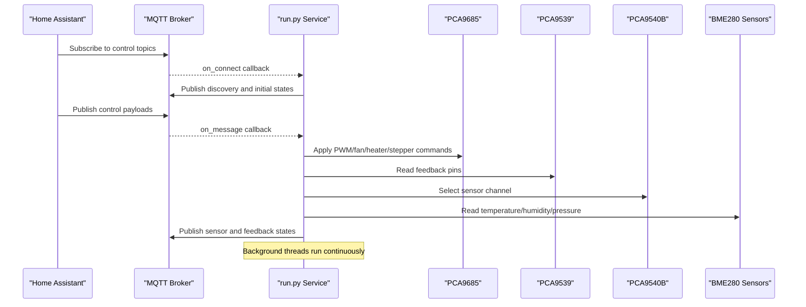
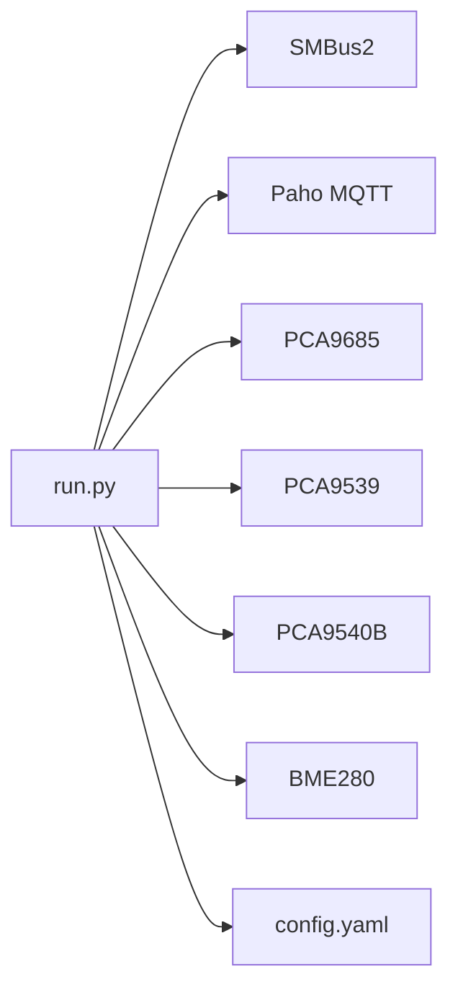

# Core Functionality

<cite>
**Referenced Files in This Document**
- [run.py](file://run.py)
- [config.yaml](file://config.yaml)
</cite>

## Table of Contents
1. [Introduction](#introduction)
2. [Project Structure](#project-structure)
3. [Core Components](#core-components)
4. [Architecture Overview](#architecture-overview)
5. [Detailed Component Analysis](#detailed-component-analysis)
6. [Dependency Analysis](#dependency-analysis)
7. [Performance Considerations](#performance-considerations)
8. [Troubleshooting Guide](#troubleshooting-guide)
9. [Conclusion](#conclusion)

## Introduction
This document explains the core operational features of the PCA9685 PWM controller system. It covers PWM control, channel mapping for heaters, fans, and auxiliary outputs; duty cycle calculation and frequency management; 12-bit resolution; hardware feedback via PCA9539; stepper motor control with ENA and DIR; thermal monitoring with dual BME280 sensors and I2C multiplexer; status indication with RGB LED and system LED; and thread management for concurrent operations. Practical examples and performance considerations are included to help operators configure and troubleshoot the system effectively.

## Project Structure
The system is implemented as a single Python service that initializes hardware devices, manages MQTT discovery and subscriptions, and runs background threads for sensor data, feedback monitoring, and LED status indication.

```mermaid
graph TB
subgraph "Host System"
MQTT["MQTT Broker"]
HA["Home Assistant"]
end
subgraph "Device Layer"
PCA["PCA9685 (16-channel 12-bit PWM)"]
GPIO["PCA9539 (16-bit GPIO expander)"]
MUX["PCA9540B (I2C multiplexer)"]
SENS1["BME280 CH0 0x76"]
SENS2["BME280 CH0 0x77"]
SENS3["BME280 CH1 0x77"]
end
subgraph "Software"
RUN["run.py Service"]
CFG["config.yaml"]
end
HA --> MQTT
MQTT <- --> RUN
RUN --> PCA
RUN --> GPIO
RUN --> MUX
MUX --> SENS1
MUX --> SENS2
MUX --> SENS3
GPIO <- --> RUN
PCA <- --> RUN
```

**Diagram sources**
- [run.py:570-630](file://run.py#L570-L630)
- [config.yaml:28-41](file://config.yaml#L28-L41)

**Section sources**
- [run.py:570-630](file://run.py#L570-L630)
- [config.yaml:28-41](file://config.yaml#L28-L41)

## Core Components
- PCA9685 PWM controller: 16 channels, 12-bit resolution, configurable global frequency.
- PCA9539 GPIO expander: 16-bit input bank for feedback monitoring (relays, stepper signals, reserve pins).
- PCA9540B I2C multiplexer: Selects sensor channels for dual BME280 deployment.
- BME280 sensors: Temperature, pressure, and optional humidity readings.
- MQTT discovery: Automatic entity registration for Home Assistant with command and state topics.
- Worker threads: Hardware feedback monitoring, sensor data collection, LED status indication, and pulse generation.

**Section sources**
- [run.py:61-109](file://run.py#L61-L109)
- [run.py:111-137](file://run.py#L111-L137)
- [run.py:139-159](file://run.py#L139-L159)
- [run.py:162-264](file://run.py#L162-L264)
- [run.py:1310-1624](file://run.py#L1310-L1624)

## Architecture Overview
The system orchestrates hardware control and monitoring through coordinated threads and MQTT messaging. The main loop connects to the MQTT broker, publishes discovery messages, subscribes to control topics, and starts worker threads for sensors, feedback, LED indicators, and pulse generation.



**Diagram sources**
- [run.py:1709-1739](file://run.py#L1709-L1739)
- [run.py:1746-1883](file://run.py#L1746-L1883)
- [run.py:822-874](file://run.py#L822-L874)
- [run.py:673-798](file://run.py#L673-L798)

## Detailed Component Analysis

### PWM Control System
- Channel mapping:
  - PWM1 (fans): channel 0
  - Heaters: channels 1–4
  - Fans power: channels 5–6
  - Stepper: DIR (channel 7), ENA (channel 8)
  - PU (pulse enable): channel 9
  - PWM2 (fans): channel 10
  - Reserve: channel 11
  - RGB LED: Red (channel 12), Green (channel 13), Blue (channel 14)
  - System LED: channel 15
- Duty cycle calculation:
  - PWM1 and PWM2 use a non-linear mapping to convert percentage to 12-bit duty cycle, with special handling near zero.
  - Duty is clamped to 0–4095 (12-bit range).
- Frequency management:
  - Global PWM frequency is set once at startup and can be configured via configuration.
  - Frequency is calculated from the internal oscillator and rounded to the nearest prescaler value.

Practical examples:
- Set fan 1 speed to 60%: publish “60” to the PWM1 duty topic.
- Turn on heater 3: publish “ON” to the heater 3 switch topic.
- Enable stepper ENA: publish “ON” to the ENA switch topic.

**Section sources**
- [run.py:266-282](file://run.py#L266-L282)
- [run.py:898-928](file://run.py#L898-L928)
- [run.py:79-93](file://run.py#L79-L93)
- [run.py:328-334](file://run.py#L328-L334)

### Hardware Feedback System (PCA9539)
- Feedback mapping:
  - Relays: bits 0–5 correspond to heaters 1–4 and fans 1–2 power.
  - Stepper: ENA (bit 8), DIR (bit 9), PU (bit 10).
  - TAXO pins: bits 11–12 monitor motor pulses.
  - Reserve inputs: bits 12–14.
- Verification procedure:
  - Pre-check current pin state.
  - Apply command (on/off) to PCA9685 channel.
  - Post-check after a short delay; compare with expected logic.
  - On mismatch, mark system status as error.
- Thermal feedback monitoring:
  - For PWM1/PWM2, pulses are expected when duty > 0; absence indicates a problem.
- Reserve input monitoring:
  - Bits 12–14 are published as binary sensors.

Practical examples:
- Verify heater 2 operation: apply switch, then confirm feedback matches expected state.
- Monitor TAXO1 pulses: observe feedback topic for pulse presence when PWM1 is active.

**Section sources**
- [run.py:930-948](file://run.py#L930-L948)
- [run.py:950-991](file://run.py#L950-L991)
- [run.py:673-798](file://run.py#L673-L798)

### Stepper Motor Control
- Signals:
  - ENA (enable) toggles motor driver enable.
  - DIR (direction) selects CW/CCW.
  - PU (pulse) generates square wave for step control.
- Safe direction switching:
  - If PU is enabled, temporarily disable pulse generation, wait for current pulse to finish, then switch DIR, and re-enable pulses if previously enabled.
- Timing constraints:
  - After changing DIR, wait ≥ 50 ms to satisfy driver setup time.

Practical examples:
- Change direction to CCW: publish “CCW” to DIR select topic; system safely disables pulses, switches DIR, waits, and resumes pulses if enabled.

**Section sources**
- [run.py:998-1036](file://run.py#L998-L1036)
- [run.py:1044-1105](file://run.py#L1044-L1105)

### Environmental Monitoring (Dual BME280)
- I2C multiplexer:
  - Channel 0: sensors at 0x76 and 0x77.
  - Channel 1: sensor at 0x77.
- Data collection:
  - Read sensors sequentially on selected channels.
  - Publish temperature, pressure, and humidity (when applicable) to MQTT topics.
  - Interval controlled by configuration.

Practical examples:
- Read CH0 0x77 sensor: system selects CH0, reads sensor, publishes temperature/humidity/pressure, then deselects channel.

**Section sources**
- [run.py:606-625](file://run.py#L606-L625)
- [run.py:822-874](file://run.py#L822-L874)
- [config.yaml:36](file://config.yaml#L36)

### Status Indication System
- RGB LED control:
  - Red/Green/Blue channels mapped to PCA9685 channels 12–14.
  - Color tuples are set using 12-bit duty values.
- System LED:
  - Channel 15 blinks continuously to indicate service activity.
- LED indicator:
  - Periodic solid/green or blinking/red pattern based on real-time problem detection.
  - Duration and interval configurable.

Practical examples:
- Show error condition: set RGB to red for a fixed duration, then turn off.
- Solid green for OK: keep RGB green for the configured duration.

**Section sources**
- [run.py:357-361](file://run.py#L357-L361)
- [run.py:1128-1144](file://run.py#L1128-L1144)
- [run.py:1167-1205](file://run.py#L1167-L1205)
- [config.yaml:41](file://config.yaml#L41)

### Thread Management and Concurrency
- pca9539_worker: continuously reads GPIO inputs, publishes raw and processed feedback, and updates real-time problem flag.
- bme_worker: periodically reads sensors on selected channels and publishes data.
- sys_led_worker: toggles system LED at a fixed rate.
- led_indicator_worker: periodically shows solid/green or blinking/red based on problem status.
- pu_worker: generates pulses at target frequency and verifies feedback.

Thread lifecycle:
- Start: create daemon thread and set running flag.
- Stop: set running flag to False, join with timeout, and reset thread handle.
- Safe shutdown: stops all workers, resets channels, and disconnects MQTT.

**Section sources**
- [run.py:800-820](file://run.py#L800-L820)
- [run.py:822-896](file://run.py#L822-L896)
- [run.py:1107-1126](file://run.py#L1107-L1126)
- [run.py:1146-1165](file://run.py#L1146-L1165)
- [run.py:1207-1226](file://run.py#L1207-L1226)
- [run.py:1889-1931](file://run.py#L1889-L1931)

## Dependency Analysis
- Hardware dependencies:
  - PCA9685 controls all outputs (PWM, relays, LEDs).
  - PCA9539 provides feedback pin states.
  - PCA9540B enables dual sensor deployment.
  - BME280 sensors provide environmental data.
- Software dependencies:
  - SMBus2 for I2C communication.
  - Paho MQTT client for discovery and control.
  - Threading for concurrency.
  - YAML configuration for runtime parameters.



**Diagram sources**
- [run.py:20-21](file://run.py#L20-L21)
- [run.py:570-630](file://run.py#L570-L630)
- [config.yaml:28-41](file://config.yaml#L28-L41)

**Section sources**
- [run.py:20-21](file://run.py#L20-L21)
- [run.py:570-630](file://run.py#L570-L630)
- [config.yaml:28-41](file://config.yaml#L28-L41)

## Performance Considerations
- I2C synchronization:
  - All I2C operations are protected by a global lock to prevent contention.
- PWM frequency:
  - Choose a frequency within the validated range to avoid instability.
- Sensor polling:
  - Adjust BME interval to balance responsiveness and CPU usage.
- Thread scheduling:
  - Workers use small sleeps; ensure host system provides adequate scheduling.
- Duty cycle mapping:
  - Non-linear mapping avoids audible noise at very low speeds.

[No sources needed since this section provides general guidance]

## Troubleshooting Guide
- PCA9685 initialization failures:
  - Retry loop during startup; check I2C bus and address configuration.
- PCA9539 feedback unavailable:
  - Initialization failure disables feedback; verify wiring and address.
- PCA9540B multiplexer issues:
  - Sensor initialization failures on a channel; ensure channel selection and deselect sequences.
- MQTT connectivity:
  - Reconnection loop; verify broker credentials and network.
- Hardware diagnostic:
  - Run automated checks for relays, stepper signals, and PU feedback; review logs for failures.

Practical examples:
- Verify relay 3: publish “ON” to heater 3 switch topic, then confirm feedback topic reflects expected state.
- Check PU pulses: enable PU, set frequency, and observe feedback topic for pulse presence.

**Section sources**
- [run.py:570-586](file://run.py#L570-L586)
- [run.py:588-595](file://run.py#L588-L595)
- [run.py:597-604](file://run.py#L597-L604)
- [run.py:1947-1960](file://run.py#L1947-L1960)
- [run.py:369-458](file://run.py#L369-L458)

## Conclusion
The PCA9685 PWM controller system integrates hardware control, feedback monitoring, environmental sensing, and status indication through a robust threaded architecture and MQTT discovery. By leveraging 12-bit PWM resolution, validated channel mappings, and careful timing, it provides reliable control of heaters, fans, and steppers while offering real-time diagnostics and clear status indication. Operators can manage the system via Home Assistant, with configuration-driven tuning for frequency, intervals, and defaults.