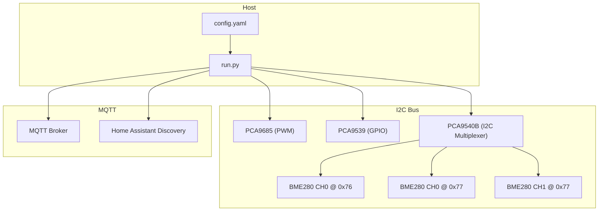
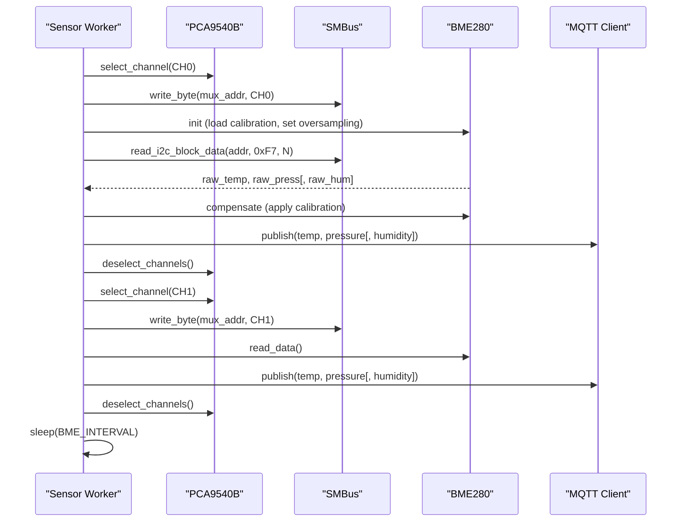
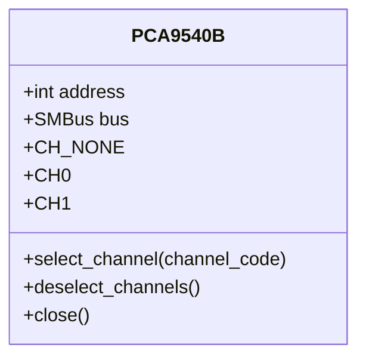
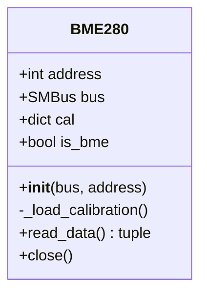
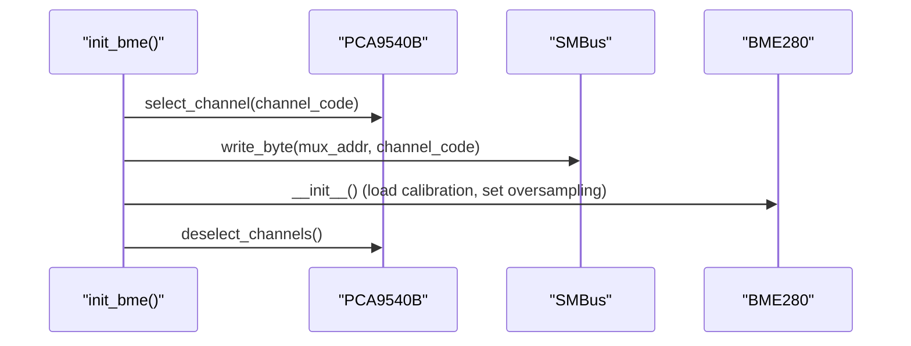
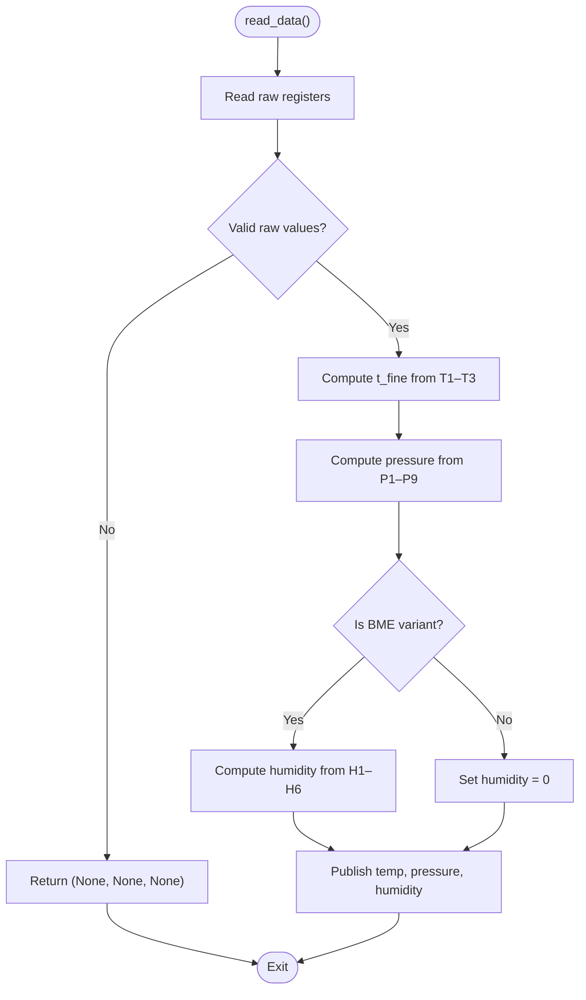
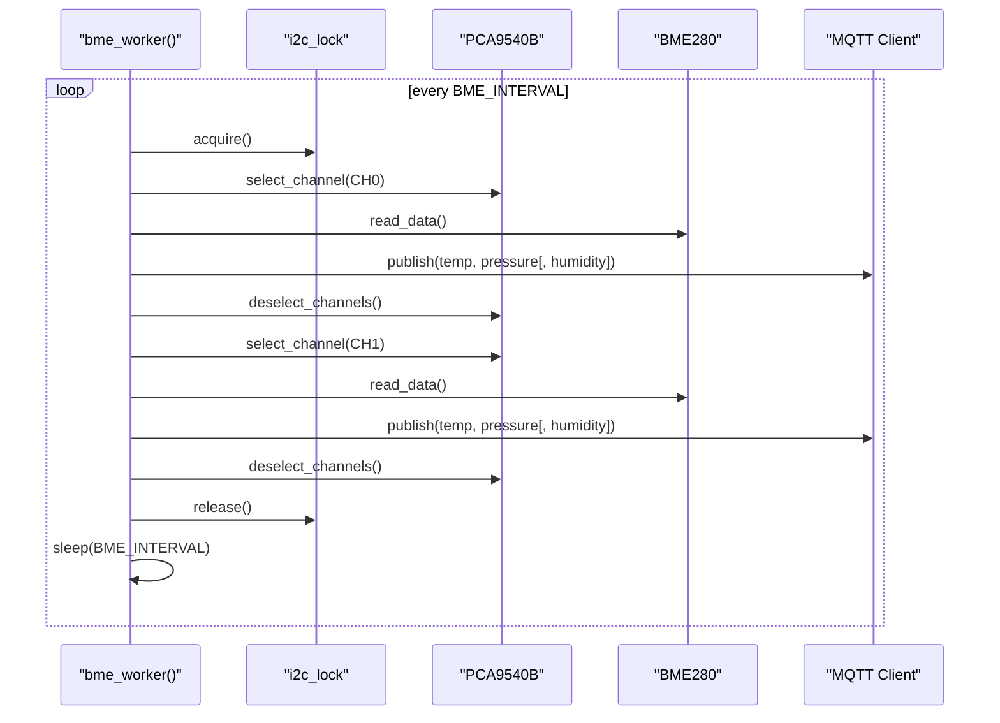
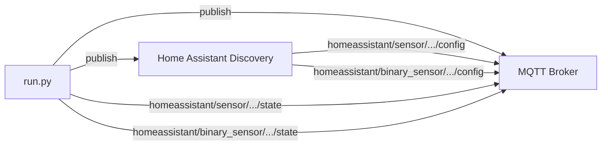
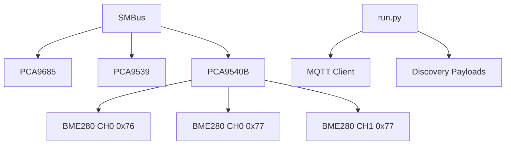

# Environmental Monitoring

<cite>
**Referenced Files in This Document**
- [run.py](file://run.py)
- [config.yaml](file://config.yaml)
</cite>

## Table of Contents
1. [Introduction](#introduction)
2. [Project Structure](#project-structure)
3. [Core Components](#core-components)
4. [Architecture Overview](#architecture-overview)
5. [Detailed Component Analysis](#detailed-component-analysis)
6. [Dependency Analysis](#dependency-analysis)
7. [Performance Considerations](#performance-considerations)
8. [Troubleshooting Guide](#troubleshooting-guide)
9. [Conclusion](#conclusion)
10. [Appendices](#appendices)

## Introduction
This document describes an environmental monitoring system that integrates dual BME280 sensors via an I2C multiplexer (PCA9540B) and publishes measurements to MQTT topics for Home Assistant integration. It covers the PCA9540B channel management, sensor initialization and calibration, oversampling configuration, compensation algorithms, thread-safe data collection, and the interval-based scheduling of sensor reads.

## Project Structure
The project is a single-file Python service that:
- Initializes I2C devices (PCA9685 PWM controller, PCA9539 GPIO expander, PCA9540B I2C multiplexer)
- Initializes up to three BME280 sensors across two channels
- Runs periodic sensor reads and publishes data to MQTT topics
- Provides Home Assistant MQTT Discovery configuration for sensors and controls

**Diagram sources**
- [run.py:571-630](file://run.py#L571-L630)
- [run.py:822-874](file://run.py#L822-L874)
- [run.py:1439-1513](file://run.py#L1439-L1513)

**Section sources**
- [run.py:571-630](file://run.py#L571-L630)
- [config.yaml:27-41](file://config.yaml#L27-L41)

## Core Components
- PCA9540B I2C multiplexer: Selects CH0 or CH1 to route BME280 sensors.
- BME280 sensor: Reads temperature, pressure, and humidity; loads calibration coefficients; applies compensation formulas.
- Threaded sensor worker: Periodically selects channels, initializes sensors, reads raw data, compensates, and publishes to MQTT.
- MQTT publisher: Publishes sensor data and Home Assistant Discovery payloads.

Key responsibilities:
- Channel selection and deselection around sensor initialization and reads
- Calibration coefficient loading and compensation math
- Thread-safe I2C access using a shared SMBus and a global lock
- Interval-based scheduling of sensor reads

**Section sources**
- [run.py:139-159](file://run.py#L139-L159)
- [run.py:162-264](file://run.py#L162-L264)
- [run.py:822-874](file://run.py#L822-L874)

## Architecture Overview
The system orchestrates I2C multiplexer channel selection, sensor initialization, and periodic data reads. Each channel’s sensors are read sequentially, and data is published to MQTT topics. The configuration file defines I2C bus, addresses, and intervals.

**Diagram sources**
- [run.py:822-874](file://run.py#L822-L874)
- [run.py:139-159](file://run.py#L139-L159)
- [run.py:162-264](file://run.py#L162-L264)

## Detailed Component Analysis

### PCA9540B I2C Multiplexer
- Implements channel selection codes for CH0 and CH1 and a deselect operation.
- Uses the shared I2C bus with a global lock to ensure exclusive access.
- Channel selection precedes sensor initialization and read operations.

**Diagram sources**
- [run.py:139-159](file://run.py#L139-L159)

**Section sources**
- [run.py:139-159](file://run.py#L139-L159)

### BME280 Sensor
- Validates chip ID and determines BME vs BMP variant.
- Loads calibration coefficients from device memory.
- Configures oversampling and standby/filter modes.
- Reads raw data and applies compensation formulas for temperature, pressure, and humidity (when applicable).
- Returns compensated values or None on invalid readings.

**Diagram sources**
- [run.py:162-264](file://run.py#L162-L264)

**Section sources**
- [run.py:162-264](file://run.py#L162-L264)

### Sensor Initialization and Channel Management
- Initializes sensors on CH0 at addresses 0x76 and 0x77, and on CH1 at 0x77.
- Selects the appropriate channel before initialization and deselects afterward.
- Handles failures by deselecting the channel even on errors.

**Diagram sources**
- [run.py:606-625](file://run.py#L606-L625)

**Section sources**
- [run.py:606-625](file://run.py#L606-L625)

### Oversampling and Compensation
- Oversampling configuration:
  - Humidity oversampling x1 for BME variants
  - Temperature and pressure oversampling x1
  - Normal mode and standby 1000 ms with filter off
- Compensation:
  - Temperature compensation using T1–T3
  - Pressure compensation using P1–P9
  - Humidity compensation using H1–H6 (BME variant)
- Returns temperature in Celsius, pressure in hectopascals, and humidity in percent.

**Diagram sources**
- [run.py:180-260](file://run.py#L180-L260)

**Section sources**
- [run.py:175-178](file://run.py#L175-L178)
- [run.py:216-260](file://run.py#L216-L260)

### Thread-Safe Sensor Data Collection
- A dedicated sensor worker runs in a separate thread.
- Uses a global lock to serialize I2C operations.
- Selects channels before each sensor read and deselects after.
- Sleeps for the configured interval between cycles.

**Diagram sources**
- [run.py:822-874](file://run.py#L822-L874)
- [run.py:41-46](file://run.py#L41-L46)

**Section sources**
- [run.py:822-874](file://run.py#L822-L874)
- [run.py:41-46](file://run.py#L41-L46)

### MQTT Publishing and Home Assistant Discovery
- Topics are defined for each sensor channel and address combination.
- Discovery payloads configure sensors and binary sensors for feedback.
- Initial states are published upon connection; availability is toggled on connect/disconnect.

**Diagram sources**
- [run.py:1439-1624](file://run.py#L1439-L1624)
- [run.py:1647-1673](file://run.py#L1647-L1673)

**Section sources**
- [run.py:501-531](file://run.py#L501-L531)
- [run.py:1439-1624](file://run.py#L1439-L1624)
- [run.py:1647-1673](file://run.py#L1647-L1673)

## Dependency Analysis
- I2C bus is shared among PCA9685, PCA9539, PCA9540B, and BME280 sensors.
- Global lock ensures mutual exclusion for I2C transactions.
- Sensor worker depends on PCA9540B for channel routing and on BME280 for measurements.
- MQTT client depends on discovery payloads and topic definitions.

**Diagram sources**
- [run.py:41-46](file://run.py#L41-L46)
- [run.py:571-630](file://run.py#L571-L630)
- [run.py:822-874](file://run.py#L822-L874)

**Section sources**
- [run.py:41-46](file://run.py#L41-L46)
- [run.py:571-630](file://run.py#L571-L630)
- [run.py:822-874](file://run.py#L822-L874)

## Performance Considerations
- Oversampling is set to x1 for all measurements, balancing accuracy and latency.
- Standby time is 1000 ms; this determines the minimum read interval.
- The worker sleeps for the configured interval between cycles to avoid excessive polling.
- Global I2C lock prevents contention but serializes all I2C operations; keep critical sections small.

[No sources needed since this section provides general guidance]

## Troubleshooting Guide
Common issues and resolutions:
- Sensor initialization failures:
  - Verify PCA9540B address and wiring; ensure channel selection succeeds before sensor init.
  - Confirm chip ID matches expected values; incorrect ID indicates wrong device or bad wiring.
- No data published:
  - Check MQTT connectivity and credentials; ensure discovery messages are published.
  - Validate BME_INTERVAL setting; too short intervals may cause timeouts.
- Invalid or zero values:
  - Ensure sensors are powered and not in sleep mode; confirm oversampling and standby settings.
  - Reinitialize sensors if compensation fails due to invalid raw values.
- I2C contention:
  - Confirm only one thread accesses I2C at a time; the global lock serializes access.

**Section sources**
- [run.py:606-625](file://run.py#L606-L625)
- [run.py:175-178](file://run.py#L175-L178)
- [run.py:822-874](file://run.py#L822-L874)
- [run.py:1710-1738](file://run.py#L1710-L1738)

## Conclusion
The system provides robust dual-channel BME280 monitoring via PCA9540B, with calibrated compensation and thread-safe I2C access. It publishes comprehensive sensor data to MQTT with Home Assistant Discovery, enabling seamless integration and remote monitoring.

[No sources needed since this section summarizes without analyzing specific files]

## Appendices

### Configuration Options
- mqtt_host, mqtt_port, mqtt_username, mqtt_password
- pca_address, pca9539_address, pca9540_address
- i2c_bus, bme_interval, pca_frequency, default_duty_cycle, pu_default_hz
- mqtt_deep_clean, led_indicator_interval

**Section sources**
- [config.yaml:27-41](file://config.yaml#L27-L41)

### Sensor Topic Definitions
- CH0 0x76: temperature, humidity, pressure
- CH0 0x77: temperature, humidity, pressure
- CH1 0x77: temperature, humidity, pressure

**Section sources**
- [run.py:501-513](file://run.py#L501-L513)
- [run.py:1439-1513](file://run.py#L1439-L1513)