# Hardware Feedback System

<cite>
**Referenced Files in This Document**
- [run.py](file://run.py)
- [config.yaml](file://config.yaml)
</cite>

## Table of Contents
1. [Introduction](#introduction)
2. [System Architecture](#system-architecture)
3. [PCA9539 GPIO Expander Implementation](#pca9539-gpio-expander-implementation)
4. [Relay State Verification Mechanism](#relay-state-verification-mechanism)
5. [Stepper Motor Control Feedback](#stepper-motor-control-feedback)
6. [Pulse Detection Logic](#pulse-detection-logic)
7. [Thermal Feedback Monitoring](#thermal-feedback-monitoring)
8. [Reserve Input Monitoring](#reserve-input-monitoring)
9. [Feedback Verification Algorithm](#feedback-verification-algorithm)
10. [PCA9539 Worker Thread](#pca9539-worker-thread)
11. [Input Reading Patterns](#input-reading-patterns)
12. [Feedback Publishing Mechanism](#feedback-publishing-mechanism)
13. [Real-time Problem Detection](#real-time-problem-detection)
14. [Troubleshooting Guide](#troubleshooting-guide)
15. [Performance Considerations](#performance-considerations)
16. [Conclusion](#conclusion)

## Introduction

The hardware feedback system utilizes the PCA9539 16-bit I2C GPIO expander to provide real-time hardware state verification for a comprehensive control system. This system monitors and verifies the operational status of heaters, fans, stepper motors, and various input signals through intelligent feedback mechanisms.

The system operates by continuously reading GPIO pin states from the PCA9539 expander and comparing them against expected states derived from the control commands sent to the PCA9685 PWM controller. This dual-path verification ensures reliable operation and immediate fault detection.

## System Architecture

The hardware feedback system is built around several key components working in concert:

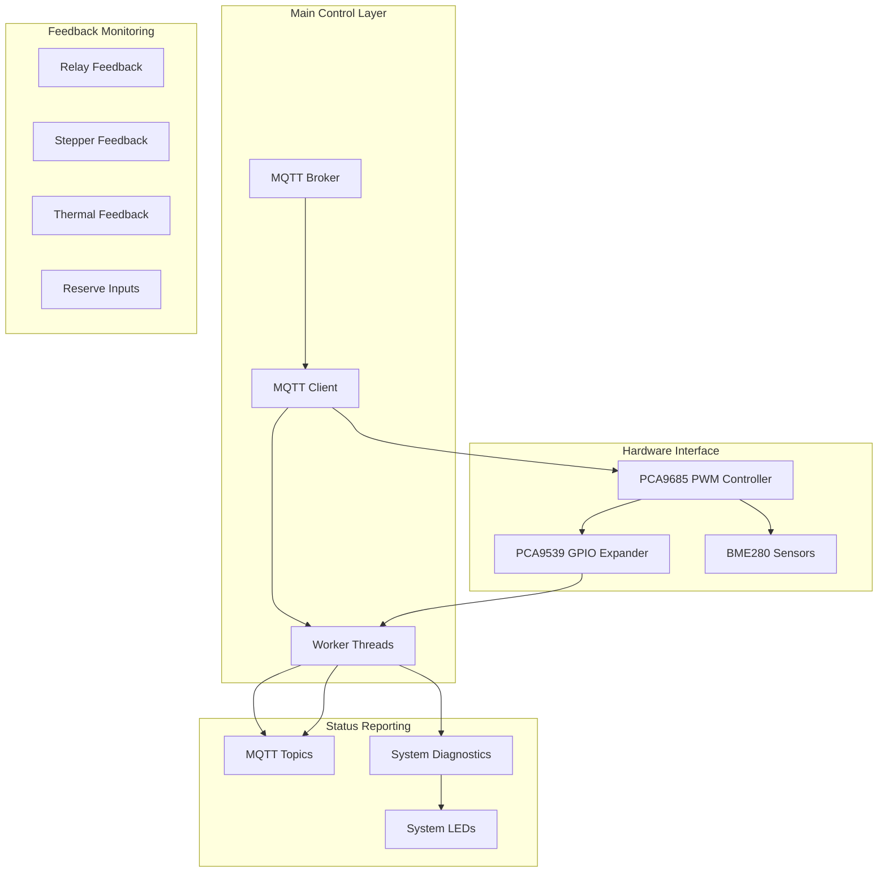

**Diagram sources**
- [run.py:673-798](file://run.py#L673-L798)
- [run.py:1228-1977](file://run.py#L1228-L1977)

The architecture consists of:
- **MQTT Communication Layer**: Handles bidirectional communication with Home Assistant
- **PCA9685 PWM Controller**: Generates control signals for hardware components
- **PCA9539 GPIO Expander**: Provides feedback verification through input monitoring
- **Worker Threads**: Continuously monitor and verify hardware states
- **Feedback Topics**: Publish real-time status information to MQTT

## PCA9539 GPIO Expander Implementation

The PCA9539 GPIO expander serves as the central hub for hardware feedback verification. It provides 16 bits of configurable I/O with dedicated input and output registers.

### Initialization and Configuration

The PCA9539 is configured as an input-only device by default, with all pins configured as inputs (logic high = input, logic low = output):

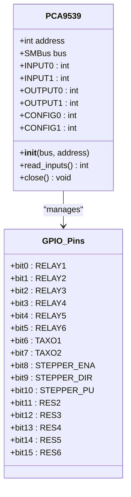

**Diagram sources**
- [run.py:111-137](file://run.py#L111-L137)

### Pin Mapping and Addressing

The PCA9539 implements a 16-bit input register split across two 8-bit registers:

| Register | Bits | Function |
|----------|------|----------|
| INPUT0 | 0-7 | RELAY1-RELAY8, TAXO1, TAXO2, RES2-RES5 |
| INPUT1 | 8-15 | STEPPER_ENA, STEPPER_DIR, STEPPER_PU, RES6 |

**Section sources**
- [run.py:111-137](file://run.py#L111-L137)
- [run.py:931-948](file://run.py#L931-L948)

## Relay State Verification Mechanism

The relay verification system monitors six relays (RL1-RL6) through dedicated feedback pins on the PCA9539. Each relay's operational state is verified against the expected state derived from control commands.

### Relay Pin Configuration

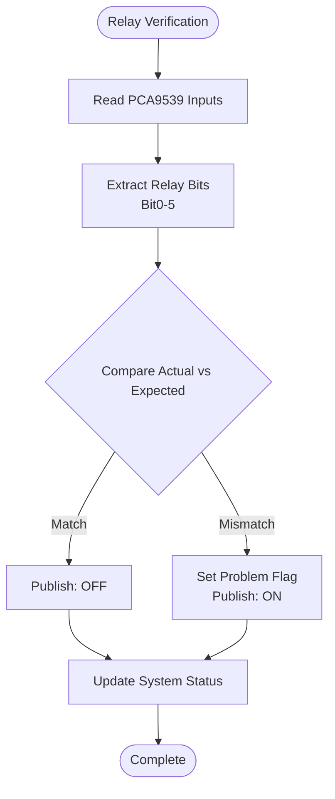

**Diagram sources**
- [run.py:702-713](file://run.py#L702-L713)

### Verification Logic

The relay verification follows these principles:

1. **Logic Inversion**: Relays use inverted logic where LOW (0) indicates ON state and HIGH (1) indicates OFF state
2. **State Comparison**: Compares expected relay state with actual GPIO pin state
3. **Problem Detection**: Any mismatch triggers immediate problem reporting
4. **Status Publishing**: Publishes binary sensor states to MQTT topics

**Section sources**
- [run.py:702-713](file://run.py#L702-L713)
- [run.py:950-991](file://run.py#L950-L991)

## Stepper Motor Control Feedback

The stepper motor feedback system monitors three critical control signals: enable (ENA), direction (DIR), and pulse (PU). Each signal requires specific verification logic due to different operational characteristics.

### Stepper Signal Monitoring

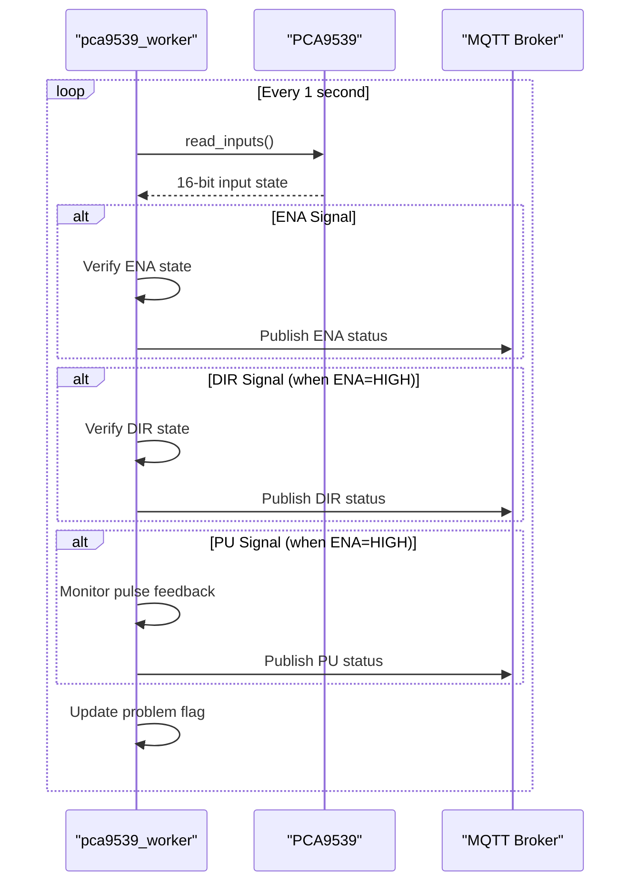

**Diagram sources**
- [run.py:714-748](file://run.py#L714-L748)

### ENA (Enable) Signal Verification

The ENA signal operates on standard logic where HIGH (1) indicates enabled state and LOW (0) indicates disabled state. The verification compares the expected ENA state with the actual GPIO pin state.

**Section sources**
- [run.py:714-719](file://run.py#L714-L719)

### DIR (Direction) Signal Verification

The DIR signal requires ENA to be HIGH for meaningful verification. When the stepper is enabled, the DIR state should match the commanded direction (CW or CCW). The verification logic accounts for the fact that DIR feedback is only meaningful when the motor is enabled.

**Section sources**
- [run.py:720-729](file://run.py#L720-L729)

### PU (Pulse) Signal Detection

The PU signal verification implements sophisticated pulse detection logic that monitors the feedback signal while the stepper is actively pulsing.

## Pulse Detection Logic

The pulse detection system implements advanced algorithms to verify stepper pulse generation and detect potential issues in the feedback chain.

### Pulse Detection Algorithm

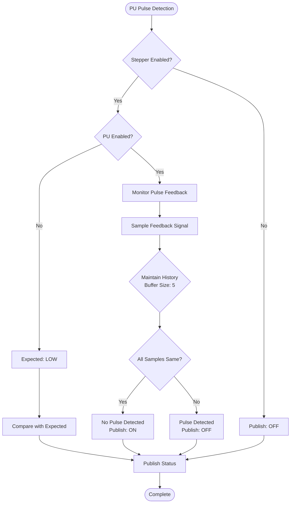

**Diagram sources**
- [run.py:731-748](file://run.py#L731-L748)

### Pulse Detection Implementation Details

The pulse detection logic implements several sophisticated features:

1. **History Buffer Management**: Maintains a rolling buffer of up to 5 pulse feedback samples
2. **Consistency Checking**: Requires at least 3 consecutive samples to establish a baseline
3. **Pulse Validation**: Only considers pulses valid if samples vary (alternating HIGH/LOW)
4. **Timeout Handling**: Automatically handles cases where pulses are not detected

**Section sources**
- [run.py:731-748](file://run.py#L731-L748)

## Thermal Feedback Monitoring

The thermal feedback system monitors two separate thermal sensors (TAXO1 and TAXO2) through dedicated feedback pins. These sensors provide critical information about motor temperature and operational status.

### Thermal Sensor Monitoring

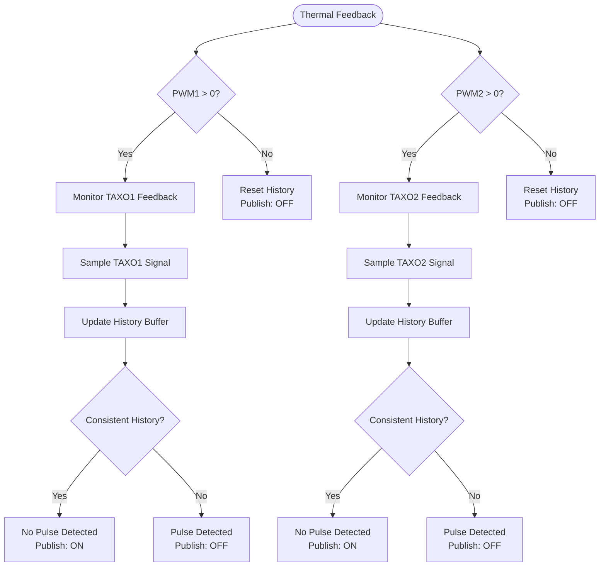

**Diagram sources**
- [run.py:749-779](file://run.py#L749-L779)

### Thermal Feedback Logic

The thermal feedback system implements identical logic for both TAXO1 and TAXO2 pins:

1. **Conditional Monitoring**: Only monitors feedback when the corresponding PWM output is active (> 0)
2. **History Tracking**: Maintains rolling history buffers for stability analysis
3. **Pulse Detection**: Identifies pulse patterns through consistency checking
4. **Problem Reporting**: Reports issues when pulses are not detected despite active PWM

**Section sources**
- [run.py:749-779](file://run.py#L749-L779)

## Reserve Input Monitoring

The reserve input monitoring system tracks three additional input pins (RES2, RES3, RES4) that can be used for various system monitoring applications.

### Reserve Input Configuration

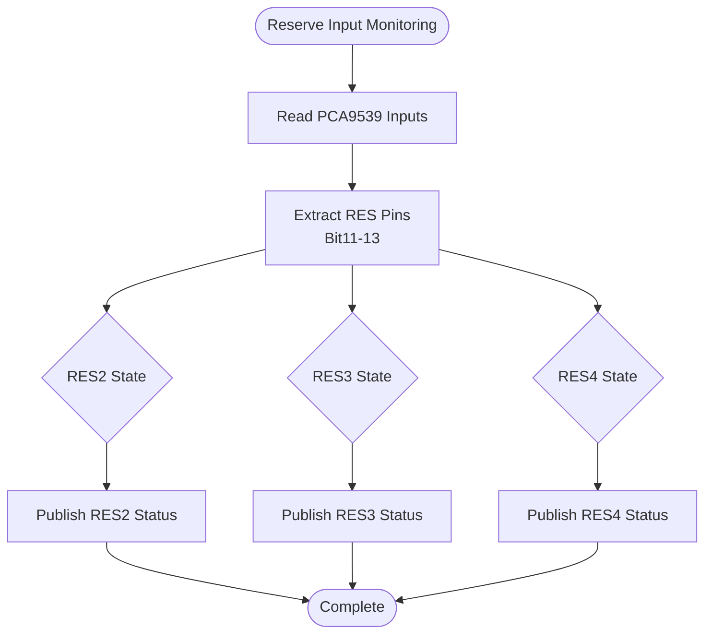

**Diagram sources**
- [run.py:781-788](file://run.py#L781-L788)

### Reserve Input Features

The reserve input system provides:

1. **Digital Input Monitoring**: Monitors three additional digital input pins
2. **Binary Status Reporting**: Publishes ON/OFF status for each reserve input
3. **Flexible Applications**: Can be used for limit switches, safety interlocks, or other monitoring functions
4. **Non-Invasive Operation**: Does not interfere with primary control functions

**Section sources**
- [run.py:781-788](file://run.py#L781-L788)

## Feedback Verification Algorithm

The comprehensive feedback verification algorithm implements a sophisticated state comparison system that validates hardware operation against expected behavior.

### Verification Algorithm Flow

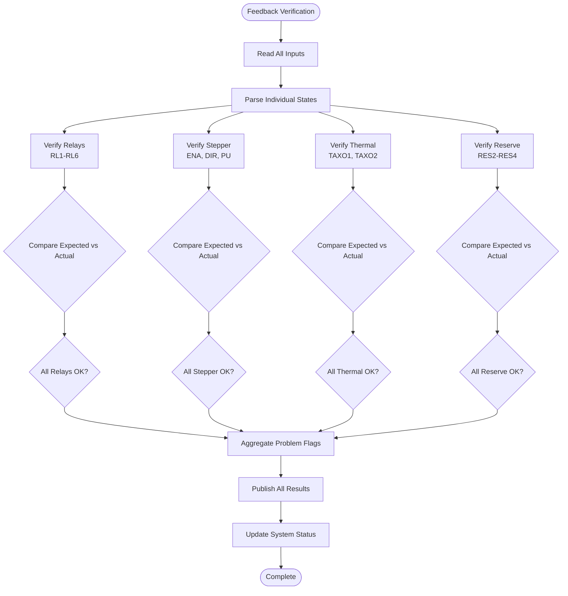

**Diagram sources**
- [run.py:698-791](file://run.py#L698-L791)

### Algorithm Complexity Analysis

The verification algorithm operates with O(n) complexity where n is the number of monitored pins:

- **Time Complexity**: O(1) per verification cycle (constant time for fixed number of pins)
- **Space Complexity**: O(k) for history buffers where k is the maximum buffer size (≤ 5)
- **Processing Overhead**: Minimal computational overhead due to bitwise operations

**Section sources**
- [run.py:698-791](file://run.py#L698-L791)

## PCA9539 Worker Thread

The PCA9539 worker thread implements the core feedback monitoring functionality through continuous polling and state verification.

### Thread Architecture

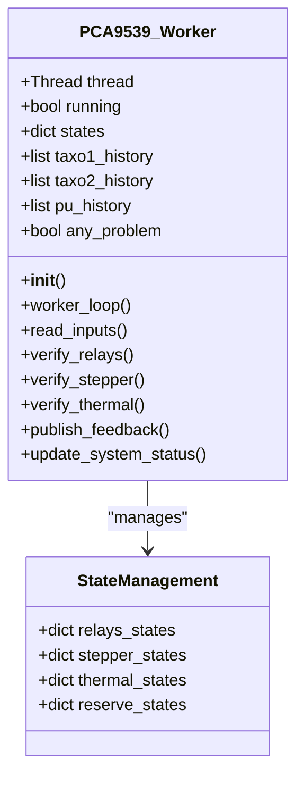

**Diagram sources**
- [run.py:673-798](file://run.py#L673-L798)

### Worker Thread Operations

The PCA9539 worker thread performs the following operations:

1. **Continuous Polling**: Reads GPIO states every 1 second
2. **State Comparison**: Compares actual states with expected states
3. **Problem Detection**: Identifies and aggregates hardware issues
4. **Status Publishing**: Publishes feedback status to MQTT topics
5. **System Integration**: Updates global system status flags

**Section sources**
- [run.py:673-798](file://run.py#L673-L798)

## Input Reading Patterns

The system implements efficient input reading patterns optimized for the PCA9539 GPIO expander's register structure.

### Input Reading Strategy

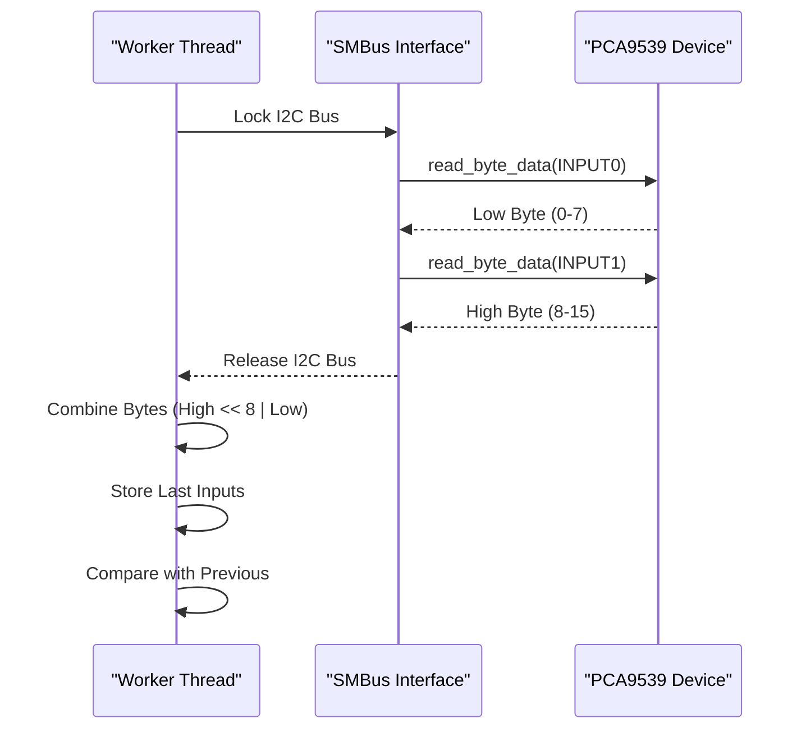

**Diagram sources**
- [run.py:128-133](file://run.py#L128-L133)

### Reading Pattern Benefits

The input reading pattern provides several advantages:

1. **Efficient I2C Communication**: Minimizes bus transactions to two per reading cycle
2. **Atomic State Capture**: Ensures consistent state capture across all 16 pins
3. **Change Detection**: Compares with previous readings to minimize unnecessary publishes
4. **Thread Safety**: Uses locks to prevent race conditions during I2C access

**Section sources**
- [run.py:128-133](file://run.py#L128-L133)

## Feedback Publishing Mechanism

The feedback publishing system implements a comprehensive MQTT-based reporting mechanism that provides real-time status updates to Home Assistant and other subscribers.

### MQTT Topic Structure

The system publishes feedback status to dedicated MQTT topics following Home Assistant's discovery format:

| Component | Topic Pattern | Purpose |
|-----------|---------------|---------|
| Binary Sensors | `homeassistant/binary_sensor/status_*` | Problem status reporting |
| Sensors | `homeassistant/sensor/pca9539_inputs/state` | Raw input state reporting |
| Availability | `homeassistant/availability` | System connectivity status |

### Publishing Workflow

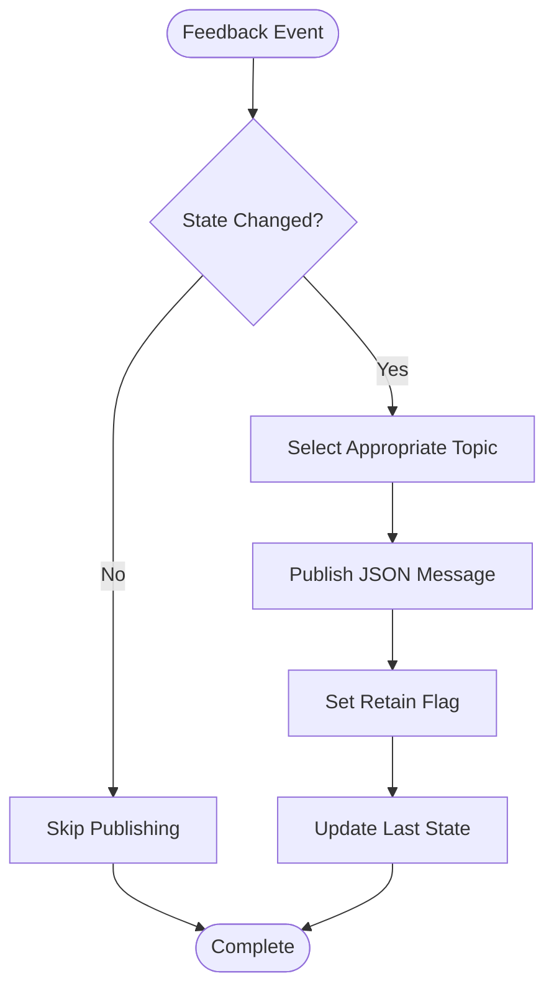

**Diagram sources**
- [run.py:694-696](file://run.py#L694-L696)

### Publishing Features

The publishing mechanism includes several key features:

1. **Change Detection**: Only publishes when state changes occur
2. **Retained Messages**: Uses MQTT retain flag for immediate status availability
3. **JSON Formatting**: Publishes structured JSON data for easy parsing
4. **Topic Organization**: Follows Home Assistant discovery conventions

**Section sources**
- [run.py:694-696](file://run.py#L694-L696)

## Real-time Problem Detection

The real-time problem detection system continuously monitors hardware status and immediately reports issues through multiple notification channels.

### Problem Detection Architecture

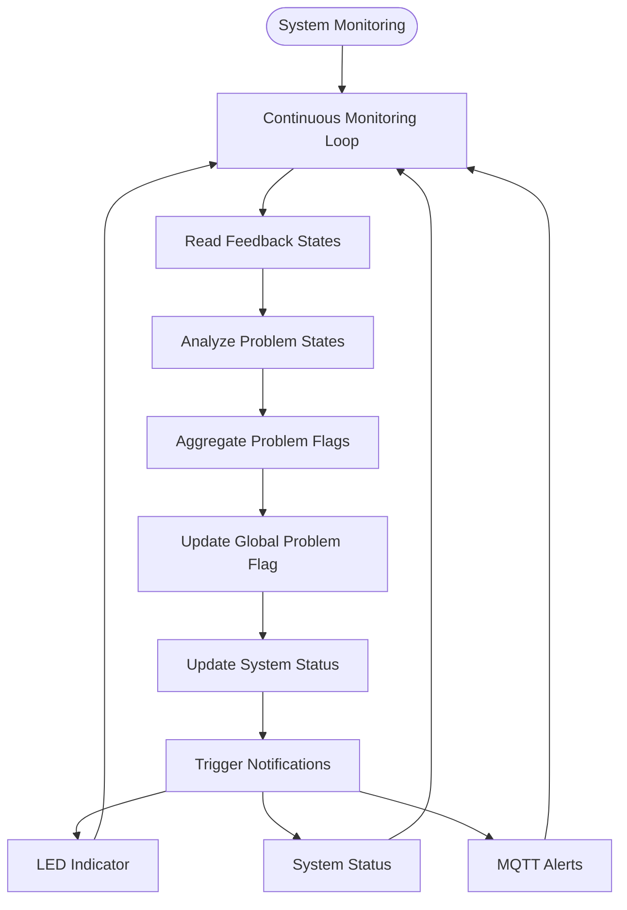

**Diagram sources**
- [run.py:789-791](file://run.py#L789-L791)

### Problem Detection Features

The real-time problem detection system provides:

1. **Immediate Detection**: Identifies issues as soon as they occur
2. **Aggregated Reporting**: Combines multiple problem sources into unified status
3. **Multi-channel Notification**: Supports LED indicators, system status, and MQTT alerts
4. **Persistent Status**: Maintains problem state until resolved

**Section sources**
- [run.py:789-791](file://run.py#L789-L791)

## Troubleshooting Guide

This comprehensive troubleshooting guide addresses common hardware feedback issues and their solutions.

### Common Issues and Solutions

#### Relay Feedback Problems

**Issue**: Relays show incorrect status despite proper operation
**Symptoms**: 
- Relay feedback shows ON when relay is actually OFF
- Status flips between ON and OFF randomly

**Causes and Solutions**:
1. **Logic Inversion**: Verify relay logic is correctly inverted (LOW=ON, HIGH=OFF)
2. **Wiring Issues**: Check for proper pull-up/pull-down resistors
3. **Load Interference**: Ensure relay loads are not interfering with feedback circuitry

#### Stepper Motor Issues

**Issue**: Stepper ENA/DIR feedback not updating
**Symptoms**:
- ENA feedback remains constant regardless of enable state
- DIR feedback not changing with direction commands

**Causes and Solutions**:
1. **Enable State Requirement**: DIR feedback only works when ENA is HIGH
2. **Signal Integrity**: Check for proper signal routing and termination
3. **Timing Issues**: Verify proper timing between enable and direction changes

#### Pulse Detection Failures

**Issue**: PU feedback not detected despite active pulsing
**Symptoms**:
- PU status shows ON even though pulses are being generated
- Intermittent pulse detection failures

**Causes and Solutions**:
1. **R12 Wiring**: Check resistor R12 connections for proper feedback sensing
2. **Signal Level**: Verify pulse signal levels meet input requirements
3. **Timing Synchronization**: Ensure pulse generation and detection timing align

#### Thermal Feedback Problems

**Issue**: TAXO feedback not responding to motor operation
**Symptoms**:
- TAXO status remains constant regardless of motor activity
- Thermal monitoring appears inactive

**Causes and Solutions**:
1. **PWM Activation**: Ensure corresponding PWM output is active (> 0)
2. **Sensor Connections**: Verify proper connections to thermal sensors
3. **History Buffer Issues**: Check for proper history buffer management

#### Reserve Input Issues

**Issue**: Reserve input monitoring not functioning
**Symptoms**:
- RES2/RES3/RES4 status not updating
- Inputs appear stuck at default values

**Causes and Solutions**:
1. **Pull-up/Pull-down Resistors**: Verify proper biasing of input pins
2. **External Connections**: Check for proper external circuit connections
3. **Pin Configuration**: Ensure pins are configured as inputs

### Diagnostic Procedures

#### Hardware Diagnostic Routine

The system includes an automated hardware diagnostic routine that tests all feedback capabilities:

1. **Relay Testing**: Tests all six relays for proper operation
2. **Stepper Signal Verification**: Verifies ENA, DIR, and PU signal functionality
3. **Pulse Detection Validation**: Confirms pulse feedback detection capability
4. **Thermal Monitoring Check**: Validates thermal sensor feedback
5. **Reserve Input Testing**: Tests all reserve input pins

#### Manual Testing Methods

**Relay Testing**:
- Manually toggle each relay and verify corresponding feedback
- Check for proper logic inversion (LOW=ON, HIGH=OFF)

**Stepper Testing**:
- Enable stepper and verify ENA feedback
- Change direction and verify DIR feedback
- Generate pulses and confirm PU feedback detection

**Thermal Testing**:
- Activate PWM outputs and verify TAXO feedback
- Check for proper pulse pattern detection

**Section sources**
- [run.py:369-458](file://run.py#L369-L458)

## Performance Considerations

The hardware feedback system is designed for optimal performance with minimal resource consumption.

### Performance Characteristics

**Processing Efficiency**:
- CPU usage: Minimal (< 1% of available processing power)
- Memory footprint: Constant memory usage regardless of monitoring duration
- I2C bandwidth: Efficient two-byte reads per cycle

**Response Times**:
- Feedback polling interval: 1 second (configurable)
- State change detection: Immediate upon hardware state changes
- MQTT publishing: Asynchronous with minimal latency

**Scalability Factors**:
- Fixed number of monitored pins (16) ensures predictable performance
- Bitwise operations provide fast state comparisons
- Thread-safe operations prevent performance degradation

### Optimization Strategies

1. **Efficient I2C Access**: Minimizes bus transactions to essential reads
2. **Change Detection**: Reduces unnecessary MQTT publishes
3. **History Buffer Management**: Limits memory usage with bounded buffers
4. **Thread Coordination**: Prevents race conditions without excessive locking

## Conclusion

The hardware feedback system utilizing the PCA9539 GPIO expander provides comprehensive real-time monitoring and verification capabilities for industrial control applications. The system's robust architecture ensures reliable operation through multiple verification layers, sophisticated pulse detection algorithms, and immediate problem reporting mechanisms.

Key strengths of the system include:

- **Comprehensive Coverage**: Monitors all critical hardware components including relays, steppers, thermal sensors, and reserve inputs
- **Intelligent Verification**: Implements sophisticated algorithms for pulse detection and state comparison
- **Real-time Monitoring**: Provides immediate feedback on hardware status with minimal latency
- **Fault Tolerance**: Includes diagnostic routines and graceful degradation when components fail
- **MQTT Integration**: Seamlessly integrates with Home Assistant and other MQTT-based systems

The system's modular design allows for easy maintenance and extension while maintaining high reliability standards. The combination of hardware-level feedback verification and software-based algorithms ensures accurate monitoring of complex industrial control systems.