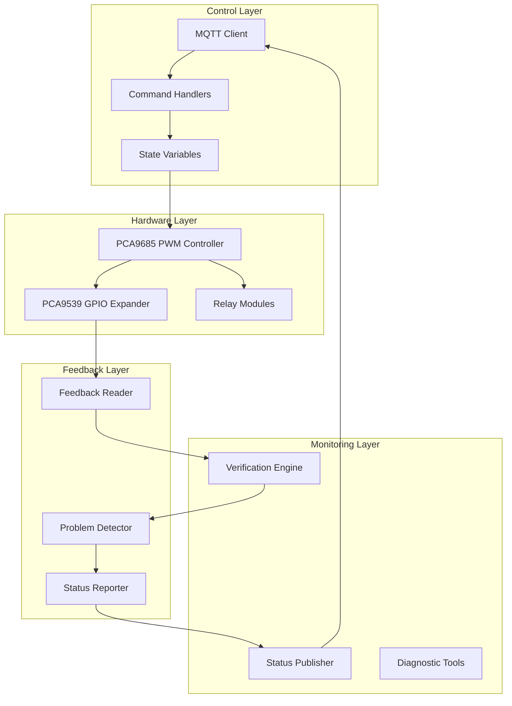
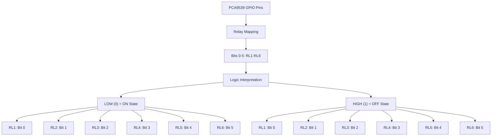
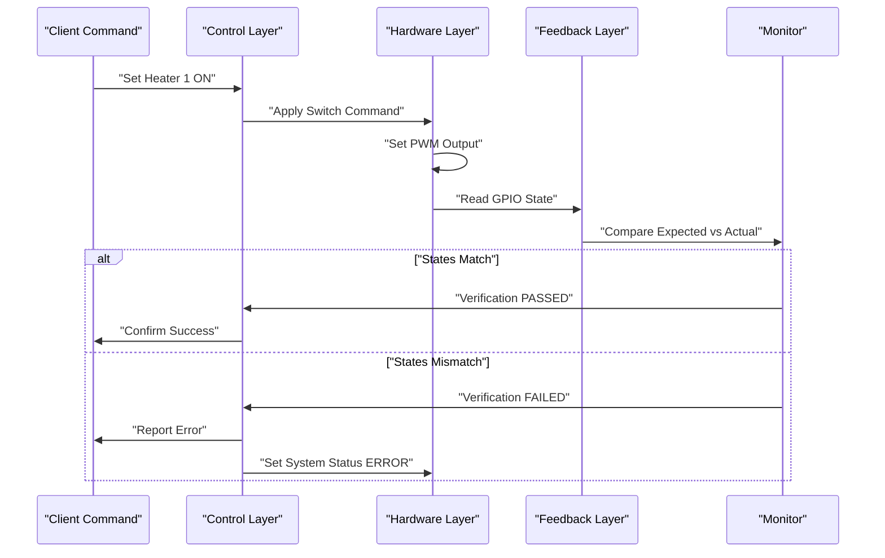
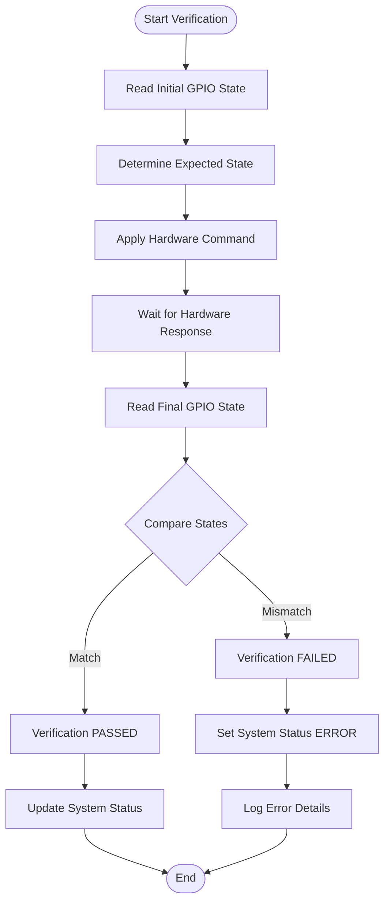
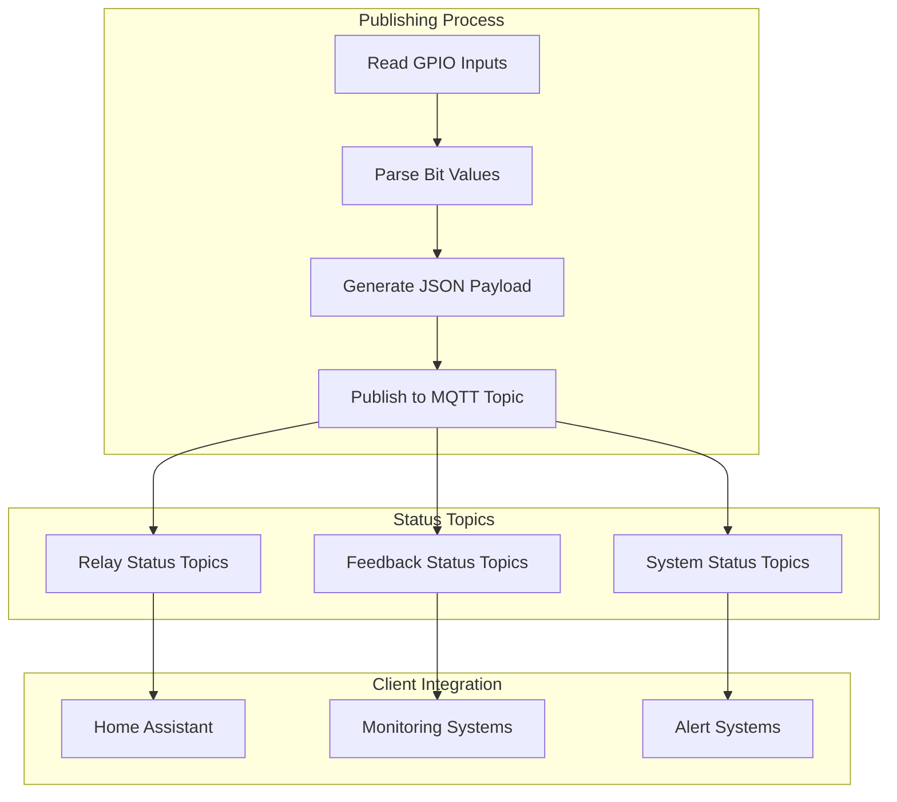
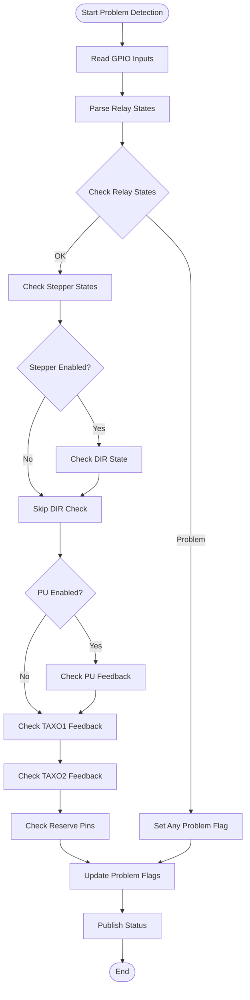

# Relay State Verification

<cite>
**Referenced Files in This Document**
- [run.py](file://run.py)
- [config.yaml](file://config.yaml)
</cite>

## Table of Contents
1. [Introduction](#introduction)
2. [System Architecture](#system-architecture)
3. [GPIO Pin Mapping](#gpio-pin-mapping)
4. [Relay Control Implementation](#relay-control-implementation)
5. [Feedback Verification Algorithm](#feedback-verification-algorithm)
6. [MQTT Publishing Mechanism](#mqtt-publishing-mechanism)
7. [Problem Detection Logic](#problem-detection-logic)
8. [Practical Usage Examples](#practical-usage-examples)
9. [Troubleshooting Guide](#troubleshooting-guide)
10. [Performance Considerations](#performance-considerations)
11. [Conclusion](#conclusion)

## Introduction

The relay state verification system is a comprehensive monitoring and validation framework designed to ensure reliable operation of heating and ventilation systems. This system monitors and validates relay operations for four heaters (Heater 1-4) and two fans (Fan 1-2), providing real-time feedback and error detection capabilities.

The system operates through a sophisticated combination of hardware control, feedback verification, and MQTT-based status reporting. It implements a dual-layer verification process that ensures commands are executed correctly and that the physical state matches the expected state.

## System Architecture

The relay state verification system is built around a modular architecture that separates concerns between hardware control, feedback monitoring, and status reporting:

**Diagram sources**
- [run.py:673-798](file://run.py#L673-L798)
- [run.py:950-991](file://run.py#L950-L991)

The architecture consists of several key components:

- **Control Layer**: Handles MQTT communication and command processing
- **Hardware Layer**: Manages PCA9685 PWM control and PCA9539 GPIO feedback
- **Monitoring Layer**: Implements verification algorithms and status publishing
- **Feedback Layer**: Processes hardware feedback and detects anomalies

## GPIO Pin Mapping

The system uses a 16-bit GPIO expansion architecture where bits 0-5 correspond to relays RL1-RL6. The mapping follows a specific convention where logic levels indicate relay states:

**Diagram sources**
- [run.py:702-712](file://run.py#L702-L712)

### Detailed Pin Configuration

The GPIO mapping establishes a clear relationship between logical states and physical relay behavior:

| Pin Number | Relay | Logical State | Physical State |
|------------|-------|---------------|----------------|
| Bit 0 | RL1 | 0 (LOW) | ON |
| Bit 0 | RL1 | 1 (HIGH) | OFF |
| Bit 1 | RL2 | 0 (LOW) | ON |
| Bit 1 | RL2 | 1 (HIGH) | OFF |
| Bit 2 | RL3 | 0 (LOW) | ON |
| Bit 2 | RL3 | 1 (HIGH) | OFF |
| Bit 3 | RL4 | 0 (LOW) | ON |
| Bit 3 | RL4 | 1 (HIGH) | OFF |
| Bit 4 | RL5 | 0 (LOW) | ON |
| Bit 4 | RL5 | 1 (HIGH) | OFF |
| Bit 5 | RL6 | 0 (LOW) | ON |
| Bit 5 | RL6 | 1 (HIGH) | OFF |

**Section sources**
- [run.py:702-712](file://run.py#L702-L712)
- [run.py:934-944](file://run.py#L934-L944)

## Relay Control Implementation

The relay control system implements a verified switching mechanism that ensures commands are executed correctly and validated against hardware feedback:

**Diagram sources**
- [run.py:950-991](file://run.py#L950-L991)
- [run.py:993-996](file://run.py#L993-L996)

### Control Flow Architecture

The verified switching process follows a three-phase approach:

1. **Pre-Check Phase**: Reads current GPIO state before applying changes
2. **Execution Phase**: Applies the requested command to hardware
3. **Post-Check Phase**: Validates the actual hardware state matches expectations

**Section sources**
- [run.py:950-991](file://run.py#L950-L991)

## Feedback Verification Algorithm

The feedback verification algorithm implements a sophisticated comparison mechanism that validates relay states against expected conditions:

**Diagram sources**
- [run.py:950-991](file://run.py#L950-L991)

### Verification Logic Implementation

The verification algorithm implements specific logic for different component types:

#### Relay Verification Logic
For relays (pins 0-5), the system uses inverted logic where:
- Expected LOW (0) indicates ON state
- Expected HIGH (1) indicates OFF state

#### Non-Relay Component Logic  
For stepper components (pins 8-10), standard logic applies:
- Expected HIGH (1) indicates ON state  
- Expected LOW (0) indicates OFF state

**Section sources**
- [run.py:950-991](file://run.py#L950-L991)

## MQTT Publishing Mechanism

The system implements a comprehensive MQTT publishing mechanism that provides real-time status updates and diagnostic information:

**Diagram sources**
- [run.py:690-798](file://run.py#L690-L798)

### Topic Structure and Organization

The MQTT publishing system organizes status information across multiple topic categories:

#### Relay Status Topics
- `homeassistant/binary_sensor/status_relay1/state`
- `homeassistant/binary_sensor/status_relay2/state`
- `homeassistant/binary_sensor/status_relay3/state`
- `homeassistant/binary_sensor/status_relay4/state`
- `homeassistant/binary_sensor/status_relay5/state`
- `homeassistant/binary_sensor/status_relay6/state`

#### Feedback Status Topics  
- `homeassistant/binary_sensor/status_ena/state`
- `homeassistant/binary_sensor/status_dir/state`
- `homeassistant/binary_sensor/status_pu/state`
- `homeassistant/binary_sensor/status_taxo1/state`
- `homeassistant/binary_sensor/status_taxo2/state`

**Section sources**
- [run.py:515-531](file://run.py#L515-L531)
- [run.py:690-798](file://run.py#L690-L798)

## Problem Detection Logic

The problem detection system continuously monitors hardware states and identifies potential issues through comprehensive validation:

**Diagram sources**
- [run.py:690-798](file://run.py#L690-L798)

### Detection Algorithm Details

The problem detection algorithm implements specific validation criteria for each component type:

#### Relay State Validation
- Compares expected relay states with actual GPIO readings
- Uses inverted logic for relay feedback (LOW=ON, HIGH=OFF)
- Sets problem flag when mismatches are detected

#### Stepper Component Validation
- Validates ENA (Enable) pin logic (HIGH=ON, LOW=OFF)
- Checks DIR (Direction) pin only when stepper is enabled
- Ensures proper timing and setup requirements

#### Feedback Component Validation
- Monitors TAXO1 and TAXO2 feedback for pulse detection
- Validates PU (Pulse) feedback during active pulsing
- Checks reserve pins for proper operation

**Section sources**
- [run.py:690-798](file://run.py#L690-L798)

## Practical Usage Examples

### Relay Control Commands

The system provides comprehensive MQTT-based control for all relay components:

#### Basic Relay Operations
- **Heater 1 Control**: `homeassistant/switch/pca_heater_1/set` with payload "ON"/"OFF"
- **Heater 2 Control**: `homeassistant/switch/pca_heater_2/set` with payload "ON"/"OFF"  
- **Heater 3 Control**: `homeassistant/switch/pca_heater_3/set` with payload "ON"/"OFF"
- **Heater 4 Control**: `homeassistant/switch/pca_heater_4/set` with payload "ON"/"OFF"
- **Fan 1 Power Control**: `homeassistant/switch/pca_fan_1_power/set` with payload "ON"/"OFF"
- **Fan 2 Power Control**: `homeassistant/switch/pca_fan_2_power/set` with payload "ON"/"OFF"

#### Feedback Verification Procedures
1. **Manual Verification**: Send control command, wait 120ms, read feedback topic
2. **Automatic Verification**: System automatically performs pre/post checks
3. **Diagnostic Mode**: Run hardware diagnostic to test all relays

### Status Monitoring Examples

#### Real-time Status Checking
- **Relay Status**: Monitor `homeassistant/binary_sensor/status_relayX/state` topics
- **System Health**: Check `homeassistant/availability` topic for connectivity
- **Problem Indicators**: Monitor feedback status topics for error conditions

#### Integration with Home Assistant
The system integrates seamlessly with Home Assistant through MQTT Discovery, providing:
- Automatic entity registration
- Real-time state updates
- Historical status tracking
- Alert notifications for problems

**Section sources**
- [run.py:1716-1883](file://run.py#L1716-L1883)
- [run.py:1357-1396](file://run.py#L1357-L1396)

## Troubleshooting Guide

### Common Relay Issues and Solutions

#### Issue: Relay Does Not Respond
**Symptoms**: Command sent but no hardware response
**Diagnosis Steps**:
1. Verify MQTT connectivity to broker
2. Check PCA9685 initialization status
3. Confirm GPIO expander availability
4. Review system logs for initialization errors

**Resolution Actions**:
- Restart service to reinitialize hardware
- Check I2C bus connections
- Verify power supply to relay modules
- Replace faulty relay components

#### Issue: Incorrect Relay State
**Symptoms**: Relay appears to be in wrong state
**Diagnosis Steps**:
1. Check feedback topic for actual GPIO state
2. Verify command payload format
3. Examine timing of state transitions
4. Review system status indicators

**Resolution Actions**:
- Recalibrate relay timing parameters
- Check wiring continuity
- Verify load characteristics
- Update firmware if necessary

#### Issue: Feedback Mismatch
**Symptoms**: Expected state differs from actual feedback
**Diagnosis Steps**:
1. Analyze verification error logs
2. Check GPIO pin configuration
3. Verify relay coil resistance
4. Test load switching characteristics

**Resolution Actions**:
- Adjust timing delays in verification
- Replace damaged relay contacts
- Check for electrical interference
- Update feedback thresholds

### Diagnostic Procedures

#### Hardware Diagnostic Testing
The system includes comprehensive diagnostic capabilities:

1. **Initialization Check**: Verifies PCA9685, PCA9539, and PCA9540 initialization
2. **Relay Testing**: Tests all six relays with ON/OFF cycles
3. **Feedback Validation**: Confirms proper GPIO feedback operation
4. **Timing Verification**: Validates pulse timing and sequencing

#### System Status Monitoring
- **Real-time Status**: `homeassistant/sensor/pca9539_inputs/state` for raw GPIO data
- **Problem Detection**: Binary sensor topics for immediate issue identification
- **System Health**: LED indicator and system status variables

**Section sources**
- [run.py:369-458](file://run.py#L369-L458)
- [run.py:673-798](file://run.py#L673-L798)

## Performance Considerations

### Timing and Synchronization

The relay verification system implements careful timing management to ensure reliable operation:

- **Verification Delay**: 120ms post-command delay for hardware stabilization
- **Feedback Sampling**: Continuous monitoring with 1-second intervals
- **Thread Management**: Dedicated threads for independent component monitoring
- **Resource Locking**: Thread-safe access to shared hardware resources

### Memory and Resource Management

The system optimizes resource usage through:
- Minimal memory footprint for status variables
- Efficient GPIO polling mechanisms
- Optimized MQTT message publishing
- Graceful shutdown procedures

### Scalability Considerations

The modular architecture supports:
- Easy addition of new relay components
- Configurable timing parameters
- Extensible feedback monitoring
- Flexible MQTT topic organization

## Conclusion

The relay state verification system provides a robust, comprehensive solution for monitoring and validating relay operations in heating and ventilation systems. Through its dual-layer verification approach, sophisticated feedback mechanisms, and MQTT-based status reporting, the system ensures reliable operation while providing detailed diagnostics and troubleshooting capabilities.

Key strengths of the system include:
- **Reliable Verification**: Three-phase verification process ensures command accuracy
- **Comprehensive Monitoring**: Real-time feedback on all system components
- **Proactive Diagnostics**: Automated testing and problem detection
- **Seamless Integration**: Full Home Assistant MQTT Discovery support
- **Flexible Architecture**: Modular design supports future enhancements

The system's implementation demonstrates best practices in embedded control systems, combining hardware reliability with software robustness to deliver a production-ready solution for industrial and commercial applications.