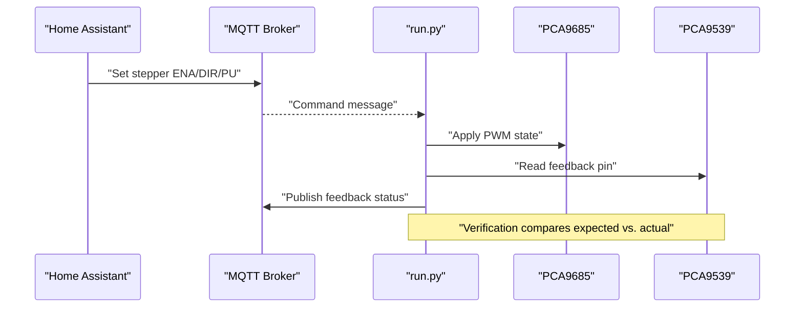
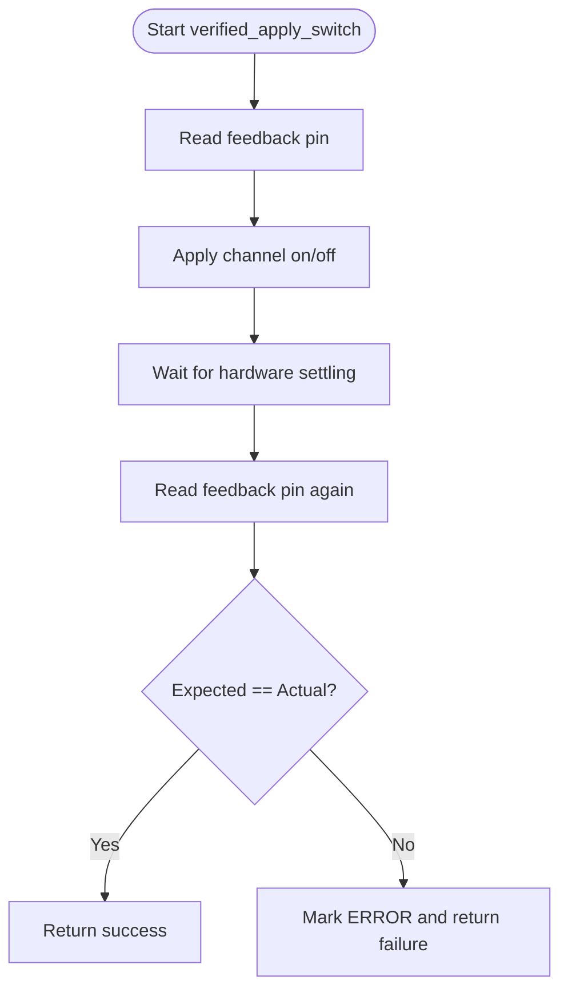
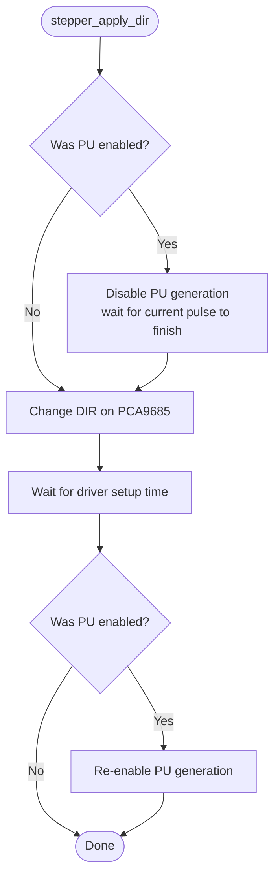
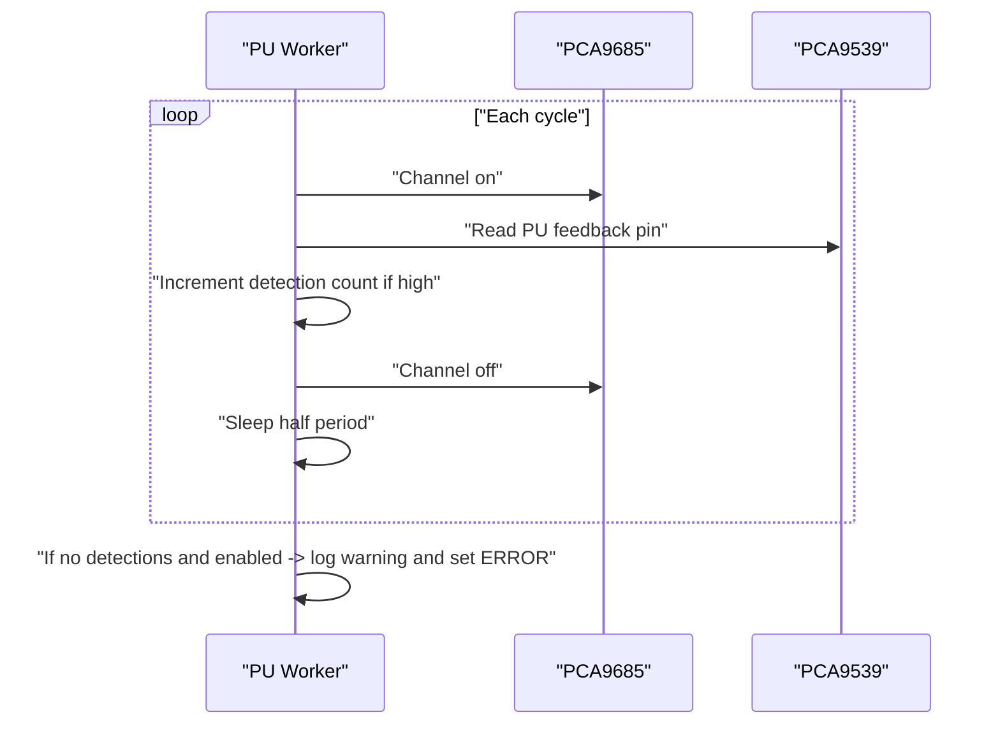
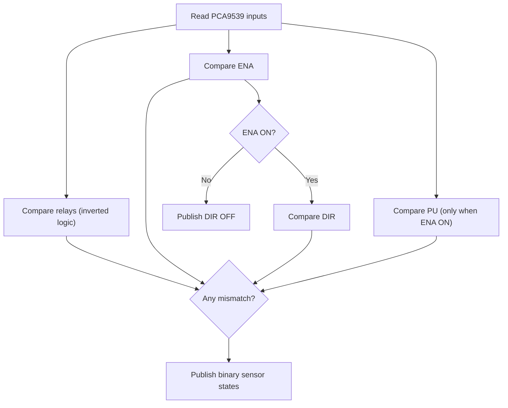
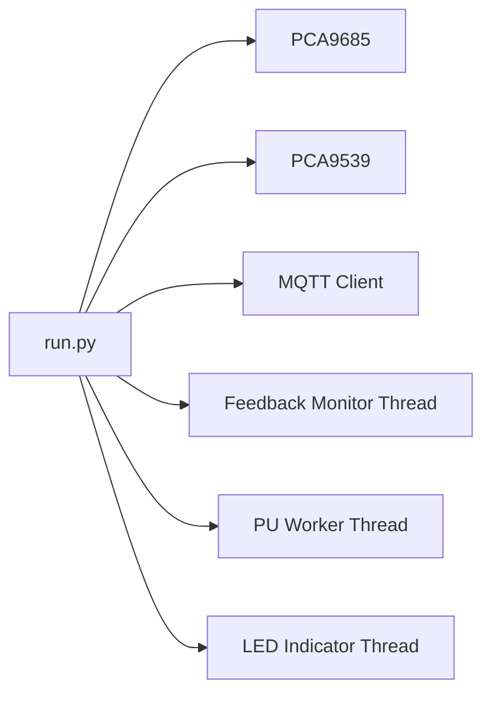

# Stepper Control Feedback

<cite>
**Referenced Files in This Document**
- [run.py](file://run.py)
- [config.yaml](file://config.yaml)
</cite>

## Table of Contents
1. [Introduction](#introduction)
2. [Project Structure](#project-structure)
3. [Core Components](#core-components)
4. [Architecture Overview](#architecture-overview)
5. [Detailed Component Analysis](#detailed-component-analysis)
6. [Dependency Analysis](#dependency-analysis)
7. [Performance Considerations](#performance-considerations)
8. [Troubleshooting Guide](#troubleshooting-guide)
9. [Conclusion](#conclusion)

## Introduction
This document explains the stepper motor control feedback system implemented in the project. It focuses on:
- GPIO pin mapping for stepper control signals (ENA and DIR)
- Enable/disable state verification logic
- Direction feedback monitoring during active stepper operation
- Pulse signal (PU) detection mechanism
- The pulse detection algorithm that verifies proper stepper operation
- Real-time problem detection comparing commanded vs. actual signals
- Practical examples of stepper control commands and feedback verification procedures

## Project Structure
The system is implemented in a single Python script that orchestrates:
- PCA9685 PWM outputs for actuators and the stepper pulse generator
- PCA9539 GPIO expander for feedback monitoring
- MQTT integration for Home Assistant discovery and control
- Dedicated threads for continuous feedback monitoring and pulse generation

```mermaid
graph TB
subgraph "Host"
HA["Home Assistant"]
MQTT["MQTT Broker"]
end
subgraph "Device"
RUN["run.py"]
PCA9685["PCA9685 (I2C)"]
PCA9539["PCA9539 (I2C)<br/>Feedback Inputs"]
BME["BME280 Sensors (I2C via PCA9540B)"]
end
HA --> MQTT
MQTT <- --> RUN
RUN --> PCA9685
RUN --> PCA9539
RUN --> BME
```

**Diagram sources**
- [run.py:1250-1257](file://run.py#L1250-L1257)
- [run.py:571-586](file://run.py#L571-L586)
- [run.py:588-604](file://run.py#L588-L604)
- [run.py:606-630](file://run.py#L606-L630)

**Section sources**
- [run.py:1250-1257](file://run.py#L1250-L1257)
- [run.py:571-586](file://run.py#L571-L586)
- [run.py:588-604](file://run.py#L588-L604)
- [run.py:606-630](file://run.py#L606-L630)

## Core Components
- PCA9685: Controls PWM outputs for heaters, fans, stepper DIR/ENA/PU, and LEDs.
- PCA9539: Reads feedback pins for relays, stepper ENA/DIR/PU, and reserve pins.
- MQTT client: Publishes discovery configs and states; subscribes to control topics.
- Feedback monitor thread: Periodically reads PCA9539 inputs and publishes binary sensor states.
- Pulse generator thread: Generates square-wave pulses on the PU channel and validates feedback.

Key constants and mappings:
- Fixed channel assignments for PCA9685 outputs
- Feedback pin mapping from PCA9685 channels to PCA9539 pins
- Topic names for MQTT control and feedback

**Section sources**
- [run.py:266-282](file://run.py#L266-L282)
- [run.py:934-944](file://run.py#L934-L944)
- [run.py:469-531](file://run.py#L469-L531)

## Architecture Overview
The system implements a closed-loop control and feedback verification architecture:
- Commands arrive via MQTT topics and are applied to PCA9685 channels.
- A verification routine checks the corresponding PCA9539 feedback pin immediately after applying the command.
- A dedicated feedback monitor continuously compares expected vs. actual states and publishes binary sensor statuses.
- A pulse generator thread toggles the PU output at a configurable frequency and monitors feedback to detect missing pulses.



**Diagram sources**
- [run.py:950-991](file://run.py#L950-L991)
- [run.py:673-798](file://run.py#L673-L798)
- [run.py:1709-1883](file://run.py#L1709-L1883)

## Detailed Component Analysis

### GPIO Pin Mapping for Stepper Control Signals
- PCA9685 channels:
  - DIR: channel 7
  - ENA: channel 8
  - PU: channel 9
- PCA9539 feedback pins:
  - ENA: pin 8
  - DIR: pin 9
  - PU: pin 10
- Mapping table:
  - Channel 7 (DIR) -> Feedback pin 9
  - Channel 8 (ENA) -> Feedback pin 8
  - Channel 9 (PU) -> Feedback pin 10

These mappings are used by:
- Verified switch application to confirm ENA/DIR state
- Continuous feedback monitoring to compare expected vs. actual
- Diagnostic routines to validate hardware connectivity

**Section sources**
- [run.py:266-282](file://run.py#L266-L282)
- [run.py:934-944](file://run.py#L934-L944)

### Enable/Disable State Verification Logic
The verification process ensures that commanded states are reflected on the hardware:
- Pre-check: Read the feedback pin for the target channel.
- Apply command: Turn the PCA9685 channel on or off.
- Post-check: Read the feedback pin again after a short delay.
- Compare: Expected vs. actual; if mismatch, mark system status as error.

Important behaviors:
- Relays (pins 0–5) use inverted logic: low indicates ON, high indicates OFF.
- ENA/DIR/PU (pins 8–10) follow PCA9685 logic: high indicates ON, low indicates OFF.
- A small delay allows hardware to settle before post-check.



**Diagram sources**
- [run.py:950-991](file://run.py#L950-L991)

**Section sources**
- [run.py:950-991](file://run.py#L950-L991)

### Direction Feedback Monitoring During Active Operation
Direction feedback is meaningful only when the stepper is enabled:
- When ENA is ON, read DIR feedback pin and compare with the commanded direction.
- If ENA is OFF, publish DIR feedback as OFF (meaningless).
- Safe direction switching temporarily disables pulse generation, waits for current pulse to finish, updates DIR, waits for setup time, then resumes pulses if previously enabled.



**Diagram sources**
- [run.py:998-1036](file://run.py#L998-L1036)

**Section sources**
- [run.py:998-1036](file://run.py#L998-L1036)

### Pulse Signal (PU) Detection Mechanism
The PU channel generates square-wave pulses at a configurable frequency. The detection mechanism:
- Pulse generator toggles the channel on/off with half-period timing.
- During each cycle, a brief read of the PU feedback pin captures whether the signal is present.
- A counter tracks consecutive detections; if none are observed for a period, an error is logged and system status is set to ERROR.



**Diagram sources**
- [run.py:1044-1105](file://run.py#L1044-L1105)

**Section sources**
- [run.py:1044-1105](file://run.py#L1044-L1105)

### State Comparison Between Commanded and Actual Signals
The feedback monitor continuously compares:
- Relays: expected ON/OFF vs. actual feedback (inverted logic).
- Stepper ENA: expected vs. actual feedback pin.
- Stepper DIR: only meaningful when ENA is ON; expected vs. actual feedback pin.
- PU: only meaningful when ENA is ON; detects whether pulses are present.

It publishes binary sensor topics indicating problems when mismatches occur.



**Diagram sources**
- [run.py:673-798](file://run.py#L673-L798)

**Section sources**
- [run.py:673-798](file://run.py#L673-L798)

### Real-Time Problem Detection
- The feedback monitor sets a global flag indicating any problem.
- An LED indicator thread reads this flag and blinks red when problems are detected.
- System status is updated to ERROR upon verification failures or missing PU pulses.

**Section sources**
- [run.py:673-798](file://run.py#L673-L798)
- [run.py:1128-1226](file://run.py#L1128-L1226)
- [run.py:1095-1101](file://run.py#L1095-L1101)

## Dependency Analysis
- PCA9685 controls outputs and timing for ENA, DIR, PU, and other channels.
- PCA9539 reads feedback pins and feeds back into the system via MQTT topics.
- MQTT client manages discovery, subscriptions, and state publication.
- Threads:
  - Feedback monitor: periodic reads and comparisons
  - Pulse generator: continuous pulse generation and feedback validation
  - LED indicator: translates runtime problems into visual cues



**Diagram sources**
- [run.py:673-798](file://run.py#L673-L798)
- [run.py:1044-1105](file://run.py#L1044-L1105)
- [run.py:1128-1226](file://run.py#L1128-L1226)

**Section sources**
- [run.py:673-798](file://run.py#L673-L798)
- [run.py:1044-1105](file://run.py#L1044-L1105)
- [run.py:1128-1226](file://run.py#L1128-L1226)

## Performance Considerations
- Feedback polling interval is approximately 1 second; this balances responsiveness with CPU usage.
- Pulse generation uses precise half-period timing; detection occurs early in each cycle to minimize latency.
- Verification delays account for hardware settling; tuning may be needed for different drivers or wiring.
- Long-running threads are daemonized; shutdown sequences ensure graceful cleanup.

[No sources needed since this section provides general guidance]

## Troubleshooting Guide

### Practical Examples of Stepper Control Commands
- Enable the stepper:
  - Publish ON to topic: homeassistant/switch/pca_stepper_ena/set
  - Expect ENA feedback to become ON and DIR feedback to be meaningful
- Change direction:
  - Publish CW or CCW to topic: homeassistant/select/pca_stepper_dir/set
  - The system safely disables pulses, switches DIR, waits, then resumes pulses if enabled
- Start generating pulses:
  - Publish ON to topic: homeassistant/switch/pca_pu_enable/set
  - Set desired frequency via topic: homeassistant/number/pca_pu_freq_hz/set

**Section sources**
- [run.py:1860-1866](file://run.py#L1860-L1866)
- [run.py:1868-1873](file://run.py#L1868-L1873)
- [run.py:1875-1879](file://run.py#L1875-L1879)

### Feedback Verification Procedures
- After sending a command, verify:
  - ENA/DIR states on their respective binary sensor topics
  - PU presence when ENA is ON and pulses are enabled
- If a mismatch is reported:
  - Confirm wiring and pull-up resistors for feedback pins
  - Re-run hardware diagnostic to validate connections

**Section sources**
- [run.py:950-991](file://run.py#L950-L991)
- [run.py:414-458](file://run.py#L414-L458)

### Troubleshooting Stepper Operation Problems
Common issues and remedies:
- ENA/DIR mismatch:
  - Verify PCA9539 feedback pin mapping and logic (ENA/DIR follow PCA9685 logic)
  - Check for voltage levels and wiring continuity
- Missing PU pulses:
  - Ensure ENA is ON and PU is enabled
  - Confirm frequency setting and that the pulse generator thread is running
  - Inspect feedback resistor and wiring for PU pin
- Direction changes fail:
  - Ensure pulses are disabled before changing DIR
  - Confirm setup time is respected before re-enabling pulses

**Section sources**
- [run.py:1044-1105](file://run.py#L1044-L1105)
- [run.py:998-1036](file://run.py#L998-L1036)
- [run.py:414-458](file://run.py#L414-L458)

## Conclusion
The system provides robust closed-loop control and feedback for stepper motors:
- Clear pin mappings for ENA, DIR, and PU
- Verified application of commands with immediate feedback checks
- Continuous monitoring of ENA/DIR/PU states with binary sensor reporting
- Precise pulse generation and detection with real-time error reporting
- Practical MQTT-based control and diagnostics suitable for Home Assistant integration