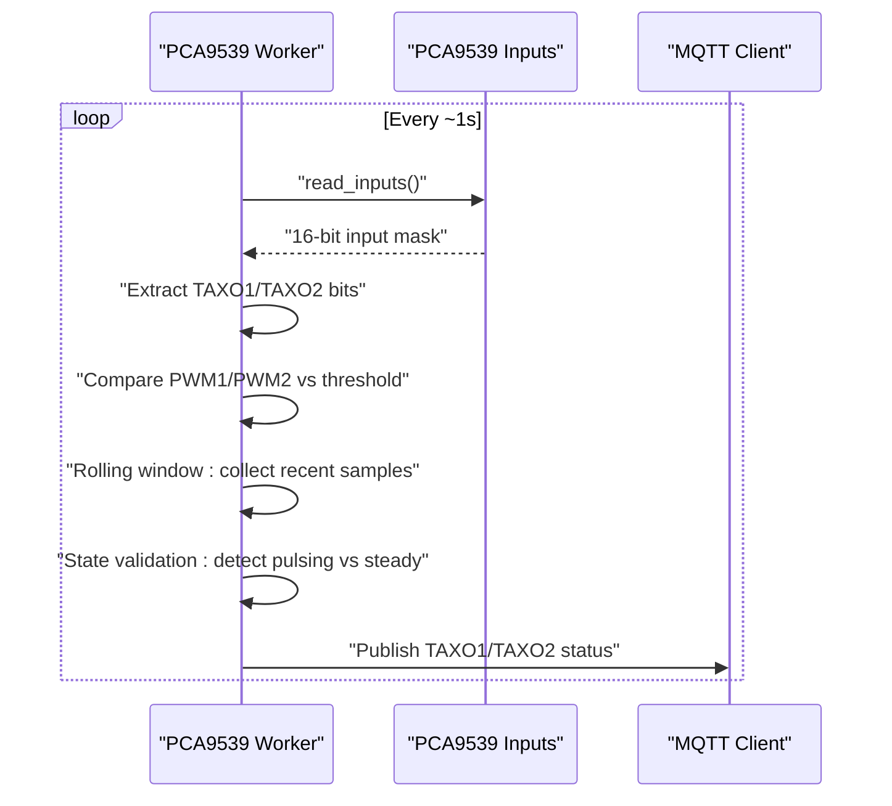
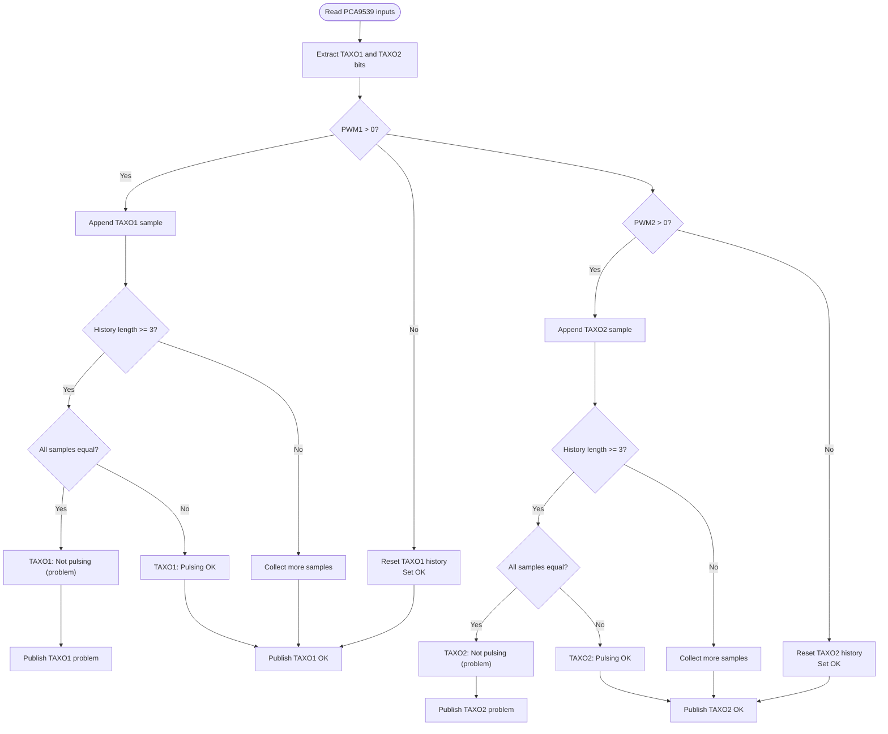
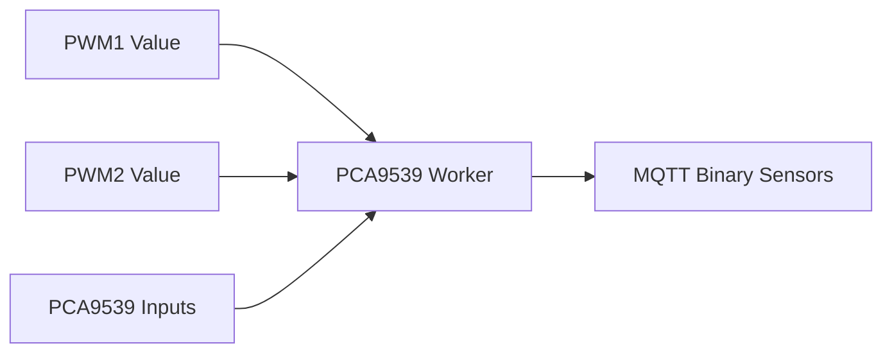

# Thermal Feedback Monitoring

<cite>
**Referenced Files in This Document**
- [run.py](file://run.py)
- [config.yaml](file://config.yaml)
</cite>

## Table of Contents
1. [Introduction](#introduction)
2. [Project Structure](#project-structure)
3. [Core Components](#core-components)
4. [Architecture Overview](#architecture-overview)
5. [Detailed Component Analysis](#detailed-component-analysis)
6. [Dependency Analysis](#dependency-analysis)
7. [Performance Considerations](#performance-considerations)
8. [Troubleshooting Guide](#troubleshooting-guide)
9. [Conclusion](#conclusion)
10. [Appendices](#appendices)

## Introduction
This document describes the thermal feedback monitoring system that verifies motor operation using TAXO1/TAXO2 pins for pulse feedback. It explains how the system detects pulses when PWM values exceed a threshold, validates states using rolling-window sampling, and publishes thermal feedback status to MQTT topics. Practical examples and troubleshooting guidance are included to help operators monitor and diagnose motor thermal behavior safely.

## Project Structure
The project is a Python service that controls PCA9685-based peripherals and monitors feedback via PCA9539 GPIO expansion. The thermal feedback logic resides in the PCA9539 worker that reads TAXO pins and publishes binary sensor states to MQTT.

```mermaid
graph TB
subgraph "Host"
MQTT["MQTT Broker"]
HA["Home Assistant"]
end
subgraph "Device"
PCA9685["PCA9685 PWM Controller"]
PCA9539["PCA9539 GPIO Expander"]
BME280["BME280 Sensors"]
STEPPERS["Stepper Motors"]
end
MQTT <- --> HA
PCA9685 <-- I2C --> PCA9539
PCA9685 <-- I2C --> BME280
STEPPERS <-- Signals --> PCA9685
PCA9539 <-- Feedback Pins --> STEPPERS
PCA9685 <-- PWM Outputs --> STEPPERS
PCA9685 <-- PWM Outputs --> FANS["Fans"]
PCA9685 <-- PWM Outputs --> HEATERS["Heaters"]
PCA9539 -.->|"Reads TAXO1/TAXO2"| STEPPERS
PCA9685 -.->|"Publishes Feedback Status"| MQTT
```

**Diagram sources**
- [run.py:571-586](file://run.py#L571-L586)
- [run.py:588-604](file://run.py#L588-L604)
- [run.py:627-629](file://run.py#L627-L629)
- [run.py:930-949](file://run.py#L930-L949)

**Section sources**
- [run.py:571-586](file://run.py#L571-L586)
- [run.py:588-604](file://run.py#L588-L604)
- [run.py:627-629](file://run.py#L627-L629)
- [run.py:930-949](file://run.py#L930-L949)

## Core Components
- PCA9685: Controls PWM outputs for fans, heaters, steppers, and LEDs.
- PCA9539: Reads feedback pins including TAXO1/TAXO2 for motor pulse verification.
- MQTT: Publishes feedback status as binary sensors and receives commands.
- BME280: Environmental sensors (optional; not directly involved in thermal feedback).
- Thermal feedback logic: Monitors TAXO pins and validates pulsing state using rolling windows.

Key constants and topics:
- TAXO pins: TAXO1 on PCA9539 pin 11, TAXO2 on PCA9539 pin 12.
- Feedback topics: Binary sensors for TAXO1 and TAXO2 status.
- PWM channels: PWM1 and PWM2 drive fans; steppers use dedicated channels.

**Section sources**
- [run.py:946-949](file://run.py#L946-L949)
- [run.py:518-520](file://run.py#L518-L520)
- [run.py:266-282](file://run.py#L266-L282)

## Architecture Overview
The thermal feedback monitoring runs continuously in a dedicated worker thread that periodically reads PCA9539 inputs, evaluates whether motors are pulsing based on PWM thresholds, and publishes status to MQTT.



**Diagram sources**
- [run.py:673-798](file://run.py#L673-L798)
- [run.py:518-520](file://run.py#L518-L520)

## Detailed Component Analysis

### Thermal Feedback Logic (TAXO Pins)
The PCA9539 worker reads feedback pins and determines whether motors are pulsing based on PWM values and rolling-window sampling.

- PWM thresholds:
  - PWM1 drives Fan 1; PWM2 drives Fan 2.
  - When PWM1 or PWM2 exceeds zero, the system expects TAXO1/TAXO2 to show pulses.
  - When PWM is zero, no pulses are expected.

- Rolling-window sampling:
  - Collect up to N recent samples (e.g., 5) for each TAXO pin.
  - If all samples are identical, the pin is considered “not pulsing.”
  - If samples vary (at least one transition), the pin is considered “pulsing.”

- State validation:
  - If pulsing is expected but not detected, publish a “problem” status.
  - If pulsing is not expected (PWM zero), accept any stable state.



**Diagram sources**
- [run.py:749-779](file://run.py#L749-L779)

**Section sources**
- [run.py:749-779](file://run.py#L749-L779)

### PWM Threshold and Edge Cases
- PWM threshold: The system treats any PWM value greater than zero as “pulsing expected.” This covers small duty cycles where motors still pulse.
- Motors off: When PWM equals zero, the system clears histories and treats any stable input as acceptable.
- Transient noise: The rolling window reduces false positives by requiring consistent transitions across multiple samples.

**Section sources**
- [run.py:751-761](file://run.py#L751-L761)
- [run.py:767-777](file://run.py#L767-L777)

### MQTT Publishing and Topics
- Binary sensor topics:
  - TAXO1 status: Published to a dedicated binary sensor topic.
  - TAXO2 status: Published to a dedicated binary sensor topic.
- Payload semantics:
  - “ON” indicates a problem detected (e.g., pulsing not observed when expected).
  - “OFF” indicates normal operation.
- Availability:
  - The service publishes an availability topic to indicate online/offline status.

**Section sources**
- [run.py:518-520](file://run.py#L518-L520)
- [run.py:1709-1738](file://run.py#L1709-L1738)

### Practical Thermal Monitoring Procedures
- Verify motor operation:
  - Set PWM1 or PWM2 to a small non-zero value to induce pulsing.
  - Observe TAXO1/TAXO2 status in Home Assistant; “OFF” indicates pulsing is occurring.
- Diagnose missing pulses:
  - If “ON” appears for TAXO1/TAXO2, confirm PWM is above zero and inspect wiring and load.
- Monitor environmental conditions:
  - Use BME280 topics to track temperature and pressure alongside thermal feedback.

**Section sources**
- [run.py:1310-1624](file://run.py#L1310-L1624)
- [run.py:627-629](file://run.py#L627-L629)

## Dependency Analysis
The thermal feedback logic depends on:
- PCA9539 input readings for TAXO1/TAXO2.
- PWM values for PWM1 and PWM2 to decide whether pulsing is expected.
- MQTT client for publishing status.



**Diagram sources**
- [run.py:673-798](file://run.py#L673-L798)
- [run.py:518-520](file://run.py#L518-L520)

**Section sources**
- [run.py:673-798](file://run.py#L673-L798)
- [run.py:518-520](file://run.py#L518-L520)

## Performance Considerations
- Sampling interval: The worker runs approximately every second, balancing responsiveness with CPU usage.
- Rolling window size: A small window (e.g., 5 samples) provides quick detection while reducing noise sensitivity.
- I2C contention: Shared SMBus access is protected by a lock to prevent conflicts.

[No sources needed since this section provides general guidance]

## Troubleshooting Guide
Common issues and resolutions:
- No pulses reported when PWM is non-zero:
  - Confirm PWM1/PWM2 values are above zero.
  - Inspect wiring between PCA9685 outputs and TAXO pins.
  - Verify load and motor connections.
- Unexpected “pulsing” status:
  - Check for PWM drift near zero; ensure PWM remains consistently above threshold.
  - Validate that the motor is mechanically coupled and free to move.
- PCA9539 not available:
  - Initialization failures disable feedback; check I2C address and wiring.
- MQTT connectivity:
  - Ensure the broker is reachable and credentials are correct.
  - Confirm discovery messages are published and retained.

**Section sources**
- [run.py:588-604](file://run.py#L588-L604)
- [run.py:1709-1738](file://run.py#L1709-L1738)

## Conclusion
The thermal feedback monitoring system uses TAXO1/TAXO2 pins to verify motor pulsing when PWM exceeds a threshold. By applying rolling-window sampling and publishing binary sensor states, it enables reliable thermal diagnostics. Operators can validate motor operation, troubleshoot missing pulses, and integrate feedback into Home Assistant for continuous monitoring.

[No sources needed since this section summarizes without analyzing specific files]

## Appendices

### Configuration Reference
- MQTT host/port/credentials are configurable.
- PCA addresses and I2C bus selection are configurable.
- Default duty cycle and pulse unit (PU) frequency are configurable.

**Section sources**
- [config.yaml:28-41](file://config.yaml#L28-L41)