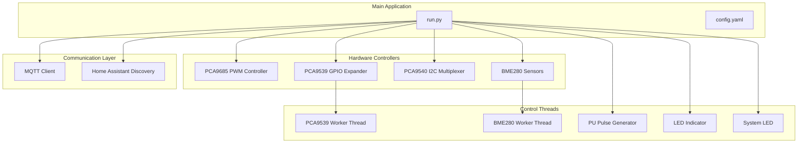
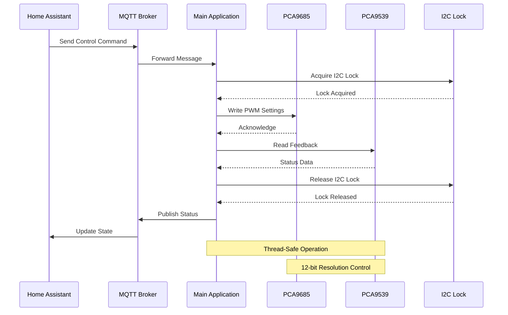
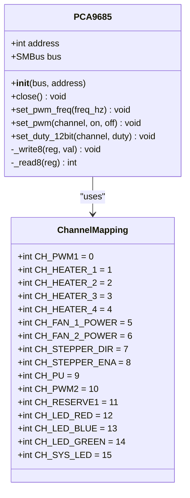
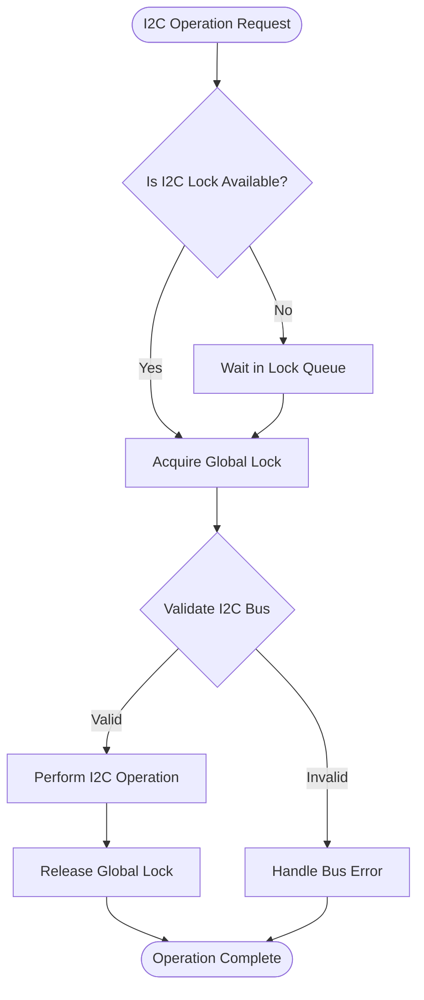
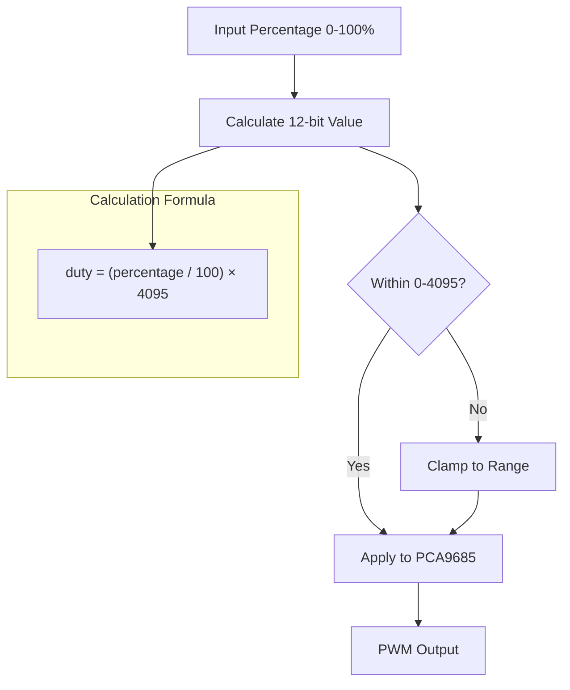
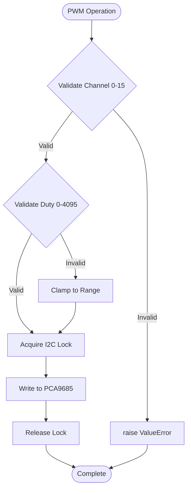
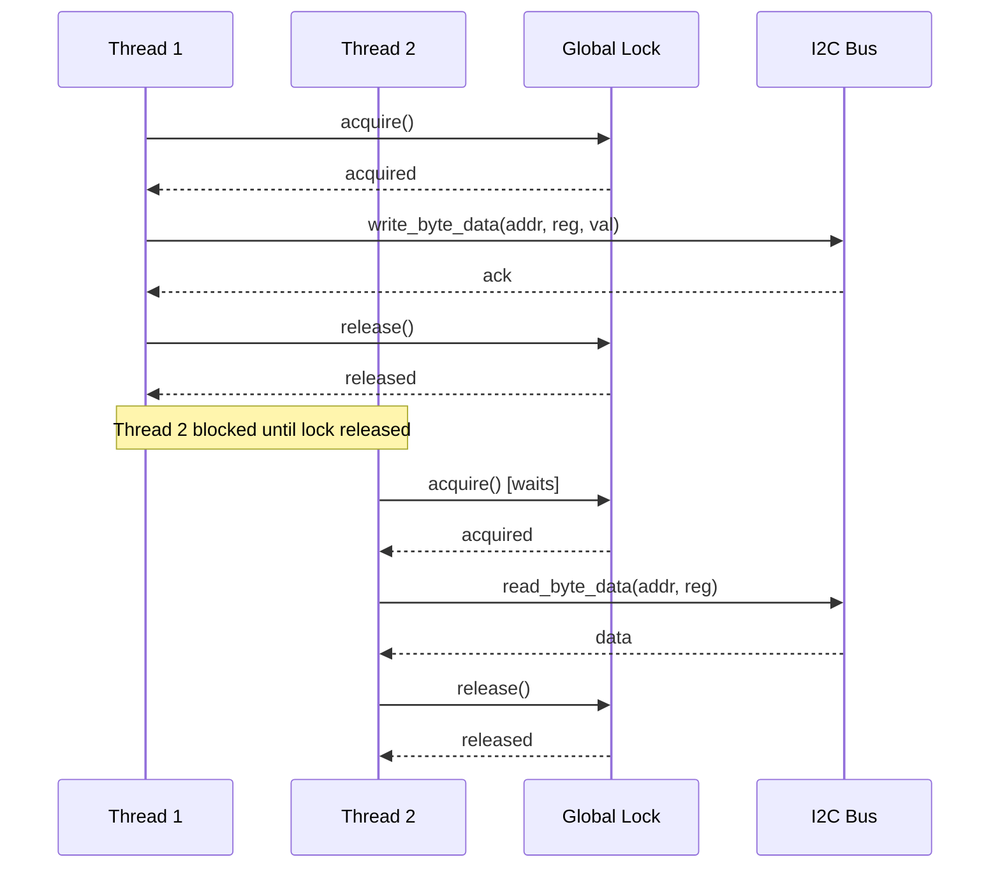
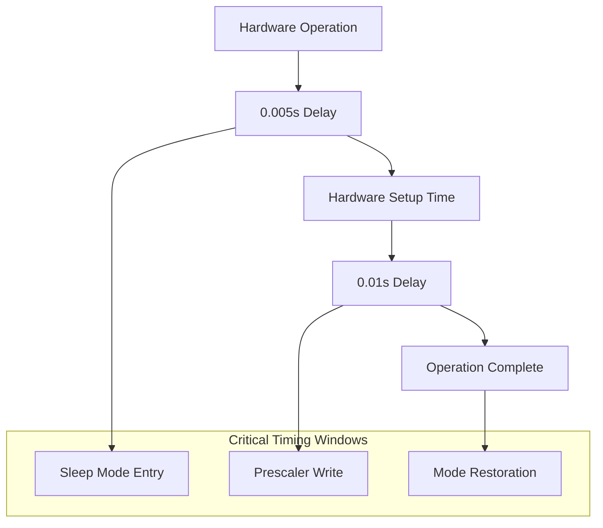
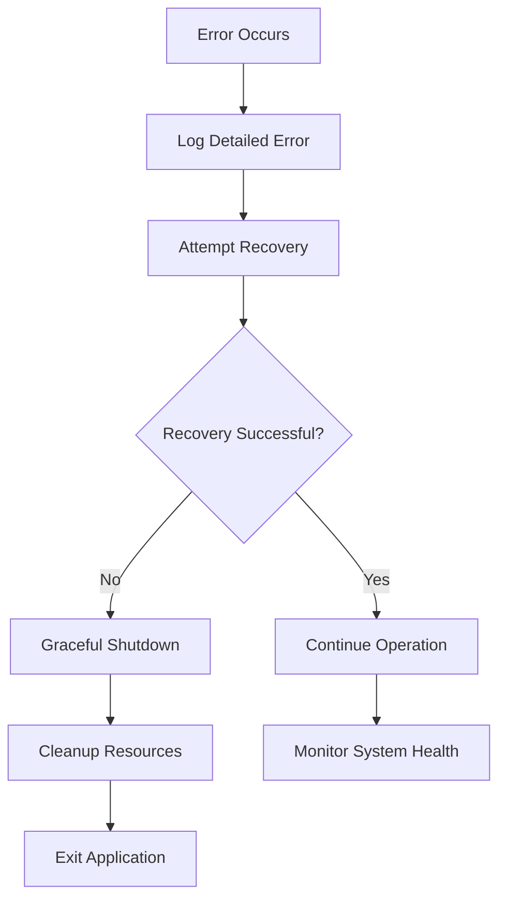

# PWM Control System

<cite>
**Referenced Files in This Document**
- [run.py](file://run.py)
- [config.yaml](file://config.yaml)
</cite>

## Table of Contents
1. [Introduction](#introduction)
2. [Project Structure](#project-structure)
3. [Core Components](#core-components)
4. [Architecture Overview](#architecture-overview)
5. [Detailed Component Analysis](#detailed-component-analysis)
6. [Channel Mapping and Configuration](#channel-mapping-and-configuration)
7. [PWM Implementation Details](#pwm-implementation-details)
8. [Frequency Management](#frequency-management)
9. [Thread-Safe I2C Access Pattern](#thread-safe-i2c-access-pattern)
10. [Practical Usage Examples](#practical-usage-examples)
11. [Performance Considerations](#performance-considerations)
12. [Troubleshooting Guide](#troubleshooting-guide)
13. [Conclusion](#conclusion)

## Introduction

This document provides comprehensive documentation for the PCA9685 16-channel PWM controller implementation. The system controls various hardware components including heaters, fans, steppers, and auxiliary outputs through precise PWM control with 12-bit resolution. The implementation utilizes a thread-safe I2C communication pattern and provides robust error handling for reliable operation in industrial environments.

The system integrates with Home Assistant through MQTT discovery, enabling seamless integration with home automation platforms while maintaining precise hardware control capabilities.

## Project Structure

The project follows a modular architecture with clear separation of concerns:



**Diagram sources**
- [run.py:1-50](file://run.py#L1-L50)
- [config.yaml:1-57](file://config.yaml#L1-L57)

**Section sources**
- [run.py:1-50](file://run.py#L1-L50)
- [config.yaml:1-57](file://config.yaml#L1-L57)

## Core Components

The system consists of several key components that work together to provide comprehensive PWM control:

### Hardware Abstraction Layer
- **PCA9685 PWM Controller**: 16-channel PWM generator with 12-bit resolution
- **PCA9539 GPIO Expander**: 16-bit input/output expansion for feedback monitoring
- **PCA9540 I2C Multiplexer**: Channel selection for multiple I2C devices
- **BME280 Sensors**: Environmental monitoring with temperature, pressure, and humidity

### Communication Infrastructure
- **MQTT Client**: Home Assistant integration with automatic discovery
- **Thread-Safe I2C Bus**: Shared SMBus with locking mechanism for concurrent access
- **Configuration Management**: YAML-based configuration with validation

### Control Systems
- **PWM Control Threads**: Dedicated threads for different control functions
- **Feedback Monitoring**: Real-time hardware status verification
- **Safety Mechanisms**: Graceful shutdown and error recovery

**Section sources**
- [run.py:61-137](file://run.py#L61-L137)
- [run.py:1228-1247](file://run.py#L1228-L1247)

## Architecture Overview

The system employs a multi-threaded architecture with clear separation between hardware control, communication, and monitoring functions:



**Diagram sources**
- [run.py:1709-1883](file://run.py#L1709-L1883)
- [run.py:40-46](file://run.py#L40-L46)

The architecture ensures that all I2C operations are thread-safe through a global lock mechanism, preventing race conditions and ensuring reliable hardware communication.

**Section sources**
- [run.py:1709-1883](file://run.py#L1709-L1883)
- [run.py:40-46](file://run.py#L40-L46)

## Detailed Component Analysis

### PCA9685 PWM Controller Implementation

The PCA9685 controller provides 16 independent PWM channels with 12-bit resolution:



**Diagram sources**
- [run.py:61-109](file://run.py#L61-L109)
- [run.py:266-282](file://run.py#L266-L282)

The PCA9685 implementation provides three primary methods for PWM control:

1. **Direct PWM Control**: `set_pwm(channel, on, off)` for fine-grained control
2. **Duty Cycle Control**: `set_duty_12bit(channel, duty)` for percentage-based control
3. **Frequency Control**: `set_pwm_freq(freq_hz)` for global frequency adjustment

**Section sources**
- [run.py:61-109](file://run.py#L61-L109)
- [run.py:266-282](file://run.py#L266-L282)

### Thread-Safe I2C Access Pattern

The system implements a sophisticated thread-safety mechanism using a global lock:



**Diagram sources**
- [run.py:40-46](file://run.py#L40-L46)
- [run.py:73-77](file://run.py#L73-L77)

The global lock ensures that all I2C operations are serialized, preventing conflicts between multiple threads attempting to access the same hardware simultaneously.

**Section sources**
- [run.py:40-46](file://run.py#L40-L46)
- [run.py:73-77](file://run.py#L73-L77)

## Channel Mapping and Configuration

The system defines a comprehensive channel mapping scheme for different hardware components:

### Primary PWM Channels
- **PWM1 (Channel 0)**: Fan 1 speed control with percentage-based mapping
- **PWM2 (Channel 10)**: Fan 2 speed control with percentage-based mapping

### Heater Control Channels (Channels 1-4)
- **Heater 1-4**: Individual heater control through relay logic
- **Logic**: Low (0) = ON, High (1) = OFF for relay-based heating

### Fan Control Channels (Channels 5-6)
- **Fan 1 Power (Channel 5)**: Main fan power control
- **Fan 2 Power (Channel 6)**: Secondary fan power control

### Special Function Channels
- **Stepper Direction (Channel 7)**: Motor direction control
- **Stepper Enable (Channel 8)**: Motor enable/disable control
- **PU Signal (Channel 9)**: Pulse generation for stepper drivers
- **System LED (Channel 15)**: Diagnostic LED indication

### Auxiliary Outputs (Channels 10-15)
- **RGB LEDs (Channels 12-14)**: Color control for status indication
- **System LED (Channel 15)**: Continuous system status indication

**Section sources**
- [run.py:266-282](file://run.py#L266-L282)
- [run.py:930-944](file://run.py#L930-L944)

## PWM Implementation Details

### 12-Bit Resolution Capability

The PCA9685 operates with 12-bit resolution, providing 4096 discrete duty cycle levels (0-4095):



**Diagram sources**
- [run.py:914-927](file://run.py#L914-L927)
- [run.py:898-912](file://run.py#L898-L912)

### Duty Cycle Calculation Methods

The system provides two primary methods for duty cycle control:

1. **Percentage-Based Control**: `update_pwm1_output_locked()` and `update_pwm2_output_locked()`
2. **Direct 12-bit Control**: `set_duty_12bit()` for precise control

### Channel Validation and Error Handling

Each PWM operation includes comprehensive validation:



**Diagram sources**
- [run.py:94-108](file://run.py#L94-L108)

**Section sources**
- [run.py:914-927](file://run.py#L914-L927)
- [run.py:898-912](file://run.py#L898-L912)
- [run.py:94-108](file://run.py#L94-L108)

## Frequency Management

### Global PWM Frequency Setting

The system manages a global PWM frequency that affects all channels:

```mermaid
flowchart TD
SetFreq[set_pwm_freq(freq_hz)] --> CalculatePrescale[Calculate Prescaler]
CalculatePrescale --> ValidateRange{Validate 24-1526 Hz}
ValidateRange --> |Outside Range| ClampFreq[Clamp to Valid Range]
ValidateRange --> |Valid| SleepMode[Enter Sleep Mode]
ClampFreq --> SleepMode
SleepMode --> WritePrescale[Write Prescaler Value]
WritePrescale --> RestoreMode[Restore Previous Mode]
RestoreMode --> Complete([Frequency Updated])
subgraph "Prescaler Formula"
Formula["prescale = round(25,000,000 / (4096 × freq)) - 1"]
end
CalculatePrescale --> Formula
```

**Diagram sources**
- [run.py:79-92](file://run.py#L79-L92)

### Frequency Constraints and Validation

The system enforces strict frequency limits:
- **Minimum Frequency**: 24 Hz (hardware constraint)
- **Maximum Frequency**: 1526 Hz (hardware constraint)
- **Default Frequency**: 1000 Hz (configurable)

### Prescaler Calculation Precision

The prescaler calculation uses the formula:
```
prescale = floor(25,000,000 / (4096 × f)) - 1
```

Where:
- 25,000,000 Hz = Internal oscillator frequency
- 4096 = Number of steps in 12-bit resolution
- f = Desired PWM frequency

**Section sources**
- [run.py:79-92](file://run.py#L79-L92)
- [config.yaml:53](file://config.yaml#L53)

## Thread-Safe I2C Access Pattern

### Global Lock Implementation

The system implements a centralized locking mechanism for all I2C operations:



**Diagram sources**
- [run.py:40-46](file://run.py#L40-L46)
- [run.py:73-77](file://run.py#L73-L77)

### Lock Scope and Best Practices

The lock mechanism ensures atomicity for all hardware operations:
- **Acquire Lock**: Before any I2C transaction
- **Release Lock**: Immediately after transaction completion
- **Exception Safety**: Locks are released in finally blocks
- **Timeout Handling**: Operations fail gracefully with proper cleanup

**Section sources**
- [run.py:40-46](file://run.py#L40-L46)
- [run.py:73-77](file://run.py#L73-L77)

## Practical Usage Examples

### Basic PWM Control Commands

#### Setting Fan 1 Speed (30% duty cycle)
1. **MQTT Command**: Publish "30" to `homeassistant/number/pca_pwm1_duty/set`
2. **Automatic Power Control**: Fan 1 power automatically enables
3. **State Update**: System publishes "30" to `homeassistant/number/pca_pwm1_duty/state`

#### Controlling Heaters
1. **Individual Heater**: Publish "ON" to `homeassistant/switch/pca_heater_1/set`
2. **All Heaters Off**: Use `channel_off()` function internally
3. **Feedback Verification**: System validates relay state through PCA9539

#### Stepper Motor Control
1. **Direction Control**: Publish "CW" or "CCW" to `homeassistant/select/pca_stepper_dir/set`
2. **Enable Control**: Publish "ON" to `homeassistant/switch/pca_stepper_ena/set`
3. **Pulse Generation**: Automatic pulse generation when enabled

### Duty Cycle Calculation Examples

#### Converting Percentage to 12-bit Values
- **10% Duty**: `(10/100) × 4095 = 409`
- **50% Duty**: `(50/100) × 4095 = 2047`
- **100% Duty**: `(100/100) × 4095 = 4095`

#### Frequency Setting Examples
- **Low Frequency (24 Hz)**: `prescale = floor(25,000,000/(4096×24)) - 1 = 255`
- **Medium Frequency (1000 Hz)**: `prescale = floor(25,000,000/(4096×1000)) - 1 = 5`
- **High Frequency (1526 Hz)**: `prescale = floor(25,000,000/(4096×1526)) - 1 = 3`

### Configuration Examples

#### Default Configuration Values
- **PCA Frequency**: 1000 Hz (configurable)
- **Default Duty Cycle**: 30% (0-100% range)
- **PU Default Frequency**: 100 Hz (0-500 Hz range)
- **LED Indicator Interval**: 30 seconds

**Section sources**
- [run.py:1782-1883](file://run.py#L1782-L1883)
- [config.yaml:37-41](file://config.yaml#L37-L41)

## Performance Considerations

### Timing Constraints and Delays

The system incorporates several timing constraints for reliable hardware operation:



**Diagram sources**
- [run.py:82-92](file://run.py#L82-L92)

### Control Precision and Resolution

The 12-bit resolution provides excellent control precision:
- **Resolution**: 4096 discrete levels (0.024% step)
- **Repeatability**: Consistent across all channels
- **Linearity**: Excellent linearity across the full range
- **Noise Immunity**: Reduced sensitivity to electrical noise

### Performance Impact Analysis

#### I2C Bus Utilization
- **Throughput**: Limited by I2C speed (typically 100-400 kHz)
- **Latency**: Typical 1-5 ms per transaction
- **Concurrency**: Single-threaded access prevents bus contention

#### Memory Usage
- **Per Channel**: ~4 bytes for state storage
- **Total Memory**: ~160 bytes for all channels
- **Thread Overhead**: Minimal overhead for thread management

**Section sources**
- [run.py:82-92](file://run.py#L82-L92)

## Troubleshooting Guide

### Common Issues and Solutions

#### I2C Bus Initialization Failures
**Symptoms**: PCA9685 initialization fails with "Failed to open I2c bus"
**Causes**: 
- Missing i2c-dev kernel module
- Incorrect I2C bus number
- Hardware bus conflicts

**Solutions**:
1. Verify kernel module loading: `modprobe i2c-dev`
2. Check I2C bus permissions: `/dev/i2c-1` accessibility
3. Validate hardware connections

#### Hardware Feedback Verification Failures
**Symptoms**: "VERIFICATION FAILED" messages in logs
**Causes**:
- Incorrect relay wiring
- Faulty relay contacts
- PCA9539 communication errors

**Solutions**:
1. Run hardware diagnostic: `hardware_diagnostic()`
2. Check relay wiring according to feedback mapping
3. Verify PCA9539 address and connections

#### PWM Output Issues
**Symptoms**: PWM signals not reaching expected levels
**Causes**:
- Incorrect channel mapping
- Load impedance mismatch
- Grounding issues

**Solutions**:
1. Verify channel assignments in configuration
2. Check load specifications and power requirements
3. Ensure proper grounding and power supply

### Error Handling Mechanisms

The system implements comprehensive error handling:



**Diagram sources**
- [run.py:1889-1931](file://run.py#L1889-L1931)

**Section sources**
- [run.py:1889-1931](file://run.py#L1889-L1931)

## Conclusion

The PCA9685 PWM control system provides a robust, thread-safe solution for industrial-grade PWM control applications. The implementation demonstrates several key strengths:

### Technical Excellence
- **Precision Control**: 12-bit resolution with excellent repeatability
- **Thread Safety**: Comprehensive locking mechanism prevents race conditions
- **Error Resilience**: Graceful error handling and recovery mechanisms
- **Hardware Integration**: Seamless integration with multiple I2C devices

### Practical Benefits
- **MQTT Integration**: Full Home Assistant support with automatic discovery
- **Real-time Feedback**: Comprehensive hardware status monitoring
- **Safety Features**: Verified switching with hardware feedback validation
- **Performance**: Optimized timing and resource utilization

### Design Philosophy
The system balances precision, reliability, and ease of use through careful abstraction of hardware complexity while maintaining direct control over critical parameters. The modular architecture facilitates maintenance and extension while ensuring system stability.

This implementation serves as a foundation for advanced PWM control applications requiring precise timing, multiple hardware integrations, and robust error handling in demanding environments.