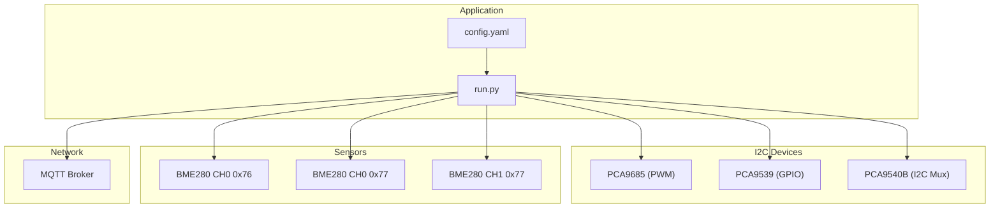
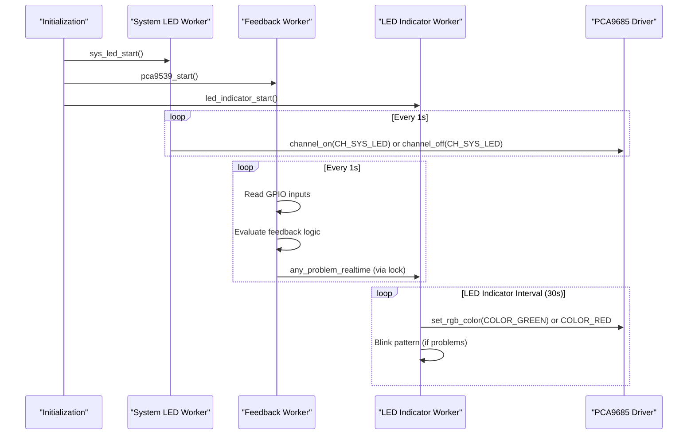
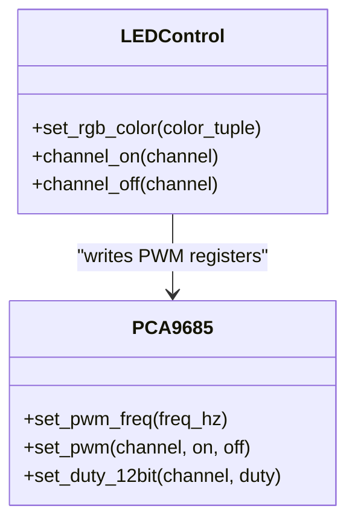
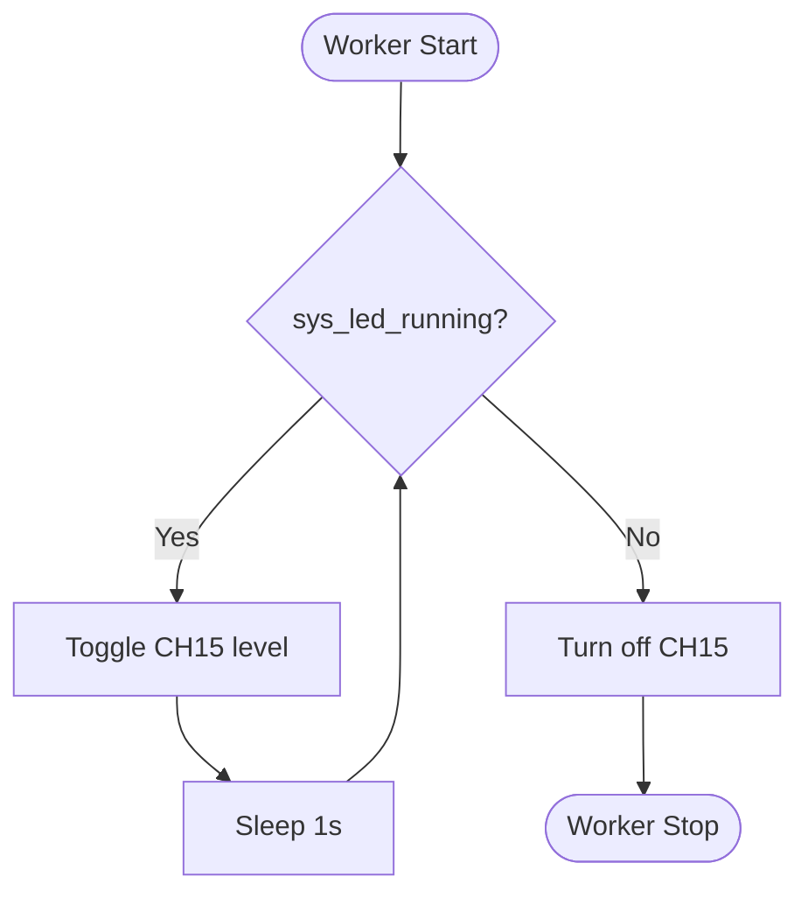
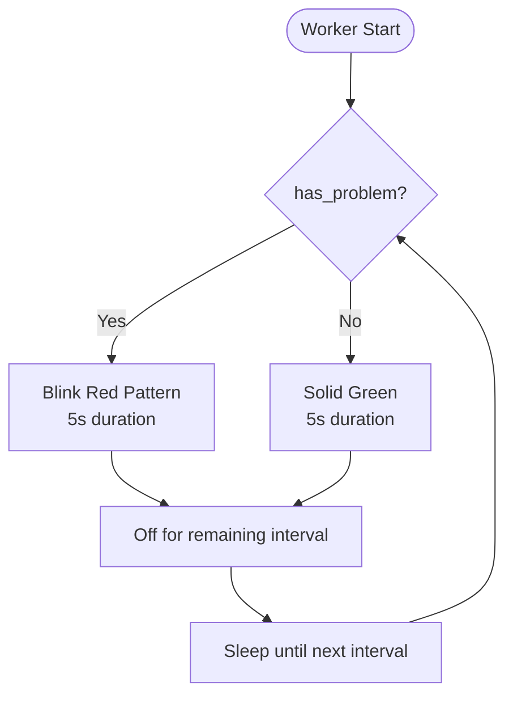
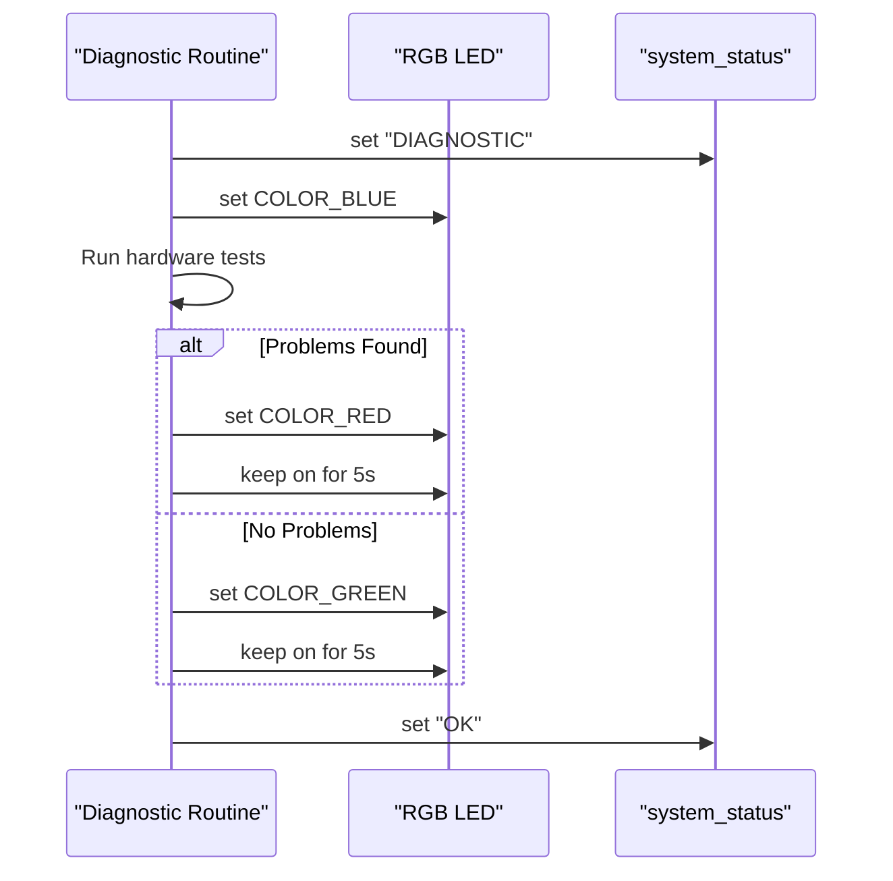
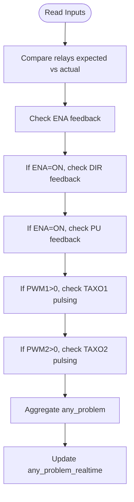
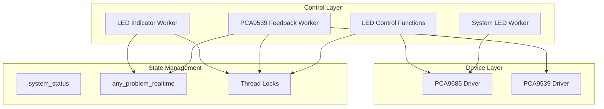

# Status Indication System

<cite>
**Referenced Files in This Document**
- [run.py](file://run.py)
- [config.yaml](file://config.yaml)
</cite>

## Table of Contents
1. [Introduction](#introduction)
2. [Project Structure](#project-structure)
3. [Core Components](#core-components)
4. [Architecture Overview](#architecture-overview)
5. [Detailed Component Analysis](#detailed-component-analysis)
6. [Dependency Analysis](#dependency-analysis)
7. [Performance Considerations](#performance-considerations)
8. [Troubleshooting Guide](#troubleshooting-guide)
9. [Conclusion](#conclusion)

## Introduction
This document describes the status indication system that controls RGB LED indicators and system LED blinking patterns for a PCA9685-based PWM controller. The system provides:
- RGB LED control with 12-bit brightness resolution
- System LED (CH15) blinking for continuous status indication
- Real-time problem detection reporting via LED patterns
- Diagnostic mode operation with blue LED indication
- Thread-safe control mechanisms for reliable operation

The system integrates with an MQTT-based control interface and uses dedicated worker threads to monitor hardware feedback and update LED states.

## Project Structure
The status indication system is implemented within a single Python application that manages I2C devices (PCA9685, PCA9539, PCA9540B), sensors (BME280), and MQTT communication. The LED control logic resides in the main application file alongside device initialization and worker thread management.

**Diagram sources**
- [run.py:570-630](file://run.py#L570-L630)
- [config.yaml:28-41](file://config.yaml#L28-L41)

**Section sources**
- [run.py:570-630](file://run.py#L570-L630)
- [config.yaml:28-41](file://config.yaml#L28-L41)

## Core Components
The status indication system consists of:
- Channel mapping for LED control (RGB and SYS_LED)
- Color definitions with 12-bit brightness control
- LED worker threads for system LED and LED indicator
- Real-time problem detection and status tracking
- Thread synchronization primitives

Key constants and mappings:
- LED channels: RED=12, GREEN=14, BLUE=13, SYS_LED=15
- Color definitions: COLOR_OFF=(0,0,0), COLOR_RED=(4095,0,0), COLOR_GREEN=(0,4095,0), COLOR_BLUE=(0,0,4095)
- LED indicator timing: LED_INDICATOR_INTERVAL (default 30s), LED_INDICATOR_ON_DURATION (fixed 5s)
- System status: system_status ("OK", "ERROR", "DIAGNOSTIC")

Thread synchronization:
- Locks for I2C bus access (i2c_lock)
- Locks for status updates (status_lock)
- Locks for real-time problem tracking (any_problem_lock)
- Locks for worker thread lifecycle (sys_led_lock, led_indicator_lock, pca9539_lock, pu_lock)

**Section sources**
- [run.py:278-281](file://run.py#L278-L281)
- [run.py:344-350](file://run.py#L344-L350)
- [run.py:326-331](file://run.py#L326-L331)
- [run.py:349-354](file://run.py#L349-L354)
- [run.py:41-41](file://run.py#L41-L41)

## Architecture Overview
The status indication system operates through coordinated worker threads and shared state management:

**Diagram sources**
- [run.py:1146-1165](file://run.py#L1146-L1165)
- [run.py:673-798](file://run.py#L673-L798)
- [run.py:1167-1204](file://run.py#L1167-L1204)
- [run.py:106-108](file://run.py#L106-L108)

## Detailed Component Analysis

### LED Channel Mapping and Color System
The system defines fixed channel mappings for LED control:
- CH_LED_RED = 12
- CH_LED_GREEN = 14
- CH_LED_BLUE = 13
- CH_SYS_LED = 15

Color definitions use 12-bit brightness control (0-4095):
- COLOR_OFF: all channels at 0
- COLOR_RED: Red channel at maximum, others at 0
- COLOR_GREEN: Green channel at maximum, others at 0
- COLOR_BLUE: Blue channel at maximum, others at 0

The PCA9685 driver exposes a 12-bit duty cycle control method that maps directly to LED brightness.

**Diagram sources**
- [run.py:106-108](file://run.py#L106-L108)
- [run.py:357-361](file://run.py#L357-L361)
- [run.py:563-569](file://run.py#L563-L569)

**Section sources**
- [run.py:278-281](file://run.py#L278-L281)
- [run.py:344-350](file://run.py#L344-L350)
- [run.py:106-108](file://run.py#L106-L108)
- [run.py:357-361](file://run.py#L357-L361)
- [run.py:563-569](file://run.py#L563-L569)

### System LED Worker (CH15)
The system LED worker continuously toggles the CH15 pin at 1Hz, providing a steady blinking pattern for system status awareness.

Implementation highlights:
- Uses a simple toggle flag to alternate between on/off states
- Sleeps for 1 second between toggles
- Gracefully stops by turning off the LED when the thread exits

**Diagram sources**
- [run.py:1128-1144](file://run.py#L1128-L1144)

**Section sources**
- [run.py:1128-1144](file://run.py#L1128-L1144)
- [run.py:1146-1165](file://run.py#L1146-L1165)

### LED Indicator Worker (RGB)
The LED indicator worker monitors real-time problem status and controls the RGB LED according to the following pattern:
- Normal operation: solid green LED for LED_INDICATOR_ON_DURATION (5s)
- Problems detected: alternating red and off every 0.5s for LED_INDICATOR_ON_DURATION (5s)
- Between cycles: LED remains off for the remainder of the interval (LED_INDICATOR_INTERVAL - LED_INDICATOR_ON_DURATION)

The worker reads the any_problem_realtime flag protected by any_problem_lock and applies the appropriate pattern.

**Diagram sources**
- [run.py:1167-1204](file://run.py#L1167-L1204)

**Section sources**
- [run.py:1167-1204](file://run.py#L1167-L1204)
- [run.py:326-331](file://run.py#L326-L331)
- [run.py:353-354](file://run.py#L353-L354)

### Diagnostic Mode Operation
During hardware diagnostics, the system sets the system_status to "DIAGNOSTIC" and ensures the blue LED is turned on. The diagnostic routine performs:
- Relay testing (heaters 1-4, fans 1-2 power)
- Stepper signal verification (ENA, DIR)
- Pulse (PU) feedback detection
- Problem classification and LED indication

Diagnostic outcomes:
- Problems detected: blue LED turns red and stays on for 5 seconds
- No problems: blue LED turns green and stays on for 5 seconds
- Final status: system_status set to "OK" regardless of results

**Diagram sources**
- [run.py:369-458](file://run.py#L369-L458)
- [run.py:349-350](file://run.py#L349-L350)
- [run.py:347-347](file://run.py#L347-L347)

**Section sources**
- [run.py:369-458](file://run.py#L369-L458)
- [run.py:349-350](file://run.py#L349-L350)

### Real-Time Problem Detection and Reporting
The PCA9539 feedback worker continuously monitors hardware feedback and determines system problems:
- Relays: compares expected vs actual states (relays are LOW=ON, HIGH=OFF)
- Stepper ENA: expects HIGH=ON
- Stepper DIR: meaningful only when ENA is HIGH
- PU feedback: verifies pulse generation when enabled
- TAXO sensors: checks for pulsing when motors are active

Problems are aggregated into any_problem flag and synchronized via any_problem_lock. The LED indicator worker reads this flag to decide LED patterns.

**Diagram sources**
- [run.py:673-798](file://run.py#L673-L798)

**Section sources**
- [run.py:673-798](file://run.py#L673-L798)
- [run.py:353-354](file://run.py#L353-L354)

### Thread Synchronization Mechanisms
The system employs multiple locks to ensure thread-safe operations:
- i2c_lock: protects I2C bus access across all device operations
- status_lock: synchronizes system_status updates
- any_problem_lock: guards real-time problem flag access
- sys_led_lock, led_indicator_lock, pca9539_lock, pu_lock: protect worker thread lifecycle

Each worker thread follows a consistent pattern:
- Check running flag under lock
- Start thread if not already running
- Use daemon threads for automatic cleanup
- Join threads gracefully on shutdown

**Section sources**
- [run.py:41-41](file://run.py#L41-L41)
- [run.py:349-350](file://run.py#L349-L350)
- [run.py:353-354](file://run.py#L353-L354)
- [run.py:1146-1165](file://run.py#L1146-L1165)
- [run.py:1207-1226](file://run.py#L1207-L1226)
- [run.py:800-820](file://run.py#L800-L820)
- [run.py:1107-1126](file://run.py#L1107-L1126)

## Dependency Analysis
The status indication system depends on several components working together:

**Diagram sources**
- [run.py:357-361](file://run.py#L357-L361)
- [run.py:1128-1144](file://run.py#L1128-L1144)
- [run.py:1167-1204](file://run.py#L1167-L1204)
- [run.py:673-798](file://run.py#L673-L798)

**Section sources**
- [run.py:357-361](file://run.py#L357-L361)
- [run.py:1128-1144](file://run.py#L1128-L1144)
- [run.py:1167-1204](file://run.py#L1167-L1204)
- [run.py:673-798](file://run.py#L673-L798)

## Performance Considerations
- LED update intervals are conservative (1s for system LED, 0.5s for indicator pattern) to minimize CPU usage
- Real-time problem detection runs at 1Hz, balancing responsiveness with minimal overhead
- Thread synchronization uses lightweight locks around critical sections
- I2C operations are batched and protected by a single global lock to prevent contention
- LED control uses direct PWM writes without intermediate calculations, minimizing latency

## Troubleshooting Guide

### LED Not Responding
Common causes and solutions:
- Verify PCA9685 initialization succeeded
- Check I2C bus permissions and device presence
- Confirm LED channel mappings are correct (RED=12, GREEN=14, BLUE=13, SYS_LED=15)
- Ensure LED indicator worker is running

### Blue LED Stays On During Diagnostic
- System status is set to "DIAGNOSTIC" during hardware tests
- Blue LED indicates diagnostic mode; problems cause red indication, no problems cause green
- Check diagnostic logs for specific failure reasons

### Red LED Blinking Pattern
- Indicates active problems detected by the feedback worker
- Check relay states, stepper signals, and pulse feedback
- Review any_problem_realtime flag updates in logs

### Green LED Solid
- Indicates normal operation with no detected problems
- Verify all feedback channels report "OFF" for problem class

### Thread Lifecycle Issues
- Use sys_led_start()/stop(), led_indicator_start()/stop(), pca9539_start()/stop(), pu_start()/stop()
- Threads are daemon threads; they exit automatically when the main process terminates
- Graceful shutdown turns off all LEDs and releases resources

**Section sources**
- [run.py:1146-1165](file://run.py#L1146-L1165)
- [run.py:1207-1226](file://run.py#L1207-L1226)
- [run.py:800-820](file://run.py#L800-L820)
- [run.py:1107-1126](file://run.py#L1107-L1126)
- [run.py:1889-1931](file://run.py#L1889-L1931)

## Conclusion
The status indication system provides robust, real-time visual feedback for the PCA9685-based controller through:
- Precise RGB LED control with 12-bit brightness resolution
- Continuous system LED blinking for operational awareness
- Automated diagnostic mode with blue LED indication
- Reliable problem detection and reporting via dedicated worker threads
- Comprehensive thread synchronization for safe concurrent operation

The modular design allows easy extension for additional status indicators and fault conditions while maintaining system stability through careful resource management and graceful shutdown procedures.