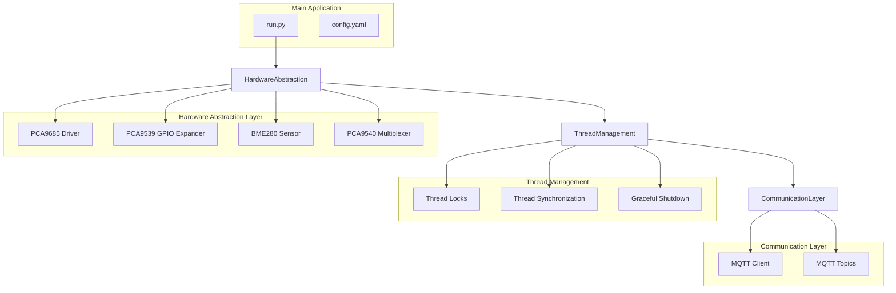
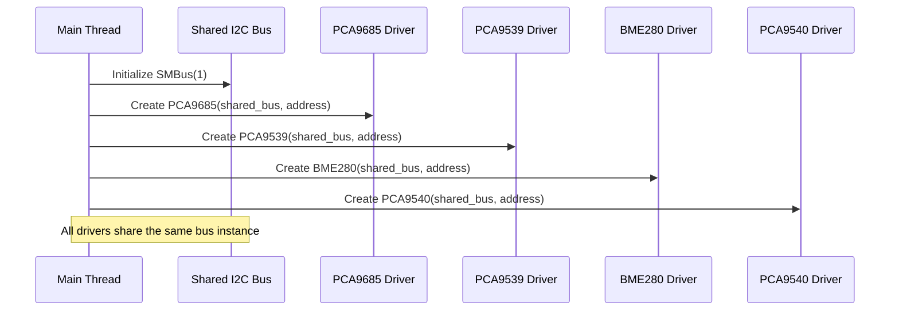
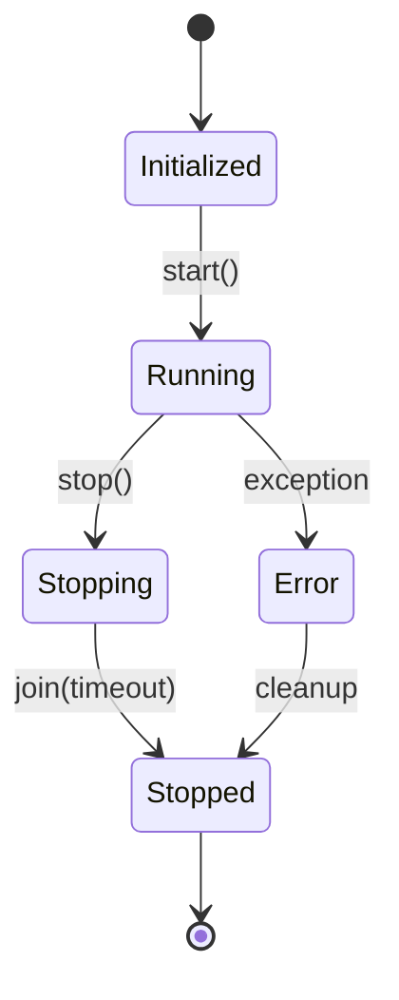
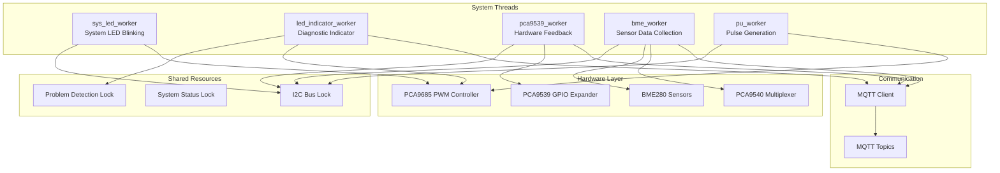
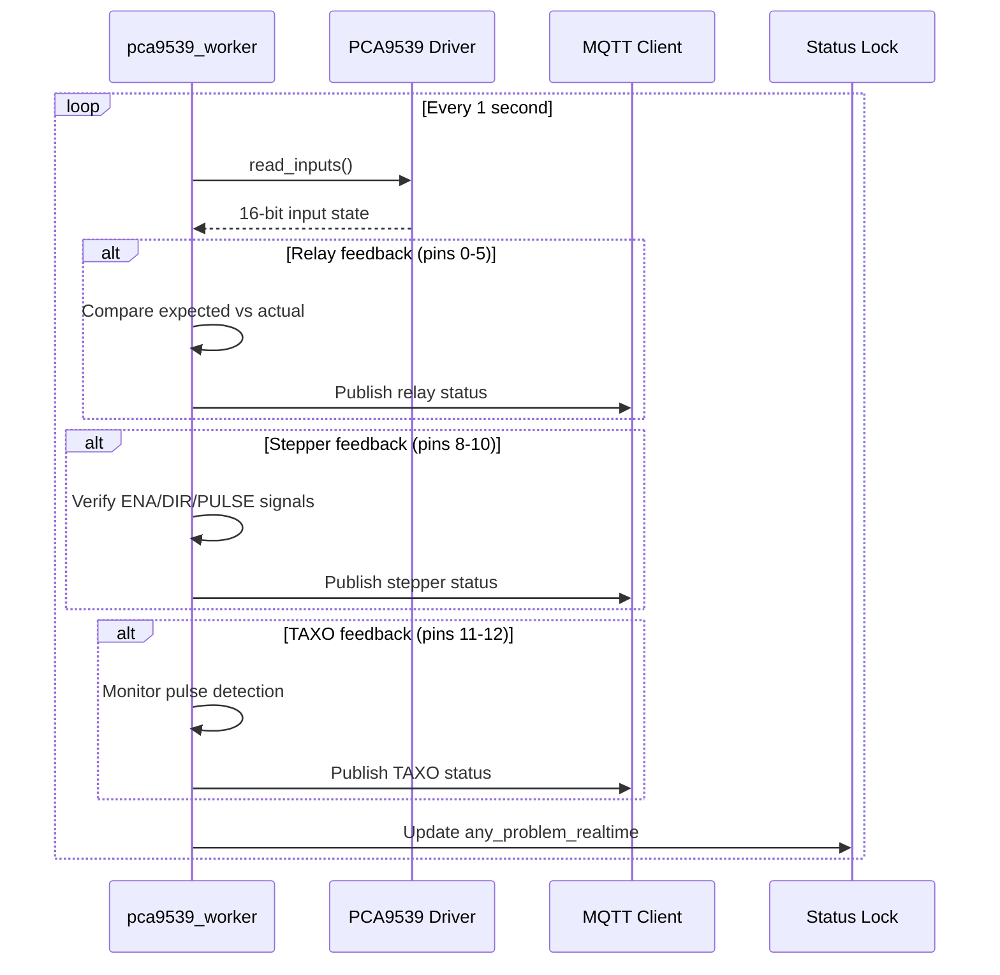
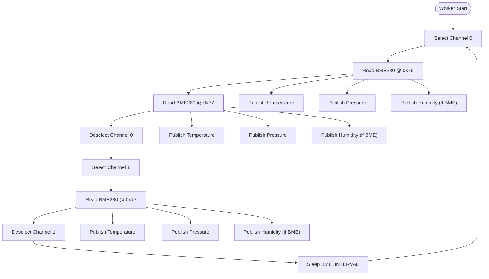
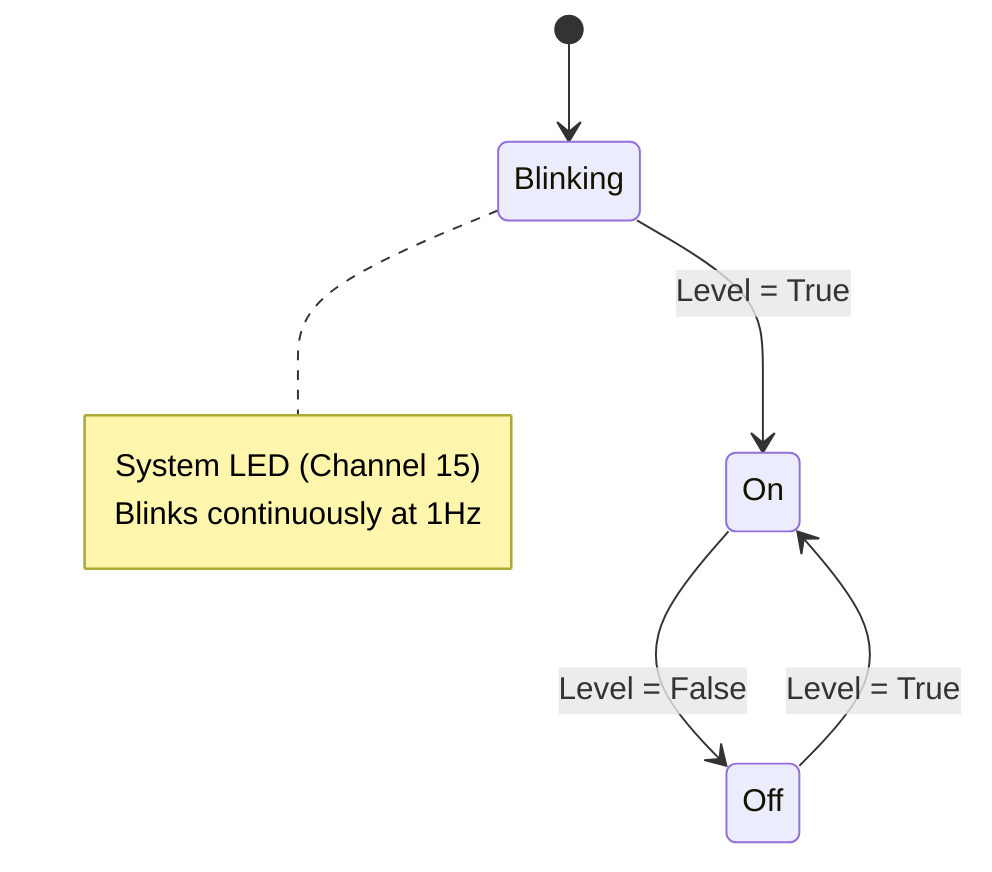
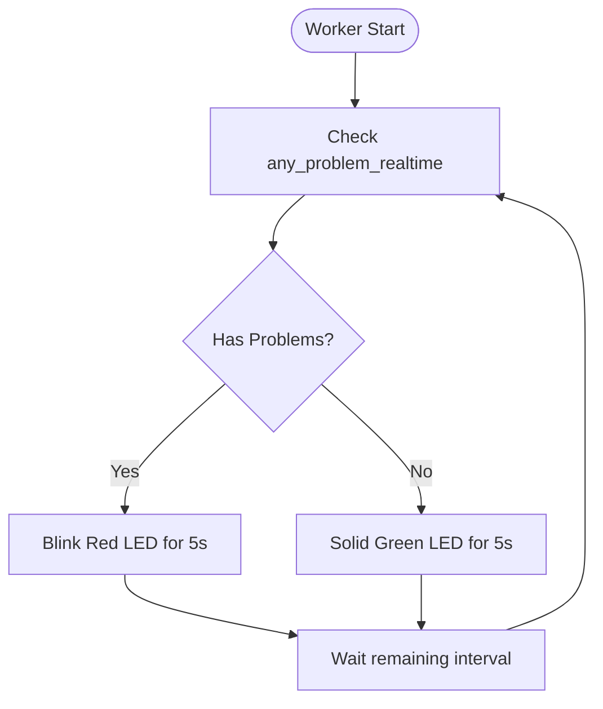
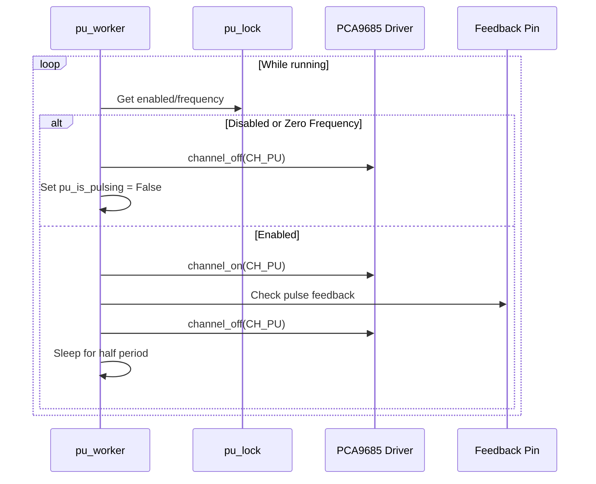
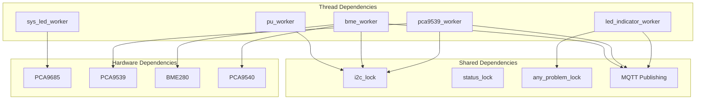

# Thread Management and Concurrency

<cite>
**Referenced Files in This Document**
- [run.py](file://run.py)
- [config.yaml](file://config.yaml)
</cite>

## Table of Contents
1. [Introduction](#introduction)
2. [Project Structure](#project-structure)
3. [Core Components](#core-components)
4. [Architecture Overview](#architecture-overview)
5. [Detailed Component Analysis](#detailed-component-analysis)
6. [Dependency Analysis](#dependency-analysis)
7. [Performance Considerations](#performance-considerations)
8. [Troubleshooting Guide](#troubleshooting-guide)
9. [Conclusion](#conclusion)

## Introduction

This document provides comprehensive documentation for the multi-threaded architecture of the PCA9685 PWM controller system. The application implements a sophisticated concurrent design pattern that coordinates multiple hardware access threads through a shared I2C bus while maintaining thread safety and graceful shutdown procedures.

The system manages four primary worker threads: `pca9539_worker` for hardware feedback monitoring, `bme_worker` for environmental sensor data collection, `sys_led_worker` for system status indication, and `led_indicator_worker` for diagnostic mode operation. Each thread operates independently while sharing a common I2C bus through carefully designed synchronization mechanisms.

## Project Structure

The project follows a modular architecture with clear separation between hardware abstraction, thread management, and MQTT communication:



**Diagram sources**
- [run.py:1-50](file://run.py#L1-L50)
- [config.yaml:1-57](file://config.yaml#L1-L57)

**Section sources**
- [run.py:1-80](file://run.py#L1-L80)
- [config.yaml:1-57](file://config.yaml#L1-L57)

## Core Components

The system implements a comprehensive thread management framework built around several key architectural patterns:

### Shared I2C Bus Architecture

The application establishes a single shared I2C bus connection that serves all hardware components:



**Diagram sources**
- [run.py:39-46](file://run.py#L39-L46)
- [run.py:111-160](file://run.py#L111-L160)

### Thread Lifecycle Management

Each worker thread follows a standardized lifecycle pattern with initialization, execution, and graceful shutdown:



**Diagram sources**
- [run.py:800-820](file://run.py#L800-L820)
- [run.py:1107-1126](file://run.py#L1107-L1126)

### Lock-Based Synchronization Patterns

The system employs multiple synchronization mechanisms to coordinate access to shared resources:

| Lock Type | Purpose | Scope | Protection |
|-----------|---------|-------|------------|
| `i2c_lock` | I2C bus access | All hardware operations | Prevent concurrent I2C transactions |
| `status_lock` | System status updates | Status changes | Atomic status transitions |
| `any_problem_lock` | Real-time problem detection | Problem state updates | Consistent problem reporting |
| `pwm1_lock` | PWM1 channel control | PWM1 operations | Atomic duty cycle changes |
| `pwm2_lock` | PWM2 channel control | PWM2 operations | Atomic duty cycle changes |
| `pu_lock` | Pulse generation control | PU worker operations | Atomic frequency changes |

**Section sources**
- [run.py:39-46](file://run.py#L39-L46)
- [run.py:349-354](file://run.py#L349-L354)
- [run.py:632-650](file://run.py#L632-L650)

## Architecture Overview

The multi-threaded architecture implements a producer-consumer pattern with specialized workers for different hardware components:



**Diagram sources**
- [run.py:1128-1226](file://run.py#L1128-L1226)
- [run.py:673-798](file://run.py#L673-L798)
- [run.py:822-874](file://run.py#L822-L874)

## Detailed Component Analysis

### PCA9539 Worker - Hardware Feedback Monitoring

The `pca9539_worker` serves as the central monitoring thread for hardware feedback verification:



**Diagram sources**
- [run.py:673-798](file://run.py#L673-L798)

Key features of the PCA9539 worker:

- **Real-time feedback monitoring**: Continuously reads 16-pin input states every second
- **Multi-channel verification**: Validates relay states, stepper signals, and pulse detection
- **Problem detection**: Maintains real-time problem state for system-wide visibility
- **Historical analysis**: Uses sliding windows for pulse detection reliability

**Section sources**
- [run.py:673-798](file://run.py#L673-L798)
- [run.py:668-671](file://run.py#L668-L671)

### BME Worker - Environmental Sensor Data Collection

The `bme_worker` manages environmental sensor data collection through the PCA9540 multiplexer:



**Diagram sources**
- [run.py:822-874](file://run.py#L822-L874)

**Section sources**
- [run.py:822-874](file://run.py#L822-L874)
- [run.py:606-625](file://run.py#L606-L625)

### System LED Worker - System Status Indication

The `sys_led_worker` provides continuous system status indication through the PCA9685 system LED:



**Diagram sources**
- [run.py:1128-1144](file://run.py#L1128-L1144)

**Section sources**
- [run.py:1128-1144](file://run.py#L1128-L1144)

### LED Indicator Worker - Diagnostic Mode Operation

The `led_indicator_worker` implements intelligent diagnostic indication based on system health:



**Diagram sources**
- [run.py:1167-1205](file://run.py#L1167-L1205)

**Section sources**
- [run.py:1167-1205](file://run.py#L1167-L1205)

### Pulse Generation Worker - PU Signal Control

The `pu_worker` manages pulse generation for stepper motor control:



**Diagram sources**
- [run.py:1044-1105](file://run.py#L1044-L1105)

**Section sources**
- [run.py:1044-1105](file://run.py#L1044-L1105)

## Dependency Analysis

The thread management system exhibits a well-structured dependency hierarchy:



**Diagram sources**
- [run.py:39-46](file://run.py#L39-L46)
- [run.py:349-354](file://run.py#L349-L354)
- [run.py:1167-1205](file://run.py#L1167-L1205)

**Section sources**
- [run.py:39-46](file://run.py#L39-L46)
- [run.py:349-354](file://run.py#L349-L354)

## Performance Considerations

The system implements several performance optimization strategies:

### Thread Pool Efficiency
- **Daemon threads**: All worker threads are daemon threads, ensuring automatic cleanup on main process exit
- **Minimal blocking**: Threads use non-blocking operations with strategic sleep intervals
- **Resource pooling**: Single shared I2C bus eliminates redundant bus connections

### Synchronization Optimization
- **Fine-grained locking**: Separate locks for different resource types minimize contention
- **Lock scope minimization**: Critical sections are kept as small as possible
- **Non-blocking operations**: Most hardware operations are performed under locks only when necessary

### Memory Management
- **Thread-local state**: Each worker maintains minimal local state to reduce memory footprint
- **Efficient data structures**: Simple lists used for pulse history tracking with automatic cleanup

## Troubleshooting Guide

### Common Thread Issues

**Thread Not Starting**
- Verify thread lock acquisition: Check if `with lock:` blocks are properly acquired
- Confirm thread state flags: Ensure `running` flags are set before thread creation
- Validate thread existence: Use `thread.is_alive()` checks before attempting operations

**Deadlock Situations**
- **I2C Deadlock**: Occurs when multiple threads attempt simultaneous I2C operations
- **Status Deadlock**: Can happen with nested lock acquisitions
- **Solution**: Always acquire locks in consistent order and keep critical sections minimal

**Hardware Access Conflicts**
- **Bus Contention**: Multiple threads accessing I2C simultaneously
- **Solution**: Use `i2c_lock` for all I2C operations and avoid nested hardware calls

### Debugging Procedures

**Thread Lifecycle Debugging**
1. Check thread state flags: `running` variables indicate thread status
2. Verify thread references: Ensure thread objects are properly maintained
3. Monitor thread logs: Each thread logs its lifecycle events

**Hardware Communication Debugging**
1. Validate I2C bus initialization: Confirm SMBus connection success
2. Check device addresses: Verify hardware address configuration
3. Monitor error logs: Review hardware access exceptions

**Section sources**
- [run.py:1889-1931](file://run.py#L1889-L1931)
- [run.py:813-820](file://run.py#L813-L820)
- [run.py:1118-1126](file://run.py#L1118-L1126)

### Practical Examples

**Thread Initialization Example**
```python
# Basic thread startup pattern
def worker_start():
    global thread, running
    with lock:
        if thread and thread.is_alive():
            return
        running = True
        thread = threading.Thread(target=worker_function, daemon=True)
        thread.start()
```

**Thread Synchronization Pattern**
```python
# Safe hardware access pattern
def safe_hardware_operation():
    with i2c_lock:
        # Perform hardware operation
        pass
```

**Graceful Shutdown Procedure**
```python
# Comprehensive shutdown sequence
def safe_shutdown():
    # Stop all workers
    bme_stop()
    pca9539_stop()
    sys_led_stop()
    led_indicator_stop()
    pu_stop()
    
    # Reset hardware states
    reset_all_hardware()
    
    # Cleanup resources
    cleanup_resources()
```

**Section sources**
- [run.py:800-820](file://run.py#L800-L820)
- [run.py:1889-1931](file://run.py#L1889-L1931)

## Conclusion

The PCA9685 PWM controller implements a robust multi-threaded architecture that effectively coordinates hardware access through a shared I2C bus while maintaining thread safety and system reliability. The design demonstrates excellent separation of concerns with dedicated workers for different hardware components, comprehensive synchronization mechanisms, and graceful shutdown procedures.

Key architectural strengths include:
- **Modular thread design**: Each worker has a specific, well-defined responsibility
- **Robust synchronization**: Carefully designed lock patterns prevent race conditions
- **Hardware abstraction**: Clean separation between hardware access and thread management
- **Error handling**: Comprehensive exception handling and graceful degradation
- **Performance optimization**: Efficient resource utilization with minimal contention

The system provides a solid foundation for embedded control applications requiring concurrent hardware access and real-time monitoring capabilities.