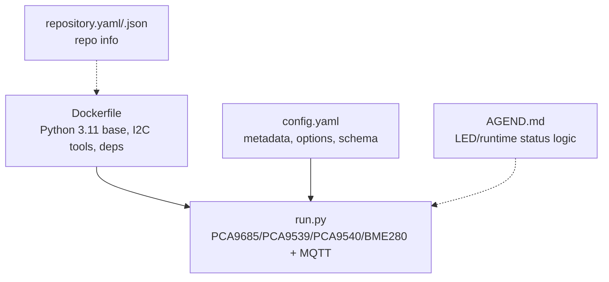
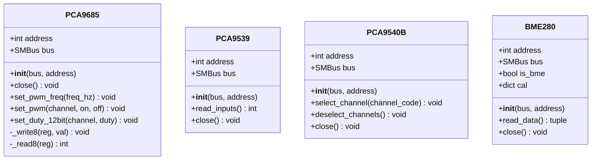
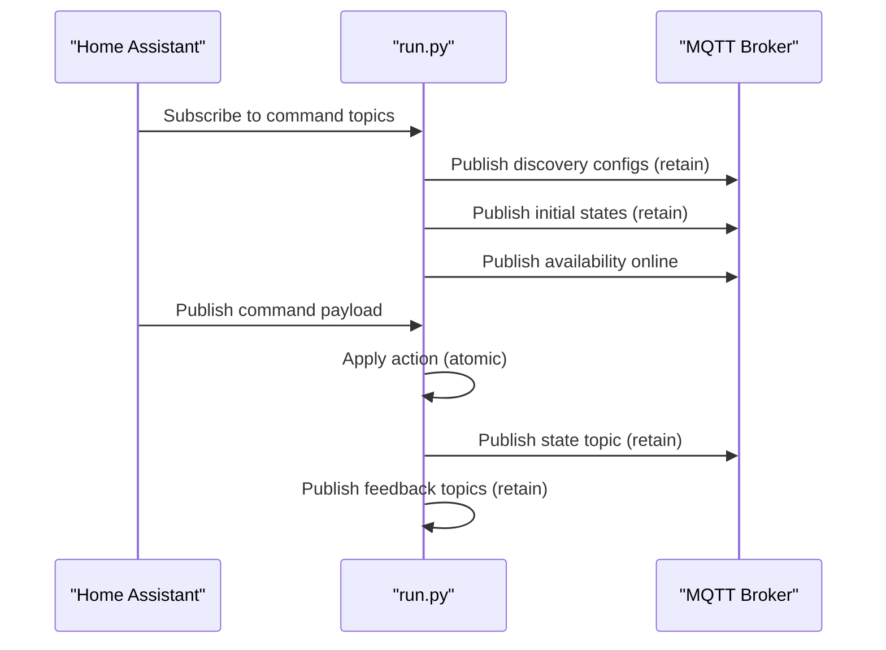
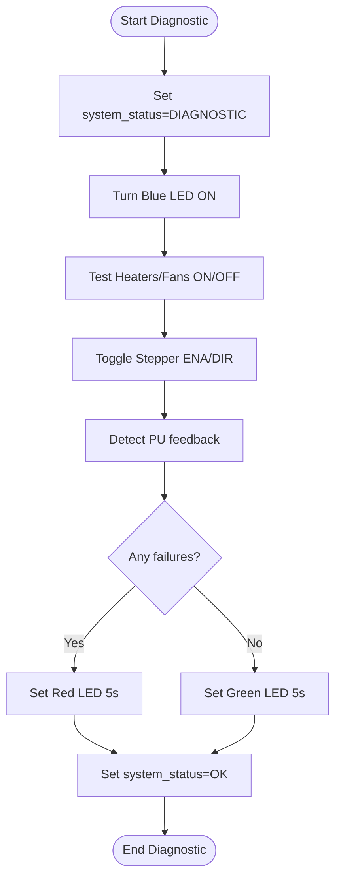
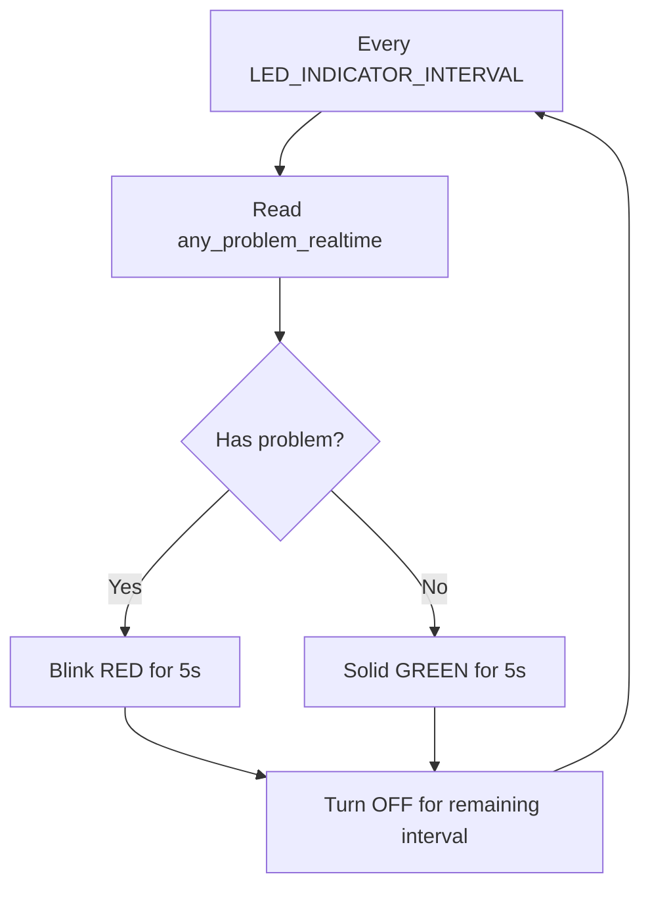
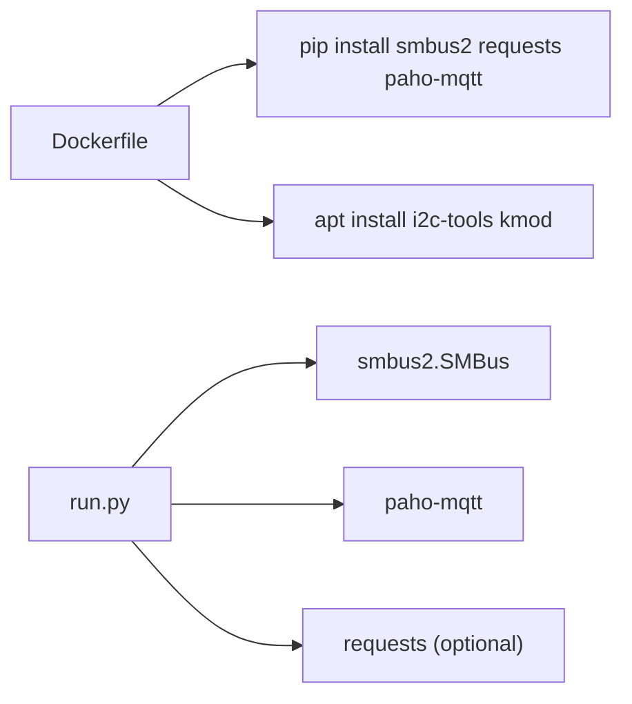

# Development and Contributing

<cite>
**Referenced Files in This Document**
- [Dockerfile](file://Dockerfile)
- [config.yaml](file://config.yaml)
- [run.py](file://run.py)
- [repository.yaml](file://repository.yaml)
- [repository.json](file://repository.json)
- [AGEND.md](file://AGEND.md)
</cite>

## Table of Contents
1. [Introduction](#introduction)
2. [Project Structure](#project-structure)
3. [Core Components](#core-components)
4. [Architecture Overview](#architecture-overview)
5. [Detailed Component Analysis](#detailed-component-analysis)
6. [Dependency Analysis](#dependency-analysis)
7. [Performance Considerations](#performance-considerations)
8. [Testing Procedures](#testing-procedures)
9. [Contribution Guidelines](#contribution-guidelines)
10. [Build and Deployment](#build-and-deployment)
11. [Debugging Techniques](#debugging-techniques)
12. [Extending Functionality](#extending-functionality)
13. [Code Review and Quality Assurance](#code-review-and-quality-assurance)
14. [Version Control Practices](#version-control-practices)
15. [Troubleshooting Guide](#troubleshooting-guide)
16. [Conclusion](#conclusion)

## Introduction
This document provides comprehensive development and contributing guidance for the PCA9685 PWM controller project. It covers environment setup, code structure, testing, contribution workflows, build/deployment, debugging, extension strategies, and quality practices. The project integrates a PCA9685 PWM controller, optional PCA9539 GPIO expander, optional PCA9540 I2C multiplexer, and BME280 sensors, exposing controls and telemetry via Home Assistant MQTT Discovery.

## Project Structure
The repository is minimal and container-focused:
- Dockerfile defines a Python 3.11 base image, installs I2C tools and kernel modules, and installs Python dependencies.
- config.yaml defines the service metadata, supported architectures, host networking, device mappings, and runtime configuration keys with validation schemas.
- run.py is the main application implementing device drivers, MQTT integration, discovery, diagnostics, and worker threads.
- repository.yaml and repository.json provide repository metadata for Home Assistant add-on ecosystems.
- AGEND.md documents LED indicator logic and runtime status flows.



**Diagram sources**
- [Dockerfile:1-15](file://Dockerfile#L1-L15)
- [config.yaml:1-57](file://config.yaml#L1-L57)
- [run.py:1-800](file://run.py#L1-L800)
- [repository.yaml:1-4](file://repository.yaml#L1-L4)
- [repository.json:1-6](file://repository.json#L1-L6)
- [AGEND.md:1-177](file://AGEND.md#L1-L177)

**Section sources**
- [Dockerfile:1-15](file://Dockerfile#L1-L15)
- [config.yaml:1-57](file://config.yaml#L1-L57)
- [run.py:1-800](file://run.py#L1-L800)
- [repository.yaml:1-4](file://repository.yaml#L1-L4)
- [repository.json:1-6](file://repository.json#L1-L6)
- [AGEND.md:1-177](file://AGEND.md#L1-L177)

## Core Components
- Device drivers
  - PCA9685: PWM generator with frequency setting and 12-bit duty control per channel.
  - PCA9539: 16-bit I2C GPIO expander for feedback and inputs.
  - PCA9540B: 1-of-2 I2C multiplexer enabling multiple sensors on the same bus.
  - BME280: Temperature/pressure/humidity sensor with calibration and sampling.
- MQTT integration
  - Home Assistant MQTT Discovery publishes entity configs and states.
  - Command topics trigger actions; feedback topics report hardware status.
- Worker threads
  - PCA9539 feedback reader, BME280 sampler, pulse generator (PU), system LED blinker, and periodic LED indicator.
- Diagnostics
  - Automated hardware checks during startup and runtime status reporting.

Key constants and mappings define channel-to-pin assignments and topic namespaces for Home Assistant entities.

**Section sources**
- [run.py:61-282](file://run.py#L61-L282)
- [run.py:284-571](file://run.py#L284-L571)
- [run.py:571-630](file://run.py#L571-L630)
- [run.py:631-820](file://run.py#L631-L820)
- [run.py:821-996](file://run.py#L821-L996)
- [run.py:1044-1226](file://run.py#L1044-L1226)
- [run.py:1228-1624](file://run.py#L1228-L1624)
- [run.py:1627-1977](file://run.py#L1627-L1977)

## Architecture Overview
The system orchestrates hardware devices and MQTT communication with a modular design:
- Initialization loads configuration, opens I2C bus, and creates device instances.
- Threads handle continuous tasks: feedback polling, sensor reads, pulse generation, LED signaling, and availability/status publishing.
- MQTT client subscribes to command topics, applies changes atomically, and publishes state updates.

```mermaid
graph TB
subgraph "Host"
CFG["config.yaml"]
ENV["Dockerfile env"]
end
subgraph "Container"
RUN["run.py"]
MQTT["MQTT Client"]
I2C["SMBus"]
end
subgraph "Devices"
PCA["PCA9685"]
GPIO["PCA9539"]
MUX["PCA9540B"]
SENS["BME280 x3"]
end
CFG --> RUN
ENV --> RUN
RUN --> MQTT
RUN --> I2C
I2C --> PCA
I2C --> GPIO
I2C --> MUX
MUX --> SENS
RUN --> PCA
RUN --> GPIO
RUN --> MUX
RUN --> SENS
MQTT <- --> "Home Assistant"
```

**Diagram sources**
- [config.yaml:1-57](file://config.yaml#L1-L57)
- [Dockerfile:1-15](file://Dockerfile#L1-L15)
- [run.py:1228-1624](file://run.py#L1228-L1624)

## Detailed Component Analysis

### Device Driver Classes


**Diagram sources**
- [run.py:61-137](file://run.py#L61-L137)
- [run.py:162-264](file://run.py#L162-L264)

**Section sources**
- [run.py:61-137](file://run.py#L61-L137)
- [run.py:162-264](file://run.py#L162-L264)

### MQTT Discovery and Message Flow


**Diagram sources**
- [run.py:1310-1624](file://run.py#L1310-L1624)
- [run.py:1709-1883](file://run.py#L1709-L1883)

**Section sources**
- [run.py:1310-1624](file://run.py#L1310-L1624)
- [run.py:1709-1883](file://run.py#L1709-L1883)

### Hardware Diagnostic Flow


**Diagram sources**
- [run.py:369-458](file://run.py#L369-L458)

**Section sources**
- [run.py:369-458](file://run.py#L369-L458)
- [AGEND.md:16-37](file://AGEND.md#L16-L37)

### LED Indicator Logic


**Diagram sources**
- [run.py:1167-1226](file://run.py#L1167-L1226)
- [AGEND.md:40-59](file://AGEND.md#L40-L59)

**Section sources**
- [run.py:1167-1226](file://run.py#L1167-L1226)
- [AGEND.md:40-59](file://AGEND.md#L40-L59)

## Dependency Analysis
- Python dependencies installed in container:
  - smbus2: I2C access
  - requests: optional supervisor API fetch
  - paho-mqtt: MQTT client
- Host dependencies:
  - i2c-tools, kmod
  - kernel module i2c-dev loaded at startup
- Container capabilities and device mapping enable I2C access and privileged operations.



**Diagram sources**
- [Dockerfile:3-11](file://Dockerfile#L3-L11)
- [run.py:14-21](file://run.py#L14-L21)

**Section sources**
- [Dockerfile:3-11](file://Dockerfile#L3-L11)
- [run.py:14-21](file://run.py#L14-L21)

## Performance Considerations
- I2C operations are synchronized with a global lock to prevent contention across devices.
- Workers operate at fixed intervals; tune config values (e.g., sensor intervals, LED indicator intervals) to balance responsiveness and CPU usage.
- Logging is configured at INFO level by default; adjust for debugging without impacting production throughput.
- Thread lifecycle management ensures graceful shutdown and resource cleanup.

[No sources needed since this section provides general guidance]

## Testing Procedures
- Unit testing
  - No dedicated unit tests are present. Consider adding pytest-based tests for device drivers and pure functions (e.g., PWM calculations, topic construction).
- Integration testing
  - Validate MQTT Discovery payloads and topic routing by connecting to a local broker and verifying retained configs and states.
  - Use a real PCA9685 breakout board and optional PCA9539/PCA9540/BME280 modules to exercise diagnostics and runtime behavior.
- Hardware validation
  - Run the diagnostic routine to verify relays, steppers, and feedback signals.
  - Confirm LED indicator behavior under normal and problem conditions.

[No sources needed since this section doesn't analyze specific files]

## Contribution Guidelines
- Code style
  - Follow PEP 8. Use consistent naming: classes (PascalCase), constants (UPPER_SNAKE), variables (snake_case), and module-level constants aligned with existing patterns.
- Commit messages
  - Use imperative mood: "Add feature", "Fix bug", "Refactor component".
- Pull requests
  - Describe the change, rationale, and impact. Include screenshots or logs for UI or hardware changes. Reference related issues.

[No sources needed since this section doesn't analyze specific files]

## Build and Deployment
- Docker image creation
  - Build from Dockerfile; it sets up Python 3.11, installs I2C tools and kernel modules, installs dependencies, copies run.py, and runs the app.
- Package management
  - Dependencies are pinned via pip install in the Dockerfile. Keep versions explicit for reproducibility.
- Release procedures
  - Update version in config.yaml and tag releases. Publish container images to your registry and update repository metadata accordingly.

**Section sources**
- [Dockerfile:1-15](file://Dockerfile#L1-L15)
- [config.yaml:2](file://config.yaml#L2)

## Debugging Techniques
- Logging configuration
  - Logger "pca9685_pwm" with a StreamHandler and formatted timestamps. Adjust level to DEBUG for verbose output.
- Hardware debugging
  - Verify kernel module i2c-dev is loaded and I2C devices are present (/dev/i2c-1). Use i2cdetect to confirm addresses.
- Remote development
  - Run the container with host network and device mapping to access I2C from the host. Tail logs and iterate quickly.

**Section sources**
- [run.py:23-27](file://run.py#L23-L27)
- [Dockerfile:3-6](file://Dockerfile#L3-L6)
- [config.yaml:25-26](file://config.yaml#L25-L26)

## Extending Functionality
- New hardware components
  - Add a new driver class similar to existing ones, expose control topics via MQTT Discovery, and integrate worker threads if needed.
- Additional features
  - Introduce new channels and mappings, extend feedback logic, and publish corresponding binary sensors or diagnostics.
- Validation
  - Thoroughly test discovery, state transitions, and feedback topics. Update LED logic if applicable.

[No sources needed since this section doesn't analyze specific files]

## Code Review and Quality Assurance
- Review checklist
  - Correctness of I2C register writes, bounds checking, and locking.
  - MQTT payload formats and retained states.
  - Thread safety and graceful shutdown.
  - Logging coverage and verbosity.
- QA procedures
  - Run diagnostics, simulate hardware problems, and verify LED and feedback topics.

[No sources needed since this section doesn't analyze specific files]

## Version Control Practices
- Branching strategy
  - Use feature branches for new components; keep main stable and tagged for releases.
- Commit hygiene
  - Atomic commits with clear messages; reference issues and PRs.
- Metadata
  - Repository metadata files (repository.yaml/json) should reflect maintainers and URLs.

**Section sources**
- [repository.yaml:1-4](file://repository.yaml#L1-L4)
- [repository.json:1-6](file://repository.json#L1-L6)

## Troubleshooting Guide
- MQTT connection fails
  - Verify broker host/port/credentials in config.yaml and environment. Check connectivity from container.
- I2C device not found
  - Ensure kernel module i2c-dev is loaded and device addresses are correct. Confirm device wiring and pull-ups.
- Diagnostics fail
  - Review diagnostic logs and LED behavior. Check relay wiring and feedback pin mappings.
- LED not blinking
  - Confirm LED indicator worker is running and interval settings are reasonable.

**Section sources**
- [run.py:1947-1960](file://run.py#L1947-L1960)
- [run.py:30-38](file://run.py#L30-L38)
- [run.py:369-458](file://run.py#L369-L458)
- [run.py:1167-1226](file://run.py#L1167-L1226)

## Conclusion
This guide consolidates environment setup, architecture, testing, contributions, deployment, and debugging for the PCA9685 PWM controller project. By following the outlined practices—careful I2C handling, robust MQTT integration, modular worker threads, and disciplined diagnostics—you can extend functionality safely and maintain high reliability in embedded environments.