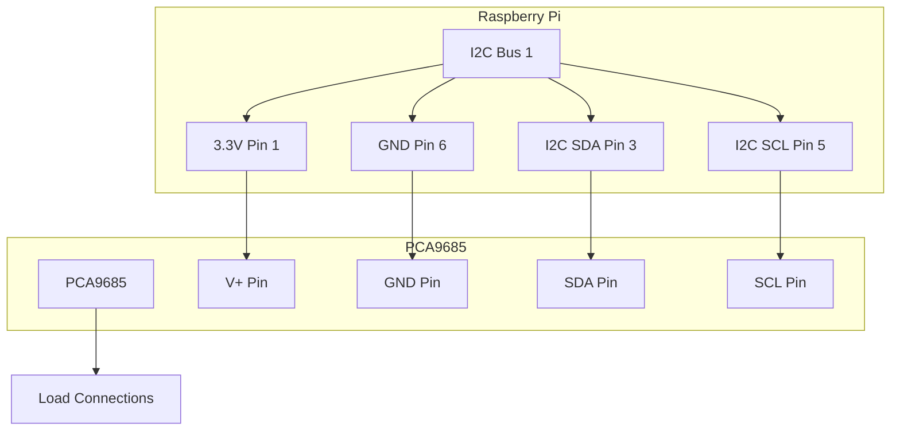
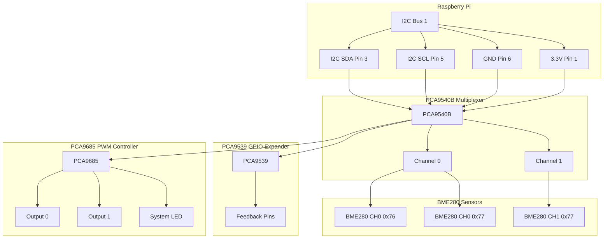

# Getting Started

<cite>
**Referenced Files in This Document**
- [run.py](file://run.py)
- [Dockerfile](file://Dockerfile)
- [config.yaml](file://config.yaml)
- [repository.yaml](file://repository.yaml)
</cite>

## Table of Contents
1. [Introduction](#introduction)
2. [Prerequisites](#prerequisites)
3. [Hardware Setup](#hardware-setup)
4. [Installation](#installation)
5. [Initial Configuration](#initial-configuration)
6. [First Run Verification](#first-run-verification)
7. [Basic Operation Examples](#basic-operation-examples)
8. [Troubleshooting](#troubleshooting)
9. [Conclusion](#conclusion)

## Introduction
The PCA9685 PWM Controller is a comprehensive solution for controlling heating elements, fans, steppers, and monitoring environmental conditions through I2C devices. This project provides a complete implementation for Raspberry Pi systems to manage PWM outputs, relay control, stepper motor operation, and sensor data collection via MQTT integration.

The system integrates multiple I2C devices including the PCA9685 PWM controller, PCA9539 GPIO expander for feedback monitoring, PCA9540B I2C multiplexer for sensor routing, and BME280 environmental sensors for temperature, humidity, and pressure monitoring.

## Prerequisites

### Hardware Requirements
- Raspberry Pi (any model with I2C support)
- PCA9685 16-channel 12-bit PWM/Servo controller
- PCA9539 16-bit I2C GPIO expander (optional but recommended)
- PCA9540B 1-of-2 I2C multiplexer (optional)
- BME280 environmental sensor(s) (optional)
- Jumper wires and breadboard
- Pull-up resistors (4.7kΩ) for I2C lines

### Software Dependencies
The project requires Python 3.11+ with the following packages:
- smbus2: I2C communication library
- paho-mqtt: MQTT client library
- requests: HTTP client for supervisor integration

### Raspberry Pi Setup
1. **Enable I2C Interface**
   ```bash
   sudo raspi-config
   # Navigate to Interface Options → I2C → Enable
   ```

2. **Verify I2C Modules**
   ```bash
   lsmod | grep i2c
   i2cdetect -y 1
   ```

3. **Install Required Packages**
   ```bash
   sudo apt-get update
   sudo apt-get install i2c-tools
   ```

**Section sources**
- [Dockerfile:1-15](file://Dockerfile#L1-L15)
- [run.py:29-46](file://run.py#L29-L46)

## Hardware Setup

### I2C Address Configuration
The system uses the following default I2C addresses:
- PCA9685: 0x40 (default)
- PCA9539: 0x74 (default)
- PCA9540B: 0x70 (default)
- BME280: 0x76 or 0x77 (default)

### Wiring Diagrams

#### Basic PCA9685 Setup


#### Complete Multi-Device Setup


**Diagram sources**
- [run.py:571-630](file://run.py#L571-L630)

### Device Address Configuration
- **PCA9685**: Uses address 0x40 by default
- **PCA9539**: Uses address 0x74 by default  
- **PCA9540B**: Uses address 0x70 by default
- **BME280**: Uses addresses 0x76 or 0x77 depending on configuration

### Pull-up Resistors
Install 4.7kΩ pull-up resistors between SDA and VCC, and SCL and VCC for reliable I2C communication.

**Section sources**
- [config.yaml:32-34](file://config.yaml#L32-L34)
- [run.py:162-179](file://run.py#L162-L179)

## Installation

### Docker-Based Deployment

#### Step 1: Prepare Docker Environment
```bash
# Pull the official Python slim image
docker pull python:3.11-slim
```

#### Step 2: Build Container Image
```bash
# Clone the repository
git clone https://github.com/KoToValery/PCA9685_PWM_controll.git
cd PCA9685_PWM_controll

# Build the Docker image
docker build -t pca9685-pwm-controller .
```

#### Step 3: Run Container with Proper Permissions
```bash
docker run -d \
  --name pca9685-controller \
  --privileged \
  --device /dev/i2c-1:/dev/i2c-1:rw \
  -e mqtt_host=core-mosquitto \
  -e mqtt_port=1883 \
  -e mqtt_username=mqtt \
  -e mqtt_password=mqtt_password \
  -v /opt/pca9685/config:/data \
  pca9685-pwm-controller
```

### Direct Python Installation

#### Step 1: Install System Dependencies
```bash
# Update package manager
sudo apt-get update

# Install I2C tools and kernel modules
sudo apt-get install -y i2c-tools kmod

# Enable I2C interface
sudo raspi-config nonint do_i2c 0
```

#### Step 2: Install Python Dependencies
```bash
# Install required Python packages
pip install smbus2 paho-mqtt requests
```

#### Step 3: Download and Run the Application
```bash
# Download the script
wget https://raw.githubusercontent.com/KoToValery/PCA9685_PWM_controll/main/run.py

# Make executable
chmod +x run.py

# Run the application
python3 run.py
```

**Section sources**
- [Dockerfile:1-15](file://Dockerfile#L1-L15)
- [run.py:14-28](file://run.py#L14-L28)

## Initial Configuration

### Configuration File Setup
Create a configuration file at `/data/options.json` with the following structure:

```yaml
mqtt_host: "core-mosquitto"
mqtt_port: 1883
mqtt_username: "mqtt"
mqtt_password: "mqtt_password"
pca_address: "0x40"
pca9539_address: "0x74"
pca9540_address: "0x70"
i2c_bus: 1
bme_interval: 30
pca_frequency: 1000
default_duty_cycle: 30
pu_default_hz: 100.0
mqtt_deep_clean: false
led_indicator_interval: 30
```

### Environment Variables
The application supports the following environment variables:

| Variable | Description | Default |
|----------|-------------|---------|
| SUPERVISOR_TOKEN | Home Assistant Supervisor token | None |
| mqtt_host | MQTT broker hostname | core-mosquitto |
| mqtt_port | MQTT broker port | 1883 |
| mqtt_username | MQTT username | None |
| mqtt_password | MQTT password | None |

### Configuration Validation
The system validates configuration parameters including:
- I2C bus numbers (0-10)
- PWM frequencies (24-1526 Hz)
- Duty cycle percentages (0-100%)
- Sensor intervals (1-3600 seconds)

**Section sources**
- [config.yaml:28-57](file://config.yaml#L28-L57)
- [run.py:284-331](file://run.py#L284-L331)

## First Run Verification

### System Status Indicators
The controller uses LED indicators to communicate system status:

#### LED Color Meanings
- **Solid Green**: System operational and healthy
- **Blinking Red**: Hardware problems detected
- **System LED (CH15)**: Always blinks to indicate service is running

#### Diagnostic Procedure
1. **Power On**: Observe LED behavior
2. **Diagnostic Mode**: System automatically runs hardware checks
3. **Status Display**: LED shows final system health

### Hardware Testing Commands
Test individual components using MQTT commands:

#### PWM Output Testing
```bash
# Set PWM1 duty cycle to 50%
mosquitto_pub -h localhost -t "homeassistant/number/pca_pwm1_duty/set" -m "50"

# Set PWM2 duty cycle to 75%
mosquitto_pub -h localhost -t "homeassistant/number/pca_pwm2_duty/set" -m "75"
```

#### Heater Control Testing
```bash
# Turn on Heater 1
mosquitto_pub -h localhost -t "homeassistant/switch/pca_heater_1/set" -m "ON"

# Turn off all heaters
mosquitto_pub -h localhost -t "homeassistant/switch/pca_heater_1/set" -m "OFF"
mosquitto_pub -h localhost -t "homeassistant/switch/pca_heater_2/set" -m "OFF"
mosquitto_pub -h localhost -t "homeassistant/switch/pca_heater_3/set" -m "OFF"
mosquitto_pub -h localhost -t "homeassistant/switch/pca_heater_4/set" -m "OFF"
```

#### Fan Control Testing
```bash
# Turn on Fan 1 Power
mosquitto_pub -h localhost -t "homeassistant/switch/pca_fan_1_power/set" -m "ON"

# Turn on Fan 2 Power
mosquitto_pub -h localhost -t "homeassistant/switch/pca_fan_2_power/set" -m "ON"
```

#### Stepper Motor Testing
```bash
# Enable stepper motor
mosquitto_pub -h localhost -t "homeassistant/switch/pca_stepper_ena/set" -m "ON"

# Set stepper direction (CW/CCW)
mosquitto_pub -h localhost -t "homeassistant/select/pca_stepper_dir/set" -m "CW"

# Enable pulse generation
mosquitto_pub -h localhost -t "homeassistant/switch/pca_pu_enable/set" -m "ON"

# Set pulse frequency (Hz)
mosquitto_pub -h localhost -t "homeassistant/number/pca_pu_freq_hz/set" -m "100"
```

### Monitoring Sensor Data
Monitor environmental sensor readings:

```bash
# Subscribe to temperature data
mosquitto_sub -h localhost -t "homeassistant/sensor/bme280_ch0_0x76_temperature/state"

# Subscribe to humidity data  
mosquitto_sub -h localhost -t "homeassistant/sensor/bme280_ch0_0x76_humidity/state"

# Subscribe to pressure data
mosquitto_sub -h localhost -t "homeassistant/sensor/bme280_ch0_0x76_pressure/state"
```

**Section sources**
- [run.py:369-458](file://run.py#L369-L458)
- [run.py:1709-1738](file://run.py#L1709-L1738)

## Basic Operation Examples

### Complete System Control Example
```bash
# 1. Enable system monitoring
mosquitto_pub -h localhost -t "homeassistant/switch/pca_heater_1/set" -m "ON"
mosquitto_pub -h localhost -t "homeassistant/switch/pca_heater_2/set" -m "ON"

# 2. Set PWM fan speeds
mosquitto_pub -h localhost -t "homeassistant/number/pca_pwm1_duty/set" -m "60"
mosquitto_pub -h localhost -t "homeassistant/number/pca_pwm2_duty/set" -m "70"

# 3. Configure stepper motor
mosquitto_pub -h localhost -t "homeassistant/switch/pca_stepper_ena/set" -m "ON"
mosquitto_pub -h localhost -t "homeassistant/select/pca_stepper_dir/set" -m "CW"
mosquitto_pub -h localhost -t "homeassistant/switch/pca_pu_enable/set" -m "ON"
mosquitto_pub -h localhost -t "homeassistant/number/pca_pu_freq_hz/set" -m "80"
```

### Sensor Monitoring Workflow
```bash
# 1. Initialize sensors
mosquitto_pub -h localhost -t "homeassistant/switch/pca_heater_1/set" -m "ON"

# 2. Monitor environmental data
echo "Monitoring BME280 sensors..."
mosquitto_sub -h localhost -t "homeassistant/sensor/bme280_ch0_0x76_temperature/state" &
mosquitto_sub -h localhost -t "homeassistant/sensor/bme280_ch0_0x76_humidity/state" &
mosquitto_sub -h localhost -t "homeassistant/sensor/bme280_ch0_0x76_pressure/state" &
```

### Feedback Verification
Monitor hardware feedback to ensure proper operation:

```bash
# Monitor relay feedback status
mosquitto_sub -h localhost -t "homeassistant/binary_sensor/status_relay1/state"
mosquitto_sub -h localhost -t "homeassistant/binary_sensor/status_relay2/state"

# Monitor stepper feedback
mosquitto_sub -h localhost -t "homeassistant/binary_sensor/status_ena/state"
mosquitto_sub -h localhost -t "homeassistant/binary_sensor/status_dir/state"
mosquitto_sub -h localhost -t "homeassistant/binary_sensor/status_pu/state"
```

**Section sources**
- [run.py:1746-1883](file://run.py#L1746-L1883)
- [run.py:673-798](file://run.py#L673-L798)

## Troubleshooting

### Common Hardware Issues

#### I2C Address Conflicts
**Problem**: Multiple devices on the same address
**Solution**: 
1. Check current I2C devices
   ```bash
   sudo i2cdetect -y 1
   ```
2. Verify device addresses in configuration
3. Use PCA9540B multiplexer to separate sensors

#### Hardware Detection Failures
**Problem**: PCA9685 not detected
**Symptoms**: 
- System exits with PCA9685 initialization error
- LED remains off
**Solutions**:
1. Verify I2C bus is enabled
2. Check wiring connections
3. Confirm power supply (3.3V)
4. Test with minimal setup

#### Sensor Communication Issues
**Problem**: BME280 sensor not responding
**Solutions**:
1. Verify sensor addresses (0x76/0x77)
2. Check pull-up resistor values (4.7kΩ)
3. Ensure proper voltage levels
4. Test with i2cdetect command

### Software Configuration Problems

#### MQTT Connectivity Issues
**Problem**: Cannot connect to MQTT broker
**Solutions**:
1. Verify broker hostname/port
2. Check authentication credentials
3. Test network connectivity
4. Review broker logs

#### PWM Output Problems
**Problem**: PWM signals not reaching loads
**Solutions**:
1. Verify relay wiring and load connections
2. Check transistor drivers
3. Test with oscilloscope
4. Verify duty cycle limits (0-100%)

#### Feedback Monitoring Issues
**Problem**: PCA9539 feedback not working
**Solutions**:
1. Verify PCA9539 address configuration
2. Check feedback pin wiring
3. Test with multimeter
4. Review diagnostic logs

### Diagnostic Commands

#### System Health Check
```bash
# Check I2C devices
sudo i2cdetect -y 1

# Monitor system logs
journalctl -u pca9685-controller -f

# Test MQTT connectivity
mosquitto_pub -h localhost -t "test/topic" -m "test message"
```

#### Hardware Verification
```bash
# Test individual outputs
for i in {0..15}; do
    mosquitto_pub -h localhost -t "homeassistant/number/pca_pwm1_duty/set" -m "$i"
    sleep 1
done
```

**Section sources**
- [run.py:571-585](file://run.py#L571-L585)
- [run.py:822-873](file://run.py#L822-L873)
- [run.py:1947-1959](file://run.py#L1947-L1959)

## Conclusion

The PCA9685 PWM Controller provides a robust foundation for industrial automation and environmental monitoring applications. By following this getting started guide, you can successfully deploy the system on Raspberry Pi, configure hardware components, establish MQTT connectivity, and verify proper operation through LED indicators and sensor feedback.

Key success factors include proper I2C wiring, correct device addressing, adequate pull-up resistors, and systematic troubleshooting using the built-in diagnostic capabilities. The modular design allows for easy expansion with additional sensors and actuators as your automation requirements evolve.

For advanced users, the system supports deep customization through configuration parameters, allowing fine-tuning of timing, frequencies, and operational characteristics to match specific application requirements.