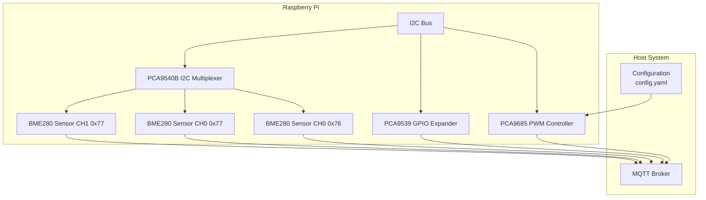
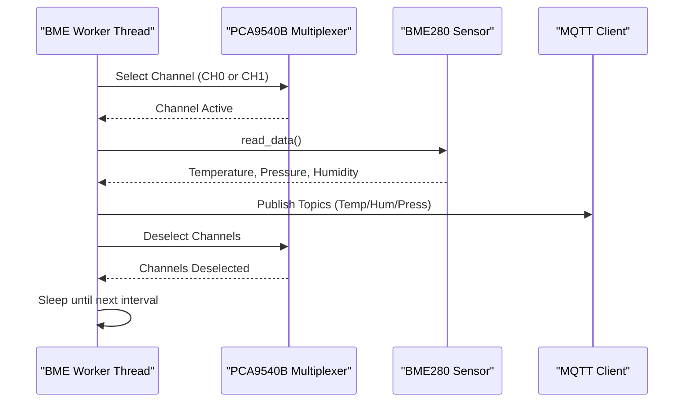
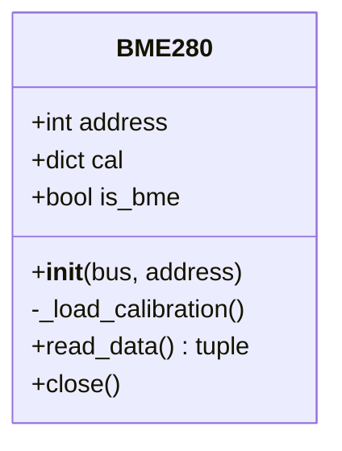
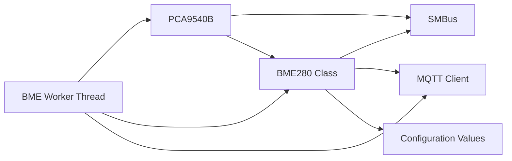

# BME280 Environmental Sensors

<cite>
**Referenced Files in This Document**
- [run.py](file://run.py)
- [config.yaml](file://config.yaml)
</cite>

## Table of Contents
1. [Introduction](#introduction)
2. [Project Structure](#project-structure)
3. [Core Components](#core-components)
4. [Architecture Overview](#architecture-overview)
5. [Detailed Component Analysis](#detailed-component-analysis)
6. [Dependency Analysis](#dependency-analysis)
7. [Performance Considerations](#performance-considerations)
8. [Troubleshooting Guide](#troubleshooting-guide)
9. [Conclusion](#conclusion)
10. [Appendices](#appendices)

## Introduction
This document explains the BME280 environmental sensor integration within the project, focusing on temperature, pressure, and humidity measurement capabilities. It covers the sensor chip architecture, calibration and compensation procedures, initialization steps (including chip ID verification), configuration settings, measurement protocols, and practical workflows for reading and publishing sensor data. It also documents the I2C multiplexer integration for dual-sensor deployments, channel management, and data collection scheduling. Finally, it provides troubleshooting guidance for initialization failures, calibration errors, and measurement inaccuracies.

## Project Structure
The project is a Python service that controls PWM outputs via PCA9685, integrates GPIO feedback via PCA9539, and reads environmental data from BME280 sensors through an I2C multiplexer (PCA9540B). The BME280 implementation resides in the main runtime script and is configured via a YAML configuration file.

**Diagram sources**
- [run.py:571-630](file://run.py#L571-L630)
- [run.py:822-874](file://run.py#L822-L874)
- [config.yaml:32-41](file://config.yaml#L32-L41)

**Section sources**
- [run.py:571-630](file://run.py#L571-L630)
- [config.yaml:32-41](file://config.yaml#L32-L41)

## Core Components
- BME280 class: Implements sensor initialization, calibration data loading, and raw-to-physical conversion.
- PCA9540B multiplexer: Manages channel selection for dual sensor deployment.
- BME worker: Orchestrates periodic sensor reads and publishes MQTT topics.
- Configuration: Defines I2C bus, addresses, intervals, and defaults.

Key responsibilities:
- Initialization: Chip ID verification (BME280=0x60, BMP280=0x58), calibration data load, and sensor configuration registers.
- Measurement: Oversampling configuration, standby times, and filter settings.
- Data processing: Temperature, pressure, and humidity compensation and unit conversions.
- Integration: I2C multiplexer channel management and scheduled data collection.

**Section sources**
- [run.py:162-264](file://run.py#L162-L264)
- [run.py:606-625](file://run.py#L606-L625)
- [run.py:822-874](file://run.py#L822-L874)
- [config.yaml:32-41](file://config.yaml#L32-L41)

## Architecture Overview
The BME280 subsystem is composed of:
- A BME280 class that encapsulates sensor operations.
- A PCA9540B multiplexer to select sensor channels.
- A dedicated worker thread that periodically reads sensors and publishes MQTT topics.
- Configuration-driven parameters controlling I2C addresses, intervals, and defaults.

**Diagram sources**
- [run.py:822-874](file://run.py#L822-L874)
- [run.py:606-625](file://run.py#L606-L625)
- [run.py:162-264](file://run.py#L162-L264)

## Detailed Component Analysis

### BME280 Class
The BME280 class encapsulates:
- Initialization: Chip ID verification, calibration data loading, and register configuration.
- Measurement: Raw ADC readings, compensation calculations, and unit conversions.
- Data publication: Temperature in Celsius, pressure in hectopascals, and humidity in percent (when applicable).

Initialization and configuration highlights:
- Chip ID verification: Validates BME280 (0x60) or BMP280 (0x58).
- Calibration data load: Reads calibration coefficients from specific registers.
- Oversampling and mode: Sets humidity oversampling (x1 for BME280), temperature and pressure oversampling (x1), and normal mode.
- Standby and filter: Sets standby time to 1000 ms and disables internal filter.

Measurement and compensation highlights:
- Temperature compensation: Uses calibration coefficients to compute t_fine and convert to Celsius.
- Pressure compensation: Uses t_fine to compute pressure in hPa with safeguards against invalid values.
- Humidity compensation: Applies BME-specific compensation when present.

**Diagram sources**
- [run.py:162-264](file://run.py#L162-L264)

**Section sources**
- [run.py:162-264](file://run.py#L162-L264)

### Sensor Initialization and Calibration
- Chip ID verification: Confirms sensor type and sets is_bme flag accordingly.
- Calibration data loading: Reads 2-byte unsigned and signed integers and constructs coefficient maps.
- Sensor configuration: Writes oversampling and mode settings, and standby/filter settings.

Operational notes:
- Humidity oversampling is set to x1 for BME280 during initialization.
- Temperature and pressure oversampling are set to x1.
- Mode is set to normal operation.
- Standby time is 1000 ms and filter is off.

**Section sources**
- [run.py:167-179](file://run.py#L167-L179)
- [run.py:180-215](file://run.py#L180-L215)

### Measurement Protocols and Compensation
- Raw data extraction: Reads 8 bytes for BME280 (or 6 bytes for BMP280) and reconstructs 20-bit values.
- Temperature compensation: Computes t_fine and converts to Celsius.
- Pressure compensation: Uses t_fine to compute pressure in hPa with checks for invalid values.
- Humidity compensation: Applies BME-specific compensation when available.

Unit conversions:
- Temperature: Celsius.
- Pressure: hectopascals (hPa).
- Humidity: percent (%).

Edge cases:
- Returns None for temperature and pressure if raw values indicate no reading.
- Humidity is clamped to [0, 100].

**Section sources**
- [run.py:216-260](file://run.py#L216-L260)

### I2C Multiplexer Integration and Dual-Sensor Deployment
- Channel selection: The PCA9540B multiplexer selects CH0 or CH1 prior to sensor initialization and data reads.
- Sensor instances: Three sensors are initialized across two channels (CH0: 0x76, 0x77; CH1: 0x77).
- Scheduling: The BME worker alternates between channels, reads each sensor, and publishes MQTT topics.

Channel management:
- Select channel, initialize sensor, deselect channels after initialization.
- During reads, select channel, read sensor, deselect channels afterward.

**Section sources**
- [run.py:606-625](file://run.py#L606-L625)
- [run.py:822-874](file://run.py#L822-L874)

### Practical Examples: Reading, Unit Conversions, and Data Processing
- Reading data: Call read_data() on a BME280 instance to obtain temperature, pressure, and humidity.
- Publishing: The worker publishes topics for temperature, pressure, and humidity (when applicable) to Home Assistant MQTT discovery topics.
- Scheduling: The worker sleeps for a configurable interval between reads.

Topics published:
- Temperature, humidity, and pressure for each sensor channel/address combination.

**Section sources**
- [run.py:822-874](file://run.py#L822-L874)
- [run.py:1440-1513](file://run.py#L1440-L1513)

## Dependency Analysis
The BME280 subsystem depends on:
- I2C bus access via SMBus.
- PCA9540B multiplexer for channel routing.
- MQTT client for publishing sensor data.
- Configuration values for addresses, intervals, and defaults.

**Diagram sources**
- [run.py:162-264](file://run.py#L162-L264)
- [run.py:606-625](file://run.py#L606-L625)
- [run.py:822-874](file://run.py#L822-L874)
- [config.yaml:32-41](file://config.yaml#L32-L41)

**Section sources**
- [run.py:162-264](file://run.py#L162-L264)
- [run.py:606-625](file://run.py#L606-L625)
- [run.py:822-874](file://run.py#L822-L874)
- [config.yaml:32-41](file://config.yaml#L32-L41)

## Performance Considerations
- Oversampling: The implementation uses x1 oversampling for temperature and pressure and x1 for humidity. Higher oversampling increases accuracy but also increases measurement time and power consumption.
- Standby time: The standby period is set to 1000 ms. Shorter standby times reduce latency but may increase noise.
- Filter: The internal filter is disabled. Enabling the filter can smooth out readings at the cost of increased latency.
- Collection interval: The BME worker sleeps for a configurable interval between reads. Adjusting this interval balances responsiveness and resource usage.

[No sources needed since this section provides general guidance]

## Troubleshooting Guide
Common issues and resolutions:
- Initialization failures:
  - Verify I2C bus and addresses in configuration.
  - Ensure the PCA9540B multiplexer is initialized and accessible.
  - Confirm chip ID verification passes (BME280=0x60, BMP280=0x58).
- Calibration errors:
  - Ensure calibration data registers are readable and not corrupted.
  - Reinitialize sensors if calibration fails.
- Measurement inaccuracies:
  - Check oversampling and standby settings for the intended use case.
  - Validate that the sensor is not exposed to extreme conditions outside its operating range.
  - Confirm that the multiplexer channel selection is correct before reading.

Operational logs:
- Initialization attempts and failures are logged.
- Read errors for each channel are logged with exceptions.

**Section sources**
- [run.py:606-625](file://run.py#L606-L625)
- [run.py:822-874](file://run.py#L822-L874)

## Conclusion
The BME280 integration provides robust temperature, pressure, and humidity measurements through a well-defined initialization and compensation pipeline. The I2C multiplexer enables dual-sensor deployments across channels, and the worker thread ensures scheduled, reliable data collection and publication. Proper configuration and awareness of oversampling, standby, and filter settings allow tuning for accuracy and performance.

[No sources needed since this section summarizes without analyzing specific files]

## Appendices

### Configuration Options Related to BME280
- mqtt_host, mqtt_port, mqtt_username, mqtt_password: MQTT broker settings.
- pca_address, pca9539_address, pca9540_address: I2C addresses for PCA9685, PCA9539, and PCA9540B.
- i2c_bus: I2C bus number.
- bme_interval: Interval between BME280 reads in seconds.
- pca_frequency: PCA9685 PWM frequency.
- default_duty_cycle: Default duty cycle percentage.
- pu_default_hz: Default pulse unit frequency.
- mqtt_deep_clean: Whether to perform deep clean of discovery topics.
- led_indicator_interval: LED indicator cycle interval.

**Section sources**
- [config.yaml:28-41](file://config.yaml#L28-L41)