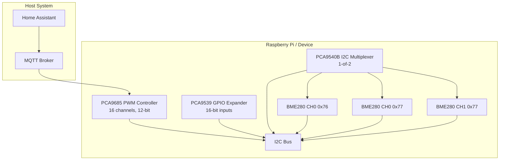
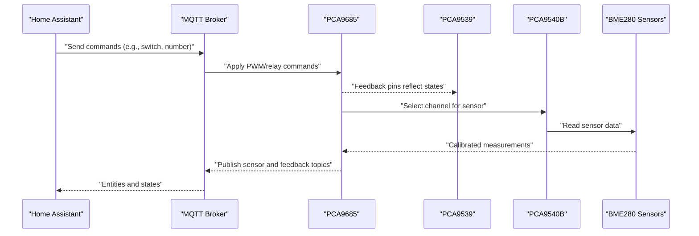
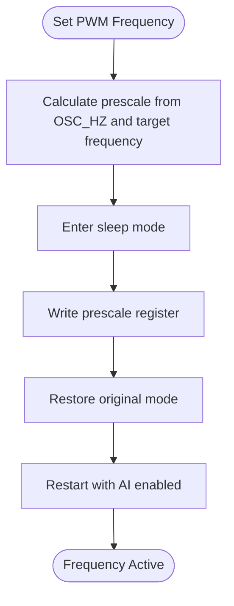
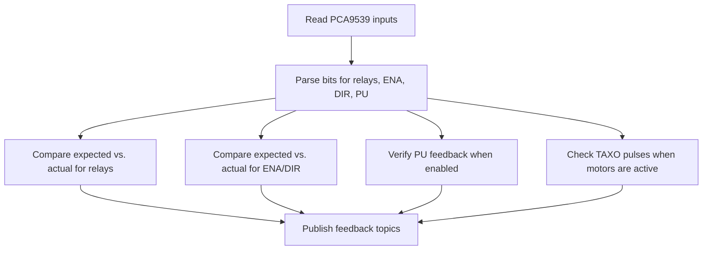
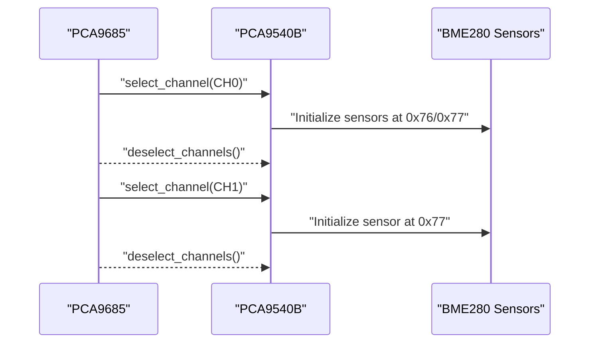
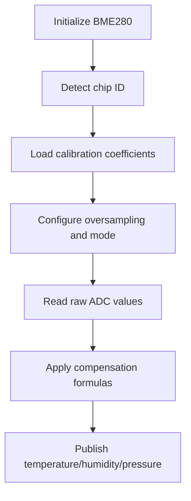
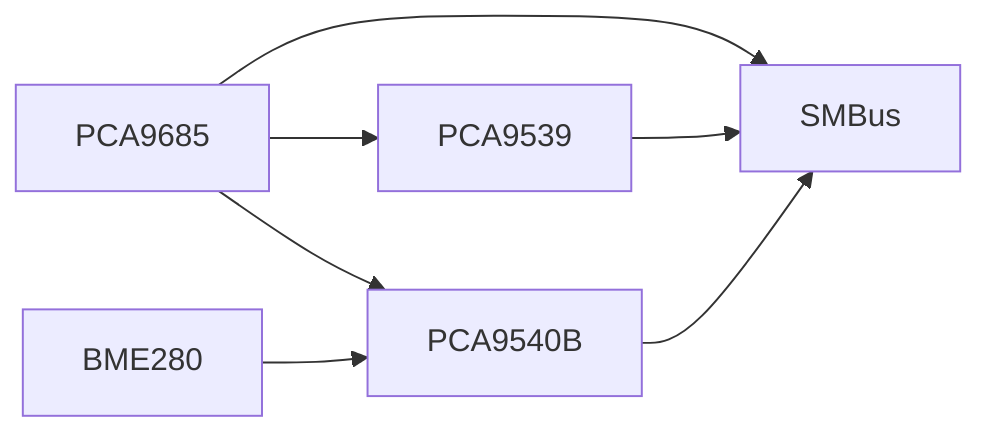

# Hardware Components

<cite>
**Referenced Files in This Document**
- [run.py](file://run.py)
- [config.yaml](file://config.yaml)
</cite>

## Table of Contents
1. [Introduction](#introduction)
2. [Project Structure](#project-structure)
3. [Core Components](#core-components)
4. [Architecture Overview](#architecture-overview)
5. [Detailed Component Analysis](#detailed-component-analysis)
6. [Dependency Analysis](#dependency-analysis)
7. [Performance Considerations](#performance-considerations)
8. [Troubleshooting Guide](#troubleshooting-guide)
9. [Conclusion](#conclusion)
10. [Appendices](#appendices)

## Introduction
This document details the hardware components integrated in the PCA9685 PWM controller system. It covers:
- PCA9685 16-channel 12-bit PWM controller: technical specifications, channel assignments, duty cycle calculation, and frequency management.
- PCA9539 16-bit I2C GPIO expander for hardware feedback monitoring: pin configurations, input/output modes, and feedback verification mechanisms.
- PCA9540B 1-of-2 I2C multiplexer for sensor expansion and channel management.
- BME280 environmental sensors: temperature, pressure, and humidity measurement capabilities, calibration processes, and I2C multiplexer integration.
It also includes wiring/connection guidance, troubleshooting procedures, safety considerations, and performance characteristics derived from the implementation.

## Project Structure
The system is implemented in a single Python service that initializes and controls the hardware via I2C and publishes telemetry to an MQTT broker. The configuration file defines I2C bus, addresses, and operational parameters.

**Diagram sources**
- [run.py:571-630](file://run.py#L571-L630)
- [config.yaml:32-36](file://config.yaml#L32-L36)

**Section sources**
- [run.py:571-630](file://run.py#L571-L630)
- [config.yaml:32-36](file://config.yaml#L32-L36)

## Core Components
- PCA9685: 16-channel 12-bit PWM controller with programmable frequency. Channels are mapped to loads (relays, fans, steppers, LEDs). Frequency is set at startup and duty cycles are managed via 12-bit values.
- PCA9539: 16-bit I2C GPIO expander configured as inputs by default. Used for hardware feedback monitoring of relays, stepper signals, and sensors.
- PCA9540B: 1-of-2 I2C multiplexer enabling multiple BME280 sensors on the same I2C bus by selecting channels.
- BME280: Temperature, pressure, and humidity sensor with calibration and compensation routines. Supports both BME280 and BMP280 variants.

**Section sources**
- [run.py:61-109](file://run.py#L61-L109)
- [run.py:111-137](file://run.py#L111-L137)
- [run.py:139-159](file://run.py#L139-L159)
- [run.py:162-264](file://run.py#L162-L264)

## Architecture Overview
The system orchestrates hardware control and monitoring:
- PCA9685 drives actuators and LEDs via PWM channels.
- PCA9539 reads feedback signals to verify actuator states and detect anomalies.
- PCA9540B selects I2C channels to enable multiple BME280 sensors.
- BME280 sensors publish calibrated readings to MQTT.
- MQTT discovery publishes entity definitions and initial states.

**Diagram sources**
- [run.py:139-159](file://run.py#L139-L159)
- [run.py:606-629](file://run.py#L606-L629)
- [run.py:822-874](file://run.py#L822-L874)
- [run.py:673-798](file://run.py#L673-L798)

## Detailed Component Analysis

### PCA9685 16-Channel 12-Bit PWM Controller
- Purpose: Drive up to 16 loads (relays, fans, steppers, LEDs) via independent PWM channels.
- Channel assignments:
  - PWM1: Fan 1 speed control
  - Heaters 1–4: Load relays
  - Fans 1–2 power: Load relays
  - Stepper DIR/ENA: Digital control
  - PU: Pulse output for stepper driver
  - PWM2: Fan 2 speed control
  - Reserved and LED channels
- Duty cycle calculation:
  - 12-bit resolution (0–4095) for precise control.
  - Percent-to-duty mapping adjusts for visual perception and hardware constraints.
- Frequency management:
  - Configurable global frequency set at startup.
  - Prescaler-based calculation ensures target frequency.
  - Sleep mode used during frequency updates to avoid glitches.

**Diagram sources**
- [run.py:79-92](file://run.py#L79-L92)
- [run.py:58-58](file://run.py#L58-L58)

**Section sources**
- [run.py:61-109](file://run.py#L61-L109)
- [run.py:266-282](file://run.py#L266-L282)
- [run.py:898-928](file://run.py#L898-L928)
- [run.py:571-586](file://run.py#L571-L586)

### PCA9539 16-Bit I2C GPIO Expander (Feedback Monitoring)
- Purpose: Monitor hardware states via 16-bit inputs.
- Initialization:
  - Pins configured as inputs by default (all bits set in configuration registers).
- Feedback verification:
  - Reads raw 16-bit input state periodically.
  - Compares expected vs. actual states for relays, stepper ENA/DIR, and PU.
  - Publishes binary sensor topics indicating problems.
- Pin mapping:
  - Relays: IO0_0–IO0_5
  - Stepper: ENA (IO1_0), DIR (IO1_1), PU (IO1_2)
  - TAXO monitoring pins: IO1_3 (TAXO1), IO1_4 (TAXO2)
  - Reserves: IO1_5–IO1_15

**Diagram sources**
- [run.py:673-798](file://run.py#L673-L798)
- [run.py:930-949](file://run.py#L930-L949)

**Section sources**
- [run.py:111-137](file://run.py#L111-L137)
- [run.py:673-798](file://run.py#L673-L798)
- [run.py:930-949](file://run.py#L930-L949)

### PCA9540B 1-of-2 I2C Multiplexer (Sensor Expansion)
- Purpose: Expand I2C bus to support multiple BME280 sensors by selecting channels.
- Operation:
  - Select channel 0 or 1 before accessing sensors.
  - Deselect channels after initialization or reads to avoid contention.
- Sensor mapping:
  - Channel 0: BME280 at 0x76 and 0x77
  - Channel 1: BME280 at 0x77

**Diagram sources**
- [run.py:606-629](file://run.py#L606-L629)
- [run.py:822-874](file://run.py#L822-L874)
- [run.py:139-159](file://run.py#L139-L159)

**Section sources**
- [run.py:139-159](file://run.py#L139-L159)
- [run.py:606-629](file://run.py#L606-L629)
- [run.py:822-874](file://run.py#L822-L874)

### BME280 Environmental Sensors (Temperature, Pressure, Humidity)
- Chip detection:
  - Validates chip ID (BME280 or BMP280) and sets variant accordingly.
- Calibration:
  - Loads calibration coefficients from device memory.
  - Applies compensation formulas for temperature, pressure, and humidity (when applicable).
- Measurement:
  - Oversampling and standby configuration set during initialization.
  - Periodic reads with configurable intervals.
- Multiplexer integration:
  - Uses PCA9540B to select channels before reading sensors.

**Diagram sources**
- [run.py:162-264](file://run.py#L162-L264)
- [run.py:606-629](file://run.py#L606-L629)

**Section sources**
- [run.py:162-264](file://run.py#L162-L264)
- [run.py:606-629](file://run.py#L606-L629)
- [run.py:822-874](file://run.py#L822-L874)

### Wiring and Connection Scheme
- I2C Bus:
  - SDA/SCL connected to the host I2C bus.
  - Pull-ups recommended per I2C specification.
- PCA9685:
  - I2C address selectable via pins; default configured in configuration.
  - Power supply and ground connections to host.
- PCA9539:
  - I2C address selectable; configured in configuration.
  - Inputs monitored for feedback; logic levels must match host.
- PCA9540B:
  - I2C address selectable; configured in configuration.
  - Connects to BME280 sensors on CH0 and CH1.
- BME280:
  - VDD/VSS, SDA/SCL, and CSB/SDO grounded or pulled to VDD depending on address selection.
- Feedback Monitoring:
  - Relays’ feedback pins connected to PCA9539 inputs.
  - Stepper ENA/DIR/PU signals routed to PCA9539 inputs.
  - TAXO sensors connected to PCA9539 inputs for pulse verification.

[No sources needed since this section provides general wiring guidance derived from component usage in the code]

### Safety Considerations and Protection Mechanisms
- Controlled shutdown:
  - On exit or signal, all channels are turned off and MQTT availability is set offline.
- Diagnostic mode:
  - System status toggles to diagnostic during hardware checks.
- Safe stepper direction change:
  - Pulse generation is temporarily disabled before changing direction to prevent conflicts.
- Frequency limits:
  - PCA frequency constrained to a safe range to avoid noise and instability.
- I2C contention prevention:
  - Mux channels are deselected after sensor operations.

**Section sources**
- [run.py:1889-1931](file://run.py#L1889-L1931)
- [run.py:998-1036](file://run.py#L998-L1036)
- [config.yaml:53-53](file://config.yaml#L53-L53)
- [run.py:610-624](file://run.py#L610-L624)

## Dependency Analysis
- PCA9685 depends on SMBus for I2C communication and is configured with a global frequency.
- PCA9539 is optional; if unavailable, feedback monitoring is disabled.
- PCA9540B is optional; if unavailable, sensor access is disabled.
- BME280 sensors require PCA9540B to be present for channel selection.

**Diagram sources**
- [run.py:42-46](file://run.py#L42-L46)
- [run.py:571-604](file://run.py#L571-L604)

**Section sources**
- [run.py:42-46](file://run.py#L42-L46)
- [run.py:571-604](file://run.py#L571-L604)

## Performance Considerations
- PWM Resolution: 12-bit allows fine-grained control; duty cycle mapping accounts for perceptual scaling.
- Frequency Range: Configurable within a practical range to balance audible noise and switching losses.
- I2C Throughput: Sensor reads are rate-limited by interval configuration; ensure adequate delays between channel selections.
- Feedback Sampling: Continuous polling of PCA9539 inputs enables real-time problem detection.

[No sources needed since this section provides general guidance]

## Troubleshooting Guide
- PCA9685 Initialization Failure:
  - Verify I2C bus accessibility and kernel module availability.
  - Confirm address configuration and pull-up resistors.
- PCA9539 Not Responding:
  - Check address configuration and wiring.
  - Ensure inputs are not shorted to ground or VCC unintentionally.
- PCA9540B Sensor Access Issues:
  - Confirm channel selection/deselection sequence.
  - Verify sensor addresses and multiplexer wiring.
- BME280 Read Failures:
  - Validate chip ID detection and calibration loading.
  - Ensure correct channel selection before read operations.
- Feedback Problems:
  - Review expected vs. actual comparisons for relays, ENA/DIR, and PU.
  - Check wiring continuity and logic levels.

**Section sources**
- [run.py:571-586](file://run.py#L571-L586)
- [run.py:588-604](file://run.py#L588-L604)
- [run.py:606-629](file://run.py#L606-L629)
- [run.py:822-874](file://run.py#L822-L874)
- [run.py:673-798](file://run.py#L673-L798)

## Conclusion
The PCA9685 PWM controller system integrates a robust set of hardware components with strong feedback and monitoring capabilities. The implementation provides precise PWM control, reliable sensor data acquisition, and continuous hardware verification through the PCA9539 expander. Proper configuration, wiring, and adherence to operational constraints ensure safe and efficient operation.

[No sources needed since this section summarizes without analyzing specific files]

## Appendices

### Configuration Options
- I2C bus, PCA9685 address, PCA9539 address, PCA9540B address, BME read interval, PCA frequency, default duty cycle, and LED indicator interval are configurable.

**Section sources**
- [config.yaml:32-41](file://config.yaml#L32-L41)
- [config.yaml:51-56](file://config.yaml#L51-L56)