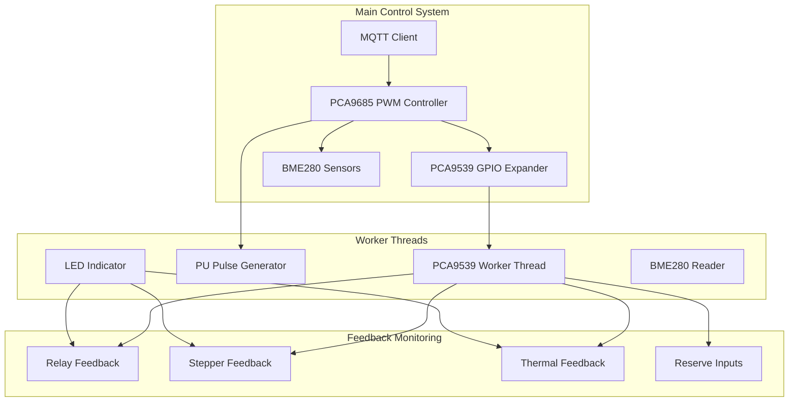
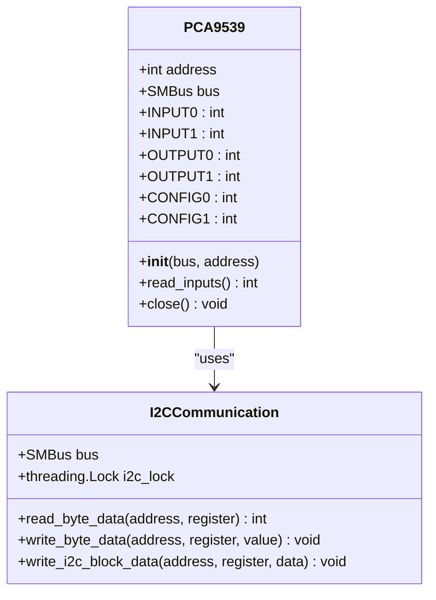
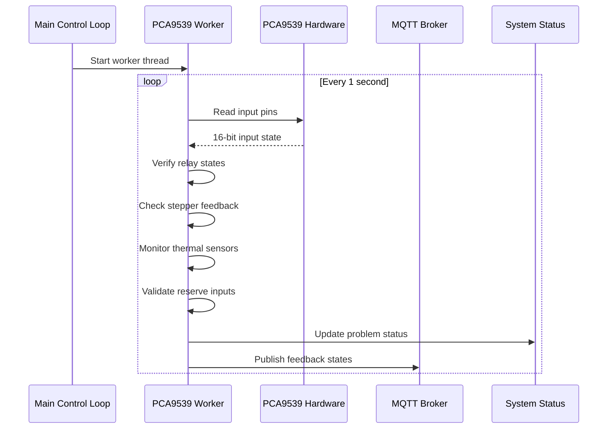
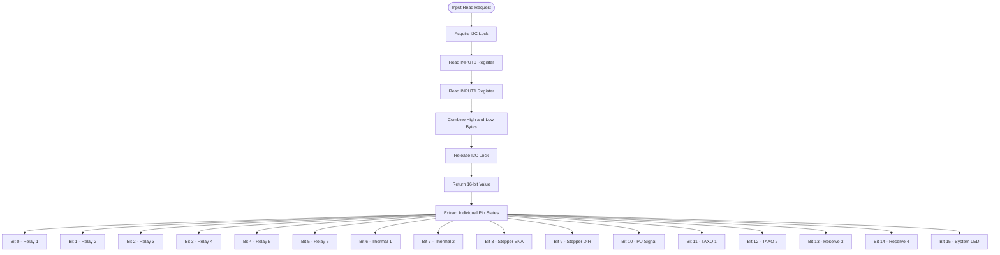
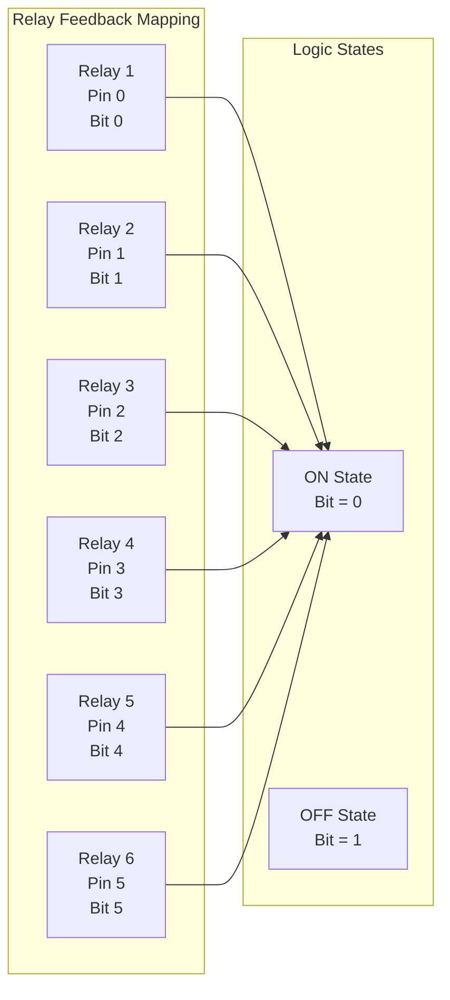
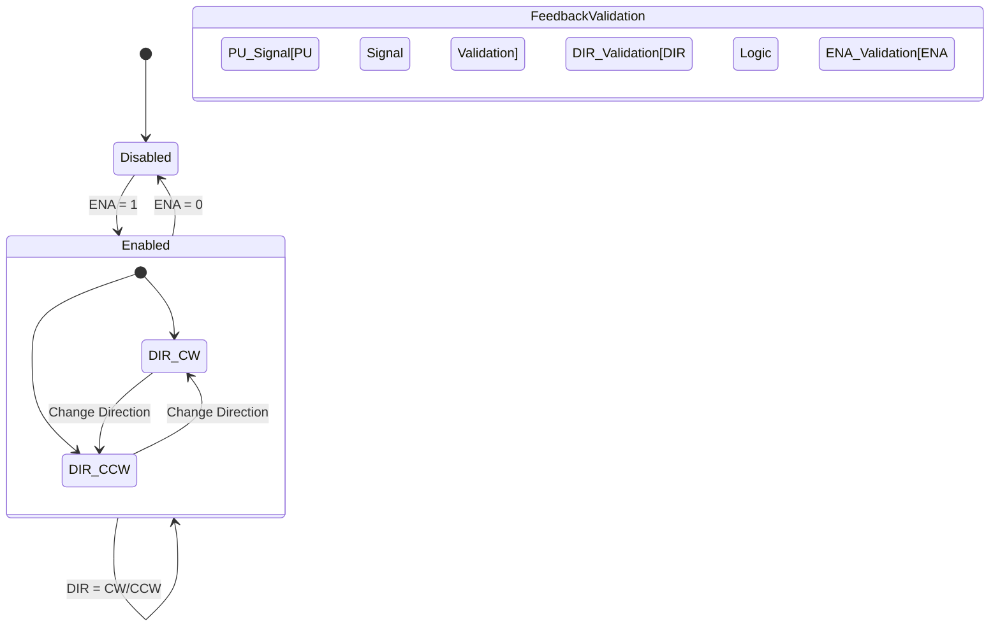
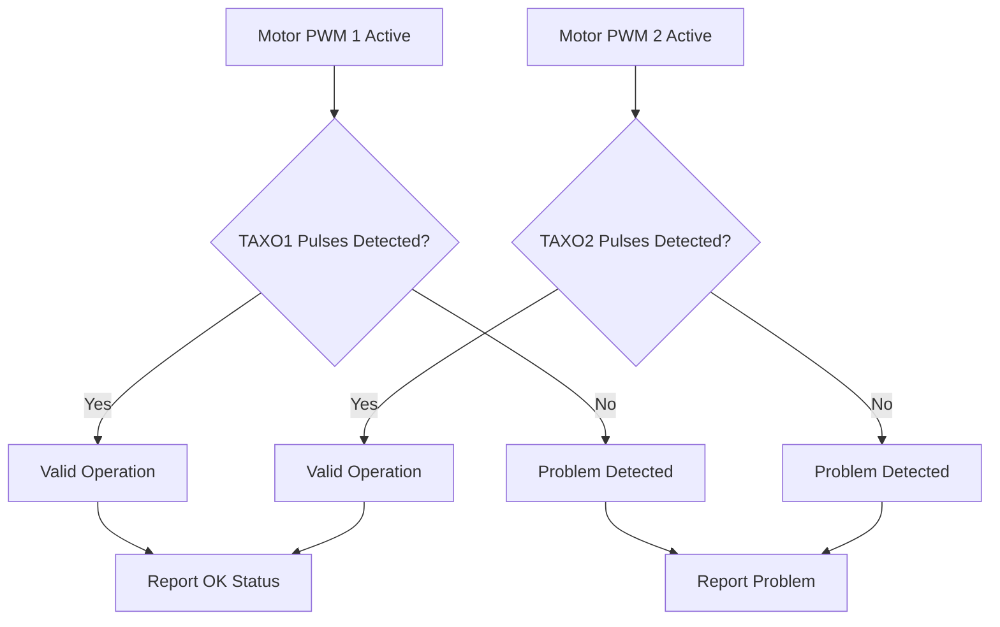
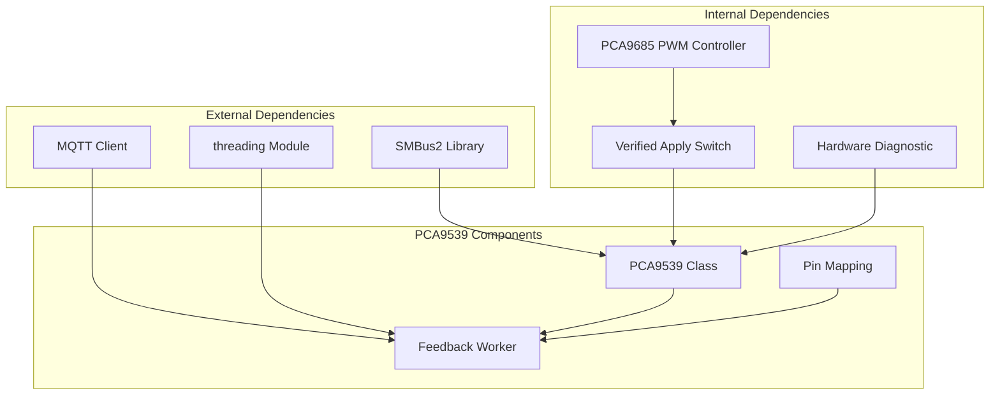

# PCA9539 GPIO Expander

<cite>
**Referenced Files in This Document**
- [run.py](file://run.py)
- [config.yaml](file://config.yaml)
</cite>

## Table of Contents
1. [Introduction](#introduction)
2. [Project Structure](#project-structure)
3. [Core Components](#core-components)
4. [Architecture Overview](#architecture-overview)
5. [Detailed Component Analysis](#detailed-component-analysis)
6. [Dependency Analysis](#dependency-analysis)
7. [Performance Considerations](#performance-considerations)
8. [Troubleshooting Guide](#troubleshooting-guide)
9. [Conclusion](#conclusion)

## Introduction

The PCA9539 16-bit I2C GPIO expander serves as a critical hardware feedback monitoring system in this embedded control application. This document provides comprehensive technical documentation for the PCA9539 implementation, focusing on its dual-port architecture, input/output configuration modes, and the sophisticated feedback verification system that ensures reliable hardware operation.

The PCA9539 operates as a 16-channel GPIO expander with two 8-bit ports (PORT0 and PORT1), enabling bidirectional I/O operations through configurable input/output modes. The implementation includes comprehensive hardware feedback monitoring for relays, stepper motors, thermal sensors, and reserve inputs, with real-time status verification through dedicated worker threads.

## Project Structure

The PCA9539 implementation is integrated within a larger embedded control system that manages PWM outputs, sensor monitoring, and hardware feedback verification. The system architecture demonstrates a modular approach with clear separation of concerns between hardware control, feedback monitoring, and system diagnostics.

**Diagram sources**
- [run.py:111-136](file://run.py#L111-L136)
- [run.py:673-798](file://run.py#L673-L798)
- [run.py:1044-1105](file://run.py#L1044-L1105)

**Section sources**
- [run.py:111-136](file://run.py#L111-L136)
- [run.py:588-595](file://run.py#L588-L595)
- [config.yaml:32-34](file://config.yaml#L32-L34)

## Core Components

### PCA9539 Class Implementation

The PCA9539 class provides a clean interface for GPIO expansion with comprehensive I2C communication support. The implementation initializes all pins as inputs by default, following the configuration register reset state.

**Diagram sources**
- [run.py:111-136](file://run.py#L111-L136)

### Dual-Port Architecture

The PCA9539 implements a dual-port architecture with separate 8-bit ports for input and output operations:

- **PORT0 (Pins 0-7)**: Primary I/O port for relays, thermal feedback, and reserve inputs
- **PORT1 (Pins 8-15)**: Secondary I/O port for stepper motor control signals

Each port maintains independent configuration registers allowing flexible pin assignments and mixed input/output scenarios.

**Section sources**
- [run.py:111-136](file://run.py#L111-L136)
- [run.py:931-944](file://run.py#L931-L944)

## Architecture Overview

The PCA9539 feedback system operates through a sophisticated multi-threaded architecture that ensures real-time hardware monitoring and verification.

**Diagram sources**
- [run.py:673-798](file://run.py#L673-L798)
- [run.py:1937-1964](file://run.py#L1937-L1964)

### Feedback Verification System

The feedback verification system implements comprehensive hardware validation through multiple verification stages:

1. **Pre-verification**: Initial hardware state assessment
2. **Command Application**: Hardware command execution
3. **Post-verification**: Final state confirmation with timing delays

**Section sources**
- [run.py:950-991](file://run.py#L950-L991)
- [run.py:673-798](file://run.py#L673-L798)

## Detailed Component Analysis

### Input Reading Mechanism

The PCA9539 input reading mechanism employs a two-stage process to capture the complete 16-bit input state:

**Diagram sources**
- [run.py:128-133](file://run.py#L128-L133)
- [run.py:698-787](file://run.py#L698-L787)

### Bit Manipulation Techniques

The implementation utilizes efficient bit manipulation techniques for extracting individual pin states from the 16-bit input register:

- **Bit Extraction**: `(input_register >> pin_index) & 1`
- **Bit Validation**: Comparison against expected logical states
- **State Comparison**: Logical verification of hardware vs. expected states

**Section sources**
- [run.py:128-133](file://run.py#L128-L133)
- [run.py:702-787](file://run.py#L702-L787)

### Relay State Monitoring

The relay monitoring system tracks six individual relays (RL1-RL6) through dedicated pin assignments:

**Diagram sources**
- [run.py:702-712](file://run.py#L702-L712)
- [run.py:934-940](file://run.py#L934-L940)

### Stepper Motor Feedback System

The stepper motor feedback system monitors three critical control signals with specific timing and validation requirements:

**Diagram sources**
- [run.py:714-747](file://run.py#L714-L747)
- [run.py:941-943](file://run.py#L941-L943)

**Section sources**
- [run.py:714-747](file://run.py#L714-L747)
- [run.py:1038-1042](file://run.py#L1038-L1042)

### Thermal Feedback Monitoring

The thermal feedback monitoring system validates stepper motor operation through pulse detection on dedicated TAXO pins:

**Diagram sources**
- [run.py:749-779](file://run.py#L749-L779)
- [run.py:947-948](file://run.py#L947-L948)

**Section sources**
- [run.py:749-779](file://run.py#L749-L779)

### Reserve Input Monitoring

The reserve input monitoring system tracks three additional input pins (RES2-RES4) for system diagnostics and future expansion:

**Section sources**
- [run.py:781-787](file://run.py#L781-L787)
- [run.py:782-784](file://run.py#L782-L784)

## Dependency Analysis

The PCA9539 implementation integrates with several system components through well-defined interfaces:

**Diagram sources**
- [run.py:20-21](file://run.py#L20-L21)
- [run.py:111-136](file://run.py#L111-L136)
- [run.py:673-798](file://run.py#L673-L798)

**Section sources**
- [run.py:20-21](file://run.py#L20-L21)
- [run.py:111-136](file://run.py#L111-L136)
- [run.py:673-798](file://run.py#L673-L798)

## Performance Considerations

### I2C Communication Optimization

The PCA9539 implementation employs several optimization strategies for efficient I2C communication:

- **Thread Safety**: Global I2C lock ensures exclusive access to I2C bus
- **Batch Operations**: Combined input reads minimize I2C transactions
- **Timing Delays**: Strategic delays accommodate hardware response times
- **Rate Limiting**: 1-second polling interval balances responsiveness with efficiency

### Memory Management

The implementation follows memory-efficient patterns:

- **Minimal State Storage**: Only essential state variables maintained
- **Thread-Safe Access**: Proper locking mechanisms prevent race conditions
- **Resource Cleanup**: Proper shutdown procedures release system resources

## Troubleshooting Guide

### Common Issues and Solutions

#### PCA9539 Initialization Failures

**Symptoms**: PCA9539 not available, feedback monitoring disabled
**Causes**: 
- Incorrect I2C address configuration
- Hardware connection issues
- I2C bus access permissions

**Solutions**:
1. Verify I2C address in configuration file
2. Check physical connections and wiring
3. Confirm I2C bus permissions and kernel modules

#### Feedback Verification Errors

**Symptoms**: Relay feedback shows "ON" when expecting "OFF"
**Causes**:
- Incorrect relay wiring polarity
- Faulty relay contacts
- Timing issues in verification process

**Solutions**:
1. Verify relay wiring according to feedback mapping
2. Test individual relay circuits independently
3. Adjust timing delays if necessary

#### Pulse Detection Problems

**Symptoms**: PU feedback not detected despite active pulsing
**Causes**:
- Insufficient pulse detection threshold
- Wiring issues in pulse feedback circuit
- Incorrect pulse frequency settings

**Solutions**:
1. Verify pulse feedback wiring connections
2. Check pulse detection thresholds in code
3. Test with known good pulse generator

**Section sources**
- [run.py:588-595](file://run.py#L588-L595)
- [run.py:950-991](file://run.py#L950-L991)
- [run.py:1095-1101](file://run.py#L1095-L1101)

### Diagnostic Procedures

The system includes comprehensive diagnostic capabilities:

1. **Hardware Diagnostic**: Automated testing of all feedback channels
2. **Real-time Monitoring**: Continuous feedback verification
3. **Problem Detection**: Automatic status reporting and LED indication
4. **System Status Tracking**: Centralized problem status management

**Section sources**
- [run.py:369-458](file://run.py#L369-L458)
- [run.py:1128-1204](file://run.py#L1128-L1204)

## Conclusion

The PCA9539 GPIO expander implementation demonstrates a robust and comprehensive approach to hardware feedback monitoring in embedded control systems. The dual-port architecture, combined with sophisticated verification algorithms and real-time monitoring capabilities, provides reliable hardware validation and system diagnostics.

Key strengths of the implementation include:

- **Modular Design**: Clean separation of concerns with dedicated worker threads
- **Comprehensive Coverage**: Full hardware feedback monitoring for all system components
- **Robust Verification**: Multi-stage verification process ensures reliable hardware state tracking
- **Flexible Configuration**: Easy-to-modify pin mappings and feedback logic
- **Production Ready**: Proper error handling, resource management, and graceful shutdown procedures

The system provides a solid foundation for industrial automation applications requiring reliable hardware monitoring and verification, with clear extension points for additional hardware components and monitoring scenarios.