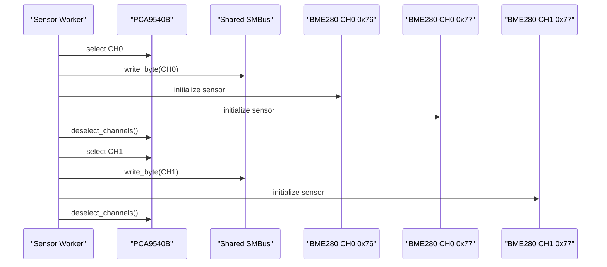
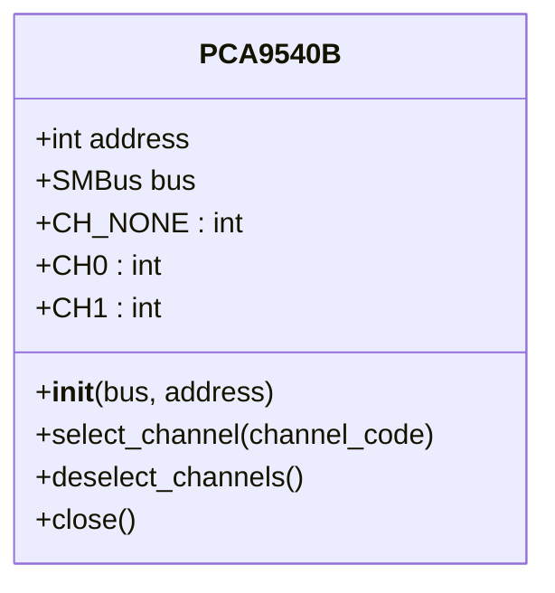
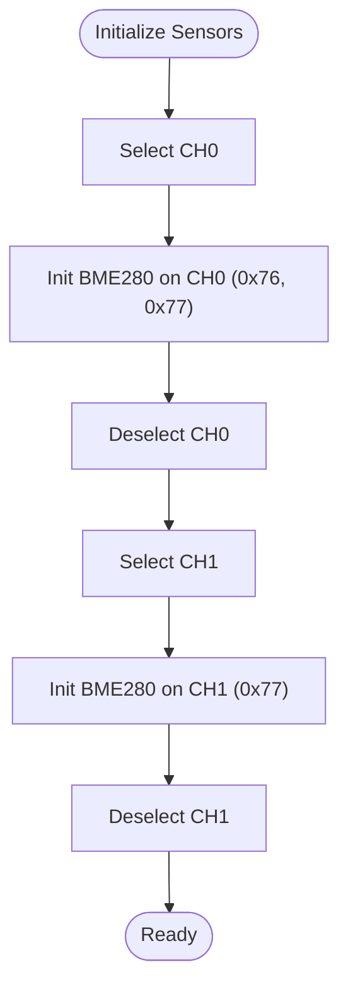
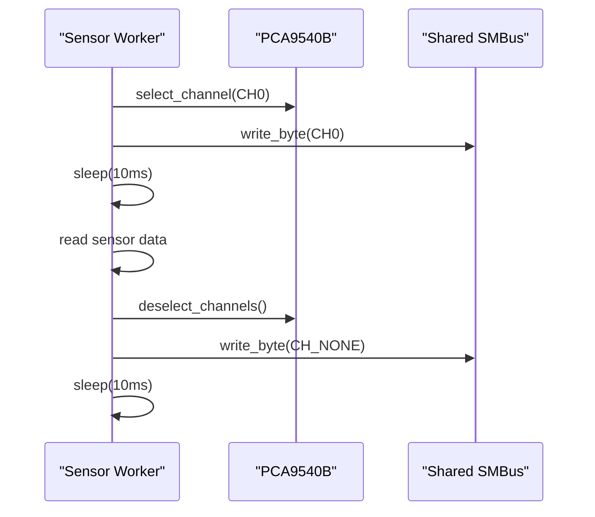
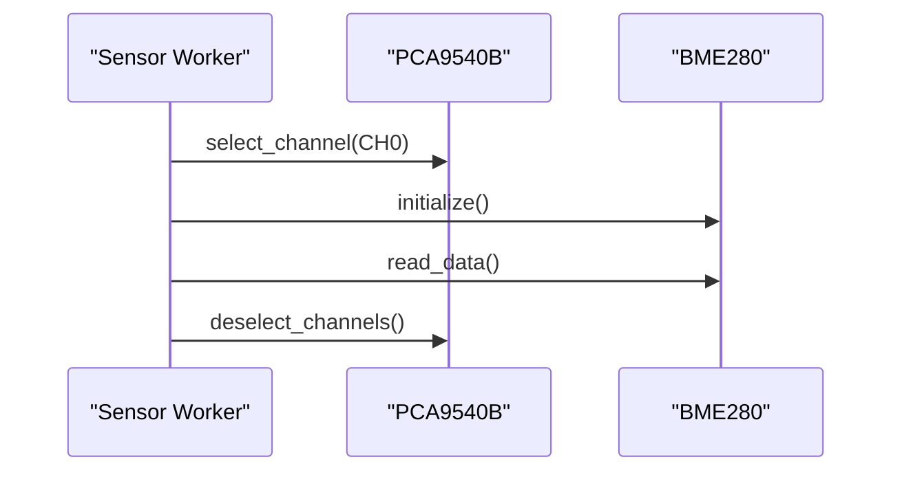
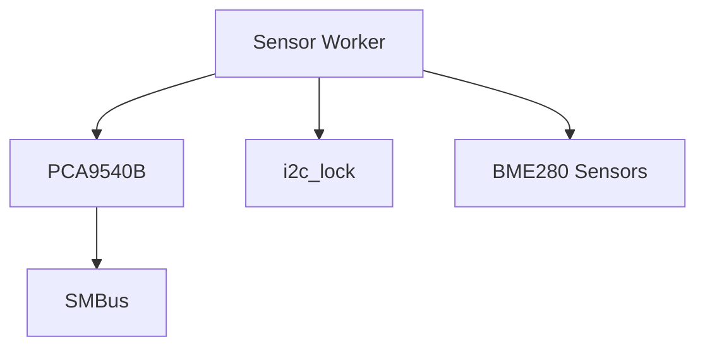

# PCA9540B I2C Multiplexer

<cite>
**Referenced Files in This Document**
- [run.py](file://run.py)
- [config.yaml](file://config.yaml)
</cite>

## Table of Contents
1. [Introduction](#introduction)
2. [Project Structure](#project-structure)
3. [Core Components](#core-components)
4. [Architecture Overview](#architecture-overview)
5. [Detailed Component Analysis](#detailed-component-analysis)
6. [Dependency Analysis](#dependency-analysis)
7. [Performance Considerations](#performance-considerations)
8. [Troubleshooting Guide](#troubleshooting-guide)
9. [Conclusion](#conclusion)

## Introduction
This document explains how the PCA9540B 1-of-2 I2C multiplexer is integrated to expand the I2C bus capacity and coordinate multiple sensor devices. It covers the multiplexer’s architecture, channel selection and deselection protocols, initialization sequences, and error handling. It also documents the sensor integration strategy for BME280 sensors placed on different channels, I2C address conflict resolution, and sequential sensor access patterns. Practical examples illustrate sensor initialization, channel switching, and data collection workflows, along with troubleshooting guidance for channel selection issues, sensor communication failures, and multiplexer synchronization problems.

## Project Structure
The project is a Python service that controls PWM outputs via PCA9685, reads sensors through PCA9539 GPIO feedback, and coordinates I2C sensor access through a PCA9540B multiplexer. The PCA9540B enables connecting multiple I2C devices to the same bus by selecting one of two channels (CH0 or CH1). The BME280 sensors are configured to operate on different channels and addresses to avoid I2C address conflicts.

```mermaid
graph TB
subgraph "Host System"
MQTT["MQTT Client"]
Threads["Worker Threads"]
end
subgraph "PCA9685 Bus Controller"
PCA9685["PCA9685 PWM Controller"]
Channels["Channel Outputs"]
end
subgraph "I2C Bus"
Mux["PCA9540B Multiplexer<br/>Address configurable"]
CH0["Channel 0"]
CH1["Channel 1"]
SENSORS["BME280 Sensors<br/>0x76, 0x77"]
end
subgraph "Feedback"
PCA9539["PCA9539 GPIO Expander"]
Feedback["Feedback Pins"]
end
MQTT --> Threads
Threads --> PCA9685
PCA9685 --> Channels
Channels --> Mux
Mux --> CH0
Mux --> CH1
CH0 --> SENSORS
CH1 --> SENSORS
PCA9685 --> PCA9539
PCA9539 --> Feedback
```

**Diagram sources**
- [run.py:139-159](file://run.py#L139-L159)
- [run.py:606-625](file://run.py#L606-L625)
- [run.py:822-874](file://run.py#L822-L874)
- [config.yaml:34-35](file://config.yaml#L34-L35)

**Section sources**
- [run.py:139-159](file://run.py#L139-L159)
- [run.py:606-625](file://run.py#L606-L625)
- [run.py:822-874](file://run.py#L822-L874)
- [config.yaml:34-35](file://config.yaml#L34-L35)

## Core Components
- PCA9540B Multiplexer: Provides two selectable I2C channels (CH0 and CH1) and a deselect state. Channel selection is performed by writing a single byte to the multiplexer’s address.
- BME280 Sensors: Temperature, pressure, and humidity sensors operating on I2C. They are initialized on specific channels and addresses to avoid conflicts.
- Shared I2C Bus: A single SMBus instance is used across all devices, protected by a global lock to serialize I2C transactions.
- Worker Threads: Dedicated threads manage sensor reads, GPIO feedback, LED indicators, and MQTT discovery.

Key implementation references:
- Multiplexer class and channel selection/deselection: [run.py:139-159](file://run.py#L139-L159)
- Sensor initialization on channels: [run.py:606-625](file://run.py#L606-L625)
- Sequential sensor reads across channels: [run.py:822-874](file://run.py#L822-L874)
- I2C bus and locking: [run.py:40-46](file://run.py#L40-L46)

**Section sources**
- [run.py:139-159](file://run.py#L139-L159)
- [run.py:606-625](file://run.py#L606-L625)
- [run.py:822-874](file://run.py#L822-L874)
- [run.py:40-46](file://run.py#L40-L46)

## Architecture Overview
The system architecture centers on a shared I2C bus controlled by a single SMBus instance. The PCA9540B multiplexer sits between the PCA9685 and the I2C devices, allowing selection of either CH0 or CH1. BME280 sensors are initialized on CH0 at addresses 0x76 and 0x77, and on CH1 at 0x77. A dedicated worker thread periodically reads sensors, selects the appropriate channel, performs sensor reads, and deselects the channel afterward. The PCA9539 GPIO expander provides feedback on relay and stepper signals.



**Diagram sources**
- [run.py:606-625](file://run.py#L606-L625)
- [run.py:139-159](file://run.py#L139-L159)

**Section sources**
- [run.py:606-625](file://run.py#L606-L625)
- [run.py:139-159](file://run.py#L139-L159)

## Detailed Component Analysis

### PCA9540B Multiplexer
The PCA9540B class encapsulates channel selection and deselection:
- Channel constants define CH_NONE, CH0, and CH1.
- select_channel writes a single byte to the multiplexer address to select a channel.
- deselect_channels ensures no channel remains selected by writing CH_NONE.

Channel selection protocol:
- Select CH0: write 0x04 to the multiplexer address.
- Select CH1: write 0x05 to the multiplexer address.
- Deselect: write 0x00 to the multiplexer address.

Initialization sequence:
- The multiplexer is instantiated with the shared SMBus and its address from configuration.
- On successful initialization, the worker threads can safely select channels.

Error handling:
- Initialization failures are logged and treated as disabling multiplexing.
- During sensor reads, exceptions are caught and the multiplexer is deselected to recover from transient errors.

Practical example references:
- Channel selection and deselection: [run.py:139-159](file://run.py#L139-L159)
- Initialization and error handling: [run.py:597-604](file://run.py#L597-L604)



**Diagram sources**
- [run.py:139-159](file://run.py#L139-L159)

**Section sources**
- [run.py:139-159](file://run.py#L139-L159)
- [run.py:597-604](file://run.py#L597-L604)

### BME280 Sensor Integration Strategy
Sensor placement and addressing:
- CH0: BME280 at 0x76 and 0x77.
- CH1: BME280 at 0x77.
- This arrangement avoids I2C address conflicts by placing sensors on different channels.

Initialization pattern:
- Select the target channel.
- Initialize the BME280 sensor(s) on that channel.
- Deselect the channel immediately after initialization.

Sequential access pattern:
- A worker thread iterates through channels and sensors, selecting the channel, reading sensor data, and deselecting.

Practical example references:
- Sensor initialization on channels: [run.py:606-625](file://run.py#L606-L625)
- Sequential sensor reads across channels: [run.py:822-874](file://run.py#L822-L874)



**Diagram sources**
- [run.py:606-625](file://run.py#L606-L625)
- [run.py:139-159](file://run.py#L139-L159)

**Section sources**
- [run.py:606-625](file://run.py#L606-L625)
- [run.py:822-874](file://run.py#L822-L874)

### Channel Selection Timing and Synchronization
Timing requirements:
- After selecting a channel, a short delay is applied before sensor operations to allow the multiplexer to settle.
- During sensor reads, a delay is applied after deselecting to ensure the bus is stable.

Synchronization:
- A global lock serializes I2C operations to prevent contention across threads.
- The multiplexer is deselected in exception handlers to guarantee a clean state.

Practical example references:
- Delay after channel selection: [run.py:610-612](file://run.py#L610-L612)
- Delay after deselecting: [run.py:849-867](file://run.py#L849-L867)
- Global I2C lock: [run.py:40-46](file://run.py#L40-L46)



**Diagram sources**
- [run.py:822-874](file://run.py#L822-L874)
- [run.py:139-159](file://run.py#L139-L159)

**Section sources**
- [run.py:822-874](file://run.py#L822-L874)
- [run.py:139-159](file://run.py#L139-L159)
- [run.py:40-46](file://run.py#L40-L46)

### Sensor Access Workflows
Initialization workflow:
- Select channel.
- Initialize sensor(s).
- Deselect channel.

Read workflow:
- Select channel.
- Read sensor data.
- Deselect channel.

Error handling:
- Exceptions during initialization or reading trigger deselection to recover the bus state.

Practical example references:
- Initialization wrapper: [run.py:606-625](file://run.py#L606-L625)
- Read loop: [run.py:822-874](file://run.py#L822-L874)



**Diagram sources**
- [run.py:606-625](file://run.py#L606-L625)
- [run.py:822-874](file://run.py#L822-L874)

**Section sources**
- [run.py:606-625](file://run.py#L606-L625)
- [run.py:822-874](file://run.py#L822-L874)

### Configuration and Addresses
The PCA9540B address is configurable via the configuration file. The default address is set to 0x70. The BME280 sensors are configured at addresses 0x76 and 0x77 on CH0, and at 0x77 on CH1.

Practical example references:
- PCA9540B address configuration: [config.yaml:34-35](file://config.yaml#L34-L35)
- Sensor topic definitions and device identifiers: [run.py:1287-1303](file://run.py#L1287-L1303)

**Section sources**
- [config.yaml:34-35](file://config.yaml#L34-L35)
- [run.py:1287-1303](file://run.py#L1287-L1303)

## Dependency Analysis
The PCA9540B multiplexer depends on:
- Shared SMBus for I2C transactions.
- Global lock for thread-safe access.
- Worker threads for periodic sensor reads.

Sensor dependencies:
- BME280 sensors depend on the multiplexer channel being selected.
- Initialization and read operations depend on the SMBus being open.



**Diagram sources**
- [run.py:40-46](file://run.py#L40-L46)
- [run.py:139-159](file://run.py#L139-L159)
- [run.py:822-874](file://run.py#L822-L874)

**Section sources**
- [run.py:40-46](file://run.py#L40-L46)
- [run.py:139-159](file://run.py#L139-L159)
- [run.py:822-874](file://run.py#L822-L874)

## Performance Considerations
- Channel selection and deselection introduce small delays; batching sensor reads within a single channel reduces overhead.
- Using a single SMBus instance and a global lock prevents bus contention but may serialize operations; consider optimizing read intervals and avoiding unnecessary channel switches.
- Sensor read intervals are configurable and can be tuned to balance responsiveness and bus utilization.

[No sources needed since this section provides general guidance]

## Troubleshooting Guide
Common issues and resolutions:
- Multiplexer initialization fails:
  - Verify the PCA9540B address in configuration and hardware wiring.
  - Check kernel module loading and I2C bus accessibility.
  - References: [run.py:597-604](file://run.py#L597-L604), [config.yaml:34-35](file://config.yaml#L34-L35)

- Channel selection does not take effect:
  - Ensure the channel selection delay is respected before sensor operations.
  - Confirm the multiplexer is deselected after exceptions.
  - References: [run.py:610-612](file://run.py#L610-L612), [run.py:849-867](file://run.py#L849-L867)

- Sensor communication failures:
  - Validate sensor addresses and channel assignments.
  - Confirm the multiplexer is deselected after initialization and reads.
  - References: [run.py:606-625](file://run.py#L606-L625), [run.py:822-874](file://run.py#L822-L874)

- Multiplexer synchronization problems:
  - Use the global lock to serialize I2C operations.
  - Ensure deselect is called in exception handlers.
  - References: [run.py:40-46](file://run.py#L40-L46), [run.py:849-867](file://run.py#L849-L867)

**Section sources**
- [run.py:597-604](file://run.py#L597-L604)
- [run.py:606-625](file://run.py#L606-L625)
- [run.py:610-612](file://run.py#L610-L612)
- [run.py:822-874](file://run.py#L822-L874)
- [run.py:849-867](file://run.py#L849-L867)
- [run.py:40-46](file://run.py#L40-L46)
- [config.yaml:34-35](file://config.yaml#L34-L35)

## Conclusion
The PCA9540B multiplexer enables efficient expansion of the I2C bus by allowing multiple sensors to share a single SMBus through channel selection. The implementation demonstrates robust initialization, sequential access patterns, and error handling to maintain reliable sensor communication. Proper configuration of addresses and channels, combined with careful timing and synchronization, ensures predictable operation across multiple sensor devices.

[No sources needed since this section summarizes without analyzing specific files]