# PCA9685 PWM Controller

<cite>
**Referenced Files in This Document**
- [run.py](file://run.py)
- [config.yaml](file://config.yaml)
</cite>

## Table of Contents
1. [Introduction](#introduction)
2. [Project Structure](#project-structure)
3. [Core Components](#core-components)
4. [Architecture Overview](#architecture-overview)
5. [Detailed Component Analysis](#detailed-component-analysis)
6. [Dependency Analysis](#dependency-analysis)
7. [Performance Considerations](#performance-considerations)
8. [Troubleshooting Guide](#troubleshooting-guide)
9. [Conclusion](#conclusion)

## Introduction
This document provides comprehensive technical documentation for a PCA9685 16-channel 12-bit PWM controller implementation. The PCA9685 is a sophisticated I2C-controlled PWM IC capable of driving up to 16 independent channels with 12-bit resolution (0-4095), enabling precise control of loads such as heaters, fans, steppers, and LEDs. This implementation integrates MQTT-based Home Assistant discovery, hardware feedback verification, and robust thread-safe I2C communication protocols.

Key technical specifications:
- 12-bit PWM resolution (0-4095)
- 16 independent channels (0-15)
- Configurable PWM frequencies via prescaler values
- Thread-safe I2C communication using SMBus2
- Hardware feedback verification through PCA9539 GPIO expander
- MQTT-based Home Assistant integration with automatic discovery

## Project Structure
The project follows a modular Python architecture centered around a single primary script that orchestrates multiple hardware components and services:

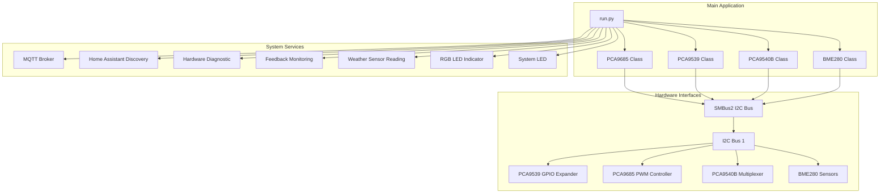

**Diagram sources**
- [run.py:1-50](file://run.py#L1-L50)
- [run.py:61-160](file://run.py#L61-L160)

**Section sources**
- [run.py:1-50](file://run.py#L1-L50)
- [config.yaml:1-57](file://config.yaml#L1-L57)

## Core Components

### PCA9685 PWM Controller Class
The PCA9685 class encapsulates all PWM functionality with thread-safe I2C operations:

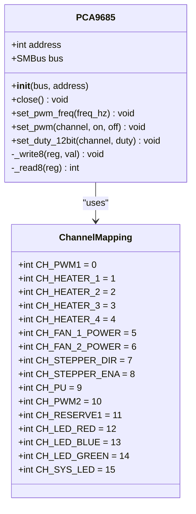

**Diagram sources**
- [run.py:61-109](file://run.py#L61-L109)
- [run.py:266-282](file://run.py#L266-L282)

### Hardware Component Classes
The implementation includes specialized classes for each hardware component:

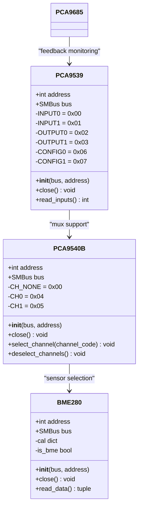

**Diagram sources**
- [run.py:111-160](file://run.py#L111-L160)
- [run.py:162-264](file://run.py#L162-L264)

**Section sources**
- [run.py:61-160](file://run.py#L61-L160)
- [run.py:162-264](file://run.py#L162-L264)

## Architecture Overview

### System Architecture
The PCA9685 controller implements a multi-threaded architecture with dedicated workers for different system functions:

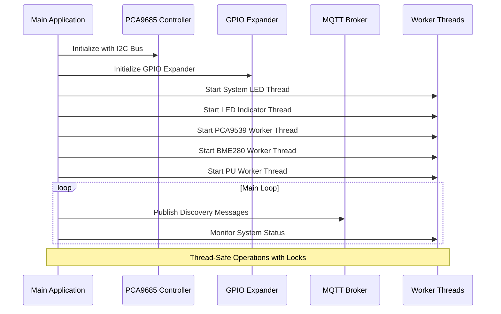

**Diagram sources**
- [run.py:571-604](file://run.py#L571-L604)
- [run.py:1128-1226](file://run.py#L1128-L1226)

### Channel Mapping System
The fixed channel mapping assigns specific functions to PCA9685 channels:

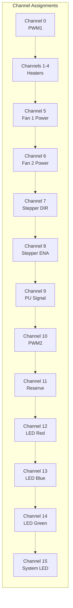

**Diagram sources**
- [run.py:266-282](file://run.py#L266-L282)
- [run.py:930-944](file://run.py#L930-L944)

**Section sources**
- [run.py:266-282](file://run.py#L266-L282)
- [run.py:930-944](file://run.py#L930-L944)

## Detailed Component Analysis

### PWM Frequency Management
The PCA9685 implements precise frequency control through prescaler calculations:

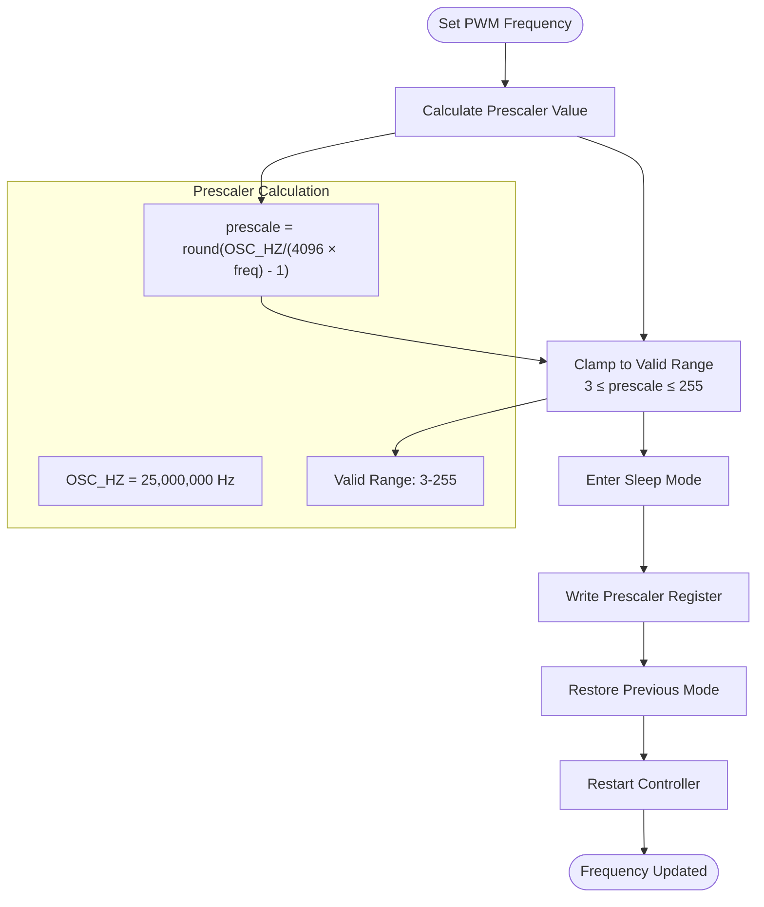

**Diagram sources**
- [run.py:79-93](file://run.py#L79-L93)

### Duty Cycle Calculation Methods
The implementation provides multiple approaches to calculate duty cycles:

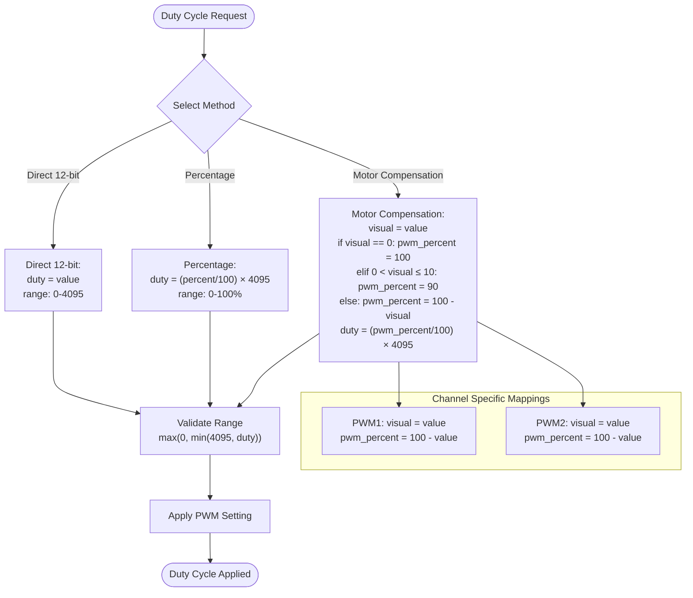

**Diagram sources**
- [run.py:106-109](file://run.py#L106-L109)
- [run.py:898-928](file://run.py#L898-L928)

### Thread-Safe I2C Communication Protocol
The implementation ensures thread-safe I2C operations through synchronized access:

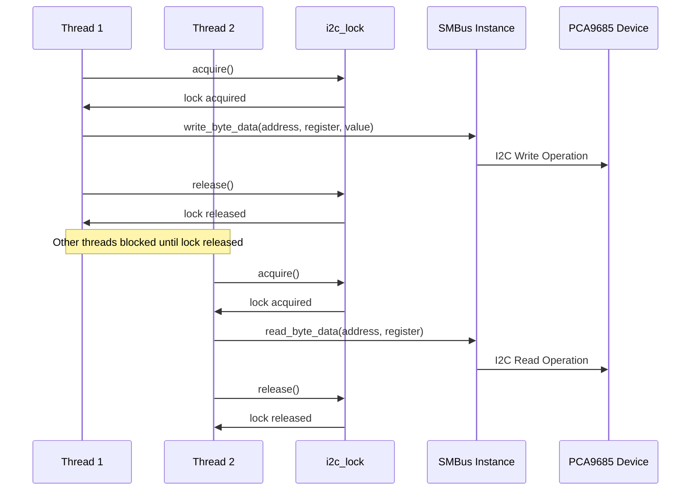

**Diagram sources**
- [run.py:39-46](file://run.py#L39-L46)
- [run.py:73-78](file://run.py#L73-L78)

**Section sources**
- [run.py:79-93](file://run.py#L79-L93)
- [run.py:898-928](file://run.py#L898-L928)
- [run.py:39-46](file://run.py#L39-L46)

### Hardware Feedback Verification System
The PCA9539 GPIO expander provides comprehensive feedback verification:

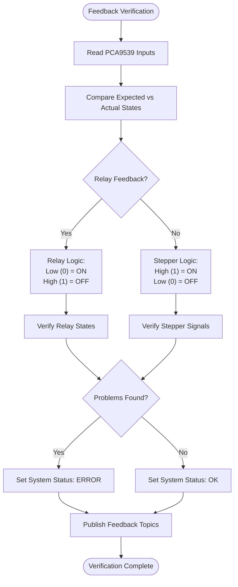

**Diagram sources**
- [run.py:673-798](file://run.py#L673-L798)
- [run.py:950-992](file://run.py#L950-L992)

**Section sources**
- [run.py:673-798](file://run.py#L673-L798)
- [run.py:950-992](file://run.py#L950-L992)

### Stepper Motor Control Implementation
The stepper motor control system implements safe switching with pulse generation:

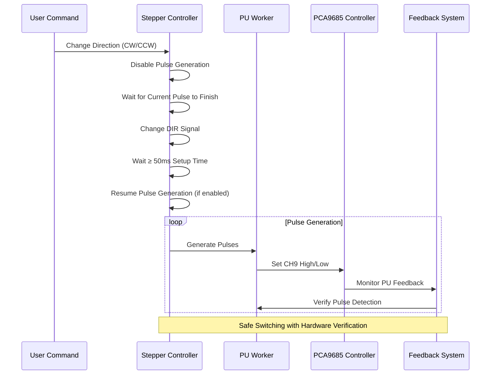

**Diagram sources**
- [run.py:998-1036](file://run.py#L998-L1036)
- [run.py:1044-1105](file://run.py#L1044-L1105)

**Section sources**
- [run.py:998-1036](file://run.py#L998-L1036)
- [run.py:1044-1105](file://run.py#L1044-L1105)

## Dependency Analysis

### Hardware Component Dependencies
The system architecture establishes clear dependencies between hardware components:

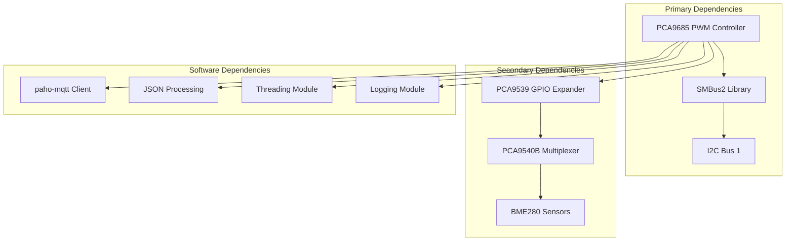

**Diagram sources**
- [run.py:20-21](file://run.py#L20-L21)
- [run.py:111-160](file://run.py#L111-L160)

### Software Architecture Dependencies
The application follows a layered architecture with clear separation of concerns:

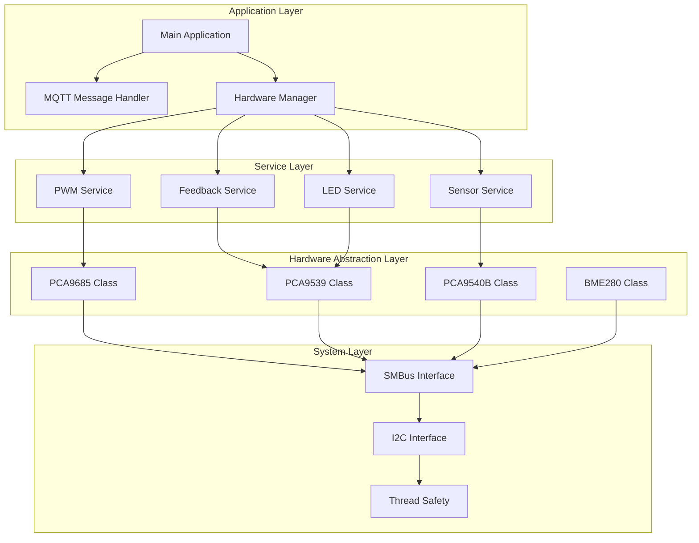

**Diagram sources**
- [run.py:571-604](file://run.py#L571-L604)
- [run.py:1228-1248](file://run.py#L1228-L1248)

**Section sources**
- [run.py:20-21](file://run.py#L20-L21)
- [run.py:571-604](file://run.py#L571-L604)

## Performance Considerations

### I2C Bus Performance
The implementation optimizes I2C communication through several mechanisms:

- **Shared Bus Access**: Single SMBus instance shared across all components
- **Thread Safety**: Global lock (`i2c_lock`) prevents concurrent I2C operations
- **Batch Operations**: I2C block writes for efficient register updates
- **Timing Delays**: Strategic delays for device stability during mode changes

### Memory Management
The application implements efficient memory usage patterns:

- **Object Lifecycle**: Proper cleanup of hardware objects during shutdown
- **Thread Management**: Daemon threads that terminate automatically
- **Resource Cleanup**: Context managers and explicit close() calls
- **Configuration Caching**: Static configuration loaded once at startup

### Real-Time Performance
Hardware feedback and control operations are designed for real-time responsiveness:

- **Feedback Sampling**: 1-second intervals for PCA9539 monitoring
- **Sensor Reading**: Configurable intervals for BME280 sensors
- **LED Indicators**: Non-blocking LED pattern updates
- **MQTT Publishing**: Asynchronous message handling

## Troubleshooting Guide

### Common PWM Issues

#### PWM Frequency Not Sticking
**Symptoms**: PWM frequency resets to default after reboots
**Causes**: 
- Prescaler value out of valid range (3-255)
- I2C communication failures during frequency setting
- Power cycling without proper shutdown sequence

**Solutions**:
1. Verify prescaler calculation: `prescale = round(25000000/(4096 × frequency) - 1)`
2. Check I2C bus connectivity and device addresses
3. Ensure proper shutdown sequence before power cycling

#### Duty Cycle Not Responding
**Symptoms**: PWM outputs not changing despite commands
**Causes**:
- Channel index out of range (0-15)
- Invalid duty cycle values (0-4095)
- Thread contention blocking I2C operations

**Solutions**:
1. Validate channel assignments in fixed mapping
2. Check duty cycle clamping: `max(0, min(4095, duty))`
3. Monitor I2C lock acquisition timing

#### Frequency Drift Issues
**Symptoms**: PWM frequency gradually changing over time
**Causes**:
- Temperature variations affecting crystal oscillator
- Power supply instability
- I2C timing issues causing partial register writes

**Solutions**:
1. Implement periodic frequency verification
2. Add temperature compensation if needed
3. Increase I2C timing delays for reliability

### Hardware Feedback Problems

#### Relay Feedback Mismatch
**Symptoms**: Relay state shows "ON" when expecting "OFF"
**Causes**:
- Incorrect wiring polarity (active-low vs active-high)
- Faulty relay contacts
- PCA9539 pin configuration issues

**Solutions**:
1. Verify relay wiring: Low (0) = ON, High (1) = OFF
2. Test individual relays with known good loads
3. Check PCA9539 configuration registers

#### Stepper Motor Control Issues
**Symptoms**: Stepper not responding to direction changes
**Causes**:
- Insufficient setup time (≥50ms) between direction changes
- Pulse generation conflicts
- Hardware driver protection circuits

**Solutions**:
1. Implement proper direction change sequence
2. Disable pulse generation during direction changes
3. Verify DM332T setup time requirements

### Channel Conflicts

#### Channel Interference
**Symptoms**: Unexpected behavior when multiple channels active
**Causes**:
- Shared power supplies causing voltage drops
- Ground loops between devices
- PWM frequency conflicts between channels

**Solutions**:
1. Use separate power supplies for sensitive channels
2. Implement proper grounding techniques
3. Configure different PWM frequencies for conflicting loads

#### I2C Bus Conflicts
**Symptoms**: Random I2C errors and device timeouts
**Causes**:
- Multiple applications accessing the same I2C bus
- Incorrect pull-up resistor values
- Device address conflicts

**Solutions**:
1. Verify unique I2C addresses for all devices
2. Check I2C pull-up resistor values (typically 4.7kΩ)
3. Close unused I2C connections

### System Shutdown and Restart Procedures

#### Safe Shutdown Sequence
1. Stop all worker threads gracefully
2. Set all PWM outputs to safe state (0 duty cycle)
3. Publish offline availability message
4. Disconnect from MQTT broker
5. Close hardware interfaces in reverse order

#### Restart Procedures
1. Reinitialize I2C bus and devices
2. Reset PCA9685 to default state
3. Reconfigure PWM frequencies
4. Re-establish MQTT connections
5. Resume normal operation

**Section sources**
- [run.py:1889-1931](file://run.py#L1889-L1931)
- [run.py:1898-1920](file://run.py#L1898-L1920)

## Conclusion

The PCA9685 16-channel 12-bit PWM controller implementation provides a robust, thread-safe solution for industrial automation and home control applications. Key strengths include:

**Technical Excellence**:
- Precise 12-bit PWM resolution with configurable frequencies
- Comprehensive hardware feedback verification
- Thread-safe I2C communication protocols
- MQTT-based Home Assistant integration

**Operational Reliability**:
- Safe shutdown procedures preventing hardware damage
- Real-time feedback monitoring for fault detection
- Graceful error handling and recovery mechanisms
- Configurable operational parameters

**Practical Applications**:
- Multi-zone heating control with precise temperature regulation
- Variable-speed fan and blower systems
- Stepper motor positioning with feedback verification
- RGB lighting control with status indication

The implementation demonstrates best practices in embedded system design, combining hardware abstraction with software engineering principles to create a maintainable and extensible solution. The modular architecture allows for easy modification and extension while maintaining system stability and reliability.