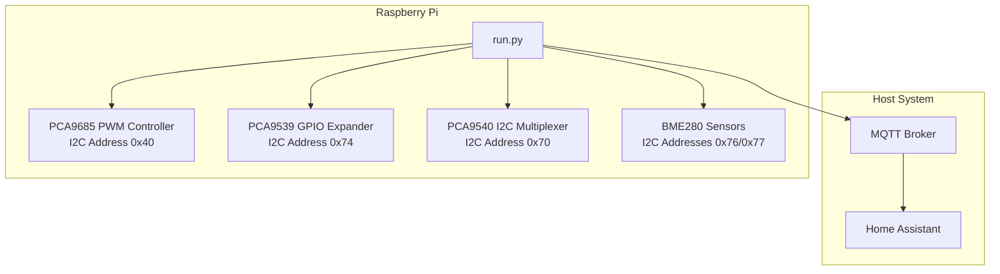
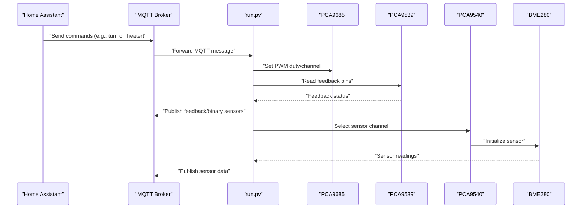
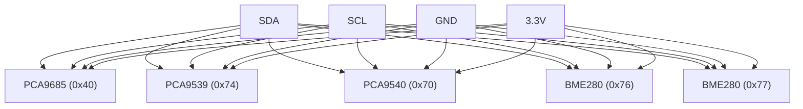
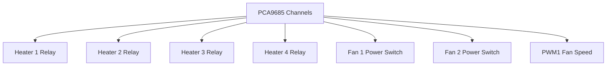
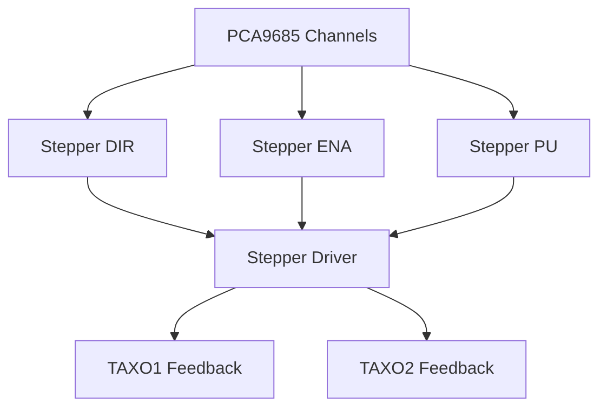
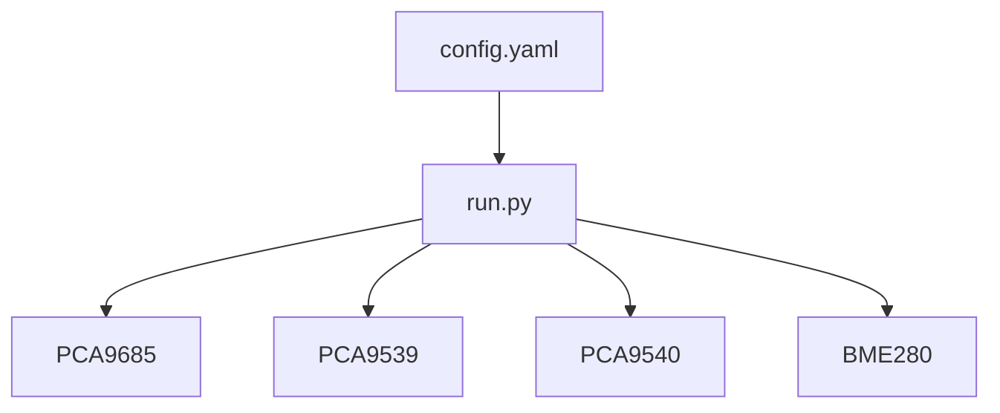

# Wiring and Connectivity

<cite>
**Referenced Files in This Document**
- [run.py](file://run.py)
- [config.yaml](file://config.yaml)
</cite>

## Table of Contents
1. [Introduction](#introduction)
2. [Project Structure](#project-structure)
3. [Core Components](#core-components)
4. [Architecture Overview](#architecture-overview)
5. [Detailed Component Analysis](#detailed-component-analysis)
6. [Dependency Analysis](#dependency-analysis)
7. [Performance Considerations](#performance-considerations)
8. [Troubleshooting Guide](#troubleshooting-guide)
9. [Conclusion](#conclusion)

## Introduction
This document provides comprehensive wiring and connectivity guidance for the PCA9685 PWM controller system. It covers I2C bus configuration, PCA9685 PWM output connections to relays, fans, heaters, and stepper motors, PCA9539 feedback input monitoring, and practical wiring diagrams. Safety considerations, signal routing, and troubleshooting guidance are included to ensure reliable operation.

## Project Structure
The project consists of a Python service that controls hardware via I2C and MQTT. The primary runtime script initializes PCA9685, PCA9539, and optional PCA9540 multiplexer, manages PWM outputs, and publishes feedback to Home Assistant via MQTT discovery.

**Diagram sources**
- [run.py:571-630](file://run.py#L571-L630)
- [config.yaml:32-34](file://config.yaml#L32-L34)

**Section sources**
- [run.py:571-630](file://run.py#L571-L630)
- [config.yaml:32-34](file://config.yaml#L32-L34)

## Core Components
- PCA9685: 16-channel 12-bit PWM controller operating at configurable frequency. Channels 0-15 are mapped to specific functions (relays, fans, steppers, LEDs).
- PCA9539: 16-bit I2C GPIO expander used for feedback monitoring of relays, stepper signals, and reserved inputs.
- PCA9540: 1-of-2 I2C multiplexer enabling multiple BME280 sensors on the same bus.
- BME280: Environmental sensors (temperature, pressure, humidity) connected via PCA9540 multiplexer.

Key channel assignments:
- Channel 0: PWM1 (Fan 1 speed control)
- Channels 1-4: Heaters 1-4
- Channels 5-6: Fans 1-2 power
- Channel 7: Stepper DIR
- Channel 8: Stepper ENA
- Channel 9: Stepper PU (pulse enable)
- Channels 10-15: Reserved/Special functions (including system LED)

Feedback mapping:
- Relays 1-6 mapped to PCA9539 pins 0-5
- Stepper ENA/DIR/PU mapped to PCA9539 pins 8-10
- TAXO1/TAXO2 monitoring via pins 11-12

**Section sources**
- [run.py:266-281](file://run.py#L266-L281)
- [run.py:934-944](file://run.py#L934-L944)
- [run.py:930-949](file://run.py#L930-L949)

## Architecture Overview
The system uses I2C for device communication and MQTT for Home Assistant integration. PCA9685 generates PWM signals for loads, while PCA9539 monitors feedback conditions. PCA9540 enables multiple sensor channels.

**Diagram sources**
- [run.py:1709-1738](file://run.py#L1709-L1738)
- [run.py:606-624](file://run.py#L606-L624)
- [run.py:673-798](file://run.py#L673-L798)

## Detailed Component Analysis

### I2C Bus Configuration
- Bus selection: Configurable via configuration option; defaults to bus 1.
- Device addresses:
  - PCA9685: 0x40 (configurable)
  - PCA9539: 0x74 (configurable)
  - PCA9540: 0x70 (configurable)
- Pull-up resistors: Required on SDA and SCL lines; typical 4.7 kΩ to 10 kΩ for 100 kHz/400 kHz modes.
- Bus speed: The PCA9685 sets its internal oscillator frequency; ensure host I2C speed matches sensor requirements (typically 100 kHz or 400 kHz).

Practical wiring:
- Connect SDA and SCL to Raspberry Pi pins according to the selected I2C bus.
- Place pull-up resistors near the PCA9685 and PCA9539 devices.
- Keep traces short and avoid routing near noisy digital signals.

**Section sources**
- [config.yaml:35](file://config.yaml#L35)
- [config.yaml:32-34](file://config.yaml#L32-L34)
- [run.py:40-46](file://run.py#L40-L46)

### PCA9685 PWM Outputs and Load Wiring
Channel-to-load mapping:
- Channel 0 (PWM1): Fan 1 speed control; connect to fan PWM input.
- Channels 1-4: Heaters 1-4; connect to relay coil or gate driver.
- Channels 5-6: Fans 1-2 power; connect to fan power switches.
- Channel 7 (DIR): Stepper direction control.
- Channel 8 (ENA): Stepper enable control.
- Channel 9 (PU): Stepper pulse generation (active-high).
- Channels 10-15: Reserved/special functions.

Load considerations:
- Relays: Use flyback diodes across relay coils; ensure coil voltage matches logic level (or use optocoupler/gate driver).
- Fans: PWM fan controllers typically accept 100 Hz to several kHz; verify device specifications.
- Heaters: Use appropriate contactors or SSRs; ensure current rating exceeds load.
- Stepper motors: Connect DIR/ENA/PU to PCA9685 outputs; ensure driver receives correct logic levels.

Current limiting:
- Use series resistors or current-limiting circuits if driving LEDs or small loads directly.
- For high-current loads, use external drivers or relays.

**Section sources**
- [run.py:266-281](file://run.py#L266-L281)
- [run.py:950-991](file://run.py#L950-L991)

### PCA9539 Feedback Inputs
Feedback pin mapping:
- Relays 1-6: Pins 0-5 (active-low logic for relays)
- Stepper ENA/DIR/PU: Pins 8-10 (active-high logic for PCA9685 outputs)
- TAXO1/TAXO2: Pins 11-12 (monitoring inputs)

Feedback verification:
- The system validates expected vs. actual states for relays and stepper signals.
- For relays, logic is inverted: LOW indicates ON, HIGH indicates OFF.
- For ENA/DIR/PU, HIGH indicates ON, LOW indicates OFF.

Wiring tips:
- Connect feedback lines from relay NC/NO contacts or driver outputs to PCA9539 pins.
- Ensure pull-up/pull-down resistors match logic levels if required by the hardware interface.

**Section sources**
- [run.py:934-944](file://run.py#L934-L944)
- [run.py:950-991](file://run.py#L950-L991)
- [run.py:673-798](file://run.py#L673-L798)

### BME280 Sensor Connections via PCA9540
Sensor configuration:
- PCA9540 multiplexer selects sensor channels 0 and 1.
- Sensors at addresses 0x76 and 0x77 are supported.
- Temperature, pressure, and humidity are published to MQTT topics.

Wiring:
- Connect SDA/SCL from PCA9540 to sensors.
- Use separate channels for multiple sensors to avoid conflicts.

**Section sources**
- [run.py:606-624](file://run.py#L606-L624)
- [run.py:822-873](file://run.py#L822-L873)

### Practical Wiring Diagrams

#### I2C Bus Layout

**Diagram sources**
- [config.yaml:32-34](file://config.yaml#L32-L34)
- [run.py:606-624](file://run.py#L606-L624)

#### PWM Output Wiring (Relays/Fans/Heaters)

**Diagram sources**
- [run.py:266-281](file://run.py#L266-L281)

#### Stepper Motor Wiring

**Diagram sources**
- [run.py:930-949](file://run.py#L930-L949)

## Dependency Analysis
The system depends on I2C device initialization order and proper configuration of addresses and bus selection. PCA9539 feedback relies on correct wiring and logic inversion for relays.

**Diagram sources**
- [config.yaml:32-34](file://config.yaml#L32-L34)
- [run.py:571-630](file://run.py#L571-L630)

**Section sources**
- [config.yaml:32-34](file://config.yaml#L32-L34)
- [run.py:571-630](file://run.py#L571-L630)

## Performance Considerations
- PWM frequency: Configurable up to 1526 Hz; lower frequencies reduce audible noise for fans/heaters.
- I2C speed: Ensure host I2C speed matches sensor requirements; 400 kHz is commonly used.
- Feedback polling: PCA9539 worker runs at 1 Hz intervals; adjust timing for real-time requirements.
- Thermal monitoring: BME280 reads occur at configured intervals; balance responsiveness with bus utilization.

[No sources needed since this section provides general guidance]

## Troubleshooting Guide

Common wiring issues:
- No PCA9685 response: Verify I2C bus selection and address; check pull-up resistors.
- PCA9539 not responding: Confirm address and wiring; ensure proper ground connection.
- Feedback mismatches: Check relay logic inversion and correct pin mapping.

Signal integrity:
- Use short, twisted pairs for sensitive feedback lines (TAXO1/TAXO2).
- Avoid routing I2C near high-frequency switching circuits.

Component protection:
- Install flyback diodes across relay coils.
- Use appropriate current-limiting for LEDs and small loads.
- Ensure proper grounding and common return paths.

Diagnostic steps:
- Run hardware diagnostic routine to verify relay and stepper functionality.
- Monitor feedback topics in MQTT for real-time status updates.
- Check system status LED behavior and error indicators.

**Section sources**
- [run.py:369-458](file://run.py#L369-L458)
- [run.py:673-798](file://run.py#L673-L798)

## Conclusion
This documentation outlines the complete wiring and connectivity requirements for the PCA9685-based control system. By following the I2C configuration guidelines, proper load wiring practices, and feedback monitoring procedures, you can achieve reliable operation of relays, fans, heaters, and stepper motors. Use the provided diagrams and troubleshooting guidance to ensure correct installation and ongoing maintenance.