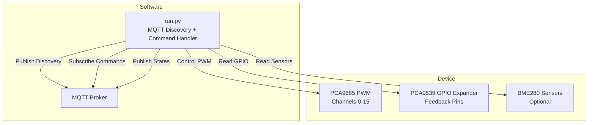
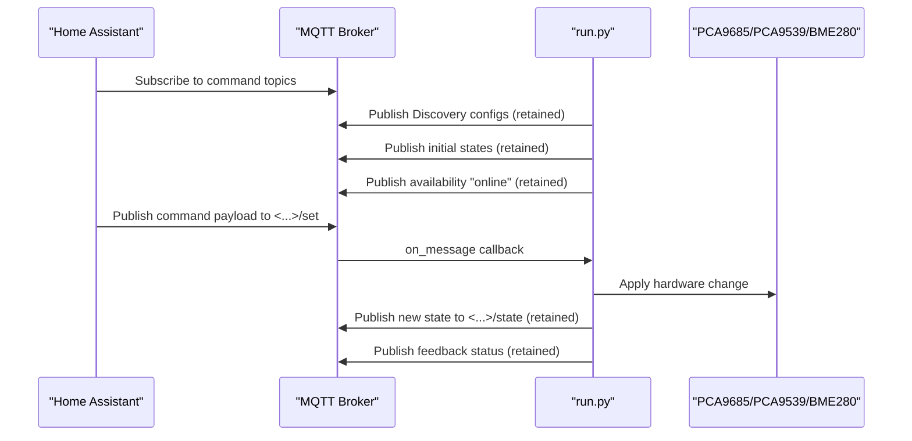
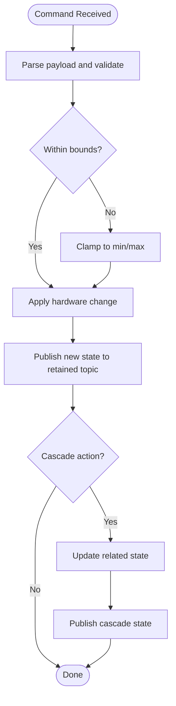
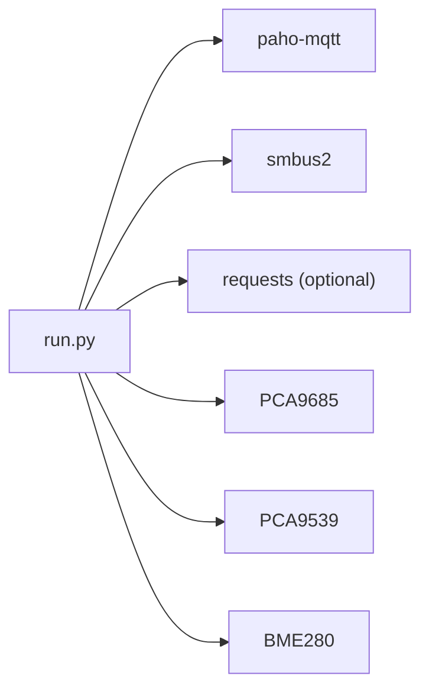

# Home Assistant Integration

<cite>
**Referenced Files in This Document**
- [run.py](file://run.py)
- [config.yaml](file://config.yaml)
- [Dockerfile](file://Dockerfile)
</cite>

## Table of Contents
1. [Introduction](#introduction)
2. [Project Structure](#project-structure)
3. [Core Components](#core-components)
4. [Architecture Overview](#architecture-overview)
5. [Detailed Component Analysis](#detailed-component-analysis)
6. [Dependency Analysis](#dependency-analysis)
7. [Performance Considerations](#performance-considerations)
8. [Troubleshooting Guide](#troubleshooting-guide)
9. [Conclusion](#conclusion)
10. [Appendices](#appendices)

## Introduction
This document explains how the PCA9685 PWM controller integrates with Home Assistant using MQTT Discovery. It covers automatic entity creation for switches, numbers, selects, sensors, and binary sensors; bidirectional communication patterns for commands and state synchronization; availability tracking and deep clean functionality; topic structure and unique identifiers; entity configuration including device classes and units; integration workflow from setup to operation; troubleshooting; security considerations; and performance optimization for large deployments.

## Project Structure
The integration consists of a single Python service that:
- Initializes PCA9685, PCA9539, and optional BME280 sensors via I2C
- Connects to an MQTT broker and publishes MQTT Discovery configurations
- Subscribes to command topics to control actuators and sensors
- Publishes sensor readings and feedback status
- Manages availability and optional deep clean of orphaned topics

**Diagram sources**
- [run.py:570-586](file://run.py#L570-L586)
- [run.py:1250-1257](file://run.py#L1250-L1257)
- [run.py:1647-1674](file://run.py#L1647-L1674)
- [run.py:1709-1739](file://run.py#L1709-L1739)

**Section sources**
- [run.py:570-586](file://run.py#L570-L586)
- [run.py:1250-1257](file://run.py#L1250-L1257)
- [run.py:1647-1674](file://run.py#L1647-L1674)
- [run.py:1709-1739](file://run.py#L1709-L1739)

## Core Components
- PCA9685 PWM controller: drives up to 16 channels with configurable frequency and duty cycle
- PCA9539 GPIO expander: reads feedback signals for relays, stepper enable/dir, and sensors
- BME280 sensors: optional temperature/humidity/pressure readings via I2C multiplexer
- MQTT Discovery publisher: advertises entities to Home Assistant
- Command handler: processes incoming commands and updates hardware state
- Availability manager: sets online/offline status and supports deep clean

Key runtime configuration is loaded from options and supervisor APIs when available.

**Section sources**
- [run.py:61-110](file://run.py#L61-L110)
- [run.py:111-137](file://run.py#L111-L137)
- [run.py:162-264](file://run.py#L162-L264)
- [run.py:284-311](file://run.py#L284-L311)

## Architecture Overview
The system follows a publish-subscribe pattern:
- Discovery: publish retained configs under homeassistant/<component>/<unique_id>/config
- Commands: subscribe to <state_topic> for current state and <command_topic>/set for updates
- States: publish retained state updates to <state_topic>
- Availability: publish online/offline to a central availability topic

**Diagram sources**
- [run.py:1647-1674](file://run.py#L1647-L1674)
- [run.py:1709-1739](file://run.py#L1709-L1739)
- [run.py:1746-1883](file://run.py#L1746-L1883)

## Detailed Component Analysis

### MQTT Discovery Protocol and Topic Structure
- Base topic: homeassistant/<component>/<unique_id>/<suffix>
- Suffixes:
  - config: retained discovery configuration
  - state: retained current state
  - set: command topic for updates
- Unique identifiers group related entities (e.g., pca_pwm1_duty, pca_heater_1, bme280_ch0_0x76_temperature)
- Device grouping: entities are associated with logical devices (e.g., Fans Control, Heaters, Stepper Control)

Entity categories and representative topics:
- Numbers: duty cycles for fans, frequency for pulse generator
- Switches: power relays, stepper enable, pulse enable
- Selects: stepper direction
- Sensors: temperature, humidity, pressure
- Binary sensors: hardware feedback status

Availability:
- Central availability topic is published by the service and retained
- Entities reference this availability topic for online/offline status

Deep Clean:
- Optional deep clean scans for topics with known prefixes and clears them
- After cleaning, publishes current discovery again

**Section sources**
- [run.py:461-531](file://run.py#L461-L531)
- [run.py:1310-1624](file://run.py#L1310-L1624)
- [run.py:1627-1707](file://run.py#L1627-L1707)
- [run.py:1671-1673](file://run.py#L1671-L1673)

### Bidirectional Communication Patterns
- Command processing:
  - Parse payload and clamp to configured bounds
  - Apply hardware changes atomically
  - Publish new state back to retained state topic
  - Some commands trigger cascading state updates (e.g., enabling fan power when speed > 0)
- State synchronization:
  - Hardware feedback loop uses PCA9539 to verify relay/stepper states and detect anomalies
  - Feedback topics publish problem/no-problem status
  - LED indicator and system LED reflect operational status

**Diagram sources**
- [run.py:1746-1883](file://run.py#L1746-L1883)
- [run.py:673-798](file://run.py#L673-L798)

**Section sources**
- [run.py:1746-1883](file://run.py#L1746-L1883)
- [run.py:673-798](file://run.py#L673-L798)

### Entity Configuration Details
- Numbers:
  - Fan duty cycles: percentage, slider mode, unit “%”
  - Pulse frequency: unit “Hz”, slider mode
- Switches:
  - Payloads “ON”/“OFF”
- Selects:
  - Options “CW”/“CCW”
- Sensors:
  - Temperature: device class “temperature”, unit “°C”
  - Humidity: device class “humidity”, unit “%”
  - Pressure: device class “pressure”, unit “hPa”
- Binary sensors:
  - Device class “problem” for feedback status

Device association:
- Entities are grouped into devices (Fans, Heaters, Stepper Control, GPIO Feedback, BME280 instances) for better organization in Home Assistant.

**Section sources**
- [run.py:1310-1624](file://run.py#L1310-L1624)
- [run.py:1259-1308](file://run.py#L1259-L1308)

### Availability Tracking and Deep Clean
- Online/offline:
  - Published retained to the availability topic upon connection and shutdown
  - Reconnected sessions re-publish online
- Deep clean:
  - Optional scanning of topics with known prefixes
  - Clears discovered and ghost topics
  - Resubmits current discovery after cleaning

**Section sources**
- [run.py:1671-1673](file://run.py#L1671-L1673)
- [run.py:1709-1739](file://run.py#L1709-L1739)
- [run.py:1676-1707](file://run.py#L1676-L1707)

### Integration Workflow
- Setup:
  - Configure MQTT host/port/credentials and I2C addresses
  - Deploy containerized service with required kernel modules and permissions
- Discovery:
  - Service connects to broker, publishes discovery and initial states
  - Home Assistant creates entities automatically
- Operation:
  - Users control entities; service applies commands and publishes states
  - Feedback topics indicate hardware status
- Shutdown:
  - Service sets offline, stops threads, and disconnects cleanly

**Section sources**
- [config.yaml:27-41](file://config.yaml#L27-L41)
- [Dockerfile:1-15](file://Dockerfile#L1-L15)
- [run.py:1946-1960](file://run.py#L1946-L1960)
- [run.py:1647-1674](file://run.py#L1647-L1674)

## Dependency Analysis
- External libraries:
  - paho-mqtt: MQTT client
  - smbus2: I2C access
  - requests: optional supervisor API integration
- Internal modules:
  - PCA9685, PCA9539, BME280 classes encapsulate hardware operations
  - Threading-based workers for feedback, sensors, and indicators
  - Signal handlers for graceful shutdown

**Diagram sources**
- [Dockerfile:8-11](file://Dockerfile#L8-L11)
- [run.py:20-21](file://run.py#L20-L21)
- [run.py:61-110](file://run.py#L61-L110)
- [run.py:111-137](file://run.py#L111-L137)
- [run.py:162-264](file://run.py#L162-L264)

**Section sources**
- [Dockerfile:8-11](file://Dockerfile#L8-L11)
- [run.py:20-21](file://run.py#L20-L21)
- [run.py:61-110](file://run.py#L61-L110)
- [run.py:111-137](file://run.py#L111-L137)
- [run.py:162-264](file://run.py#L162-L264)

## Performance Considerations
- Minimize I2C contention:
  - Use a shared bus with a lock around register writes
- Reduce MQTT traffic:
  - Publish only when state changes
  - Use retained messages for states and discovery
- Limit polling:
  - Use dedicated worker threads with controlled intervals
- Optimize sensor reads:
  - Batch reads and avoid unnecessary channel switching
- Concurrency:
  - Guard shared state with locks (e.g., PWM values, pulse generator state)
- Scalability:
  - For many entities, prefer retained discovery and avoid frequent re-publication
  - Consider reducing feedback polling intervals if not critical

[No sources needed since this section provides general guidance]

## Troubleshooting Guide
Common issues and resolutions:
- Discovery failures:
  - Verify MQTT broker connectivity and credentials
  - Confirm availability topic is reachable and retained
  - Check that discovery configs are published to retained topics
- Connectivity problems:
  - Ensure broker is reachable from the service container
  - Validate authentication and TLS settings if required
- Entity state synchronization:
  - Check PCA9539 feedback topics for “problem” status
  - Review logs for verification failures when applying switch commands
- Deep clean not clearing orphaned entities:
  - Confirm deep clean option is enabled
  - Ensure topic prefixes match expected patterns
- Hardware diagnostics:
  - Run diagnostic routine to verify relays, steppers, and pulse feedback

Operational checks:
- Confirm PCA9685 initialization and frequency setting
- Verify I2C addresses and wiring for PCA9539 and BME280
- Monitor system LED and LED indicator behavior

**Section sources**
- [run.py:1709-1739](file://run.py#L1709-L1739)
- [run.py:1676-1707](file://run.py#L1676-L1707)
- [run.py:369-458](file://run.py#L369-L458)
- [run.py:570-586](file://run.py#L570-L586)
- [run.py:588-604](file://run.py#L588-L604)

## Conclusion
The PCA9685 PWM controller integrates seamlessly with Home Assistant via MQTT Discovery. It provides robust bidirectional control for fans, heaters, steppers, and sensors, with hardware feedback and availability tracking. Optional deep clean helps maintain a tidy MQTT namespace. With proper configuration and monitoring, the system offers reliable automation support for diverse applications.

[No sources needed since this section summarizes without analyzing specific files]

## Appendices

### Security Considerations
- Authentication:
  - Configure MQTT username/password in options
  - Prefer secure broker with TLS if applicable
- Network isolation:
  - Run in a restricted network segment
  - Limit exposed ports and services
- Least privilege:
  - Use minimal required capabilities in container
  - Restrict I2C access to necessary devices

**Section sources**
- [config.yaml:27-41](file://config.yaml#L27-L41)
- [Dockerfile:1-15](file://Dockerfile#L1-L15)

### Example Home Assistant Automations and Scripts
- Auto-enable fan power when speed > 0:
  - Trigger: fan speed set
  - Action: turn on fan power switch
- Auto-adjust speed when power toggles:
  - Trigger: fan power switch toggled
  - Action: set speed to default or zero accordingly
- Pulse enable/disable:
  - Trigger: pulse enable toggle
  - Action: start/stop pulse worker and publish state
- Stepper direction change:
  - Trigger: select direction
  - Action: safely disable pulses, change direction, resume pulses if enabled

[No sources needed since this section provides general guidance]

### Configuration Reference
- MQTT:
  - Host, Port, Username, Password
- I2C:
  - PCA address, PCA9539 address, PCA9540 address, bus number
- Behavior:
  - PCA frequency, default duty cycle, pulse unit default frequency
  - BME read interval, LED indicator interval
  - Deep clean flag

**Section sources**
- [config.yaml:27-41](file://config.yaml#L27-L41)
- [config.yaml:42-57](file://config.yaml#L42-L57)