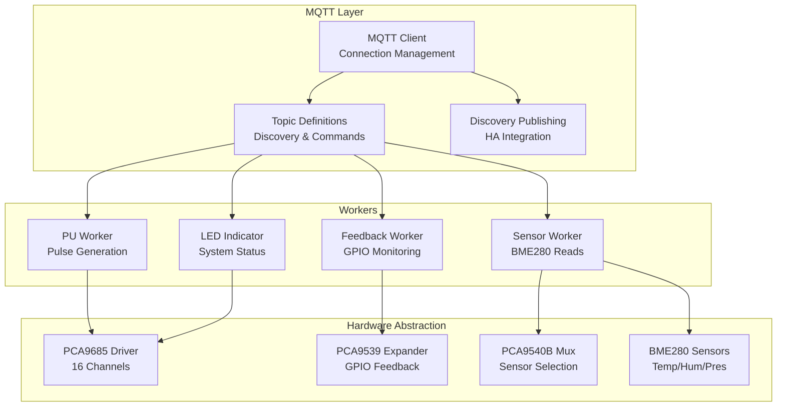
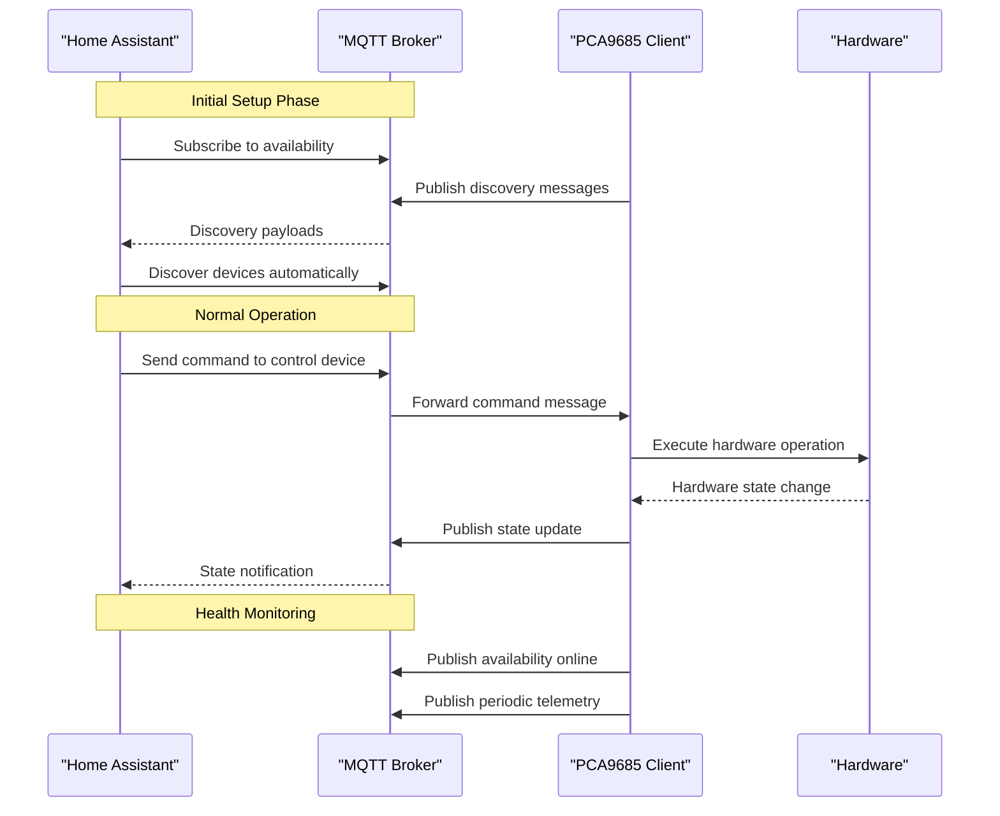
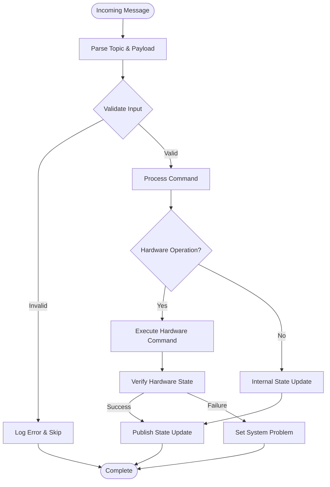
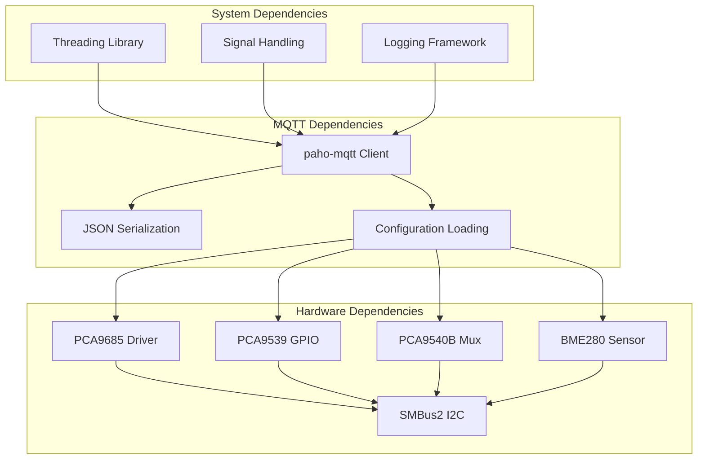

# MQTT Communication

<cite>
**Referenced Files in This Document**
- [run.py](file://run.py)
- [config.yaml](file://config.yaml)
</cite>

## Table of Contents
1. [Introduction](#introduction)
2. [Project Structure](#project-structure)
3. [Core Components](#core-components)
4. [Architecture Overview](#architecture-overview)
5. [Detailed Component Analysis](#detailed-component-analysis)
6. [Dependency Analysis](#dependency-analysis)
7. [Performance Considerations](#performance-considerations)
8. [Troubleshooting Guide](#troubleshooting-guide)
9. [Conclusion](#conclusion)
10. [Appendices](#appendices)

## Introduction
This document provides comprehensive MQTT communication documentation for the PCA9685 PWM controller system. It covers the complete MQTT topic structure, command processing workflows, state publishing mechanisms, Home Assistant discovery integration, connection management, message serialization formats, troubleshooting procedures, security considerations, and performance optimization techniques.

The system integrates a PCA9685 16-channel 12-bit PWM driver with optional PCA9539 GPIO expander and BME280 environmental sensors, exposing controls and telemetry via MQTT with Home Assistant Discovery protocol support.

## Project Structure
The MQTT implementation is primarily contained within a single Python script that manages:
- Hardware abstraction layers for PCA9685, PCA9539, PCA9540B, and BME280
- MQTT client configuration and lifecycle management
- Topic definitions and discovery message publishing
- Command processing and state publication workflows
- Background worker threads for sensor and feedback monitoring



**Diagram sources**
- [run.py:1250-1285](file://run.py#L1250-L1285)
- [run.py:1310-1624](file://run.py#L1310-L1624)

**Section sources**
- [run.py:1250-1285](file://run.py#L1250-L1285)
- [run.py:1310-1624](file://run.py#L1310-L1624)

## Core Components
The MQTT system consists of several interconnected components that handle different aspects of the communication pipeline:

### Topic Structure Organization
The system uses a hierarchical topic structure following Home Assistant MQTT Discovery conventions:
- Base path: `homeassistant/{component}/{unique_id}/{suffix}`
- Components: switches, numbers, selects, sensors, binary_sensors
- Suffixes: `set` (commands), `state` (telemetry), `config` (discovery)

### Device Groupings
The system organizes hardware into logical device groups:
- **Stepper Control**: Direction, enable, pulse generation controls
- **Heaters**: Four independent heating elements
- **Fans Control**: Two fan power and speed controls
- **Status LEDs**: RGB status indication
- **GPIO Feedback**: Hardware feedback monitoring
- **BME280 Sensors**: Environmental measurements

**Section sources**
- [run.py:461-531](file://run.py#L461-L531)
- [run.py:1259-1308](file://run.py#L1259-L1308)

## Architecture Overview
The MQTT architecture implements a publish-subscribe pattern with bidirectional communication:



**Diagram sources**
- [run.py:1709-1739](file://run.py#L1709-L1739)
- [run.py:1746-1883](file://run.py#L1746-L1883)
- [run.py:1647-1673](file://run.py#L1647-L1673)

## Detailed Component Analysis

### Topic Structure and Hierarchical Organization
The system defines comprehensive topic hierarchies for different device categories:

#### Switch Controls (Relays and Power)
- **Heater Controls**: `homeassistant/switch/pca_heater_{1-4}/set` and `/state`
- **Fan Power Controls**: `homeassistant/switch/pca_fan_{1-2}_power/set` and `/state`
- **Stepper Enable**: `homeassistant/switch/pca_stepper_ena/set` and `/state`
- **PU Enable**: `homeassistant/switch/pca_pu_enable/set` and `/state`

#### Numeric Controls (Duty Cycles and Frequencies)
- **Fan Speed Controls**: `homeassistant/number/pca_pwm{1-2}_duty/set` and `/state`
- **PU Frequency**: `homeassistant/number/pca_pu_freq_hz/set` and `/state`

#### Select Controls (Direction)
- **Stepper Direction**: `homeassistant/select/pca_stepper_dir/set` and `/state`

#### Sensor Telemetry
- **Temperature Sensors**: `homeassistant/sensor/bme280_ch{0,1}_0x76/_0x77_temperature/state`
- **Humidity Sensors**: `homeassistant/sensor/bme280_ch{0,1}_0x76/_0x77_humidity/state`
- **Pressure Sensors**: `homeassistant/sensor/bme280_ch{0,1}_0x76/_0x77_pressure/state`
- **GPIO Inputs**: `homeassistant/sensor/pca9539_inputs/state`

#### Binary Sensor Feedback
- **Hardware Status**: `homeassistant/binary_sensor/status_{taxo1,taxo2,ena,dir,pu}/state`
- **Relay Feedback**: `homeassistant/binary_sensor/status_relay{1-6}/state`
- **Reserve Pins**: `homeassistant/binary_sensor/status_res{2-4}/state`

**Section sources**
- [run.py:469-531](file://run.py#L469-L531)
- [run.py:501-531](file://run.py#L501-L531)

### Command Processing Workflows
The system implements robust command processing with validation and hardware execution:



**Diagram sources**
- [run.py:1746-1883](file://run.py#L1746-L1883)
- [run.py:950-991](file://run.py#L950-L991)

#### Command Validation and Execution
Each command undergoes strict validation:
- **Numeric Commands**: Range validation (0-100% for duty cycles, 0-500Hz for frequency)
- **Boolean Commands**: Payload conversion ("ON"/"OFF" to boolean)
- **Direction Commands**: Enum validation (CW/CCW)
- **Hardware Verification**: Post-execution feedback verification

#### Specialized Processing Logic
- **Auto-power Synchronization**: Fan power automatically enables when speed > 0%
- **Speed-to-Power Sync**: Power state updates when speed changes
- **Safe Direction Changes**: Stepper direction changes with pulse generation safety
- **Default Duty Cycle**: Automatic power restoration to configured percentage

**Section sources**
- [run.py:1782-1883](file://run.py#L1782-L1883)
- [run.py:950-991](file://run.py#L950-L991)

### State Publishing Mechanisms
The system implements multiple state publishing strategies:

#### Periodic Updates
- **BME280 Sensors**: Configurable interval (default 30 seconds)
- **GPIO Inputs**: On-change notifications with raw and hex formats
- **System Status**: LED indicator with configurable intervals

#### On-Change Notifications
- **Hardware Feedback**: Immediate state changes when GPIO readings differ
- **Problem Detection**: Real-time problem status updates
- **Sensor Readings**: Publish only when measurements change

#### Retained Message Handling
- **Discovery Messages**: Retained for persistent device registration
- **State Messages**: Retained for immediate state visibility upon subscription
- **Availability**: Retained to indicate system health

**Section sources**
- [run.py:822-874](file://run.py#L822-L874)
- [run.py:695-797](file://run.py#L695-L797)
- [run.py:1647-1673](file://run.py#L1647-L1673)

### Home Assistant Discovery Integration
The system provides comprehensive Home Assistant Discovery support:

#### Discovery Message Format
Each entity publishes a JSON configuration message containing:
- **Basic Metadata**: name, unique_id, device information
- **Command/State Topics**: Topic definitions for bidirectional communication
- **Entity-Specific Properties**: min/max values, units, options, device classes
- **Availability**: Integration with system availability topic

#### Device Grouping
Entities are organized into logical device groups:
- **PCA9685 Stepper Control**: Direction, enable, pulse generation
- **PCA9685 Heaters**: Four independent heating elements
- **PCA9685 Fans Control**: Two fan power and speed controls
- **PCA9539 GPIO Feedback**: Hardware status monitoring
- **BME280 Sensors**: Environmental measurements

#### Dynamic Initial States
Some entities require dynamic initial state publishing:
- **Stepper Direction**: Published based on current direction setting
- **PU Frequency**: Published based on current frequency setting

**Section sources**
- [run.py:1310-1624](file://run.py#L1310-L1624)
- [run.py:1647-1673](file://run.py#L1647-L1673)

### Connection Management
The system implements robust connection management:

#### Broker Authentication
- **Username/Password**: Configurable credentials from configuration
- **Environment Integration**: Supervisor token-based configuration retrieval
- **Fallback Mechanisms**: Graceful handling of authentication failures

#### Keep-Alive and Reconnection
- **Connection Retry**: Exponential backoff up to 10 attempts
- **Reconnection Strategy**: Automatic reconnection when disconnected
- **Graceful Shutdown**: Proper cleanup of all resources on termination

#### Availability Management
- **Online/Offline States**: Retained availability messages
- **Deep Clean Mode**: Optional cleanup of orphaned topics
- **Ghost Topic Detection**: Comprehensive topic scanning during deep clean

**Section sources**
- [run.py:1255-1256](file://run.py#L1255-L1256)
- [run.py:1947-1960](file://run.py#L1947-L1960)
- [run.py:1709-1739](file://run.py#L1709-L1739)

### Message Serialization Formats
The system uses standardized message formats:

#### JSON Payload Structures
- **Discovery Messages**: Complete entity configuration as JSON
- **Sensor Data**: Numeric values with appropriate decimal precision
- **GPIO Status**: JSON objects with raw and hex representations

#### State Value Encoding
- **Numeric Values**: Integer percentages for duty cycles
- **Frequency Values**: Integer Hertz values
- **Boolean Values**: "ON"/"OFF" string literals
- **Enum Values**: "CW"/"CCW" direction indicators

#### Topic Naming Conventions
- **Component Types**: lowercase entity types (switch, number, select, sensor, binary_sensor)
- **Unique Identifiers**: Descriptive unique_id values
- **Suffixes**: Standardized suffixes (set, state, config)

**Section sources**
- [run.py:1647-1673](file://run.py#L1647-L1673)
- [run.py:835-838](file://run.py#L835-L838)

## Dependency Analysis



**Diagram sources**
- [run.py:20-21](file://run.py#L20-L21)
- [run.py:284-311](file://run.py#L284-L311)

**Section sources**
- [run.py:20-21](file://run.py#L20-L21)
- [run.py:284-311](file://run.py#L284-L311)

## Performance Considerations
The system implements several optimization techniques for efficient operation:

### Hardware Access Optimization
- **I2C Locking**: Thread-safe access to shared SMBus interface
- **Batch Operations**: Combined register writes for efficiency
- **Hardware Verification**: Minimized polling with strategic timing

### Network Optimization
- **Message Deduplication**: Only publish state changes
- **Configurable Intervals**: Adjustable sensor update frequencies
- **Efficient Topic Structure**: Minimal topic depth for optimal routing

### Memory Management
- **Thread Cleanup**: Proper resource cleanup on shutdown
- **Graceful Degradation**: Optional sensor disablement on initialization failure
- **Memory Pooling**: Reuse of data structures across operations

### Scalability Features
- **Modular Design**: Easy addition of new device types
- **Configuration Flexibility**: Runtime parameter adjustment
- **Worker Isolation**: Separate threads for different responsibilities

## Troubleshooting Guide

### MQTT Connectivity Issues
**Common Symptoms:**
- Devices not appearing in Home Assistant
- Commands not executing
- Frequent disconnections

**Diagnostic Steps:**
1. **Broker Reachability**: Verify broker hostname/port accessibility
2. **Authentication**: Check username/password credentials
3. **Network Configuration**: Confirm firewall and network isolation
4. **Connection Logs**: Review MQTT connection attempts and failures

**Resolution Procedures:**
- Verify broker service status and network connectivity
- Validate MQTT credentials in configuration
- Check for network segmentation blocking MQTT traffic
- Monitor connection retry logs for patterns

### Message Delivery Problems
**Common Symptoms:**
- Commands received but no hardware response
- State updates not reflected in Home Assistant
- Inconsistent sensor readings

**Diagnostic Steps:**
1. **Topic Verification**: Confirm correct topic formatting
2. **Payload Validation**: Check message payload structure
3. **Hardware Feedback**: Monitor GPIO feedback signals
4. **Thread Status**: Verify worker thread operation

**Resolution Procedures:**
- Validate topic definitions against published discovery
- Check payload format matches entity configuration
- Verify hardware connections and wiring
- Restart affected worker threads

### Broker Configuration Errors
**Common Symptoms:**
- Discovery messages not persisting
- Availability state not updating
- Ghost topics accumulating

**Diagnostic Steps:**
1. **Retained Messages**: Check retained message status
2. **Topic Permissions**: Verify publish/subscribe permissions
3. **Storage Limits**: Monitor broker storage utilization
4. **Deep Clean Mode**: Enable deep clean for orphaned topics

**Resolution Procedures:**
- Clear retained messages and republish discovery
- Configure proper topic permissions
- Adjust broker storage limits if needed
- Enable deep clean mode to resolve conflicts

### Hardware Integration Issues
**Common Symptoms:**
- PCA9685 initialization failures
- GPIO expander not responding
- Sensor read errors

**Diagnostic Steps:**
1. **I2C Bus Access**: Verify i2c-dev module loading
2. **Address Conflicts**: Check I2C address uniqueness
3. **Pull-up Resistors**: Verify proper pull-up configuration
4. **Power Supply**: Check adequate power delivery

**Resolution Procedures:**
- Load i2c-dev kernel module
- Verify I2C addresses are unique and correct
- Install proper pull-up resistors (4.7kΩ)
- Check power supply voltage and current capacity

**Section sources**
- [run.py:1947-1960](file://run.py#L1947-L1960)
- [run.py:573-585](file://run.py#L573-L585)
- [run.py:607-624](file://run.py#L607-L624)

## Conclusion
The PCA9685 PWM controller system provides a robust, production-ready MQTT implementation with comprehensive Home Assistant integration. The architecture balances reliability with performance through careful topic organization, efficient command processing, and comprehensive error handling.

Key strengths include:
- **Complete Discovery Integration**: Automatic device registration with Home Assistant
- **Robust Error Handling**: Graceful degradation and recovery mechanisms
- **Hardware Safety**: Verified command execution with feedback loops
- **Flexible Configuration**: Runtime parameter adjustment and modular design

The system serves as a solid foundation for industrial automation and IoT applications requiring precise PWM control and environmental monitoring capabilities.

## Appendices

### Configuration Reference
The system supports extensive runtime configuration through environment variables and supervisor integration:

**MQTT Configuration:**
- `mqtt_host`: Broker hostname (default: core-mosquitto)
- `mqtt_port`: Broker port (default: 1883)
- `mqtt_username`: Authentication username (optional)
- `mqtt_password`: Authentication password (optional)

**Hardware Configuration:**
- `pca_address`: PCA9685 I2C address (default: 0x40)
- `pca9539_address`: GPIO expander address (default: 0x74)
- `pca9540_address`: Multiplexer address (default: 0x70)
- `i2c_bus`: I2C bus number (default: 1)

**Operational Parameters:**
- `bme_interval`: Sensor update interval (default: 30 seconds)
- `pca_frequency`: PWM frequency (default: 1000 Hz)
- `default_duty_cycle`: Default fan duty cycle (default: 30%)
- `pu_default_hz`: Default pulse frequency (default: 100 Hz)

**Section sources**
- [config.yaml:28-41](file://config.yaml#L28-L41)
- [run.py:316-334](file://run.py#L316-L334)

### Advanced Usage Examples
For direct MQTT client usage and custom integrations:

**Basic Command Pattern:**
```
# Set fan 1 speed to 75%
mosquitto_pub -h broker -t "homeassistant/number/pca_pwm1_duty/set" -m "75"

# Turn on heater 1
mosquitto_pub -h broker -t "homeassistant/switch/pca_heater_1/set" -m "ON"

# Get current fan 1 speed
mosquitto_sub -h broker -t "homeassistant/number/pca_pwm1_duty/state" -v
```

**Custom Integration Pattern:**
```python
import paho.mqtt.client as mqtt
import json

def on_connect(client, userdata, flags, rc, properties):
    client.subscribe("homeassistant/#")

def on_message(client, userdata, msg):
    if msg.topic.endswith('/state'):
        data = json.loads(msg.payload)
        print(f"Device {msg.topic}: {data}")

client = mqtt.Client()
client.on_connect = on_connect
client.on_message = on_message
client.connect("localhost", 1883, 60)
client.loop_forever()
```

**Security Configuration:**
- Enable TLS encryption for broker communication
- Use strong authentication credentials
- Implement network segmentation for MQTT traffic
- Regular credential rotation and access control review