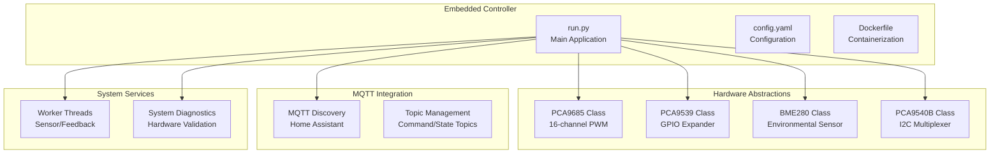
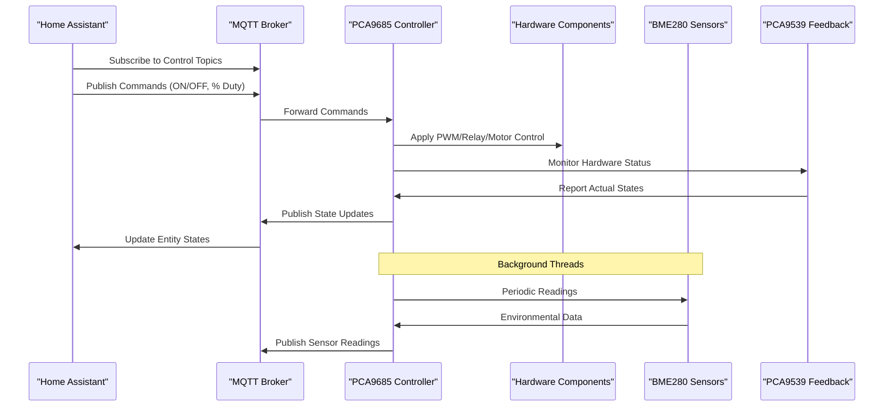
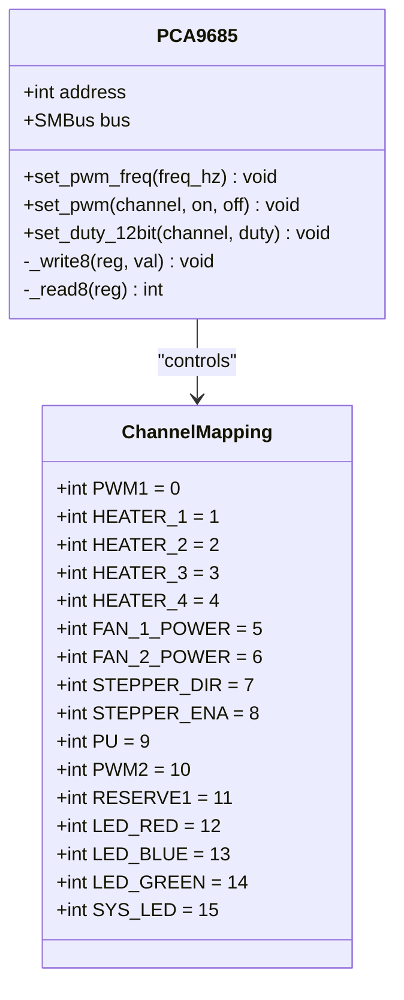
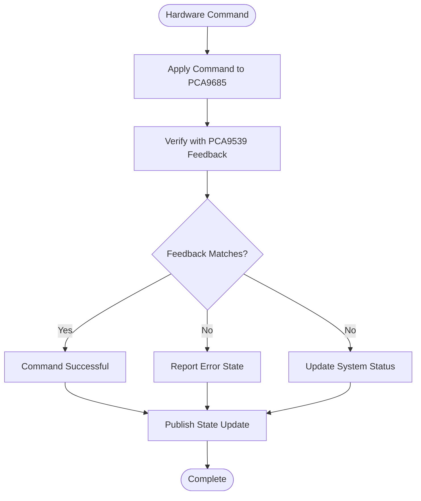
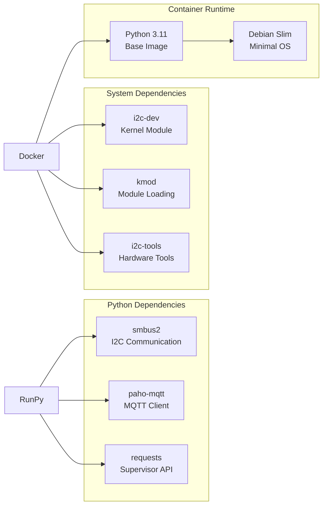

# Introduction and Purpose

<cite>
**Referenced Files in This Document**
- [run.py](file://run.py)
- [config.yaml](file://config.yaml)
- [Dockerfile](file://Dockerfile)
- [repository.yaml](file://repository.yaml)
</cite>

## Table of Contents
1. [Introduction](#introduction)
2. [Project Structure](#project-structure)
3. [Core Components](#core-components)
4. [Architecture Overview](#architecture-overview)
5. [Detailed Component Analysis](#detailed-component-analysis)
6. [Dependency Analysis](#dependency-analysis)
7. [Performance Considerations](#performance-considerations)
8. [Troubleshooting Guide](#troubleshooting-guide)
9. [Conclusion](#conclusion)

## Introduction

The PCA9685 PWM Controller for Home Assistant is an embedded IoT controller designed to bridge hardware control capabilities with Home Assistant automation through MQTT integration. This project transforms traditional hardware components—relays, motors, fans, and heaters—into smart, controllable entities within a home automation ecosystem.

### What is PWM Control?

Pulse Width Modulation (PWM) is a technique used to control power delivered to electrical devices by switching power on and off rapidly. The key concept is the **duty cycle**, which represents the percentage of time a signal is high versus low within a complete cycle. In this system:

- **12-bit duty cycle resolution**: Values range from 0 to 4095, providing fine-grained control
- **Channel mapping**: Each of the 16 PCA9685 channels can be individually configured for specific hardware functions
- **Hardware feedback**: Real-time monitoring ensures commands are executed correctly

### System Value Proposition

This controller provides a comprehensive solution for creating custom hardware control solutions in both residential and industrial automation contexts:

- **Smart Home Integration**: Seamlessly integrates with Home Assistant's MQTT Discovery protocol
- **Precise Hardware Control**: Enables fine-tuned control of motors, heaters, fans, and lighting
- **Reliability Monitoring**: Built-in hardware feedback ensures system reliability
- **Scalable Architecture**: Supports multiple sensor types and hardware configurations

### Target Use Cases

The system excels at transforming traditional hardware into intelligent automation components:

- **Temperature Control**: Heaters (4 channels) with precise power regulation through PWM duty cycle control
- **Motor Positioning**: Stepper motors with direction control, enable/disable functionality, and pulse generation
- **Environmental Monitoring**: BME280 sensors providing temperature, humidity, and pressure readings across multiple I2C channels
- **Ventilation Systems**: Fan control with speed regulation and automatic power management

## Project Structure

The project follows a modular architecture designed for embedded IoT deployment:

**Diagram sources**
- [run.py:61-160](file://run.py#L61-L160)
- [run.py:461-531](file://run.py#L461-L531)
- [run.py:1310-1624](file://run.py#L1310-L1624)

**Section sources**
- [run.py:1-50](file://run.py#L1-L50)
- [config.yaml:1-57](file://config.yaml#L1-L57)
- [Dockerfile:1-15](file://Dockerfile#L1-L15)

## Core Components

### Hardware Control Layer

The system provides four primary control domains through dedicated channel mapping:

#### PWM Control Channels
- **Channel 0 (PWM1)**: Fan 1 speed control with duty cycle regulation
- **Channel 10 (PWM2)**: Fan 2 speed control with independent duty cycle management
- **Default Duty Cycle**: Configurable percentage (default 30%) for automatic fan startup

#### Relay Control Channels
- **Channels 1-4**: Heaters 1-4 with individual control
- **Channels 5-6**: Fans 1-2 power control
- **Logic**: Low (0) = ON, High (1) = OFF for relay circuits

#### Motor Control Channels
- **Channel 7 (DIR)**: Stepper motor direction control (CW/CCW)
- **Channel 8 (ENA)**: Stepper motor enable/disable
- **Channel 9 (PU)**: Pulse generation for stepper drivers

### Sensor Integration

The system supports multiple environmental monitoring scenarios:

- **BME280 Sensors**: Temperature, humidity, and pressure measurement
- **I2C Multiplexing**: PCA9540B allows up to two sensors per channel
- **Channel Configuration**: CH0 (0x76/0x77) and CH1 (0x77) sensor placement
- **Reading Intervals**: Configurable polling intervals (default 30 seconds)

### Feedback and Diagnostics

Real-time hardware validation ensures reliable operation:

- **PCA9539 GPIO Expansion**: 16-bit input monitoring for hardware status
- **Feedback Mapping**: Direct correlation between PCA9685 channels and feedback pins
- **Diagnostic Mode**: Automated hardware testing during startup
- **Problem Detection**: Real-time monitoring of relay states, motor signals, and sensor feedback

**Section sources**
- [run.py:266-335](file://run.py#L266-L335)
- [run.py:930-949](file://run.py#L930-L949)
- [run.py:369-458](file://run.py#L369-L458)

## Architecture Overview

The system implements a multi-threaded architecture with MQTT-based communication:

**Diagram sources**
- [run.py:1709-1738](file://run.py#L1709-L1738)
- [run.py:822-873](file://run.py#L822-L873)
- [run.py:673-798](file://run.py#L673-L798)

The architecture ensures reliable operation through:

- **Thread Safety**: Lock-based access to shared resources
- **Error Recovery**: Automatic reconnection and graceful shutdown
- **State Synchronization**: Real-time feedback loops prevent desynchronization
- **Configurable Parameters**: Runtime adjustment of system behavior

## Detailed Component Analysis

### PCA9685 PWM Controller

The core PWM controller provides 16 independent channels with 12-bit resolution:

**Diagram sources**
- [run.py:61-109](file://run.py#L61-L109)
- [run.py:266-281](file://run.py#L266-L281)

### MQTT Integration and Discovery

The system implements Home Assistant MQTT Discovery protocol:

- **Entity Discovery**: Automatic registration of all control entities
- **Topic Structure**: `homeassistant/{component}/{unique_id}/{suffix}`
- **State Management**: Retained state topics for reliable entity updates
- **Availability Tracking**: Online/offline status reporting

### Hardware Feedback System

Real-time monitoring ensures hardware reliability:

**Diagram sources**
- [run.py:950-991](file://run.py#L950-L991)
- [run.py:673-798](file://run.py#L673-L798)

**Section sources**
- [run.py:61-109](file://run.py#L61-L109)
- [run.py:1310-1624](file://run.py#L1310-L1624)
- [run.py:673-798](file://run.py#L673-L798)

## Dependency Analysis

The system relies on several key dependencies for embedded IoT operation:

**Diagram sources**
- [Dockerfile:1-15](file://Dockerfile#L1-L15)
- [run.py:14-21](file://run.py#L14-L21)

The dependency structure supports:

- **Containerized Deployment**: Self-contained runtime environment
- **Hardware Access**: Direct I2C device access with appropriate permissions
- **Network Connectivity**: Reliable MQTT communication for automation integration

**Section sources**
- [Dockerfile:1-15](file://Dockerfile#L1-L15)
- [run.py:14-21](file://run.py#L14-L21)

## Performance Considerations

### PWM Resolution and Timing

The system achieves high-resolution PWM control through:

- **12-bit Precision**: 4096 discrete duty cycle levels for smooth motor and heater control
- **Frequency Configuration**: Adjustable PWM frequency (24-1526 Hz) for different load characteristics
- **Channel Independence**: Each of 16 channels operates independently without interference

### Multi-threaded Architecture Benefits

- **Non-blocking Operations**: Sensor reading, feedback monitoring, and MQTT communication run concurrently
- **Real-time Responsiveness**: Hardware commands execute immediately without blocking other operations
- **Resource Efficiency**: Thread pooling minimizes memory overhead while maintaining responsiveness

### I2C Communication Optimization

- **Shared Bus Access**: Single SMBus instance with thread-safe locking prevents conflicts
- **Multiplexer Support**: PCA9540B enables multiple sensor configurations on limited I2C lines
- **Error Recovery**: Automatic retry mechanisms handle temporary I2C bus contention

## Troubleshooting Guide

### Common Issues and Solutions

**Hardware Initialization Failures**
- Verify I2C device addresses in configuration
- Check kernel module loading (`i2c-dev`)
- Confirm physical connections and pull-up resistors

**MQTT Connection Problems**
- Validate broker credentials and network connectivity
- Check firewall settings and port accessibility
- Monitor availability topic for connection status

**Sensor Reading Errors**
- Verify I2C multiplexer channel selection timing
- Check sensor addresses (0x76/0x77) and wiring
- Monitor BME280 calibration data and initialization logs

**Feedback Monitoring Issues**
- Confirm PCA9539 GPIO expander initialization
- Verify feedback pin mappings and hardware connections
- Check relay logic levels (active-low for relays)

### Diagnostic Features

The system includes comprehensive built-in diagnostics:

- **Automated Hardware Tests**: Initial system validation during startup
- **Real-time Problem Detection**: Continuous monitoring of hardware states
- **LED Indicator System**: Visual status indication through RGB LEDs
- **System Status Tracking**: Centralized status management with error reporting

**Section sources**
- [run.py:369-458](file://run.py#L369-L458)
- [run.py:1889-1931](file://run.py#L1889-L1931)

## Conclusion

The PCA9685 PWM Controller for Home Assistant represents a sophisticated solution for bridging traditional hardware control with modern home automation ecosystems. By combining precise PWM control, comprehensive hardware feedback, and seamless MQTT integration, this system enables the creation of custom hardware control solutions that are both reliable and scalable.

The project's strength lies in its modular architecture, comprehensive error handling, and extensive configuration options. Whether controlling simple relays or complex motor systems with precise feedback, this controller provides the foundation for building intelligent, responsive automation systems that integrate seamlessly with Home Assistant's ecosystem.

Through careful attention to embedded systems programming principles, thread safety, and hardware reliability, this project demonstrates how modern software engineering practices can enhance traditional hardware control applications, making them suitable for both residential and industrial automation contexts.