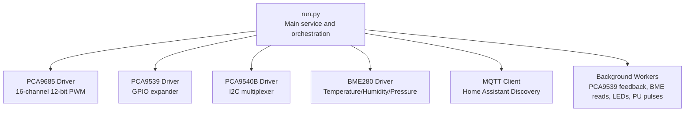
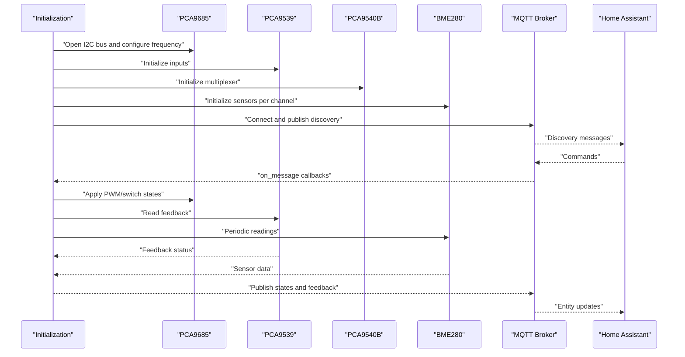
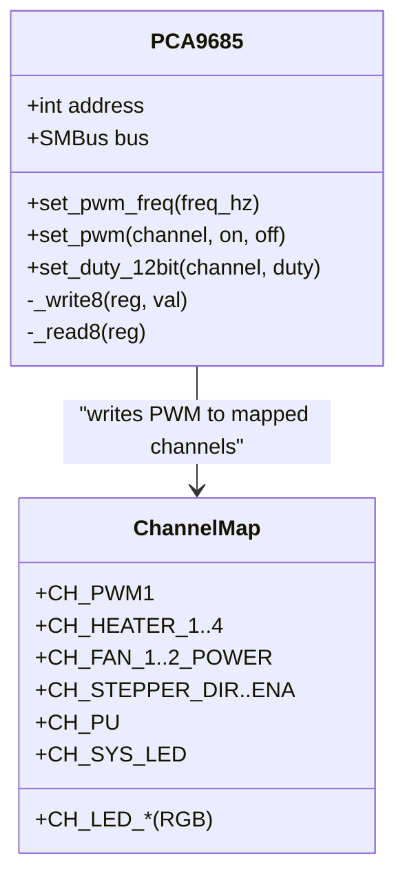
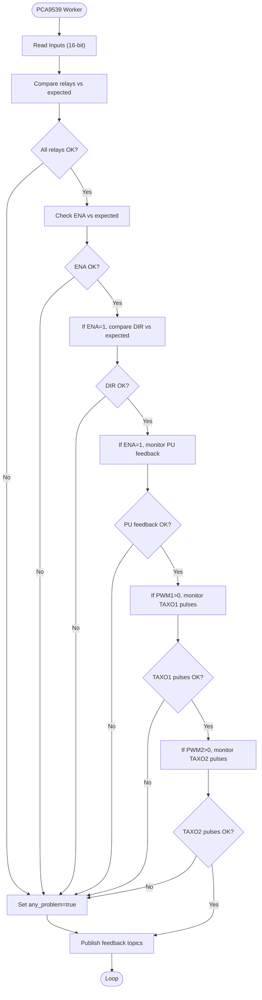
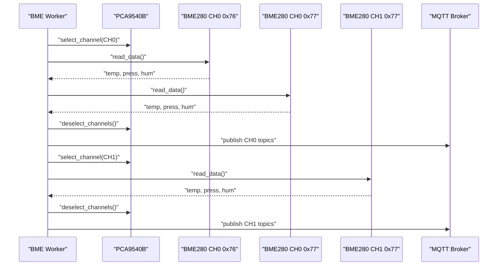
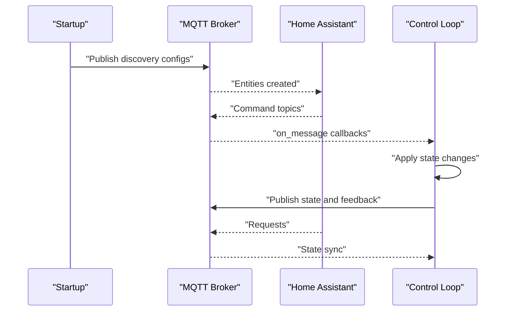
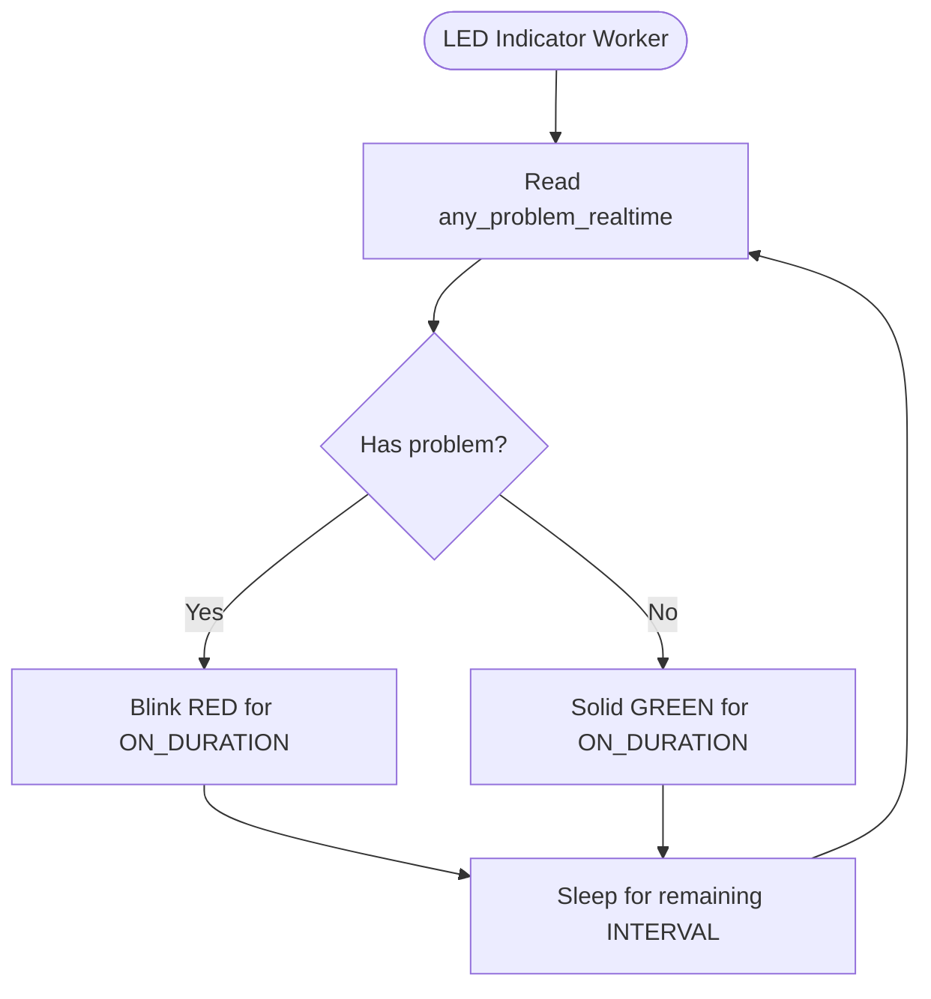
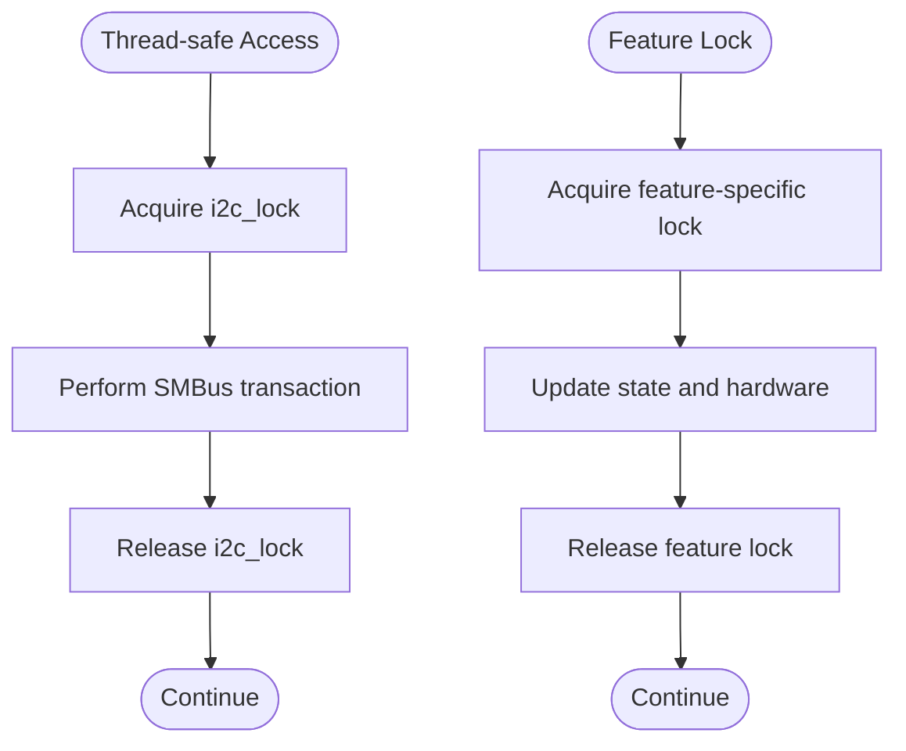
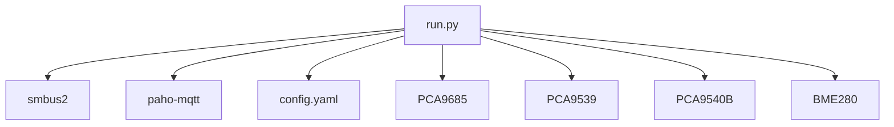

# Key Features and Capabilities

<cite>
**Referenced Files in This Document**
- [run.py](file://run.py)
- [config.yaml](file://config.yaml)
</cite>

## Table of Contents
1. [Introduction](#introduction)
2. [Project Structure](#project-structure)
3. [Core Components](#core-components)
4. [Architecture Overview](#architecture-overview)
5. [Detailed Component Analysis](#detailed-component-analysis)
6. [Dependency Analysis](#dependency-analysis)
7. [Performance Considerations](#performance-considerations)
8. [Troubleshooting Guide](#troubleshooting-guide)
9. [Conclusion](#conclusion)

## Introduction
This document explains the comprehensive capabilities of the PCA9685 PWM Controller system, focusing on:
- 16-channel PWM control with 12-bit resolution mapped to specific hardware functions
- Hardware feedback monitoring via PCA9539 GPIO expander for relays, stepper signals, and thermal feedback
- Dual BME280 environmental monitoring with PCA9540B I2C multiplexer support
- Home Assistant integration through MQTT discovery, automatic entity creation, and bidirectional command/state synchronization
- Real-time status LED indication for system health and problem detection
- Thread-safe hardware access coordination and robust error handling for production reliability

## Project Structure
The system centers around a single Python script that orchestrates hardware drivers, MQTT communication, and background workers. Configuration is supplied via a YAML file.

**Diagram sources**
- [run.py:61-160](file://run.py#L61-L160)
- [run.py:1250-1280](file://run.py#L1250-L1280)
- [run.py:1647-1674](file://run.py#L1647-L1674)

**Section sources**
- [run.py:1-120](file://run.py#L1-L120)
- [config.yaml:1-57](file://config.yaml#L1-L57)

## Core Components
- PCA9685 PWM Controller: Provides 16 channels of 12-bit PWM output at configurable frequency. Channels are mapped to specific hardware functions (e.g., PWM1 fan control, heaters 1–4, fan power control, stepper motor control, LED indication).
- PCA9539 GPIO Expander: Reads feedback from relays, stepper enable/dir, and pulse/tachometer signals to validate commanded states and detect anomalies.
- PCA9540B I2C Multiplexer: Enables selection of two sensor channels to support multiple BME280 devices on a single I2C bus.
- BME280 Sensors: Measure temperature, pressure, and humidity; calibrated and compensated using on-chip calibration registers.
- MQTT Integration: Uses Home Assistant MQTT Discovery to automatically create entities and synchronize state with commands.

**Section sources**
- [run.py:266-282](file://run.py#L266-L282)
- [run.py:111-137](file://run.py#L111-L137)
- [run.py:139-159](file://run.py#L139-L159)
- [run.py:162-264](file://run.py#L162-L264)
- [run.py:1250-1309](file://run.py#L1250-L1309)

## Architecture Overview
The system initializes hardware drivers, sets up MQTT discovery, and runs background threads for continuous monitoring and control.

**Diagram sources**
- [run.py:571-630](file://run.py#L571-L630)
- [run.py:1250-1280](file://run.py#L1250-L1280)
- [run.py:1647-1674](file://run.py#L1647-L1674)
- [run.py:1709-1739](file://run.py#L1709-L1739)
- [run.py:1746-1883](file://run.py#L1746-L1883)

## Detailed Component Analysis

### 16-Channel PWM Control with 12-bit Resolution
- Channel mapping defines dedicated functions for each of the 16 channels, including PWM1 fan control, heaters 1–4, fan power control, stepper motor control, and LED indication.
- PWM duty cycle is applied using 12-bit precision (0–4095), enabling fine-grained control of fans and heaters.
- A global PWM frequency is configured at startup; individual channels inherit this configuration.

**Diagram sources**
- [run.py:61-109](file://run.py#L61-L109)
- [run.py:266-282](file://run.py#L266-L282)

**Section sources**
- [run.py:266-282](file://run.py#L266-L282)
- [run.py:79-93](file://run.py#L79-L93)
- [run.py:94-108](file://run.py#L94-L108)

### Hardware Feedback Monitoring via PCA9539
- PCA9539 reads 16-bit input state to validate relay states, stepper enable/dir, and pulse/tachometer feedback.
- Feedback topics are published for Home Assistant, including binary sensors for relays, ENA, DIR, PU, and tachometer signals.
- A dedicated worker continuously monitors inputs and publishes status, while a real-time problem flag drives LED indicators.

**Diagram sources**
- [run.py:673-798](file://run.py#L673-L798)
- [run.py:930-949](file://run.py#L930-L949)

**Section sources**
- [run.py:111-137](file://run.py#L111-L137)
- [run.py:673-798](file://run.py#L673-L798)
- [run.py:930-949](file://run.py#L930-L949)

### Dual BME280 Environmental Monitoring with I2C Multiplexer
- Two channels are supported via PCA9540B multiplexer; sensors are initialized on CH0 (0x76 and 0x77) and CH1 (0x77).
- Each sensor is calibrated using on-chip coefficients and compensated for temperature, pressure, and humidity.
- Background worker periodically reads sensors, selects channels, and publishes data to Home Assistant topics.

**Diagram sources**
- [run.py:822-874](file://run.py#L822-L874)
- [run.py:606-625](file://run.py#L606-L625)
- [run.py:162-264](file://run.py#L162-L264)

**Section sources**
- [run.py:822-874](file://run.py#L822-L874)
- [run.py:606-625](file://run.py#L606-L625)
- [run.py:162-264](file://run.py#L162-L264)

### Home Assistant Integration via MQTT Discovery
- Automatic entity creation: The system publishes MQTT discovery payloads for switches, numbers, selects, sensors, and binary sensors.
- Bidirectional synchronization: Incoming commands update internal state and hardware; state topics reflect current values and feedback.
- Availability management: Online/offline status is published to keep integrations informed.

**Diagram sources**
- [run.py:1647-1674](file://run.py#L1647-L1674)
- [run.py:1709-1739](file://run.py#L1709-L1739)
- [run.py:1746-1883](file://run.py#L1746-L1883)

**Section sources**
- [run.py:1310-1624](file://run.py#L1310-L1624)
- [run.py:1647-1674](file://run.py#L1647-L1674)
- [run.py:1709-1739](file://run.py#L1709-L1739)
- [run.py:1746-1883](file://run.py#L1746-L1883)

### Real-time Status LED Indication System
- System LED (CH15) blinks continuously to indicate operational status.
- LED indicator displays:
  - Solid green: No problems detected
  - Alternating red: Problems detected, blinking for a configured duration
- The indicator thread reads a real-time problem flag from the PCA9539 worker and toggles RGB LEDs accordingly.

**Diagram sources**
- [run.py:1167-1226](file://run.py#L1167-L1226)
- [run.py:1128-1165](file://run.py#L1128-L1165)

**Section sources**
- [run.py:1128-1165](file://run.py#L1128-L1165)
- [run.py:1167-1226](file://run.py#L1167-L1226)
- [run.py:343-355](file://run.py#L343-L355)

### Thread-safe Hardware Access and Error Handling
- Shared I2C bus is protected by a global lock to prevent concurrent access conflicts.
- Per-feature locks coordinate state updates (e.g., PWM values, stepper state, PU settings).
- Robust error handling:
  - Initialization retries for PCA9685
  - Graceful fallbacks when PCA9539 or PCA9540B are unavailable
  - Safe shutdown sequences that turn off all outputs and disconnect cleanly
  - Diagnostic routine to validate hardware connectivity and feedback

**Diagram sources**
- [run.py:39-46](file://run.py#L39-L46)
- [run.py:65-77](file://run.py#L65-L77)
- [run.py:82-104](file://run.py#L82-L104)

**Section sources**
- [run.py:39-46](file://run.py#L39-L46)
- [run.py:65-77](file://run.py#L65-L77)
- [run.py:82-104](file://run.py#L82-L104)
- [run.py:1889-1931](file://run.py#L1889-L1931)

## Dependency Analysis
- Hardware drivers depend on SMBus2 for I2C transactions and paho-mqtt for MQTT communication.
- Configuration is loaded from options JSON and optionally enriched via Supervisor API.
- Threading model ensures isolation between workers and safe access to shared resources.

**Diagram sources**
- [run.py:20-21](file://run.py#L20-L21)
- [run.py:284-311](file://run.py#L284-L311)
- [run.py:61-160](file://run.py#L61-L160)

**Section sources**
- [run.py:20-21](file://run.py#L20-L21)
- [run.py:284-311](file://run.py#L284-L311)
- [run.py:61-160](file://run.py#L61-L160)

## Performance Considerations
- PWM frequency and duty cycle calculations are performed with minimal overhead; thread-safe updates protect against race conditions.
- BME reads are throttled by a configurable interval to balance responsiveness and bus utilization.
- Feedback polling runs at a modest rate to avoid I2C contention while maintaining timely problem detection.

[No sources needed since this section provides general guidance]

## Troubleshooting Guide
- PCA9685 initialization failures: The system retries up to ten times and exits if unsuccessful. Verify I2C bus permissions and address configuration.
- PCA9539 unavailability: Feedback topics will be disabled; the system continues operating with manual control and LED diagnostics.
- PCA9540B multiplexer issues: Sensor initialization may fail; ensure wiring and channel selection logic are correct.
- MQTT connectivity: The service logs connection errors and attempts reconnection; verify broker credentials and network access.
- Hardware diagnostics: Use the built-in diagnostic routine to validate relays, stepper signals, and pulse feedback.

**Section sources**
- [run.py:571-586](file://run.py#L571-L586)
- [run.py:588-604](file://run.py#L588-L604)
- [run.py:606-625](file://run.py#L606-L625)
- [run.py:1947-1960](file://run.py#L1947-L1960)
- [run.py:369-458](file://run.py#L369-L458)

## Conclusion
The PCA9685 PWM Controller system delivers a robust, production-ready solution for multi-channel PWM control, hardware feedback validation, environmental sensing, and Home Assistant integration. Its thread-safe design, comprehensive error handling, and real-time status indicators ensure reliable operation across diverse hardware setups.