# Project Overview

<cite>
**Referenced Files in This Document**
- [run.py](file://run.py)
- [config.yaml](file://config.yaml)
- [Dockerfile](file://Dockerfile)
- [repository.yaml](file://repository.yaml)
- [AGEND.md](file://AGEND.md)
</cite>

## Table of Contents
1. [Introduction](#introduction)
2. [Project Structure](#project-structure)
3. [Core Components](#core-components)
4. [Architecture Overview](#architecture-overview)
5. [Detailed Component Analysis](#detailed-component-analysis)
6. [Dependency Analysis](#dependency-analysis)
7. [Performance Considerations](#performance-considerations)
8. [Troubleshooting Guide](#troubleshooting-guide)
9. [Conclusion](#conclusion)
10. [Appendices](#appendices)

## Introduction
This project is an embedded IoT controller designed to manage multiple hardware components via I2C and MQTT Discovery for Home Assistant. It centers on a PCA9685 16-channel 12-bit PWM IC to control fans, heaters, and steppers, complemented by a PCA9539 16-bit GPIO expander for hardware feedback and a PCA9540B I2C multiplexer to support multiple BME280 environmental sensors. The system exposes controls and sensors to Home Assistant through MQTT Discovery, enabling intuitive dashboards and automation.

The project targets both home automation and industrial control scenarios where precise duty cycle control, hardware feedback, and reliable telemetry are essential. It emphasizes robustness through verified hardware state transitions, continuous feedback monitoring, and resilient MQTT connectivity.

## Project Structure
The repository is containerized and orchestrated as a Home Assistant Add-on. The primary runtime is a Python service that initializes I2C devices, publishes MQTT Discovery entries, and runs background workers for sensor reads, feedback monitoring, LED indicators, and stepper pulse generation.

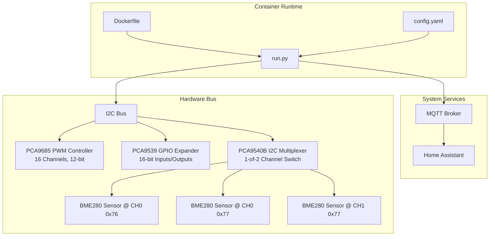

**Diagram sources**
- [Dockerfile:1-15](file://Dockerfile#L1-L15)
- [config.yaml:1-57](file://config.yaml#L1-L57)
- [run.py:571-630](file://run.py#L571-L630)

**Section sources**
- [Dockerfile:1-15](file://Dockerfile#L1-L15)
- [config.yaml:1-57](file://config.yaml#L1-L57)
- [run.py:571-630](file://run.py#L571-L630)

## Core Components
- PCA9685 PWM Controller: Provides 16 independent 12-bit PWM channels with configurable global frequency. Used to control fans, heaters, and steppers. Exposes duty cycle control and channel mapping for hardware feedback.
- PCA9539 GPIO Expander: Reads 16-bit input state for relays, stepper signals, and reserved pins. Provides hardware feedback to detect mismatches between commanded and actual states.
- PCA9540B I2C Multiplexer: Selects between two I2C channels to enable multiple BME280 sensors on a single bus segment.
- BME280 Sensors: Temperature, pressure, and humidity sensors on CH0 and CH1 channels; calibrated and polled periodically.
- MQTT Discovery: Publishes Home Assistant entities with command and state topics, enabling seamless integration.

Key concepts:
- Duty cycle: The percentage of time a PWM signal is ON within a period, represented as a 0–100% value and mapped to a 12-bit value (0–4095) for the PCA9685.
- Channel mapping: Fixed mapping of PCA9685 channels to hardware functions (e.g., heaters, fans, steppers, LEDs). Feedback mapping correlates PCA9685 channels to PCA9539 input pins.
- Hardware feedback: Real-time verification of relay states, stepper enable/dir, and pulse feedback via PCA9539 inputs.

**Section sources**
- [run.py:61-109](file://run.py#L61-L109)
- [run.py:111-137](file://run.py#L111-L137)
- [run.py:139-159](file://run.py#L139-L159)
- [run.py:162-264](file://run.py#L162-L264)
- [run.py:266-282](file://run.py#L266-L282)
- [run.py:930-944](file://run.py#L930-L944)

## Architecture Overview
The system architecture integrates hardware control, feedback, and telemetry through a central Python service. The service initializes I2C devices, sets up MQTT Discovery, and runs dedicated threads for sensor polling, feedback monitoring, LED indication, and stepper pulse generation.

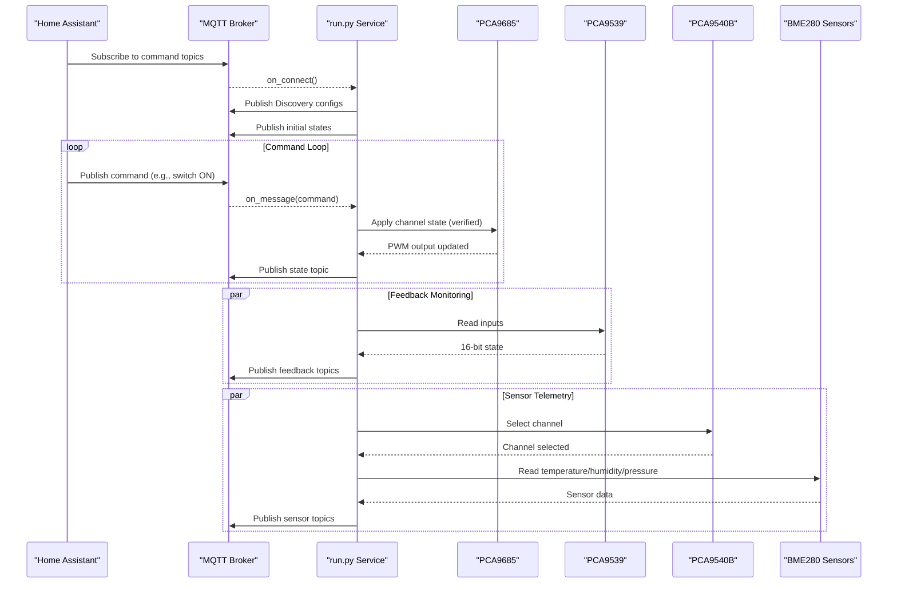

**Diagram sources**
- [run.py:1709-1738](file://run.py#L1709-L1738)
- [run.py:1746-1883](file://run.py#L1746-L1883)
- [run.py:673-798](file://run.py#L673-L798)
- [run.py:822-874](file://run.py#L822-L874)

## Detailed Component Analysis

### PCA9685 PWM Controller
- Responsibilities:
  - Initialize PCA9685 with proper modes and drive configuration.
  - Set global PWM frequency and write 12-bit duty cycle to channels.
  - Provide channel helpers to turn channels ON/OFF and apply duty cycles.
- Implementation highlights:
  - Uses SMBus2 for thread-safe I2C access guarded by a global lock.
  - Configures MODE1 and MODE2 registers for proper operation.
  - Supports 12-bit duty cycle mapping to 0–4095 for precise control.

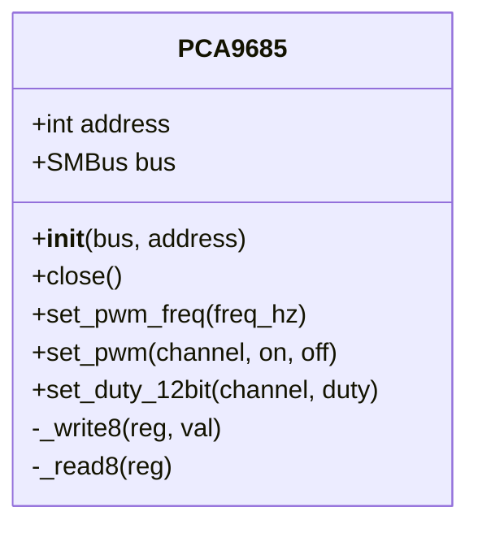

**Diagram sources**
- [run.py:61-109](file://run.py#L61-L109)

**Section sources**
- [run.py:61-109](file://run.py#L61-L109)

### PCA9539 GPIO Expander
- Responsibilities:
  - Read 16-bit input state representing hardware feedback.
  - Used for verifying relay states, stepper enable/dir, and pulse feedback.
- Implementation highlights:
  - Initializes pins as inputs by default.
  - Provides read_inputs() returning a 16-bit integer for bit-wise checks.

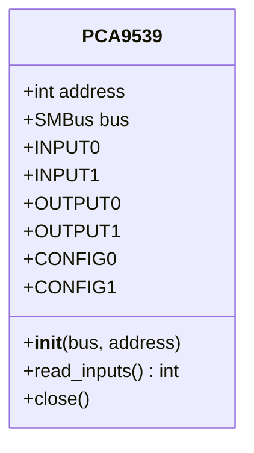

**Diagram sources**
- [run.py:111-137](file://run.py#L111-L137)

**Section sources**
- [run.py:111-137](file://run.py#L111-L137)

### PCA9540B I2C Multiplexer
- Responsibilities:
  - Select I2C channels to enable multiple sensors on the same bus.
  - Supports CH0 and CH1 selection and channel deselection.
- Implementation highlights:
  - Uses single-byte writes to select channels.
  - Ensures channels are deselected after sensor operations.

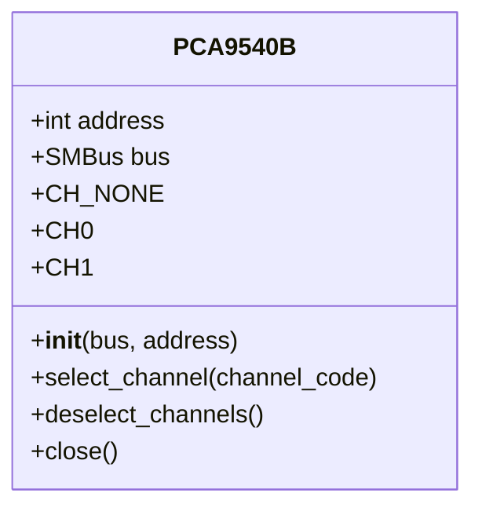

**Diagram sources**
- [run.py:139-159](file://run.py#L139-L159)

**Section sources**
- [run.py:139-159](file://run.py#L139-L159)

### BME280 Environmental Sensors
- Responsibilities:
  - Read calibrated temperature, pressure, and humidity values.
  - Initialize sensor settings and calibration data.
- Implementation highlights:
  - Validates chip ID and distinguishes BME280 vs BMP280.
  - Loads calibration coefficients and computes compensated readings.
  - Polls sensors on configured intervals and publishes telemetry.

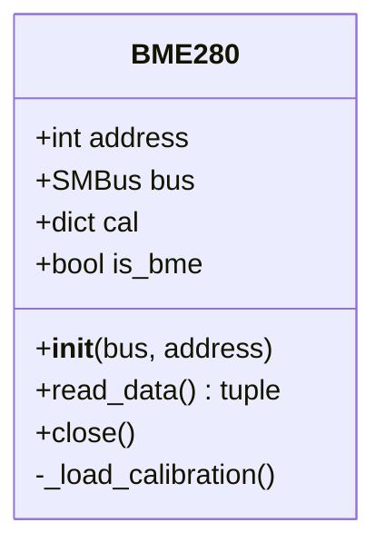

**Diagram sources**
- [run.py:162-264](file://run.py#L162-L264)

**Section sources**
- [run.py:162-264](file://run.py#L162-L264)

### MQTT Discovery and Topics
- Responsibilities:
  - Publish Home Assistant Discovery entries for switches, numbers, selects, sensors, and binary sensors.
  - Manage availability topic and deep clean mode for ghost topic cleanup.
  - Subscribe to command topics and publish state topics.
- Implementation highlights:
  - Defines topic constants for each entity.
  - Publishes discovery JSON with command/state topics and device metadata.
  - Handles deep clean by scanning and clearing retained topics.

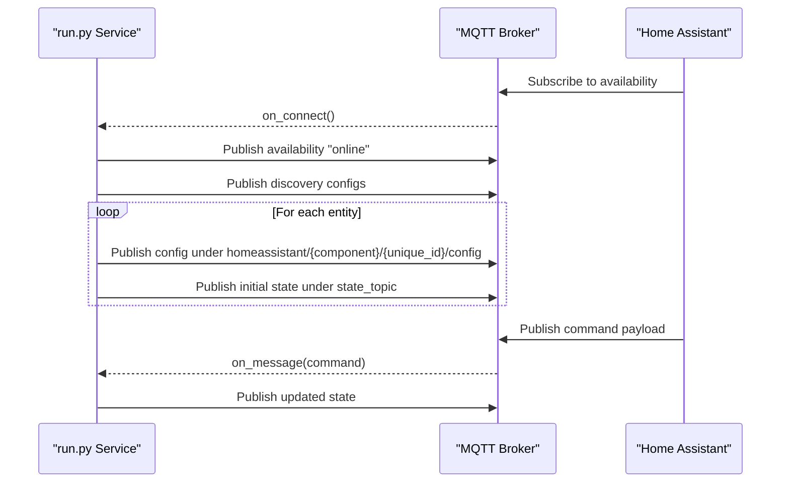

**Diagram sources**
- [run.py:1647-1674](file://run.py#L1647-L1674)
- [run.py:1709-1738](file://run.py#L1709-L1738)
- [run.py:1746-1883](file://run.py#L1746-L1883)

**Section sources**
- [run.py:461-531](file://run.py#L461-L531)
- [run.py:1310-1624](file://run.py#L1310-L1624)
- [run.py:1647-1674](file://run.py#L1647-L1674)
- [run.py:1709-1738](file://run.py#L1709-L1738)
- [run.py:1746-1883](file://run.py#L1746-L1883)

### Verified Hardware Control and Feedback
- Responsibilities:
  - Apply hardware state changes with pre/post verification against PCA9539 feedback.
  - Detect and report problems via binary sensor topics.
- Implementation highlights:
  - Maps PCA9685 channels to PCA9539 pins for feedback correlation.
  - Uses wait periods and bit checks to confirm hardware response.
  - Publishes individual feedback topics for relays, stepper signals, and pulses.

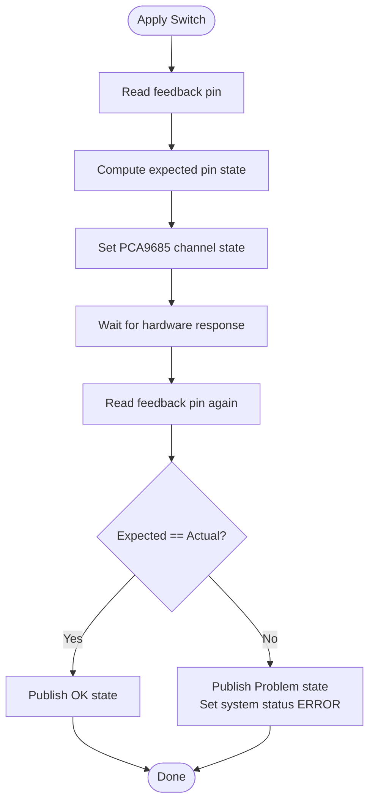

**Diagram sources**
- [run.py:950-996](file://run.py#L950-L996)
- [run.py:673-798](file://run.py#L673-L798)

**Section sources**
- [run.py:930-944](file://run.py#L930-L944)
- [run.py:950-996](file://run.py#L950-L996)
- [run.py:673-798](file://run.py#L673-L798)

### Stepper Pulse Generation (PU)
- Responsibilities:
  - Generate square-wave pulses on a dedicated channel for stepper drivers.
  - Monitor pulse feedback via PCA9539 pin to detect missed pulses.
- Implementation highlights:
  - Threaded worker toggles channel ON/OFF at target frequency.
  - Verifies feedback pulses and updates system status on failures.
  - Integrates with direction changes by temporarily disabling pulses.

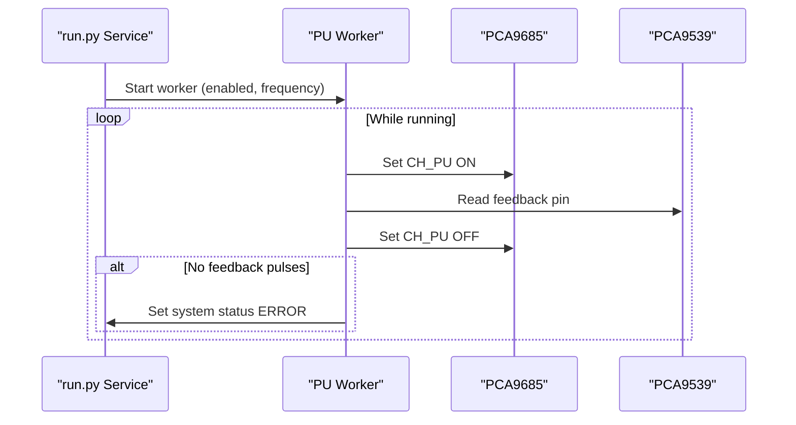

**Diagram sources**
- [run.py:1044-1105](file://run.py#L1044-L1105)
- [run.py:673-798](file://run.py#L673-L798)

**Section sources**
- [run.py:1044-1105](file://run.py#L1044-L1105)
- [run.py:673-798](file://run.py#L673-L798)

### LED Indicators and Diagnostics
- Responsibilities:
  - System LED (CH15) blinks continuously.
  - LED indicator cycles between solid green (OK) and blinking red (problems) at intervals.
  - Startup diagnostic verifies hardware and sets system status accordingly.
- Implementation highlights:
  - Diagnostic mode sets system status to DIAGNOSTIC and uses blue LED.
  - After diagnostic, system status remains OK; runtime problems are reflected via feedback and LED indicator.

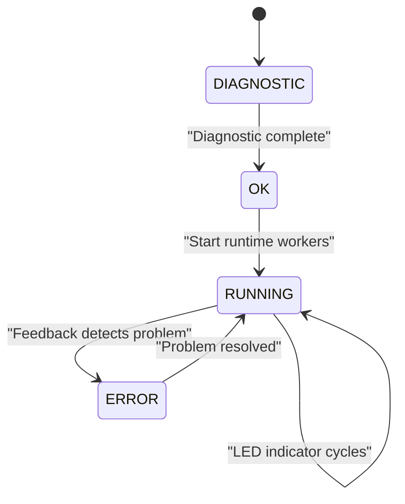

**Diagram sources**
- [run.py:369-458](file://run.py#L369-L458)
- [run.py:1128-1165](file://run.py#L1128-L1165)
- [run.py:1167-1226](file://run.py#L1167-L1226)
- [AGEND.md:16-58](file://AGEND.md#L16-L58)

**Section sources**
- [run.py:369-458](file://run.py#L369-L458)
- [run.py:1128-1165](file://run.py#L1128-L1165)
- [run.py:1167-1226](file://run.py#L1167-L1226)
- [AGEND.md:16-58](file://AGEND.md#L16-L58)

## Dependency Analysis
- Containerization and runtime:
  - Python 3.11 slim base with i2c-tools and kernel modules installed.
  - Dependencies: smbus2, requests, paho-mqtt.
- I2C and hardware:
  - Requires i2c-dev kernel module and access to /dev/i2c-1.
  - Shared SMBus instance guarded by a global lock to prevent concurrent I2C access.
- MQTT and Home Assistant:
  - Connects to a local MQTT broker and publishes Discovery entries.
  - Supports Supervisor-provided MQTT credentials when available.

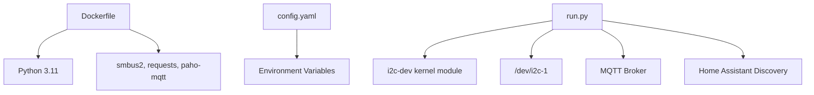

**Diagram sources**
- [Dockerfile:1-15](file://Dockerfile#L1-L15)
- [config.yaml:16-27](file://config.yaml#L16-L27)
- [run.py:29-46](file://run.py#L29-L46)

**Section sources**
- [Dockerfile:1-15](file://Dockerfile#L1-L15)
- [config.yaml:16-27](file://config.yaml#L16-L27)
- [run.py:29-46](file://run.py#L29-L46)

## Performance Considerations
- I2C concurrency: A global lock serializes I2C operations to prevent bus contention and ensure reliable transactions.
- Polling intervals: Sensor polling and feedback loops operate at modest rates to balance responsiveness and CPU usage.
- Duty cycle mapping: Non-linear mapping for PWM1/PWM2 duty to improve perceived speed control at low percentages.
- Threading model: Dedicated threads for sensor reads, feedback monitoring, LED indicators, and pulse generation keep the main loop responsive.

[No sources needed since this section provides general guidance]

## Troubleshooting Guide
Common issues and resolutions:
- MQTT connection failures: Verify broker host/port/credentials; the service retries connection with exponential backoff.
- Discovery cleanup: Enable deep clean to remove stale retained topics; the service subscribes to homeassistant/# and clears discovered topics after a short timer.
- Feedback mismatches: Use verified apply switch to confirm hardware state; check wiring and pull-up resistors for PCA9539 inputs.
- Pulse feedback not detected: Ensure stepper enable is ON and frequency is above threshold; verify feedback pin connections.
- Sensor initialization failures: Confirm PCA9540B channel selection and address validity; ensure sensors are present on the bus.

**Section sources**
- [run.py:1709-1738](file://run.py#L1709-L1738)
- [run.py:1676-1707](file://run.py#L1676-L1707)
- [run.py:950-996](file://run.py#L950-L996)
- [run.py:1044-1105](file://run.py#L1044-L1105)
- [run.py:606-625](file://run.py#L606-L625)

## Conclusion
This project delivers a robust, production-ready embedded controller for home automation and industrial control. By combining precise PWM control, hardware feedback, and MQTT Discovery, it enables reliable automation of heaters, fans, steppers, and environmental monitoring. The modular design, verified state transitions, and resilient MQTT integration make it suitable for diverse environments requiring dependable telemetry and actuation.

[No sources needed since this section summarizes without analyzing specific files]

## Appendices

### Practical Use Cases
- Controlling heaters: Use switch entities to toggle relays; the system ensures feedback alignment and publishes problem states.
- Fan speed control: Adjust duty cycle via number entities; power follows speed automatically.
- Stepper motor control: Set direction, enable/disable, and generate pulses at desired frequency; monitor feedback for missed pulses.
- Environmental monitoring: Deploy multiple BME280 sensors via PCA9540B multiplexer; publish temperature, humidity, and pressure telemetry.

[No sources needed since this section provides general guidance]

### Public Interfaces and Topic Structures
- Command topics (set):
  - Number: PWM1 duty cycle, PWM2 duty cycle
  - Switch: Heater 1–4, Fan 1/2 power
  - Select: Stepper direction (CW/CCW)
  - Switch: Stepper enable, PU enable
  - Number: PU frequency (Hz)
- State topics (state):
  - Number: PWM1/PWM2 duty cycle
  - Switch: Heater/Fan/Stepper states
  - Select: Stepper direction
  - Binary sensors: Feedback for relays, ENA, DIR, PU, TAXO1/TAXO2, and reserve pins
  - Sensors: BME280 temperature, humidity, pressure per channel

**Section sources**
- [run.py:469-531](file://run.py#L469-L531)
- [run.py:1310-1624](file://run.py#L1310-L1624)