# System Architecture Overview

<cite>
**Referenced Files in This Document**
- [run.py](file://run.py)
- [config.yaml](file://config.yaml)
- [repository.json](file://repository.json)
- [AGEND.md](file://AGEND.md)
</cite>

## Table of Contents
1. [Introduction](#introduction)
2. [Project Structure](#project-structure)
3. [Core Components](#core-components)
4. [Architecture Overview](#architecture-overview)
5. [Detailed Component Analysis](#detailed-component-analysis)
6. [Dependency Analysis](#dependency-analysis)
7. [Performance Considerations](#performance-considerations)
8. [Troubleshooting Guide](#troubleshooting-guide)
9. [Conclusion](#conclusion)
10. [Appendices](#appendices)

## Introduction
This document describes the architectural design of the PCA9685 PWM Controller system that integrates a Raspberry Pi-based embedded controller with Home Assistant via MQTT. The system orchestrates multiple hardware components over I2C:
- Central PCA9685 16-channel PWM controller driving fans, heaters, steppers, and LEDs
- PCA9539 16-bit GPIO expander for hardware feedback verification
- PCA9540B 1-of-2 I2C multiplexer enabling sensor expansion across two channels
- BME280 environmental sensors providing temperature, humidity, and pressure telemetry

The system exposes Home Assistant entities automatically using MQTT Discovery, manages hardware state through dedicated worker threads, and ensures robustness via thread locks and I2C bus coordination.

## Project Structure
The repository centers around a single entry script that initializes drivers, starts worker threads, publishes MQTT discovery, and handles bidirectional command/state flows.

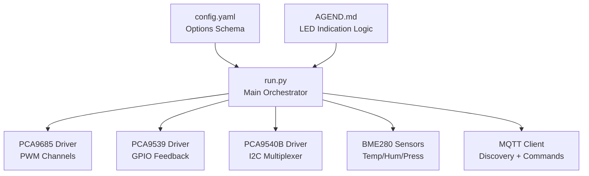

**Diagram sources**
- [run.py:1228-1977](file://run.py#L1228-L1977)
- [config.yaml:27-57](file://config.yaml#L27-L57)

**Section sources**
- [run.py:1228-1977](file://run.py#L1228-L1977)
- [config.yaml:1-57](file://config.yaml#L1-57)

## Core Components
- PCA9685 PWM Controller: Manages 16 channels with configurable frequency and 12-bit duty resolution. Provides channel_on/channel_off helpers and thread-safe write access via a shared I2C bus lock.
- PCA9539 GPIO Expander: Reads 16-bit input state to verify hardware feedback for relays, stepper signals, and sensors.
- PCA9540B Multiplexer: Selects between CH0 and CH1 to enable multiple BME280 sensors on the same I2C bus.
- BME280 Environmental Sensors: Reads calibrated temperature, pressure, and optional humidity; publishes periodic readings.
- MQTT Integration: Uses Home Assistant Discovery to auto-create entities and subscribes to command topics to drive hardware.

**Section sources**
- [run.py:61-109](file://run.py#L61-L109)
- [run.py:111-137](file://run.py#L111-L137)
- [run.py:139-159](file://run.py#L139-L159)
- [run.py:162-264](file://run.py#L162-L264)
- [run.py:1310-1624](file://run.py#L1310-L1624)

## Architecture Overview
The system follows a centralized orchestration model:
- A single shared SMBus instance coordinates all I2C transactions with a global lock to prevent race conditions.
- Worker threads continuously monitor hardware state, collect sensor data, and manage LED indicators.
- MQTT clients subscribe to Home Assistant command topics and publish state and diagnostics.

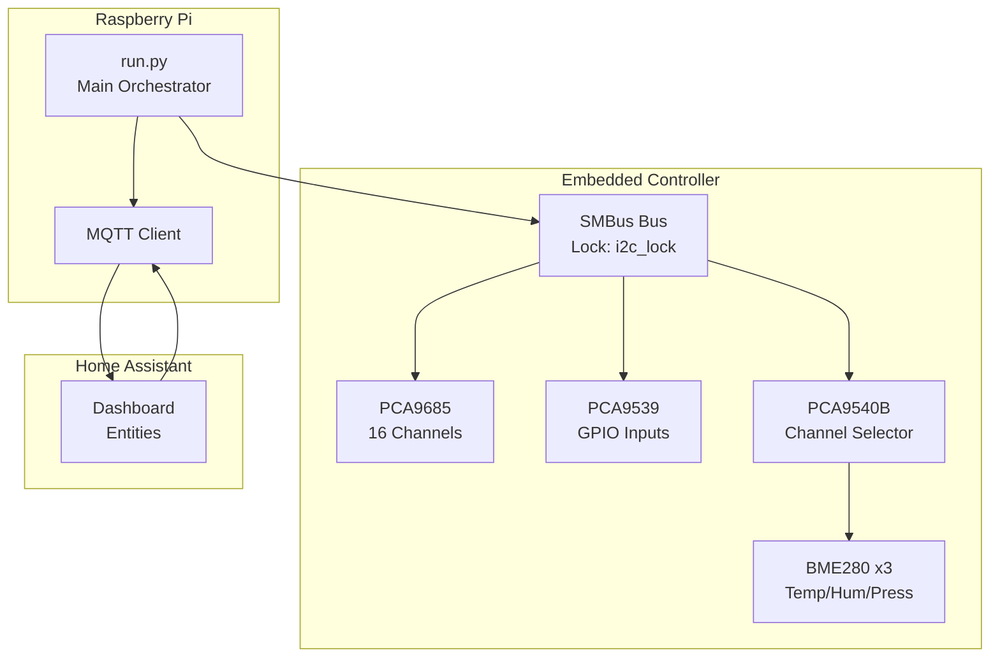

**Diagram sources**
- [run.py:39-47](file://run.py#L39-L47)
- [run.py:571-630](file://run.py#L571-L630)
- [run.py:1250-1257](file://run.py#L1250-L1257)

## Detailed Component Analysis

### PCA9685 PWM Controller
- Responsibilities: Initialize controller, set global PWM frequency, and program channel outputs with 12-bit precision.
- Thread Safety: All register writes are protected by the global I2C lock.
- Channel Mapping: Fixed mapping defines channels for PWM fans, heaters, steppers, and LEDs.

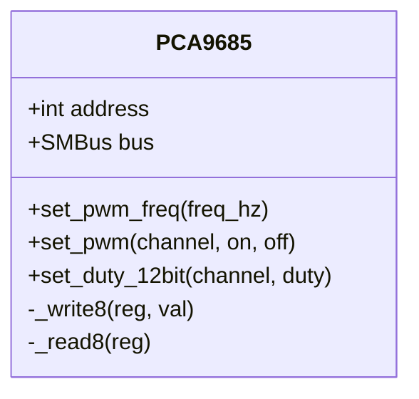

**Diagram sources**
- [run.py:61-109](file://run.py#L61-L109)

**Section sources**
- [run.py:61-109](file://run.py#L61-L109)
- [run.py:266-282](file://run.py#L266-L282)

### PCA9539 GPIO Expander
- Responsibilities: Read 16-bit input state and publish raw and formatted values.
- Feedback Verification: Used to validate relay states, stepper enable/dir, and pulse feedback.

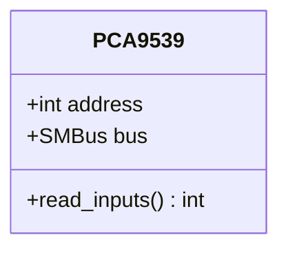

**Diagram sources**
- [run.py:111-137](file://run.py#L111-L137)

**Section sources**
- [run.py:111-137](file://run.py#L111-L137)

### PCA9540B I2C Multiplexer
- Responsibilities: Select CH0/CH1 channels to enable multiple sensors on the same I2C bus.
- Coordination: Must be selected before sensor reads and deselected afterward.

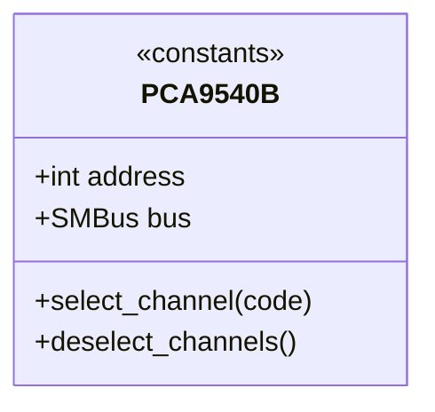

**Diagram sources**
- [run.py:139-159](file://run.py#L139-L159)

**Section sources**
- [run.py:139-159](file://run.py#L139-L159)

### BME280 Environmental Sensors
- Responsibilities: Initialize sensor chips, load calibration, read raw data, compute compensated values, and publish telemetry.
- Multiplexed Access: Uses PCA9540B to select channel before reading.

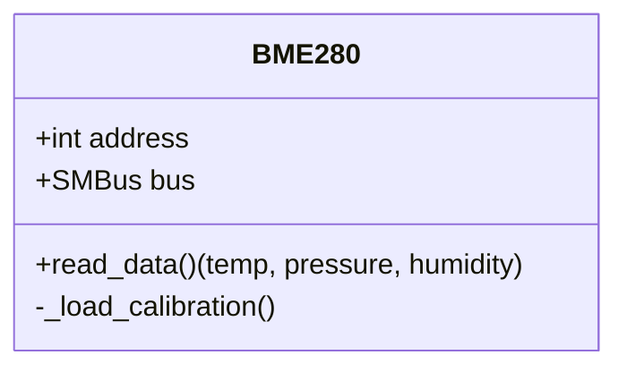

**Diagram sources**
- [run.py:162-264](file://run.py#L162-L264)

**Section sources**
- [run.py:162-264](file://run.py#L162-L264)

### MQTT Integration and Discovery
- Discovery: Publishes Home Assistant Discovery configs for switches, numbers, selects, sensors, and binary sensors.
- Availability: Publishes online/offline status.
- Command Handling: Subscribes to command topics and updates hardware state accordingly.

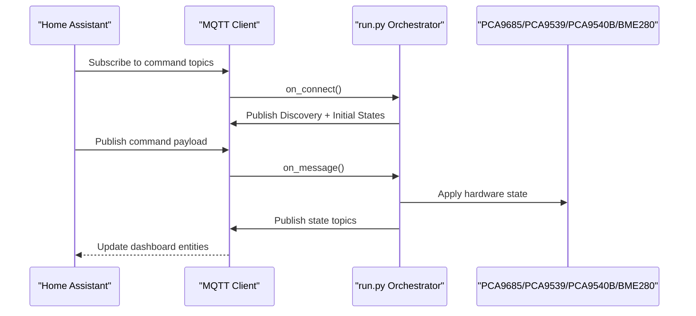

**Diagram sources**
- [run.py:1709-1739](file://run.py#L1709-L1739)
- [run.py:1746-1883](file://run.py#L1746-L1883)
- [run.py:1647-1674](file://run.py#L1647-L1674)

**Section sources**
- [run.py:1310-1624](file://run.py#L1310-L1624)
- [run.py:1709-1739](file://run.py#L1709-L1739)
- [run.py:1746-1883](file://run.py#L1746-L1883)

### Hardware Monitoring and Feedback Loop
- Worker Thread: Periodically reads PCA9539 inputs, validates expected vs. actual states, publishes feedback topics, and sets a real-time problem flag.
- Feedback Topics: Binary sensors for relays, stepper enable/dir, and pulse feedback; numeric sensors for reserved inputs.

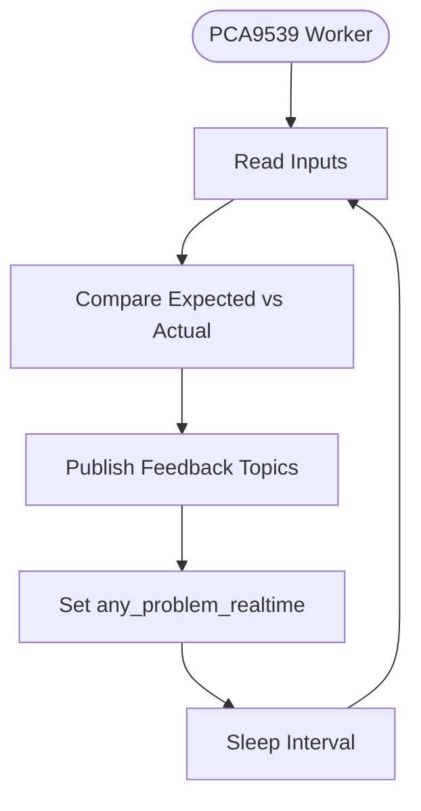

**Diagram sources**
- [run.py:673-798](file://run.py#L673-L798)

**Section sources**
- [run.py:673-798](file://run.py#L673-L798)

### Sensor Data Collection
- Worker Thread: Alternately selects CH0 and CH1 via PCA9540B, reads BME280 sensors, publishes telemetry, and sleeps according to configured interval.

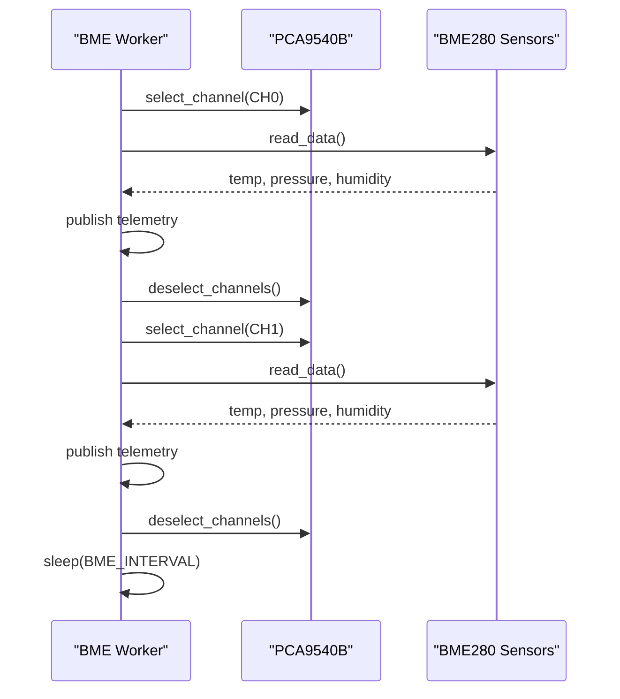

**Diagram sources**
- [run.py:822-874](file://run.py#L822-L874)

**Section sources**
- [run.py:822-874](file://run.py#L822-L874)

### LED Status Indication and System LED
- System LED (CH15): Blinking pattern indicates service liveness.
- LED Indicator: Periodic visual status using RGB channels; reacts to real-time hardware problems.
- Diagnostic Mode: Blue LED during startup diagnostics; switches to red/green based on test outcomes.

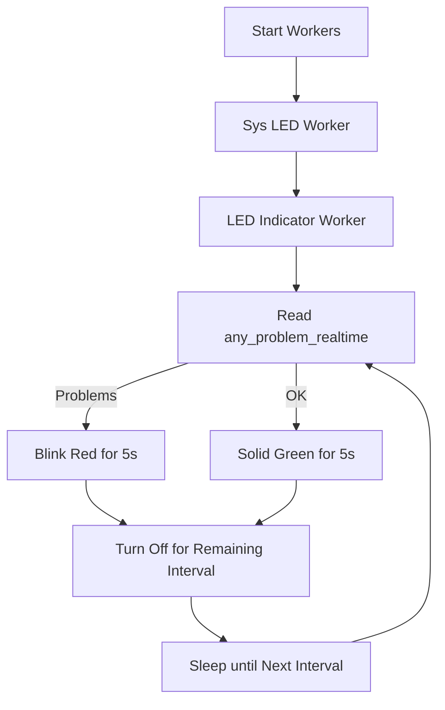

**Diagram sources**
- [run.py:1128-1226](file://run.py#L1128-L1226)
- [run.py:1167-1226](file://run.py#L1167-L1226)
- [run.py:369-458](file://run.py#L369-L458)

**Section sources**
- [run.py:1128-1226](file://run.py#L1128-L1226)
- [run.py:1167-1226](file://run.py#L1167-L1226)
- [run.py:369-458](file://run.py#L369-L458)

### Pulse Generation (PU) and Safety Logic
- Worker Thread: Generates square wave pulses at requested frequency; verifies feedback via PCA9539 pin.
- Safe Direction Switching: Disables pulse generation before changing stepper direction, waits for completion, then resumes if previously enabled.

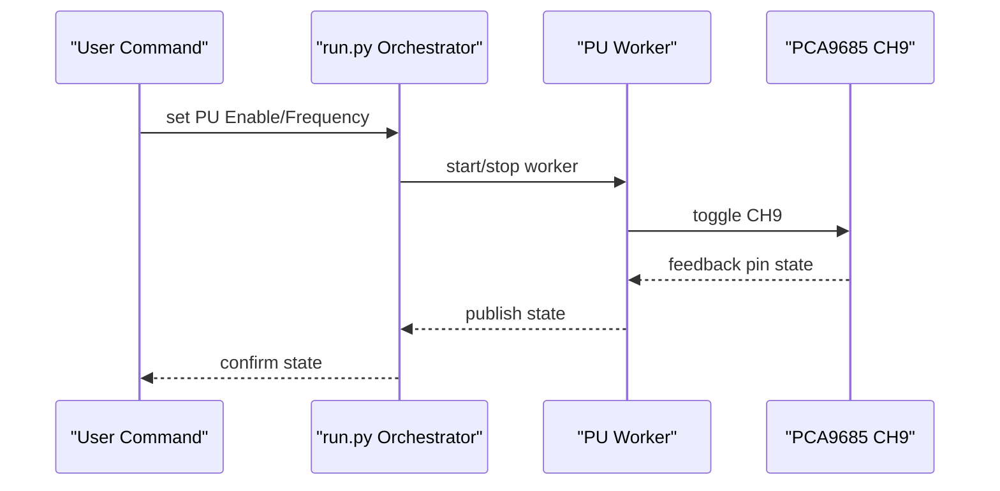

**Diagram sources**
- [run.py:1044-1105](file://run.py#L1044-L1105)
- [run.py:998-1036](file://run.py#L998-L1036)

**Section sources**
- [run.py:1044-1105](file://run.py#L1044-L1105)
- [run.py:998-1036](file://run.py#L998-L1036)

## Dependency Analysis
- Shared I2C Bus: All drivers share a single SMBus instance guarded by a global lock to serialize I2C transactions.
- Worker Threads: Independent threads for PCA9539 feedback, BME sensor reads, LED indicators, and PU pulses; each uses its own thread lock to guard mutable state.
- MQTT Client: Single client instance handles discovery, subscriptions, and publications; uses availability topic to signal health.

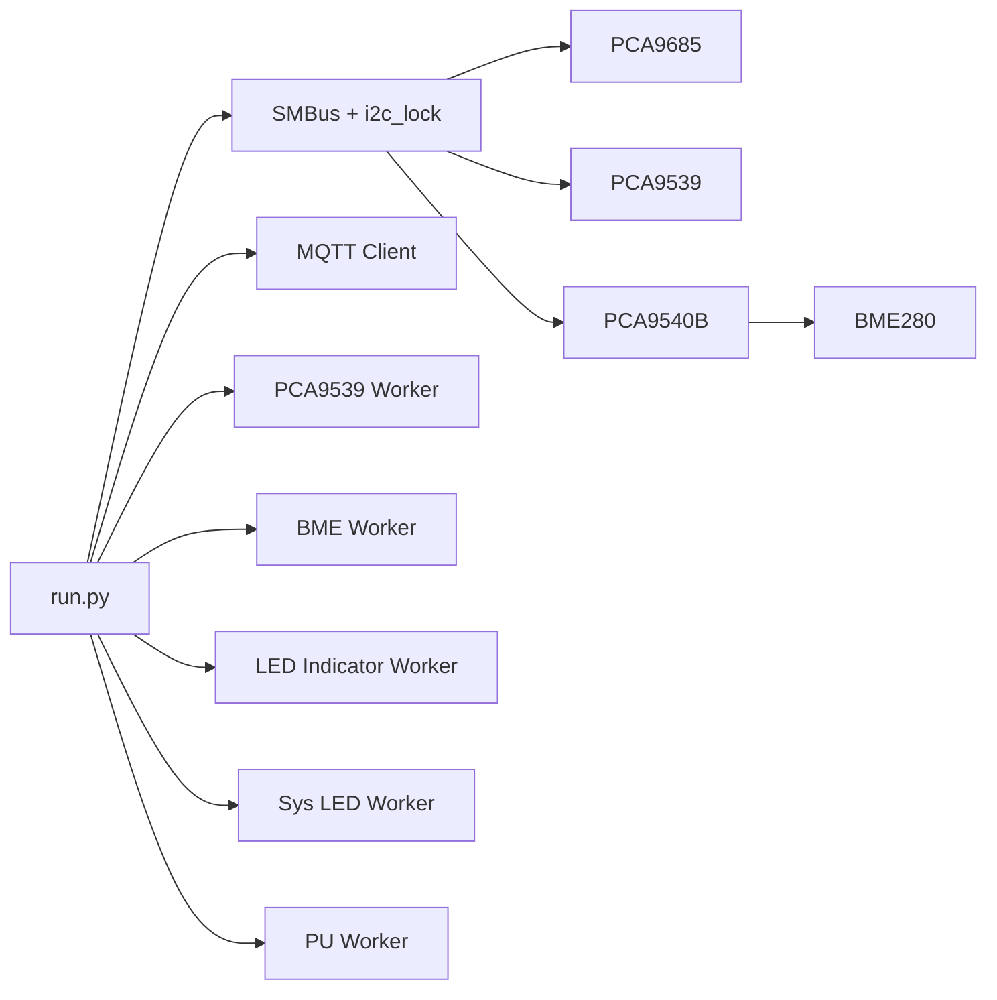

**Diagram sources**
- [run.py:39-47](file://run.py#L39-L47)
- [run.py:800-820](file://run.py#L800-L820)
- [run.py:876-896](file://run.py#L876-L896)
- [run.py:1107-1126](file://run.py#L1107-L1126)
- [run.py:1146-1165](file://run.py#L1146-L1165)
- [run.py:1207-1226](file://run.py#L1207-L1226)

**Section sources**
- [run.py:39-47](file://run.py#L39-L47)
- [run.py:800-820](file://run.py#L800-L820)
- [run.py:876-896](file://run.py#L876-L896)
- [run.py:1107-1126](file://run.py#L1107-L1126)
- [run.py:1146-1165](file://run.py#L1146-L1165)
- [run.py:1207-1226](file://run.py#L1207-L1226)

## Performance Considerations
- I2C Serialization: The global lock prevents concurrent I2C operations, reducing contention but potentially increasing latency under heavy activity. Consider batching reads/writes where safe.
- Worker Intervals: Feedback loop runs every second; adjust intervals judiciously to balance responsiveness and CPU usage.
- Sensor Sampling: BME sampling occurs at configured intervals; ensure intervals align with Home Assistant polling preferences.
- Thread Lifecycle: Graceful shutdown stops all workers and resets hardware outputs to safe defaults.

[No sources needed since this section provides general guidance]

## Troubleshooting Guide
- MQTT Discovery Issues: If entities do not appear, verify discovery publication and availability topic; deep-clean mode clears stale topics and re-publishes current discovery.
- Hardware Feedback Problems: Use feedback binary sensors to detect mismatched relay/stepper states; review PCA9539 worker logs for problem flags.
- Pulse Feedback Not Detected: Verify wiring and pull-up resistors; check PU worker warnings and system status updates.
- Shutdown Behavior: On SIGTERM/SIGINT, all workers are stopped, hardware outputs reset, and offline availability is published.

**Section sources**
- [run.py:1627-1674](file://run.py#L1627-L1674)
- [run.py:1757-1779](file://run.py#L1757-L1779)
- [run.py:1889-1931](file://run.py#L1889-L1931)

## Conclusion
The PCA9685 PWM Controller system demonstrates a robust, modular architecture integrating embedded hardware, I2C devices, and Home Assistant through MQTT Discovery. Centralized orchestration, thread-safe I2C access, and dedicated worker threads ensure reliable operation, while explicit feedback loops and LED indicators provide clear operational visibility.

[No sources needed since this section summarizes without analyzing specific files]

## Appendices

### Configuration Management
- Environment-driven Options: MQTT credentials and supervisor integration are loaded from environment and options JSON.
- Device Addresses and Intervals: I2C addresses, bus number, PWM frequency, duty cycle defaults, and polling intervals are configurable via options JSON.
- Validation: Options schema enforces type and range constraints.

**Section sources**
- [run.py:284-312](file://run.py#L284-L312)
- [config.yaml:27-57](file://config.yaml#L27-L57)

### System Context Diagram
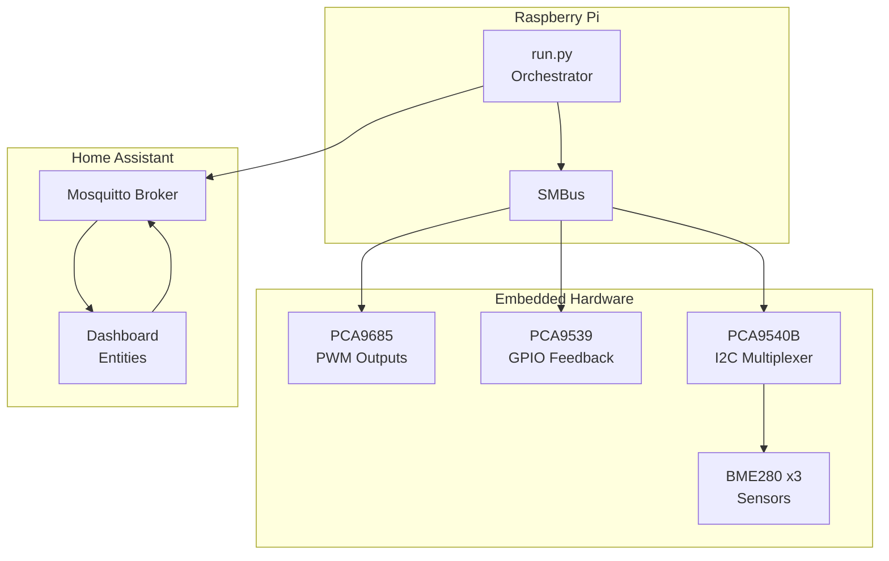

**Diagram sources**
- [run.py:39-47](file://run.py#L39-L47)
- [run.py:1250-1257](file://run.py#L1250-L1257)
- [config.yaml:28-31](file://config.yaml#L28-L31)