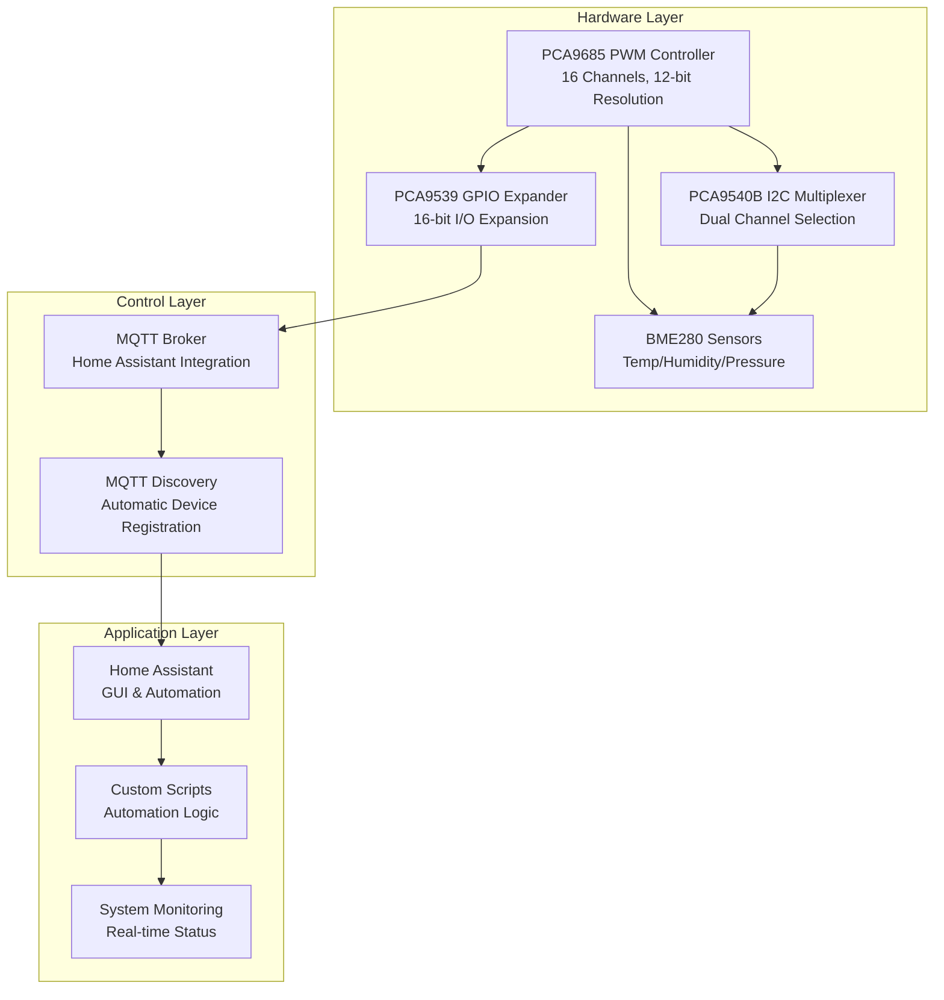
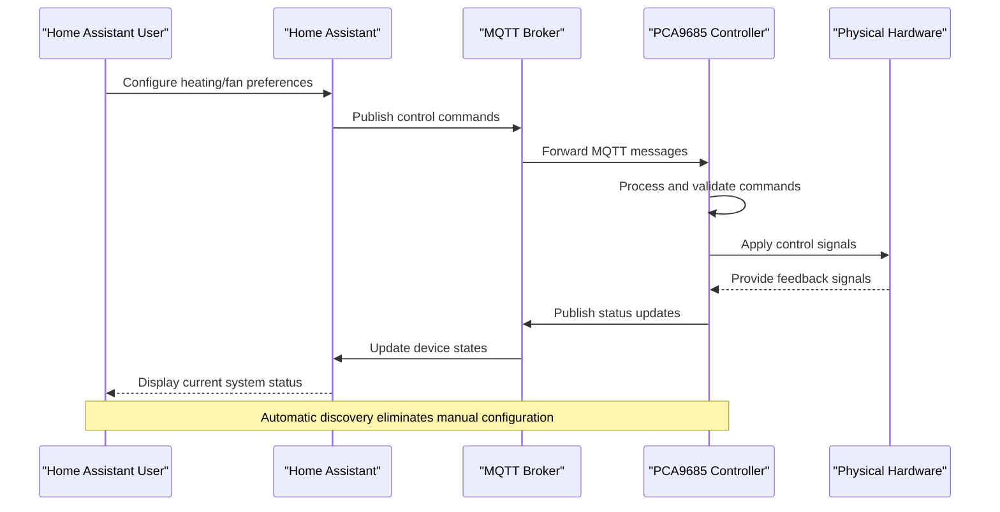
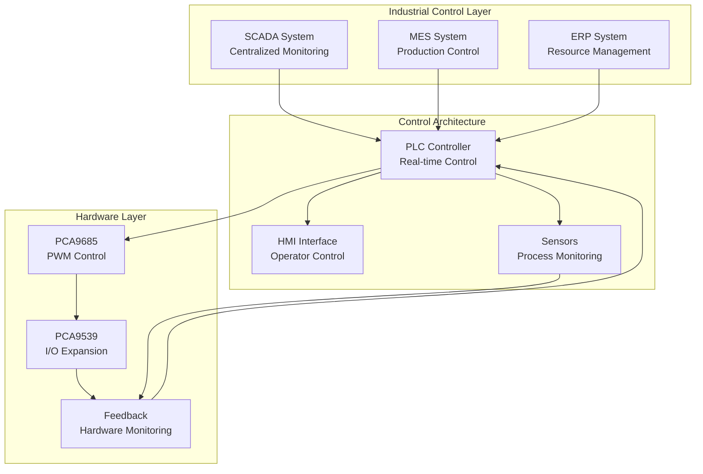
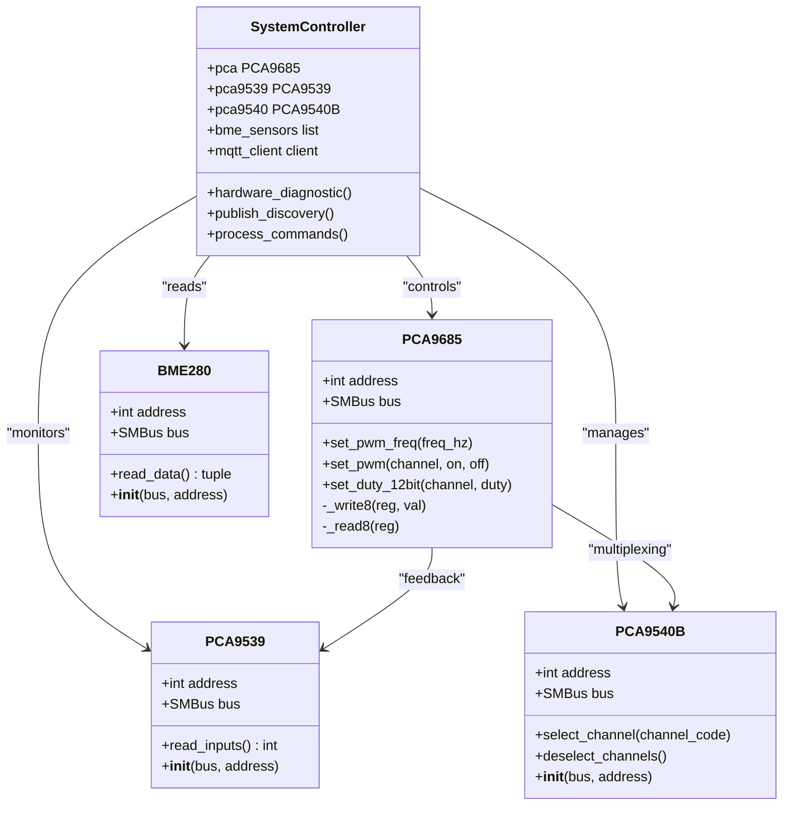

# Target Audience and Use Cases

<cite>
**Referenced Files in This Document**
- [run.py](file://run.py)
- [config.yaml](file://config.yaml)
</cite>

## Table of Contents
1. [Introduction](#introduction)
2. [Project Overview](#project-overview)
3. [Target User Groups](#target-user-groups)
4. [Beginner-Friendly Concepts](#beginner-friendly-concepts)
5. [Primary Use Cases](#primary-use-cases)
6. [Intermediate Applications](#intermediate-applications)
7. [Advanced Scenarios](#advanced-scenarios)
8. [Practical Implementation Examples](#practical-implementation-examples)
9. [System Architecture for Different Audiences](#system-architecture-for-different-audiences)
10. [Getting Started Guides](#getting-started-guides)
11. [Conclusion](#conclusion)

## Introduction

The PCA9685 PWM Controller system is a comprehensive embedded control solution designed to bridge the gap between microcontroller-based automation and modern home automation ecosystems. This system leverages the PCA9685 16-channel 12-bit PWM controller, combined with additional I2C devices including the PCA9539 GPIO expander, PCA9540B I2C multiplexer, and BME280 environmental sensors to create a versatile platform for various automation scenarios.

The system operates as a bridge between hardware control and software orchestration, providing a unified interface through MQTT discovery for integration with popular home automation platforms like Home Assistant. This architecture makes it accessible to users ranging from hobbyists building their first automation projects to professional developers implementing complex industrial control systems.

## Project Overview

The PCA9685 PWM Controller system represents a sophisticated approach to embedded automation control, combining hardware-level precision with software-driven flexibility. The system's core architecture centers around several key components:

**Hardware Foundation:**
- PCA9685 16-channel 12-bit PWM controller for precise motor and actuator control
- PCA9539 16-bit I2C GPIO expander for hardware feedback and monitoring
- PCA9540B 1-of-2 I2C multiplexer enabling multiple sensor configurations
- BME280 environmental sensors for temperature, humidity, and pressure monitoring

**Software Infrastructure:**
- MQTT-based communication protocol for seamless integration with automation platforms
- Threaded architecture supporting concurrent hardware monitoring and control
- Comprehensive error handling and diagnostic capabilities
- Configurable parameters for diverse operational environments

**Integration Ecosystem:**
- Home Assistant MQTT Discovery for automatic device registration
- Modular design supporting custom hardware extensions
- Scalable architecture accommodating multiple sensor configurations

**Diagram sources**
- [run.py:571-630](file://run.py#L571-L630)
- [run.py:1250-1310](file://run.py#L1250-L1310)

**Section sources**
- [run.py:1-50](file://run.py#L1-L50)
- [config.yaml:1-57](file://config.yaml#L1-L57)

## Target User Groups

### Home Automation Enthusiasts

**Primary Characteristics:**
- Individuals seeking to automate home environments using accessible technology
- Users comfortable with GUI-based interfaces and visual automation tools
- Interested in cost-effective solutions for HVAC control, lighting, and basic environmental monitoring

**System Benefits:**
- Seamless integration with Home Assistant through MQTT discovery
- Pre-configured device categories (switches, numbers, sensors, binary sensors)
- Minimal technical complexity for achieving meaningful automation results
- Comprehensive hardware feedback for reliable operation monitoring

**Key Features for Home Automation:**
- Four independent heater controls for zone heating management
- Dual fan speed control with automatic power management
- Stepper motor control for automated blinds, valves, and positioning systems
- Environmental monitoring capabilities for climate control optimization

### Industrial Control System Developers

**Primary Characteristics:**
- Professional engineers developing control systems for manufacturing and process automation
- Teams requiring precise timing control and reliable hardware feedback
- Organizations needing scalable solutions for multiple process control points

**System Benefits:**
- 12-bit PWM resolution providing fine-grained control precision
- Hardware feedback verification ensuring control loop integrity
- Multi-channel capability supporting complex process control architectures
- Robust error detection and reporting mechanisms

**Industrial Applications:**
- Motor speed and torque control for conveyor systems
- Temperature and pressure regulation in process vessels
- Valve positioning and flow control in fluid handling systems
- Automated positioning systems for robotic applications

### Embedded Systems Programmers

**Primary Characteristics:**
- Software developers specializing in embedded systems and real-time control
- Engineers requiring direct hardware control with minimal abstraction layers
- Professionals building custom automation solutions with specific timing requirements

**System Benefits:**
- Direct register-level access to PCA9685 PWM registers
- Thread-safe hardware abstraction with configurable synchronization
- Flexible channel mapping supporting custom hardware configurations
- Comprehensive I2C device support for sensor and actuator integration

**Programming Advantages:**
- Modular class-based architecture facilitating code reuse
- Thread-safe operations supporting concurrent hardware access
- Extensible design allowing custom device drivers and protocols
- Comprehensive logging and diagnostic capabilities

### Makers and Raspberry Pi Platform Users

**Primary Characteristics:**
- Hobbyists and makers building innovative automation projects
- Users leveraging Raspberry Pi as central control units
- Creators developing custom solutions for specific automation challenges

**System Benefits:**
- Optimized for Raspberry Pi deployment with I2C device support
- Container-ready architecture for easy deployment and scaling
- Comprehensive configuration options for diverse hardware setups
- Extensive documentation and community support resources

**Maker-Friendly Features:**
- Pre-configured Raspberry Pi device mappings
- Flexible I2C bus configuration supporting multiple device arrangements
- Comprehensive hardware diagnostics for troubleshooting
- Modular design enabling incremental system expansion

**Section sources**
- [config.yaml:7-15](file://config.yaml#L7-L15)
- [run.py:1250-1310](file://run.py#L1250-L1310)

## Beginner-Friendly Concepts

### Understanding PWM (Pulse Width Modulation)

**What is PWM?**
PWM is a technique for controlling power delivered to electrical devices by rapidly switching power on and off at a fixed frequency while varying the duration of "on" time relative to the total cycle time. Think of it like controlling water flow by opening and closing a tap very quickly - the faster you open it, the more water flows through on average.

**How PWM Works:**
- **Frequency:** The number of on/off cycles per second (measured in Hz)
- **Duty Cycle:** The percentage of time the signal is "on" during each cycle
- **Average Power:** Higher duty cycle = more power delivered

**Practical Example:**
Imagine controlling a fan motor:
- 100% duty cycle: Fan runs at full speed continuously
- 50% duty cycle: Fan alternates between on and off states, spending equal time in each state
- 0% duty cycle: Fan remains off

**Section sources**
- [run.py:79-93](file://run.py#L79-L93)
- [run.py:106-108](file://run.py#L106-L108)

### I2C Communication Basics

**What is I2C?**
I2C (Inter-Integrated Circuit) is a serial communication protocol that allows multiple devices to communicate over just two wires. It's like having a conversation with multiple people using only two phone lines - each device has a unique address and can send/receive data independently.

**I2C Bus Components:**
- **SDA (Serial Data):** Carries the actual data being transmitted
- **SCL (Serial Clock):** Provides timing signals synchronizing data transfer
- **Pull-up Resistors:** Essential for proper signal integrity
- **Address Space:** Each device has a unique 7-bit or 10-bit address

**Device Addressing:**
- Devices are identified by hexadecimal addresses (e.g., 0x40, 0x74, 0x76)
- Multiple devices can share the same bus without interference
- Address conflicts must be avoided when adding new devices

**Section sources**
- [run.py:20-21](file://run.py#L20-L21)
- [config.yaml:32-35](file://config.yaml#L32-L35)

### Home Assistant Integration

**MQTT Discovery Process:**
The system automatically registers with Home Assistant through MQTT discovery, eliminating manual configuration overhead. This process involves:

1. **Device Registration:** Each controlled component appears as a separate entity
2. **Capability Definition:** Available actions and states are automatically described
3. **User Interface Creation:** Home Assistant generates appropriate UI elements
4. **State Synchronization:** Real-time updates reflect actual hardware conditions

**Supported Device Types:**
- **Switches:** Binary on/off control for relays and motors
- **Numbers:** Slider controls for PWM duty cycles and frequency settings
- **Sensors:** Environmental readings and system status information
- **Select Controls:** Direction selection for stepper motors
- **Binary Sensors:** Hardware feedback and error condition monitoring

**Section sources**
- [run.py:1310-1624](file://run.py#L1310-L1624)
- [run.py:1647-1673](file://run.py#L1647-L1673)

## Primary Use Cases

### HVAC Control Through Heater and Fan Management

**System Capabilities:**
The PCA9685 system provides comprehensive heating and ventilation control through four independent heater channels and dual fan management. Each heater can be individually controlled, allowing for zoned heating solutions that optimize energy consumption while maintaining comfort levels.

**Heating Control Features:**
- **Independent Zone Control:** Four separate heating zones with individual temperature management
- **PWM-Based Temperature Regulation:** Precise heat output adjustment through duty cycle modulation
- **Automatic Fan Coordination:** Fans automatically activate when heaters are powered
- **Safety Monitoring:** Hardware feedback ensures proper relay operation and prevents overheating

**Ventilation Management:**
- **Dual Fan Control:** Separate speed control for intake and exhaust systems
- **Intelligent Power Management:** Fans automatically adjust based on heating demands
- **Energy Optimization:** Variable speed operation reduces power consumption during partial loads
- **Air Quality Integration:** Environmental sensors enable automated ventilation scheduling

**Implementation Example:**
A typical residential HVAC setup would utilize:
- Heaters 1-2 for living spaces with individual room temperature control
- Heaters 3-4 for specialized areas like basements or utility rooms
- Fan 1 for circulation and Fan 2 for exhaust ventilation
- Integrated temperature and humidity monitoring for optimal comfort

**Section sources**
- [run.py:266-281](file://run.py#L266-L281)
- [run.py:1357-1396](file://run.py#L1357-L1396)
- [run.py:1782-1858](file://run.py#L1782-L1858)

### CNC Machine Control Through Stepper Motor Positioning

**Precision Control Capabilities:**
The system excels in precise motion control applications through dedicated stepper motor channels and hardware feedback verification. The combination of 12-bit PWM resolution and hardware monitoring enables reliable positioning systems for various CNC applications.

**Stepper Motor Control Features:**
- **Direction Control:** Dedicated CW/CCW direction channel with safe switching protocols
- **Enable Control:** Separate enable channel for motor power management
- **Pulse Generation:** Dedicated pulse output for step/dir motor drivers
- **Feedback Verification:** Hardware monitoring ensures proper motor operation
- **Safe Operation Protocols:** Controlled direction changes prevent motor damage

**Positioning Accuracy:**
- **12-bit Resolution:** 4096 discrete position steps for precise control
- **Frequency Control:** Adjustable pulse rates up to 500Hz for smooth operation
- **Load Monitoring:** Feedback sensors detect motor load and positioning accuracy
- **Error Detection:** Automatic fault detection prevents system damage

**CNC Application Scenarios:**
- **Rotary Tables:** Precision indexing for drilling and machining operations
- **Linear Axes:** X/Y/Z axis positioning for cutting tools and workpieces
- **Spindle Control:** Variable speed spindle operation with load monitoring
- **Tool Changers:** Automated tool positioning and exchange mechanisms

**Section sources**
- [run.py:273-274](file://run.py#L273-L274)
- [run.py:274-275](file://run.py#L274-L275)
- [run.py:275-276](file://run.py#L275-L276)
- [run.py:998-1036](file://run.py#L998-L1036)
- [run.py:1044-1104](file://run.py#L1044-L1104)

### Greenhouse Automation Through Environmental Monitoring and Actuator Control

**Complete Climate Control Solution:**
The system provides integrated environmental monitoring and actuation control ideal for agricultural applications. Multiple BME280 sensors enable comprehensive climate monitoring across different areas of growing spaces.

**Environmental Monitoring Capabilities:**
- **Multi-Sensor Deployment:** Up to three sensor channels with independent I2C multiplexing
- **Real-Time Data Collection:** Configurable sampling intervals for responsive control
- **Comprehensive Parameter Monitoring:** Temperature, humidity, and atmospheric pressure
- **Data Logging Integration:** Historical data storage for climate analysis and optimization

**Actuator Control for Agriculture:**
- **Ventilation Control:** Exhaust fans and intake systems for temperature and humidity management
- **Heating Systems:** Electric heating elements for cold weather protection
- **Irrigation Control:** Solenoid valves and pump control for automated watering
- **Lighting Systems:** LED grow lights with dimming capability for photosynthesis optimization

**Greenhouse Application Architecture:**
- **Zone Separation:** Independent control of different growing areas
- **Seasonal Adaptation:** Automated adjustment based on external weather conditions
- **Crop Optimization:** Specific environmental requirements for different plant types
- **Energy Efficiency:** Intelligent scheduling to minimize operational costs

**Section sources**
- [run.py:606-629](file://run.py#L606-L629)
- [run.py:822-873](file://run.py#L822-L873)
- [run.py:1439-1488](file://run.py#L1439-L1488)

### General Industrial Process Control Through Relay Switching and Motor Control

**Manufacturing and Process Automation:**
The system provides robust control capabilities suitable for various industrial applications requiring precise relay switching and motor control with comprehensive monitoring.

**Relay Control Applications:**
- **Motor Starter Control:** Direct control of AC and DC motors with overload protection
- **Valve Actuation:** Pneumatic and hydraulic valve control for process fluid management
- **Heating Element Control:** Batch heating systems and thermal processing equipment
- **Lighting Control:** Large-scale facility lighting with dimming capability

**Motor Control Solutions:**
- **Variable Frequency Drive Control:** Soft start capabilities for motor protection
- **Direction Reversal:** Bidirectional motor control for conveyors and positioning systems
- **Torque Control:** Precise motor torque application for material handling equipment
- **Emergency Stop Integration:** Safety interlock circuitry for emergency shutdown

**Process Monitoring and Control:**
- **Temperature Monitoring:** RTD and thermocouple integration for process temperature control
- **Pressure Monitoring:** Transducer integration for fluid and gas pressure control
- **Flow Monitoring:** Sensor integration for liquid and gas flow rate measurement
- **Level Monitoring:** Float switches and ultrasonic sensors for tank and vessel monitoring

**Section sources**
- [run.py:267-270](file://run.py#L267-L270)
- [run.py:271-272](file://run.py#L271-L272)
- [run.py:930-944](file://run.py#L930-L944)
- [run.py:1514-1623](file://run.py#L1514-L1623)

## Intermediate Applications

### Custom Hardware Integration

**Extending System Capabilities:**
The modular architecture supports integration of custom hardware components through the PCA9539 GPIO expander and flexible I2C device configuration. This enables users to expand beyond standard automation scenarios.

**Hardware Extension Approaches:**
- **Sensor Integration:** Custom analog and digital sensors through I2C expansion
- **Actuator Control:** Specialized actuators requiring specific control characteristics
- **Communication Interfaces:** Serial communication protocols for legacy equipment integration
- **Power Management:** Battery monitoring, power distribution, and energy management systems

**Integration Patterns:**
- **Modular Device Drivers:** Standardized interfaces for new hardware components
- **Protocol Adapters:** Translation layers between different communication standards
- **Signal Conditioning:** Hardware interfaces for sensor signal processing and actuator drive circuits
- **Safety Interlocks:** Hardware-based safety systems integrated with software control

**Section sources**
- [run.py:111-136](file://run.py#L111-L136)
- [run.py:139-159](file://run.py#L139-L159)

### Sensor Network Expansion

**Scalable Monitoring Architecture:**
The system supports expansion of sensor networks through the PCA9540B I2C multiplexer, enabling deployment of multiple sensor arrays across distributed locations.

**Network Architecture Options:**
- **Multi-Zone Monitoring:** Distributed sensor arrays for large facilities and outdoor installations
- **Redundancy Systems:** Backup sensors for critical measurements and fault tolerance
- **Wireless Integration:** I2C-to-wireless bridges for remote sensor deployment
- **Data Aggregation:** Centralized data collection from multiple sensor locations

**Advanced Sensor Applications:**
- **Weather Stations:** Complete meteorological monitoring with multiple environmental parameters
- **Water Quality Monitoring:** pH, conductivity, dissolved oxygen, and turbidity measurement
- **Air Quality Monitoring:** Particulate matter, VOCs, CO2, and other air quality indicators
- **Soil Monitoring:** Moisture, temperature, nutrient levels for precision agriculture

**Section sources**
- [run.py:139-159](file://run.py#L139-L159)
- [run.py:606-629](file://run.py#L606-L629)

### Automation Script Development

**Programmatic Control and Integration:**
The MQTT-based architecture enables sophisticated automation scripting for complex control scenarios that exceed simple GUI-based automation capabilities.

**Scripting Capabilities:**
- **Conditional Logic:** Complex decision-making based on multiple sensor inputs and historical data
- **Predictive Control:** Machine learning-based control algorithms for optimal performance
- **Integration APIs:** Third-party service integration for weather data, energy pricing, and other external factors
- **Event-Driven Automation:** Real-time response to changing conditions with adaptive control strategies

**Advanced Automation Patterns:**
- **Optimization Algorithms:** Energy minimization and cost optimization through predictive control
- **Fault Detection and Isolation:** Automated diagnosis of system faults and isolation procedures
- **Adaptive Control:** Self-tuning control systems that adapt to changing operating conditions
- **Coordinated Control:** Multi-zone control with coordination between different system components

**Section sources**
- [run.py:1709-1738](file://run.py#L1709-L1738)
- [run.py:1746-1882](file://run.py#L1746-L1882)

## Advanced Scenarios

### System Monitoring and Diagnostics

**Comprehensive Health Monitoring:**
The system provides extensive monitoring capabilities through hardware feedback verification, real-time status reporting, and automated diagnostic procedures.

**Diagnostic Features:**
- **Hardware Validation:** Automated testing of all control channels and feedback circuits
- **Performance Monitoring:** Real-time tracking of system performance and efficiency metrics
- **Predictive Maintenance:** Early detection of potential hardware failures and maintenance needs
- **Operational Analytics:** Historical data analysis for system optimization and performance improvement

**Monitoring Architecture:**
- **Multi-Level Feedback:** Hardware-level feedback combined with software-level status monitoring
- **Alarm Management:** Hierarchical alarm system with escalation procedures and notification capabilities
- **Remote Access:** Web-based monitoring interface for remote system oversight
- **Data Export:** Structured data export for integration with enterprise monitoring systems

**Advanced Diagnostic Procedures:**
- **Self-Diagnostic Testing:** Automated periodic system health checks with detailed reporting
- **Root Cause Analysis:** Sophisticated fault detection and analysis capabilities
- **Performance Benchmarking:** Comparative analysis against baseline performance metrics
- **Trend Analysis:** Long-term trend monitoring for predictive maintenance and system optimization

**Section sources**
- [run.py:369-458](file://run.py#L369-L458)
- [run.py:673-798](file://run.py#L673-L798)
- [run.py:1128-1204](file://run.py#L1128-L1204)

### Fault Detection and Protection Systems

**Robust Safety and Protection Mechanisms:**
The system incorporates comprehensive fault detection and protection mechanisms designed to prevent equipment damage and ensure safe operation under various fault conditions.

**Protection Strategies:**
- **Overcurrent Protection:** Automatic shutdown on excessive current draw or short circuits
- **Overtemperature Protection:** Thermal monitoring with automatic shutdown to prevent overheating
- **Undervoltage Protection:** Operation monitoring with automatic protection against brownouts
- **Communication Failure Protection:** Fail-safe modes when communication with control systems is lost

**Advanced Fault Detection:**
- **Pattern Recognition:** Machine learning-based fault pattern recognition for early detection
- **Cross-Channel Monitoring:** Interdependent system monitoring to detect cascading failures
- **Predictive Fault Detection:** Statistical analysis for early warning of impending failures
- **Isolation Procedures:** Automatic isolation of faulty components to prevent system-wide failure

**Safety Integration:**
- **Emergency Shutdown:** Rapid system shutdown under critical fault conditions
- **Manual Override Capability:** Safe manual intervention during automated system faults
- **Safety Interlock Integration:** Integration with external safety systems and emergency procedures
- **Compliance Monitoring:** Continuous monitoring for regulatory compliance in industrial environments

**Section sources**
- [run.py:950-991](file://run.py#L950-L991)
- [run.py:1044-1104](file://run.py#L1044-L1104)
- [run.py:1514-1623](file://run.py#L1514-L1623)

### Integration with Larger Automation Frameworks

**Enterprise Integration Capabilities:**
The system supports integration with comprehensive automation frameworks through standardized protocols and APIs, enabling deployment in complex industrial and commercial environments.

**Integration Architectures:**
- **SCADA Integration:** Supervisory Control and Data Acquisition system connectivity for industrial monitoring
- **MES Integration:** Manufacturing Execution System integration for production control and optimization
- **ERP Integration:** Enterprise Resource Planning system connectivity for resource management and scheduling
- **Cloud Integration:** Remote monitoring and control capabilities through cloud-based automation platforms

**Protocol Support:**
- **OPC UA:** Industry-standard protocol for industrial automation system integration
- **Modbus:** Widely-used protocol for industrial electronic devices communication
- **BACnet:** Building Automation and Control Networks protocol for facility management
- **IEC 61850:** Communication protocols for power system automation

**Advanced Integration Features:**
- **Edge Computing:** Local processing capabilities for reduced latency and improved reliability
- **Data Fusion:** Integration of multiple data sources for comprehensive system awareness
- **AI/ML Integration:** Machine learning model integration for predictive analytics and optimization
- **Cybersecurity Integration:** Enterprise-grade security measures for protected industrial communications

**Section sources**
- [config.yaml:1-15](file://config.yaml#L1-L15)
- [run.py:1647-1673](file://run.py#L1647-L1673)
- [run.py:1709-1738](file://run.py#L1709-L1738)

## Practical Implementation Examples

### Home Automation Setup for Beginners

**Simple Heating Control:**
A basic home heating system can be implemented using two heater channels for different zones:
1. **Living Area Control:** Primary heating channel with temperature sensor feedback
2. **Bedroom Control:** Secondary heating channel for individual room management
3. **Fan Coordination:** Automatic fan activation when heaters are powered
4. **Safety Monitoring:** Hardware feedback verification for relay operation

**Implementation Steps:**
- Configure two heater channels in the system configuration
- Install temperature sensors in each zone
- Set up Home Assistant automation for temperature-based control
- Monitor system status through built-in diagnostic procedures

**Expected Outcomes:**
- Individual room temperature control with automatic fan coordination
- Reliable hardware feedback ensuring proper system operation
- Energy-efficient heating through precise temperature control
- Easy integration with existing home automation infrastructure

### Industrial Process Control for Professionals

**Manufacturing Line Integration:**
A comprehensive industrial control system can manage multiple process stages:
1. **Conveyor Belt Control:** Variable speed control with load monitoring
2. **Temperature Control:** PID control loops for heating and cooling processes
3. **Valve Positioning:** Precise control of fluid flow in processing lines
4. **Safety Systems:** Emergency shutdown and safety interlock integration

**Professional Implementation:**
- Integration with existing SCADA systems for centralized monitoring
- Implementation of safety instrumented systems (SIS) for critical safety functions
- Development of custom control algorithms for specific process requirements
- Integration with enterprise systems for production tracking and quality control

**Advanced Features:**
- Predictive maintenance scheduling based on system performance data
- Real-time optimization of process parameters for maximum efficiency
- Integration with quality control systems for automated product inspection
- Compliance monitoring for industry regulations and standards

### Agricultural Automation for Makers

**Greenhouse Climate Control:**
A complete greenhouse automation system utilizing multiple environmental sensors:
1. **Multi-Sensor Array:** Temperature, humidity, and CO2 monitoring in different zones
2. **Ventilation Control:** Exhaust fans and intake systems for climate management
3. **Heating System:** Electric heating elements for cold weather protection
4. **Irrigation Control:** Automated watering systems with soil moisture monitoring

**Maker-Friendly Implementation:**
- Utilization of Raspberry Pi as central control unit
- Integration of commonly available sensors and actuators
- Open-source software architecture enabling customization and extension
- Community support for troubleshooting and optimization

**Smart Agriculture Features:**
- Automated climate control based on crop requirements and external weather conditions
- Integration with weather forecasting services for predictive climate management
- Data logging for agricultural research and optimization studies
- Cost optimization through energy-efficient climate control strategies

**Section sources**
- [run.py:1357-1396](file://run.py#L1357-L1396)
- [run.py:1439-1488](file://run.py#L1439-L1488)
- [run.py:1782-1858](file://run.py#L1782-L1858)

## System Architecture for Different Audiences

### Home Assistant Integration Architecture

**User-Friendly Automation:**
The system provides seamless integration with Home Assistant through automatic MQTT discovery, eliminating the need for manual device configuration and complex setup procedures.

**Diagram sources**
- [run.py:1647-1673](file://run.py#L1647-L1673)
- [run.py:1709-1738](file://run.py#L1709-L1738)

### Industrial Control Architecture

**Professional Control Systems:**
The system supports complex industrial control requirements through robust hardware interfaces, comprehensive monitoring, and integration with enterprise control systems.

**Diagram sources**
- [run.py:1250-1310](file://run.py#L1250-L1310)
- [run.py:1310-1624](file://run.py#L1310-L1624)

### Embedded Development Architecture

**Programmer-Friendly Design:**
The system provides a clean, modular architecture suitable for embedded development with comprehensive hardware abstraction and thread-safe operations.

**Diagram sources**
- [run.py:61-109](file://run.py#L61-L109)
- [run.py:111-136](file://run.py#L111-L136)
- [run.py:139-159](file://run.py#L139-L159)
- [run.py:162-263](file://run.py#L162-L263)

**Section sources**
- [run.py:61-109](file://run.py#L61-L109)
- [run.py:111-136](file://run.py#L111-L136)
- [run.py:139-159](file://run.py#L139-L159)
- [run.py:162-263](file://run.py#L162-L263)

## Getting Started Guides

### Quick Start for Home Automation Enthusiasts

**Basic Setup Steps:**
1. **Hardware Preparation:** Connect PCA9685 controller to Raspberry Pi I2C bus
2. **Software Installation:** Deploy containerized system through Home Assistant Supervisor
3. **Initial Configuration:** Configure MQTT broker settings and device addresses
4. **Device Discovery:** Allow automatic MQTT discovery to register devices in Home Assistant
5. **Basic Control:** Test heater and fan controls through Home Assistant interface

**First Use Scenarios:**
- Simple room heating control with temperature monitoring
- Basic fan speed control for ventilation management
- Integration with existing smart home ecosystem
- Gradual expansion to multi-zone control systems

### Professional Implementation Guide

**Industrial Deployment Checklist:**
1. **System Design:** Define control requirements and hardware specifications
2. **Network Planning:** Design I2C topology and device addressing scheme
3. **Safety Integration:** Implement safety interlocks and emergency shutdown procedures
4. **SCADA Integration:** Establish communication with supervisory control systems
5. **Testing and Commissioning:** Comprehensive system testing and performance validation
6. **Documentation:** Complete system documentation and operator training materials

**Professional Features to Utilize:**
- Hardware feedback verification for control loop integrity
- Comprehensive error handling and fault detection systems
- Integration with enterprise monitoring and control systems
- Advanced diagnostic capabilities for system maintenance

### Maker Project Implementation

**Raspberry Pi Integration:**
1. **Hardware Setup:** Connect PCA9685 to Raspberry Pi GPIO pins with proper pull-up resistors
2. **Software Environment:** Install Python dependencies and configure I2C access permissions
3. **System Configuration:** Customize device addresses and control parameters for specific applications
4. **Testing Phase:** Verify hardware communication and basic control functionality
5. **Application Development:** Develop custom scripts for specific automation requirements

**Maker-Friendly Features:**
- Comprehensive hardware diagnostics for troubleshooting
- Flexible configuration options for diverse hardware setups
- Extensive logging capabilities for system monitoring and debugging
- Modular design enabling incremental project expansion

**Section sources**
- [config.yaml:28-41](file://config.yaml#L28-L41)
- [run.py:571-585](file://run.py#L571-L585)
- [run.py:1947-1960](file://run.py#L1947-L1960)

## Conclusion

The PCA9685 PWM Controller system represents a versatile and powerful solution for embedded automation control, successfully bridging the gap between simple home automation and complex industrial control systems. Its modular architecture, comprehensive hardware support, and seamless integration with popular automation platforms make it accessible to users across the entire spectrum of embedded systems expertise.

**Key Strengths:**
- **Universal Applicability:** Suitable for home automation, industrial control, and maker projects
- **Comprehensive Hardware Support:** Multiple I2C devices enabling diverse automation scenarios
- **Professional Integration:** Ready for enterprise-level deployment and monitoring
- **Developer-Friendly:** Clean architecture supporting custom extensions and modifications
- **Cost-Effective:** High-performance capabilities at accessible price points

**Future Potential:**
The system's modular design and extensible architecture position it well for future developments in IoT, edge computing, and intelligent automation. As embedded systems continue to evolve, this foundation provides a solid platform for emerging technologies and integration requirements.

Whether you're a homeowner seeking simple climate control, a professional engineer designing complex industrial systems, or a maker exploring innovative automation projects, the PCA9685 PWM Controller system offers the capabilities and flexibility needed to transform ideas into reality.