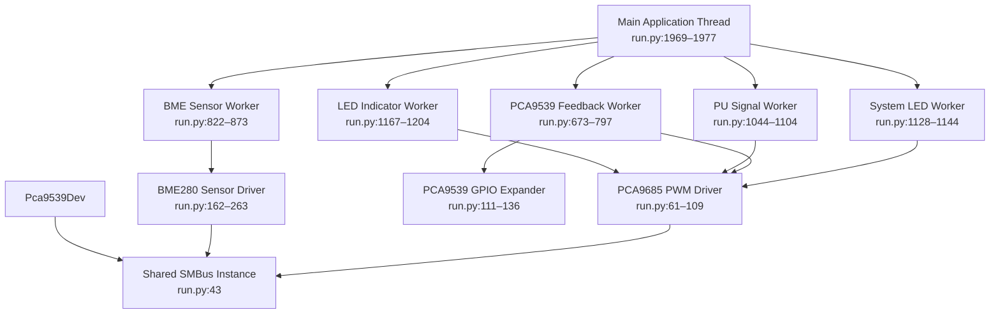
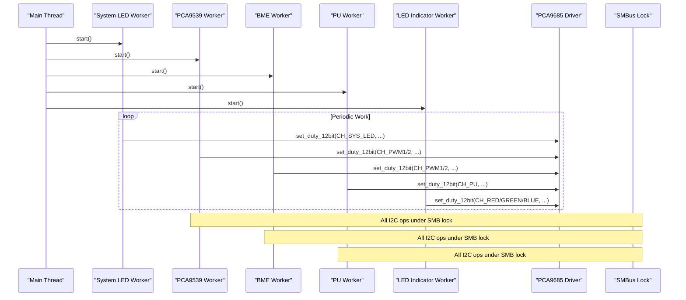
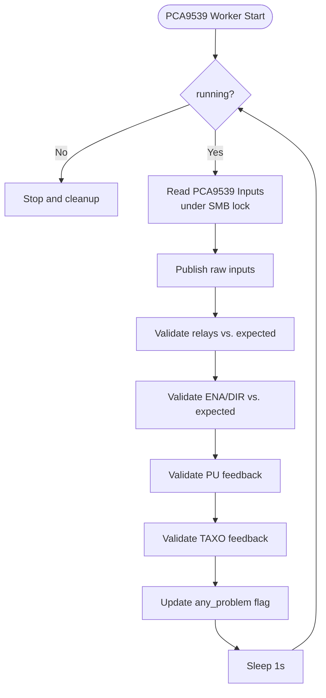
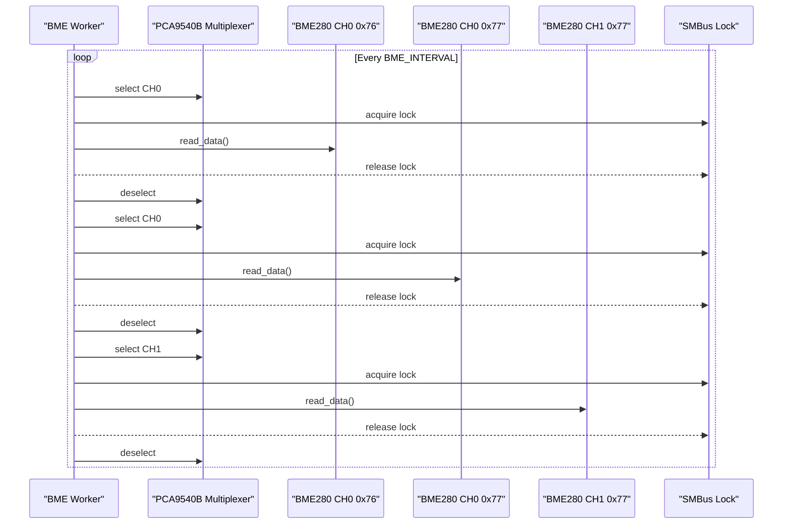
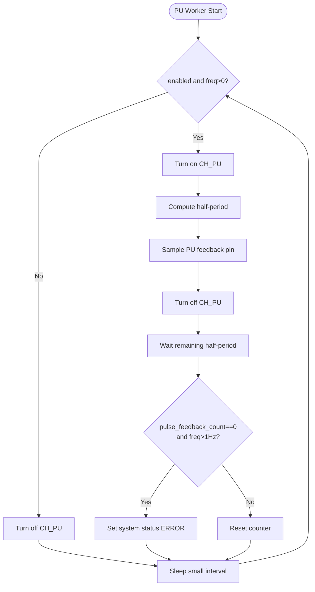
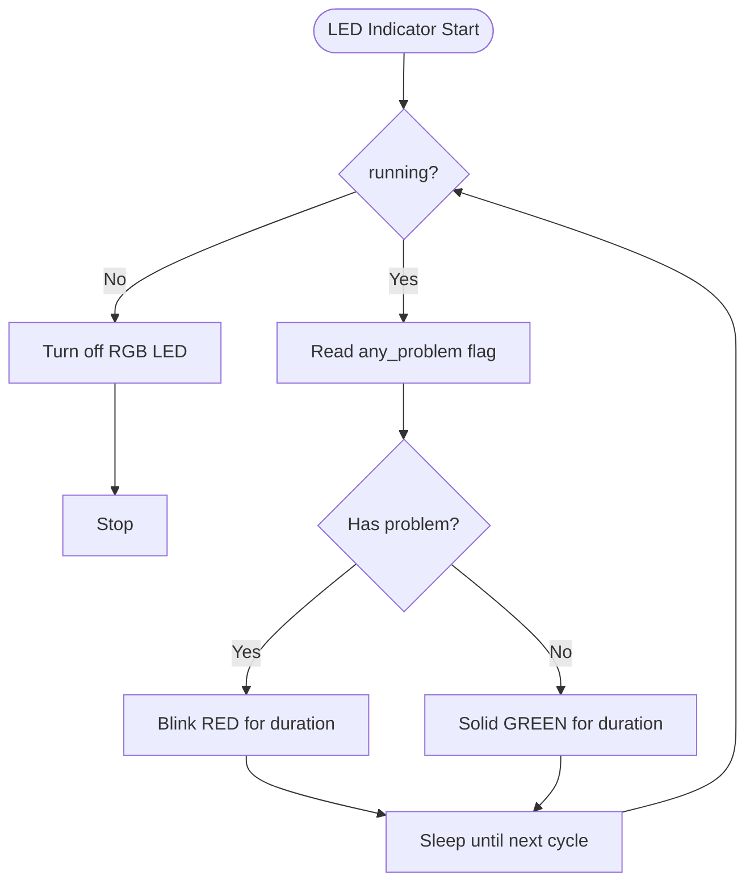
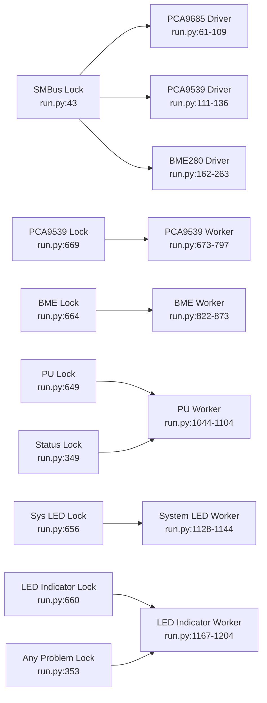

# Thread Management and Concurrency

<cite>
**Referenced Files in This Document**
- [run.py](file://run.py)
- [config.yaml](file://config.yaml)
</cite>

## Table of Contents
1. [Introduction](#introduction)
2. [Project Structure](#project-structure)
3. [Core Components](#core-components)
4. [Architecture Overview](#architecture-overview)
5. [Detailed Component Analysis](#detailed-component-analysis)
6. [Dependency Analysis](#dependency-analysis)
7. [Performance Considerations](#performance-considerations)
8. [Troubleshooting Guide](#troubleshooting-guide)
9. [Conclusion](#conclusion)
10. [Appendices](#appendices)

## Introduction
This document explains the thread management and concurrency model used by the PCA9685 PWM controller system. It covers the dedicated worker threads for PCA9539 feedback monitoring, BME sensor data collection, PU signal generation, and LED status indication. It documents synchronization primitives (locks), inter-thread communication patterns, hardware access coordination over the shared I2C bus, error handling and graceful shutdown, performance characteristics, and guidance for extending the threading model.

## Project Structure
The application is a single-file Python service that orchestrates hardware control and telemetry via MQTT discovery. Threading is implemented with standard library constructs and a shared I2C bus protected by a global lock.

**Diagram sources**
- [run.py:1969-1977](file://run.py#L1969-L1977)
- [run.py:1128-1144](file://run.py#L1128-L1144)
- [run.py:673-797](file://run.py#L673-L797)
- [run.py:822-873](file://run.py#L822-L873)
- [run.py:1044-1104](file://run.py#L1044-L1104)
- [run.py:1167-1204](file://run.py#L1167-L1204)
- [run.py:61-109](file://run.py#L61-L109)
- [run.py:162-263](file://run.py#L162-L263)
- [run.py:111-136](file://run.py#L111-L136)
- [run.py:43](file://run.py#L43)

**Section sources**
- [run.py:1969-1977](file://run.py#L1969-L1977)
- [run.py:1128-1144](file://run.py#L1128-L1144)
- [run.py:673-797](file://run.py#L673-L797)
- [run.py:822-873](file://run.py#L822-L873)
- [run.py:1044-1104](file://run.py#L1044-L1104)
- [run.py:1167-1204](file://run.py#L1167-L1204)
- [run.py:61-109](file://run.py#L61-L109)
- [run.py:162-263](file://run.py#L162-L263)
- [run.py:111-136](file://run.py#L111-L136)
- [run.py:43](file://run.py#L43)

## Core Components
- Shared I2C bus and synchronization
  - A single shared SMBus instance is opened early and guarded by a global lock to serialize all I2C transactions across drivers.
  - Hardware drivers (PCA9685, PCA9539, BME280) acquire the lock around each I2C operation to prevent races.
- Dedicated worker threads
  - PCA9539 feedback monitor: continuously reads feedback pins and publishes status.
  - BME sensor collector: periodically reads temperature/humidity/pressure from up to three sensors via a multiplexer.
  - PU signal generator: generates pulses on a dedicated channel and validates feedback.
  - LED indicator: shows system health via RGB LED with periodic blinking or solid color.
  - System LED: blinks a dedicated system LED at a fixed rate.
- Inter-thread communication
  - Shared state protected by per-domain locks (e.g., PWM values, PU enable/frequency, system status, any problem flag).
  - Cross-thread updates are coordinated via explicit locks and minimal state transitions.
- Graceful shutdown
  - Signal handlers stop all workers, reset hardware outputs, disconnect MQTT, and exit cleanly.

**Section sources**
- [run.py:43](file://run.py#L43)
- [run.py:61-109](file://run.py#L61-L109)
- [run.py:111-136](file://run.py#L111-L136)
- [run.py:162-263](file://run.py#L162-L263)
- [run.py:673-797](file://run.py#L673-L797)
- [run.py:822-873](file://run.py#L822-L873)
- [run.py:1044-1104](file://run.py#L1044-L1104)
- [run.py:1167-1204](file://run.py#L1167-L1204)
- [run.py:1128-1144](file://run.py#L1128-L1144)
- [run.py:1889-1930](file://run.py#L1889-L1930)

## Architecture Overview
The system uses a main application thread to orchestrate worker threads and manage MQTT connectivity. Workers operate independently with minimal inter-worker synchronization, communicating primarily through shared state protected by locks.

**Diagram sources**
- [run.py:1969-1977](file://run.py#L1969-L1977)
- [run.py:1128-1144](file://run.py#L1128-L1144)
- [run.py:673-797](file://run.py#L673-L797)
- [run.py:822-873](file://run.py#L822-L873)
- [run.py:1044-1104](file://run.py#L1044-L1104)
- [run.py:1167-1204](file://run.py#L1167-L1204)
- [run.py:61-109](file://run.py#L61-L109)
- [run.py:43](file://run.py#L43)

## Detailed Component Analysis

### PCA9539 Feedback Monitoring Worker
Responsibilities:
- Continuously polls PCA9539 inputs and publishes raw and derived status topics.
- Validates expected vs. actual states for relays, stepper ENA/DIR, PU, and TAXO signals.
- Updates a real-time “any problem” flag for the LED indicator worker.

Synchronization and coordination:
- Uses a per-worker lock to guard start/stop lifecycle.
- Reads inputs under the shared I2C lock.
- Updates a shared “any problem” flag under a dedicated lock.

Error handling:
- Catches exceptions during read and logs errors; continues loop.

**Diagram sources**
- [run.py:673-797](file://run.py#L673-L797)
- [run.py:43](file://run.py#L43)
- [run.py:353](file://run.py#L353)

**Section sources**
- [run.py:673-797](file://run.py#L673-L797)
- [run.py:353](file://run.py#L353)

### BME Sensor Data Collection Worker
Responsibilities:
- Selects I2C channels on PCA9540B multiplexer and reads BME280 sensors.
- Publishes temperature, pressure, and humidity topics.
- Handles channel selection/deselection safely.

Synchronization and coordination:
- Uses a per-worker lock to guard lifecycle.
- Uses the shared I2C lock around all sensor reads.
- Ensures channel deselection on exceptions.

**Diagram sources**
- [run.py:822-873](file://run.py#L822-L873)
- [run.py:139-159](file://run.py#L139-L159)
- [run.py:162-263](file://run.py#L162-L263)
- [run.py:43](file://run.py#L43)

**Section sources**
- [run.py:822-873](file://run.py#L822-L873)
- [run.py:139-159](file://run.py#L139-L159)
- [run.py:162-263](file://run.py#L162-L263)

### PU Signal Generation Worker
Responsibilities:
- Generates square-wave pulses on a dedicated channel at a configurable frequency.
- Validates feedback pulses via PCA9539 pin sampling.
- Updates system status to ERROR if pulses are expected but not detected.

Synchronization and coordination:
- Uses a per-worker lock to guard lifecycle and shared state (enable, frequency).
- Uses a shared “is pulsing” flag to coordinate direction changes.
- Uses the shared I2C lock around hardware writes.

**Diagram sources**
- [run.py:1044-1104](file://run.py#L1044-L1104)
- [run.py:648-653](file://run.py#L648-L653)
- [run.py:349](file://run.py#L349)

**Section sources**
- [run.py:1044-1104](file://run.py#L1044-L1104)
- [run.py:648-653](file://run.py#L648-L653)
- [run.py:349](file://run.py#L349)

### LED Indicator Worker
Responsibilities:
- Periodically checks the real-time “any problem” flag and sets RGB LED accordingly.
- Blinks red for a duration when problems are present; otherwise shows solid green.

Synchronization and coordination:
- Reads the “any problem” flag under a dedicated lock.
- Uses a shared RGB LED control function.

**Diagram sources**
- [run.py:1167-1204](file://run.py#L1167-L1204)
- [run.py:353](file://run.py#L353)

**Section sources**
- [run.py:1167-1204](file://run.py#L1167-L1204)
- [run.py:353](file://run.py#L353)

### System LED Worker
Responsibilities:
- Continuously toggles a dedicated system LED at a fixed rate.

Synchronization and coordination:
- Uses a per-worker lock to guard lifecycle.
- Writes to PCA9685 channel under the shared I2C lock.

**Section sources**
- [run.py:1128-1144](file://run.py#L1128-L1144)
- [run.py:61-109](file://run.py#L61-L109)
- [run.py:43](file://run.py#L43)

### Main Application Thread Responsibilities
- Initializes hardware drivers and opens the shared SMBus.
- Starts worker threads in a controlled order.
- Manages MQTT connection, discovery, and message handling.
- Implements graceful shutdown via signal handlers.

**Section sources**
- [run.py:571-586](file://run.py#L571-L586)
- [run.py:588-604](file://run.py#L588-L604)
- [run.py:1937-1967](file://run.py#L1937-L1967)
- [run.py:1889-1930](file://run.py#L1889-L1930)

## Dependency Analysis
Key dependencies and coupling:
- Shared I2C bus: All hardware drivers depend on a single SMBus instance guarded by a global lock.
- Per-domain locks: Each worker has its own lifecycle lock; shared state is protected by dedicated locks.
- Inter-thread communication: Minimal; mostly via shared state and status flags.
- External systems: MQTT broker for discovery and control.

**Diagram sources**
- [run.py:43](file://run.py#L43)
- [run.py:61-109](file://run.py#L61-L109)
- [run.py:111-136](file://run.py#L111-L136)
- [run.py:162-263](file://run.py#L162-L263)
- [run.py:669](file://run.py#L669)
- [run.py:664](file://run.py#L664)
- [run.py:649](file://run.py#L649)
- [run.py:656](file://run.py#L656)
- [run.py:660](file://run.py#L660)
- [run.py:349](file://run.py#L349)
- [run.py:353](file://run.py#L353)

**Section sources**
- [run.py:43](file://run.py#L43)
- [run.py:61-109](file://run.py#L61-L109)
- [run.py:111-136](file://run.py#L111-L136)
- [run.py:162-263](file://run.py#L162-L263)
- [run.py:669](file://run.py#L669)
- [run.py:664](file://run.py#L664)
- [run.py:649](file://run.py#L649)
- [run.py:656](file://run.py#L656)
- [run.py:660](file://run.py#L660)
- [run.py:349](file://run.py#L349)
- [run.py:353](file://run.py#L353)

## Performance Considerations
- CPU utilization
  - Workers sleep between iterations (1s for PCA9539, BME_INTERVAL for BME). This keeps CPU usage low.
  - PU worker sleeps for short intervals proportional to frequency; minimal overhead.
- Memory usage
  - Workers keep small local histories (e.g., recent feedback samples) bounded by small sizes.
- Thread priority
  - No explicit thread priority adjustments are used. Threads are standard daemon threads.
- I2C contention
  - All I2C operations are serialized under a single global lock, preventing bus conflicts but limiting parallelism.

[No sources needed since this section provides general guidance]

## Troubleshooting Guide
Common issues and remedies:
- Deadlocks
  - Not observed in current design; no cross-lock acquisitions occur. Ensure future extensions avoid acquiring multiple locks concurrently.
- Race conditions
  - Protected by dedicated locks for shared state. Verify that all shared writes are guarded by the appropriate lock.
- Hardware access failures
  - I2C operations are retried implicitly by the main loop and workers. Exceptions are logged and the loop continues.
- Shutdown hangs
  - Signal handlers call stop routines for each worker and join with timeouts. Ensure workers honor their running flags promptly.

Debugging techniques:
- Add logging around lock acquisition and release to detect long waits.
- Monitor thread.is_alive() and join() with timeouts during shutdown.
- Use minimal state changes and explicit locks to simplify debugging.

**Section sources**
- [run.py:1889-1930](file://run.py#L1889-L1930)
- [run.py:813-820](file://run.py#L813-L820)
- [run.py:889-896](file://run.py#L889-L896)
- [run.py:1118-1126](file://run.py#L1118-L1126)
- [run.py:1157-1165](file://run.py#L1157-L1165)
- [run.py:1218-1226](file://run.py#L1218-L1226)

## Conclusion
The system employs a simple, robust threading model centered on a shared I2C lock and per-domain worker threads. Synchronization is explicit and minimal, reducing complexity and risk. The design supports safe hardware access, graceful shutdown, and clear separation of concerns across workers.

[No sources needed since this section summarizes without analyzing specific files]

## Appendices

### Configuration Reference
- MQTT host/port/credentials, PCA addresses, I2C bus, BME interval, LED indicator interval, default duty cycle, and PU default frequency are configured via options.

**Section sources**
- [config.yaml:28-41](file://config.yaml#L28-L41)

### Thread Safety Considerations
- Always acquire the shared I2C lock around hardware operations.
- Guard all shared mutable state with dedicated locks before reading/writing.
- Avoid long-running operations inside critical sections; keep I2C operations fast.

**Section sources**
- [run.py:43](file://run.py#L43)
- [run.py:632-669](file://run.py#L632-L669)

### Extending the Threading Model
- Add a new worker thread by:
  - Defining a worker function with a running flag and a lock.
  - Creating a start/stop pair that manages lifecycle and joins with timeouts.
  - Protecting any shared state with a dedicated lock.
- Example pattern: follow the existing workers’ lifecycle and locking conventions.

**Section sources**
- [run.py:800-820](file://run.py#L800-L820)
- [run.py:876-896](file://run.py#L876-L896)
- [run.py:1107-1126](file://run.py#L1107-L1126)
- [run.py:1146-1165](file://run.py#L1146-L1165)
- [run.py:1207-1226](file://run.py#L1207-L1226)