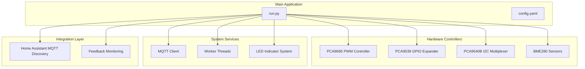
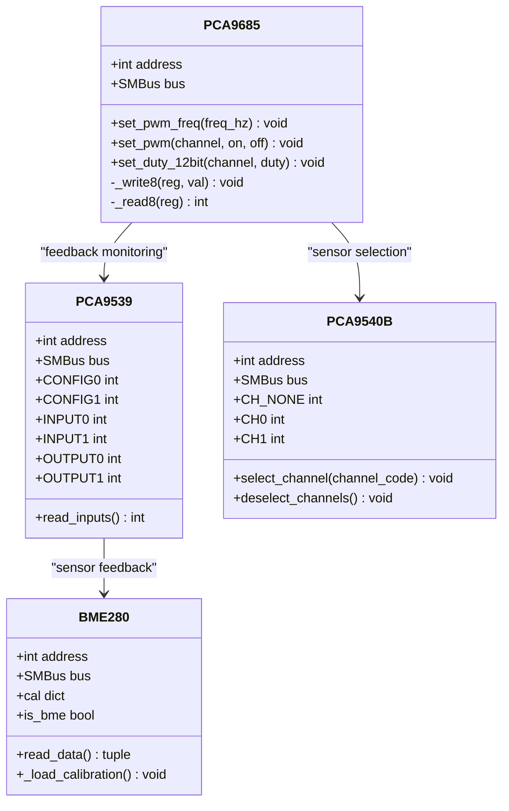
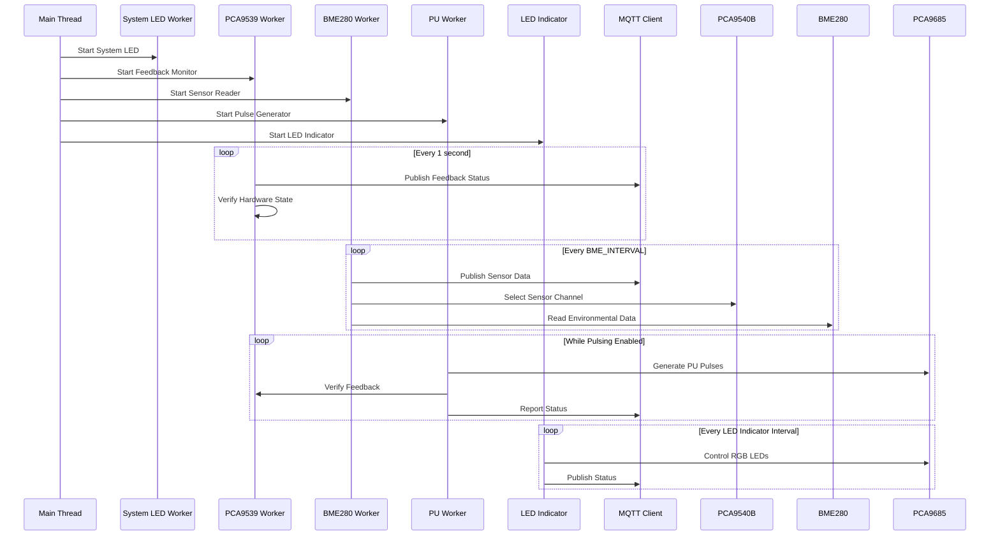
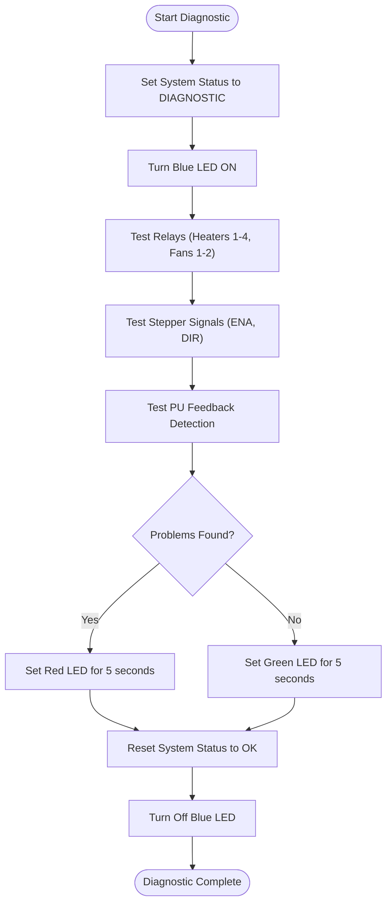
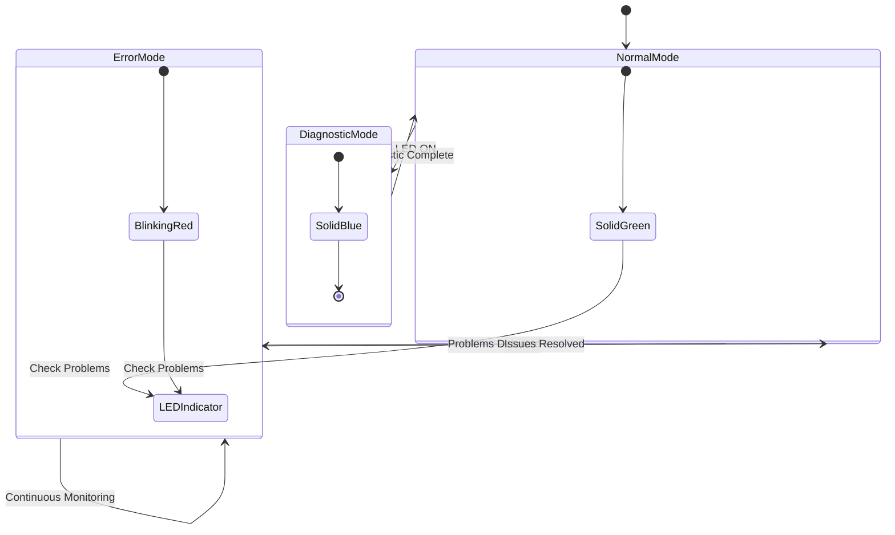
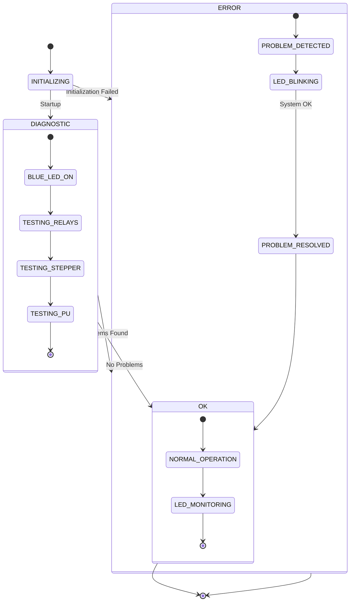
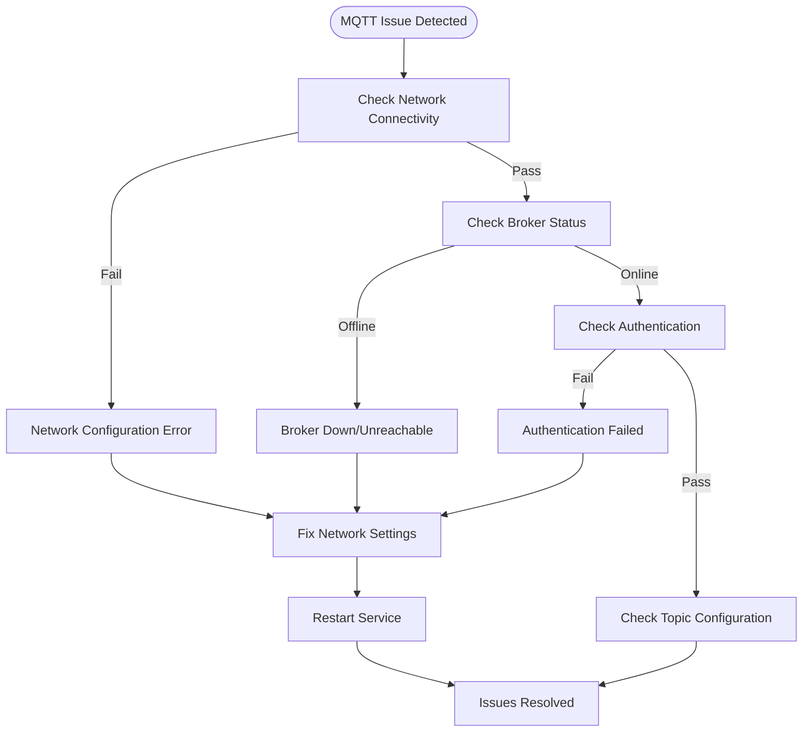
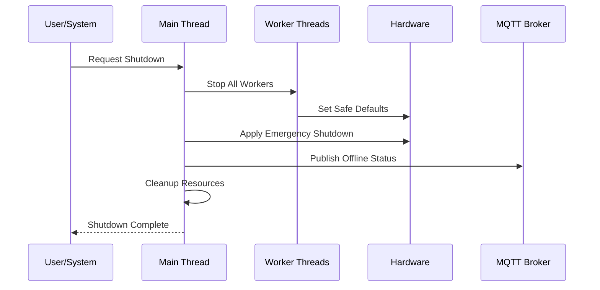

# Troubleshooting and Diagnostics

<cite>
**Referenced Files in This Document**
- [run.py](file://run.py)
- [config.yaml](file://config.yaml)
</cite>

## Table of Contents
1. [Introduction](#introduction)
2. [Project Structure](#project-structure)
3. [Core Components](#core-components)
4. [Architecture Overview](#architecture-overview)
5. [Automated Hardware Diagnostic Procedure](#automated-hardware-diagnostic-procedure)
6. [LED Indication Interpretation](#led-indication-interpretation)
7. [System States and Status Management](#system-states-and-status-management)
8. [Common Problem Scenarios](#common-problem-scenarios)
9. [Systematic Troubleshooting Procedures](#systematic-troubleshooting-procedures)
10. [Log Analysis Techniques](#log-analysis-techniques)
11. [Recovery Procedures](#recovery-procedures)
12. [Preventive Maintenance Guidelines](#preventive-maintenance-guidelines)
13. [Diagnostic Mode Operation](#diagnostic-mode-operation)
14. [Performance Troubleshooting](#performance-troubleshooting)
15. [Escalation Procedures](#escalation-procedures)
16. [Conclusion](#conclusion)

## Introduction

The PCA9685 PWM Controller system is a comprehensive I2C-based control solution designed for home automation environments. This system integrates multiple hardware components including the PCA9685 PWM controller, PCA9539 GPIO expander, PCA9540B I2C multiplexer, and BME280 environmental sensors. The system provides automated hardware diagnostics, real-time status monitoring, and comprehensive MQTT integration for Home Assistant compatibility.

The system operates through a sophisticated multi-threaded architecture that manages PWM outputs, hardware feedback verification, sensor data collection, and real-time status indication. It implements robust error handling, graceful degradation when components are unavailable, and comprehensive logging for diagnostics.

## Project Structure

The project follows a modular Python architecture with clear separation of concerns:



**Diagram sources**
- [run.py:1-50](file://run.py#L1-L50)
- [config.yaml:1-57](file://config.yaml#L1-L57)

**Section sources**
- [run.py:1-50](file://run.py#L1-L50)
- [config.yaml:1-57](file://config.yaml#L1-L57)

## Core Components

The system is built around several key components that work together to provide comprehensive control and monitoring:

### Hardware Controller Classes

The system implements specialized classes for each hardware component:



**Diagram sources**
- [run.py:61-160](file://run.py#L61-L160)

### Channel Mapping and Configuration

The system uses a fixed channel mapping for precise hardware control:

| Channel | Function | Pin Assignment |
|---------|----------|----------------|
| 0 | PWM1 Output | Fan 1 Control |
| 1-4 | Heaters | RL1-RL4 Relays |
| 5-6 | Fans | FAN1/FAN2 Power |
| 7 | Stepper DIR | Direction Control |
| 8 | Stepper ENA | Enable Control |
| 9 | PU Signal | Pulse Generation |
| 10 | Reserved | Not Used |
| 11 | LED Red | RGB Control |
| 12 | LED Blue | RGB Control |
| 13 | LED Green | RGB Control |
| 14 | System LED | Heartbeat Indicator |
| 15 | Reserved | Not Used |

**Section sources**
- [run.py:266-282](file://run.py#L266-L282)
- [run.py:934-944](file://run.py#L934-L944)

## Architecture Overview

The system employs a multi-threaded architecture with specialized workers for different functions:



**Diagram sources**
- [run.py:1128-1226](file://run.py#L1128-L1226)
- [run.py:822-874](file://run.py#L822-L874)
- [run.py:1044-1105](file://run.py#L1044-L1105)

**Section sources**
- [run.py:1128-1226](file://run.py#L1128-L1226)
- [run.py:822-874](file://run.py#L822-L874)
- [run.py:1044-1105](file://run.py#L1044-L1105)

## Automated Hardware Diagnostic Procedure

The system includes a comprehensive automated diagnostic routine that performs hardware verification during startup:

### Diagnostic Workflow



**Diagram sources**
- [run.py:369-458](file://run.py#L369-L458)

### Diagnostic Tests Performed

The automated diagnostic executes three primary test categories:

#### 1. Relay Testing Procedure
- **Heaters 1-4 Testing**: Each heater relay is tested individually
- **Fan Power Testing**: Both fan power relays are verified
- **Test Method**: Each relay is toggled ON/OFF and verified through PCA9539 feedback
- **Expected Behavior**: Relay logic is inverted (LOW=ON, HIGH=OFF)

#### 2. Stepper Signal Verification
- **ENA Signal Test**: Enable pin verification with hardware feedback
- **DIR Signal Test**: Direction pin verification with hardware feedback
- **Timing Requirements**: Proper timing sequence maintained for safe switching

#### 3. PU Feedback Detection
- **Pulse Generation**: System generates test pulses on CH9
- **Feedback Monitoring**: PCA9539 pin 10 monitors pulse feedback
- **Validation Logic**: Pulse detection confirms proper signal propagation

**Section sources**
- [run.py:369-458](file://run.py#L369-L458)
- [run.py:950-996](file://run.py#L950-L996)

## LED Indication Interpretation

The system uses a sophisticated LED indicator system for real-time status communication:

### LED Color Codes and Meanings

| LED Color | Status Type | Meaning | Duration Pattern |
|-----------|-------------|---------|------------------|
| **Blue** | System State | Diagnostic Mode Active | Solid during diagnostic |
| **Green** | System Health | System Operational | Solid steady |
| **Red** | Error Condition | Hardware/Communication Error | Blinking pattern |
| **RGB Combined** | System Status | Variable Status | Depends on mode |

### LED Indicator Modes



**Diagram sources**
- [run.py:1167-1226](file://run.py#L1167-L1226)
- [run.py:343-350](file://run.py#L343-L350)

### LED Indicator Timing Configuration

The LED indicator system operates on configurable timing parameters:

| Parameter | Default Value | Description |
|-----------|---------------|-------------|
| `LED_INDICATOR_INTERVAL` | 30 seconds | Total cycle duration |
| `LED_INDICATOR_ON_DURATION` | 5 seconds | LED active period |
| `BME_INTERVAL` | 30 seconds | Sensor reading interval |
| `PCA_FREQUENCY` | 1000 Hz | PWM frequency setting |

**Section sources**
- [run.py:325-328](file://run.py#L325-L328)
- [run.py:1167-1226](file://run.py#L1167-L1226)

## System States and Status Management

The system maintains a centralized status management system for comprehensive monitoring:

### Status States



**Diagram sources**
- [run.py:349-350](file://run.py#L349-L350)
- [run.py:673-798](file://run.py#L673-L798)

### Status Lock Mechanism

The system implements thread-safe status management:

- **Global Status Variable**: Centralized system state tracking
- **Thread Lock Protection**: Atomic status updates across threads
- **Real-time Problem Flag**: Live problem detection for LED indication
- **Status Persistence**: Status maintained across system operations

**Section sources**
- [run.py:349-355](file://run.py#L349-L355)
- [run.py:789-792](file://run.py#L789-L792)

## Common Problem Scenarios

### Hardware Detection Failures

#### PCA9685 Initialization Issues
- **Symptoms**: System fails to initialize PCA9685 controller
- **Causes**: I2C bus access denied, incorrect address, kernel module missing
- **Logs**: "Failed to initialize PCA9685 after 10 attempts"
- **Resolution**: Verify I2C permissions, check hardware connections

#### PCA9539 GPIO Expander Failure
- **Symptoms**: Hardware feedback monitoring disabled
- **Causes**: I2C address conflict, wiring issues, power problems
- **Logs**: "PCA9539 initialization failed"
- **Resolution**: Check I2C pull-ups, verify address configuration

#### PCA9540B Multiplexer Issues
- **Symptoms**: Sensor selection failures, intermittent readings
- **Causes**: Channel selection timing, I2C bus contention
- **Logs**: "BME280 initialization failed on CHX"
- **Resolution**: Implement proper channel sequencing

### I2C Communication Errors

#### Bus Access Problems
- **Symptoms**: Random I2C errors, sensor timeouts
- **Causes**: Bus speed conflicts, electrical noise, grounding issues
- **Logs**: "I2C read/write error", "Device not responding"
- **Resolution**: Check I2C wiring, reduce bus speed, improve grounding

#### Device Address Conflicts
- **Symptoms**: Mixed up sensor readings, unexpected device responses
- **Causes**: Incorrect I2C addresses, multiple devices on same address
- **Logs**: "Unexpected Chip ID", "Address conflict detected"
- **Resolution**: Verify device addresses, reconfigure I2C addresses

### MQTT Connectivity Issues

#### Broker Connection Problems
- **Symptoms**: Discovery messages not appearing, commands ignored
- **Causes**: Network connectivity, authentication failures, broker downtime
- **Logs**: "MQTT connection failed", "Connection refused"
- **Resolution**: Verify network connectivity, check credentials, restart broker

#### Topic Publishing Failures
- **Symptoms**: Status updates not reaching Home Assistant
- **Causes**: Topic formatting errors, permission issues, broker overload
- **Logs**: "Publish failed", "Topic not found"
- **Resolution**: Check topic format, verify permissions, monitor broker load

### Sensor Reading Problems

#### BME280 Calibration Issues
- **Symptoms**: Inaccurate temperature/humidity readings
- **Causes**: Calibration data corruption, sensor aging, environmental factors
- **Logs**: "Unexpected Chip ID", "Sensor timeout"
- **Resolution**: Recalibrate sensors, replace if necessary

#### Feedback Signal Problems
- **Symptoms**: Hardware feedback not matching commanded state
- **Causes**: Wiring issues, component failure, timing problems
- **Logs**: "VERIFICATION FAILED", "Feedback mismatch"
- **Resolution**: Check wiring continuity, test components individually

**Section sources**
- [run.py:571-586](file://run.py#L571-L586)
- [run.py:588-604](file://run.py#L588-L604)
- [run.py:1709-1740](file://run.py#L1709-L1740)

## Systematic Troubleshooting Procedures

### Hardware Component Testing

#### Step-by-Step Hardware Verification

1. **Power Supply Check**
   - Measure voltage at PCA9685 V+ pin (3.3V/5V)
   - Verify ground connections
   - Check for voltage drops under load

2. **I2C Bus Integrity**
   - Use oscilloscope to verify SDA/SCL waveforms
   - Check pull-up resistor values (4.7kΩ typical)
   - Test bus speed compatibility

3. **Individual Component Testing**
   - Test PCA9685 PWM output with multimeter
   - Verify PCA9539 GPIO functionality
   - Check BME280 sensor communication

#### Diagnostic Tools Required
- Multimeter for voltage/current measurements
- Oscilloscope for signal integrity
- I2C scanner for address verification
- Logic analyzer for protocol analysis

### Software Component Troubleshooting

#### Configuration Validation
1. **Verify Configuration File**
   - Check I2C bus numbers and addresses
   - Validate MQTT broker settings
   - Confirm sensor intervals and parameters

2. **Environment Setup**
   - Verify kernel module loading (i2c-dev)
   - Check device permissions (/dev/i2c-*)
   - Validate Python dependencies

3. **Service Dependencies**
   - Confirm MQTT broker accessibility
   - Verify Home Assistant availability
   - Check network connectivity

### Network and Integration Issues

#### MQTT Troubleshooting Flow



**Diagram sources**
- [run.py:1709-1740](file://run.py#L1709-L1740)

**Section sources**
- [run.py:1709-1740](file://run.py#L1709-L1740)
- [config.yaml:28-41](file://config.yaml#L28-L41)

## Log Analysis Techniques

### Log Level Interpretation

The system implements structured logging with clear severity levels:

| Log Level | Purpose | Typical Messages |
|-----------|---------|------------------|
| **DEBUG** | Detailed operational information | Component state changes, internal processing |
| **INFO** | General operational messages | System startup, configuration loading |
| **WARNING** | Potentially problematic conditions | Component initialization failures, recoverable errors |
| **ERROR** | Error conditions requiring attention | Critical failures, unhandled exceptions |

### Error Message Decoding

#### Common Error Patterns

1. **I2C Communication Errors**
   ```
   "Failed to open I2C bus X: [Error]"
   "PCA9685 initialization failed: [Reason]"
   "PCA9539 read error: [Exception]"
   ```

2. **MQTT Connection Issues**
   ```
   "MQTT connection failed with code X"
   "Connection refused by broker"
   "Publish failed: [Error]"
   ```

3. **Hardware Verification Failures**
   ```
   "VERIFICATION FAILED for [Component]: expected X, got Y"
   "Hardware diagnostic completed with ERRORS"
   "PU feedback not detected during diagnostic"
   ```

#### Log Analysis Workflow

1. **Initial Assessment**
   - Identify error type and severity
   - Locate error source in code
   - Determine impact on system operation

2. **Root Cause Analysis**
   - Trace error back to specific component
   - Check recent log entries for patterns
   - Verify hardware status

3. **Resolution Planning**
   - Prioritize critical vs. non-critical errors
   - Plan component isolation if needed
   - Prepare replacement parts if required

### Debug Information Extraction

#### System State Logs
- **Component Status**: Active/inactive states of all workers
- **Hardware Feedback**: Real-time feedback verification results
- **Sensor Readings**: Last successful sensor data
- **MQTT Status**: Connection and message flow information

#### Performance Metrics
- **Thread Activity**: Worker thread status and execution times
- **Memory Usage**: Current memory consumption patterns
- **I2C Bus Utilization**: Communication frequency and success rates

**Section sources**
- [run.py:23-27](file://run.py#L23-L27)
- [run.py:795-797](file://run.py#L795-L797)

## Recovery Procedures

### Safe Shutdown Sequences

The system implements comprehensive shutdown procedures to ensure safe hardware state:



**Diagram sources**
- [run.py:1889-1931](file://run.py#L1889-L1931)

### Hardware Reset Operations

#### Emergency Hardware Reset
1. **Immediate Action**
   - Cut power to affected hardware section
   - Verify all outputs are at safe defaults
   - Check for component damage

2. **Gradual Restoration**
   - Power cycle individual components
   - Reinitialize I2C bus
   - Test component functionality

3. **System Reconfiguration**
   - Reload configuration files
   - Restart worker threads
   - Verify all systems operational

#### Configuration Restoration
- **Factory Defaults**: Load default configuration values
- **Component Reinitialization**: Reset all hardware components
- **Service Restart**: Restart all system services
- **Health Verification**: Run diagnostic procedures

### Graceful Degradation

The system implements graceful degradation when components fail:

- **PCA9539 Failure**: Continue operation with reduced feedback
- **BME280 Failure**: Continue without environmental monitoring
- **MQTT Failure**: Continue local operation with limited remote access
- **I2C Bus Failure**: Isolate affected components

**Section sources**
- [run.py:1889-1931](file://run.py#L1889-L1931)
- [run.py:588-604](file://run.py#L588-L604)

## Preventive Maintenance Guidelines

### Regular System Checks

#### Monthly Maintenance Tasks
1. **Visual Inspection**
   - Check for loose connections
   - Inspect for component overheating
   - Verify cable integrity

2. **Functional Testing**
   - Verify all relays operate correctly
   - Test PWM output accuracy
   - Check sensor communication

3. **Software Updates**
   - Update firmware when available
   - Review configuration changes
   - Monitor system logs for trends

#### Quarterly Deep Maintenance
1. **Hardware Calibration**
   - Calibrate PWM outputs
   - Verify sensor accuracy
   - Check I2C bus performance

2. **Component Replacement**
   - Replace worn components proactively
   - Upgrade outdated hardware
   - Optimize system configuration

3. **Performance Optimization**
   - Analyze system performance metrics
   - Optimize I2C bus utilization
   - Review power consumption patterns

### System Health Monitoring Recommendations

#### Continuous Monitoring Parameters
- **Temperature Monitoring**: Track component operating temperatures
- **Current Consumption**: Monitor power usage patterns
- **I2C Bus Health**: Track communication success rates
- **Component Lifespan**: Estimate remaining component life

#### Alert Thresholds
- **Temperature**: Above normal operating range
- **Current**: Excessive power draw
- **I2C Errors**: Consistent communication failures
- **System Uptime**: Extended periods of degraded operation

## Diagnostic Mode Operation

### Manual Diagnostic Procedures

The system supports manual diagnostic mode for targeted troubleshooting:

#### Diagnostic Command Flow
1. **Enter Diagnostic Mode**
   - Set system status to DIAGNOSTIC
   - Activate blue LED indicator
   - Initialize diagnostic sequence

2. **Execute Targeted Tests**
   - Select specific component for testing
   - Run component-specific verification
   - Record test results

3. **Exit Diagnostic Mode**
   - Restore normal system operation
   - Report diagnostic results
   - Return to monitoring mode

#### Diagnostic Mode Features
- **Selective Testing**: Test individual components
- **Real-time Feedback**: Immediate test results
- **Safe Operation**: All tests performed safely
- **Comprehensive Reporting**: Detailed diagnostic output

### Real-time Status Indicators

The system provides multiple layers of real-time status information:

#### Hardware Status Monitoring
- **Feedback Verification**: Continuous hardware state checking
- **Problem Detection**: Real-time issue identification
- **Status Propagation**: Immediate status updates to MQTT

#### System Performance Monitoring
- **Thread Activity**: Monitor worker thread health
- **Resource Usage**: Track CPU and memory consumption
- **I2C Bus Performance**: Monitor communication quality

**Section sources**
- [run.py:369-458](file://run.py#L369-L458)
- [run.py:673-798](file://run.py#L673-L798)

## Performance Troubleshooting

### CPU Usage Analysis

#### Performance Bottlenecks
1. **I2C Bus Contention**
   - Multiple threads accessing I2C simultaneously
   - Long I2C transaction times
   - Bus arbitration delays

2. **MQTT Message Processing**
   - High message volume
   - Slow broker response
   - Topic subscription overhead

3. **Sensor Reading Intervals**
   - Too frequent sensor polling
   - Long sensor read times
   - Memory allocation overhead

#### Optimization Strategies
- **I2C Bus Optimization**: Implement proper locking mechanisms
- **MQTT Efficiency**: Batch message processing, optimize intervals
- **Memory Management**: Reduce object creation, optimize data structures

### Memory Consumption Monitoring

#### Memory Usage Patterns
- **Thread Stack Space**: Monitor per-thread memory usage
- **Object Lifetime**: Track long-lived objects
- **Buffer Management**: Monitor I2C buffer usage

#### Memory Optimization Techniques
- **Object Pooling**: Reuse frequently allocated objects
- **Lazy Initialization**: Initialize components only when needed
- **Garbage Collection**: Monitor and tune garbage collection

### I2C Bus Optimization

#### Bus Performance Analysis
1. **Transaction Timing**
   - Measure I2C transaction completion times
   - Identify slow-performing devices
   - Optimize transaction sequences

2. **Bus Utilization**
   - Monitor concurrent I2C access
   - Identify bus contention issues
   - Optimize device scheduling

3. **Signal Integrity**
   - Check I2C waveform quality
   - Verify pull-up resistor values
   - Monitor for electrical interference

**Section sources**
- [run.py:40-41](file://run.py#L40-L41)
- [run.py:822-874](file://run.py#L822-L874)

## Escalation Procedures

### Complex Issue Escalation

#### Tiered Support Structure
1. **Level 1: Basic Troubleshooting**
   - Verify basic system operation
   - Check configuration files
   - Restart services

2. **Level 2: Advanced Diagnostics**
   - Perform detailed hardware testing
   - Analyze system logs extensively
   - Isolate problematic components

3. **Level 3: Expert Intervention**
   - Hardware replacement required
   - Firmware updates needed
   - System redesign considerations

#### Escalation Criteria
- **Critical System Failure**: Complete system shutdown
- **Safety Concerns**: Risk of equipment damage or injury
- **Extended Downtime**: Business impact exceeding SLA
- **Recurring Issues**: Persistent problems despite resolution attempts

### External Support Coordination

#### Documentation Requirements
- **System Configuration**: Complete hardware and software setup
- **Error Logs**: Comprehensive log analysis results
- **Test Results**: Diagnostic procedure outcomes
- **Component History**: Hardware replacement and maintenance records

#### Support Communication
- **Clear Problem Statement**: Specific symptoms and error messages
- **Resolution Attempts**: Previous troubleshooting steps taken
- **System Impact**: Business or operational consequences
- **Timeline Expectations**: Urgency and deadline requirements

## Conclusion

The PCA9685 PWM Controller system provides comprehensive troubleshooting and diagnostics capabilities through its multi-layered approach to system monitoring and error handling. The combination of automated hardware diagnostics, real-time status indication, and structured logging enables efficient problem identification and resolution.

Key strengths of the system include:
- **Comprehensive Hardware Coverage**: Automated testing of all major components
- **Real-time Monitoring**: Continuous status verification and reporting
- **Structured Diagnostics**: Systematic troubleshooting procedures
- **Robust Error Handling**: Graceful degradation and recovery mechanisms
- **Extensive Logging**: Detailed operational and error information

The troubleshooting procedures outlined in this document provide a systematic approach to identifying and resolving issues across all system components. By following these procedures and utilizing the system's built-in diagnostic capabilities, most hardware and software issues can be resolved efficiently with minimal downtime.

For complex issues requiring external support, the system's comprehensive logging and diagnostic features provide excellent foundation for technical assistance while maintaining system reliability and safety throughout the troubleshooting process.